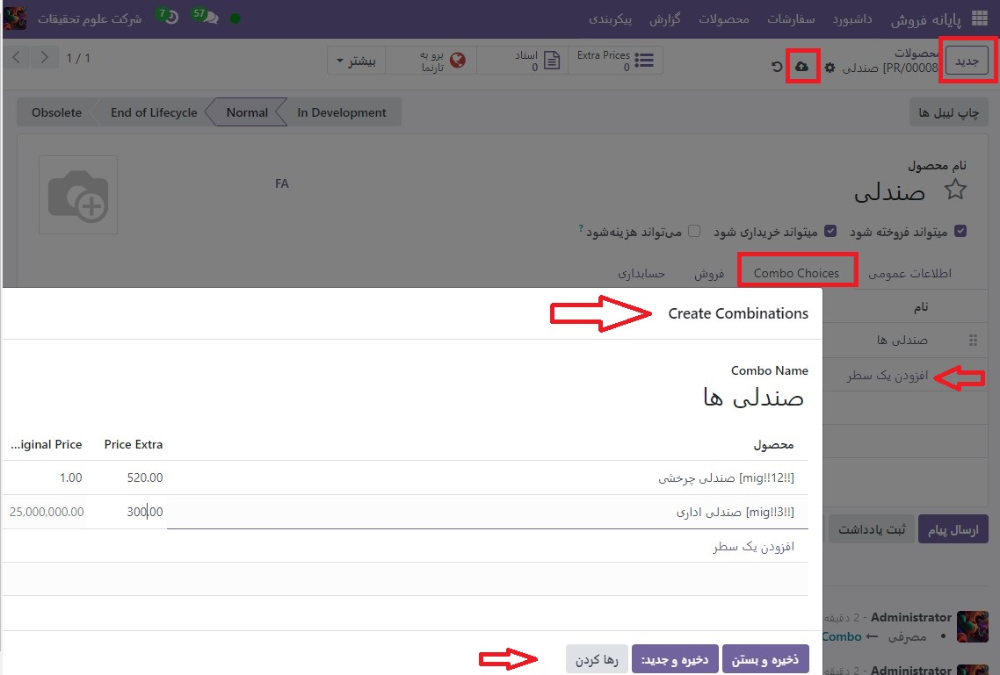

:nosearch:
:show-content:
:hide-page-toc:
:show-toc:

===========================================
ترکیبات محصول
===========================================

ویژگی ترکیبات محصول به کاربران اجازه می دهد تا گزینه های ترکیبی را برای یک محصول واحد تعریف و مدیریت کنند.

در زمینه یک رستوران، این ویژگی به کاربران امکان می دهد منوهای چند گزینه ای ایجاد کنند. به عنوان مثال، یک کاربر می تواند یک غذای اصلی تعریف کند و گزینه های مختلفی را برای غذاها، نوشیدنی ها یا دسرهایی که مشتریان می توانند با غذای اصلی ترکیب کنند، مشخص کند.

در خرده فروشی، این ویژگی به شما این امکان را می دهد که یک مجموعه محصول با چندین محصول برای انتخاب و ترکیب ایجاد کنید.

پیکربندی
-----------------------------------------------------------
ابتدا باید انتخاب های ترکیبی ایجاد کنید. برای انجام این کار:

    #. به  :menuselection:`پایانه فروش --> محصولات --> ترکیب محصول` بروید و روی جدید کلیک کنید.

    #. ترکیب خود را نام ببرید و محصولاتی را که می‌خواهید مشتریان انتخاب کنند با کلیک کردن روی افزودن خط اضافه کنید. همچنین می توانید برای هر گزینه در ستون هزینه اضافی قیمت اضافی درج کنید.

.. note::
    به عنوان مرجع، قیمت اصلی محصول انتخاب شده در ستون قیمت اصلی نمایش داده می شود.

دوم، شما نیاز به ایجاد یک محصول خاص برای جمع آوری گزینه های ترکیبی دارید. برای انجام این:

    #. به پایانه فروش ‣ محصولات ‣ محصولات بروید و روی جدید کلیک کنید.

    #. نوع محصول را روی Combo قرار دهید و برگه اطلاعات عمومی را پر کنید.

.. note::
    قیمت فروش محصول ترکیبی ثابت است و بر اساس قیمت‌های تکی اقلام موجود یا تعداد اقلام موجود در **combo** تغییر نمی‌کند. قیمت محصول ترکیبی فقط تحت تأثیر قیمت اضافی است که به صورت اختیاری در ایجاد انتخاب ترکیبی تعریف شده است یا اگر یک نوع از یکی از موارد قیمت اضافی مشخصی داشته باشد

    #. به تب **Combo Choices** بروید، روی **افزودن یک سطر** کلیک کنید و ترکیب‌هایی را که می‌خواهید اضافه کنید انتخاب کنید. همچنین می توانید در این مرحله با کلیک بر روی جدید در پنجره بازشو، یک ترکیب جدید ایجاد کنید.

پس از ایجاد و افزودن گزینه های ترکیبی به یک محصول، می توانید ترکیبات ترکیبی را در فروشگاه یا رستوران خرده فروشی خود بفروشید.