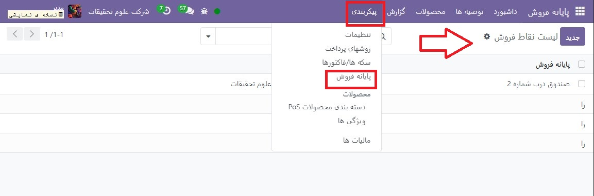
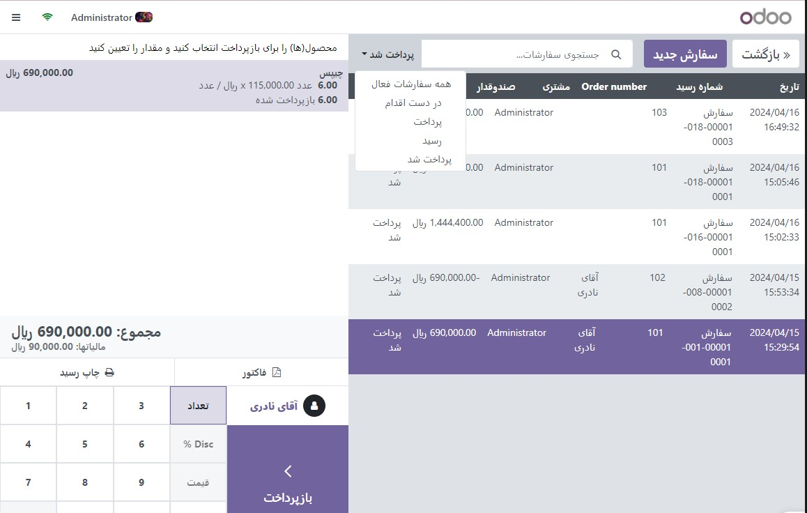
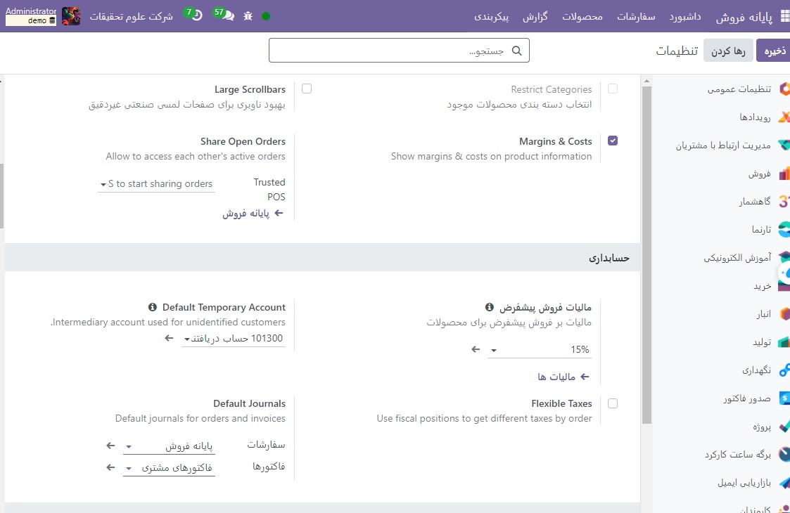

:nosearch:
:show-content:
:hide-page-toc:
:show-toc:

===========================================
رسید و فاکتور
===========================================

رسیدها
-------------------------------------
رسیدها را با رفتن به  :menuselection:`پایانه فروش --> پیکربندی --> پایانه فروش`، انتخاب POS و رفتن به قسمت Bills & Receipts، تنظیم کنید.

برای سفارشی کردن هدر و پاورقی، Header & Footer را فعال کنید و هر دو فیلد را با اطلاعاتی که باید روی رسید چاپ شود پر کنید.

برای چاپ خودکار رسیدها پس از ثبت پرداخت، تنظیم چاپ خودکار رسید را فعال کنید.

.. seealso::
   - :doc:`bills`
   - :doc:`ePOS printers`

یک رسید را دوباره چاپ کنید
-------------------------------------------------
از رابط POS، روی سفارشات کلیک کنید، منوی انتخاب کشویی را در کنار نوار جستجو باز کنید و فیلتر پیش‌فرض همه سفارش‌های فعال را به پرداخت شده تغییر دهید. سپس، سفارش مربوطه را انتخاب کرده و روی Print Receipt کلیک کنید.

.. note::
    می توانید لیست سفارشات را با استفاده از نوار جستجو فیلتر کنید. مرجع خود را وارد کنید و روی شماره رسید، تاریخ یا مشتری کلیک کنید.

فاکتورها
------------------------------------
پایانه فروش به شما امکان می دهد پس از پرداخت، برای مشتریان ثبت نام شده فاکتور صادر و چاپ کنید و تمام سفارشات فاکتور شده قبلی را بازیابی کنید.

.. note::
    یک فاکتور ایجاد شده در یک POS یک ورودی به مجله حسابداری مربوطه ایجاد می کند که قبلاً تنظیم شده است.

پیکربندی
--------------------------------------------
برای تعریف اینکه چه مجلاتی برای یک POS خاص استفاده می شود، به تنظیمات POS بروید و به قسمت حسابداری بروید. سپس می توانید مجلات حسابداری را که به طور پیش فرض برای سفارشات و صورتحساب ها استفاده می شود در قسمت مجلات پیش فرض تعیین کنید.

یک مشتری فاکتور بگیرید
-------------------------------------------------------
پس از پردازش پرداخت، روی فاکتور در زیر نام مشتری کلیک کنید تا فاکتوری برای آن سفارش صادر شود.

روش پرداخت را انتخاب کرده و روی تأیید کلیک کنید. فاکتور به صورت خودکار صادر و آماده دانلود و/یا چاپ می شود.

.. note::
    برای اینکه بتوان فاکتور صادر کرد باید مشتری انتخاب شود.

فاکتورها را بازیابی کنید
-----------------------------------------------
برای بازیابی فاکتورها از داشبورد POS،

   #. با رفتن به پایانه فروش ‣ سفارشات ‣ سفارشات به تمام سفارش های انجام شده از طریق POS خود دسترسی پیدا کنید.

   #. برای دسترسی به فاکتور سفارش، فرم سفارش را با انتخاب سفارش باز کنید، سپس روی فاکتور کلیک کنید.

.. note::
    سفارشات صورتحساب شده را می توان با وضعیت فاکتور در ستون وضعیت شناسایی کرد.

    با کلیک بر روی Filters and Invoiced می‌توانید فهرست سفارش‌ها را به سفارش‌های صورت‌حساب فیلتر کنید.

کدهای QR برای تولید فاکتورها
----------------------------------------
مشتریان همچنین می توانند با اسکن کد QR چاپ شده در رسید خود، فاکتور درخواست کنند. پس از اسکن، آنها باید فرمی را با اطلاعات صورتحساب خود پر کنند و روی دریافت فاکتور من کلیک کنند. از یک طرف، انجام این کار یک فاکتور برای دانلود ایجاد می کند. از سوی دیگر، وضعیت سفارش از حالت پرداخت شده یا ارسال شده به صورتحساب در باطن Odoo می‌رود.

.. image:: ./img/pointofsale/i11.jpg
    :align: center
    :alt: پایانه فروش