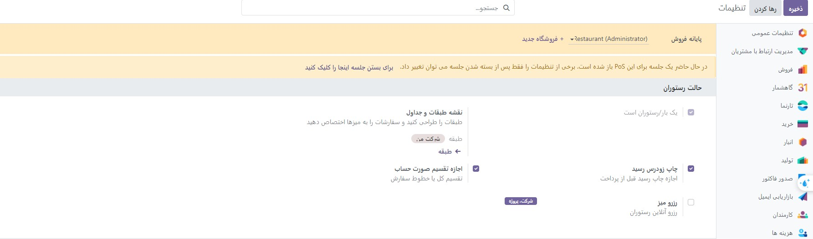

:nosearch:
:show-content:
:hide-page-toc:
:show-toc:

=============================
صورتحساب
=============================

روش‌های معمول در رستوران‌ها یا بارها این است که قبل از پرداخت صورتحساب درخواست کنید یا آن را بر اساس موارد سفارش داده شده تقسیم کنید. Odoo POS دو ویژگی را برای انجام یکپارچه این وظایف ارائه می دهد: چاپ صورت حساب و تقسیم صورت حساب.

چاپ قبض
---------------------------------------------
از یک جلسه باز، روی **صورتحساب ‣ چاپ** در هر لحظه کلیک کنید تا یک صورتحساب ایجاد و چاپ شود. 

.. note::
    صورتحساب چاپ شده نهایی نیست و برای منعکس کردن هرگونه تغییر در سفارش به روز می شود.

تقسیم صورتحساب
--------------------------------
از یک جلسه باز، روی تقسیم کلیک کنید تا مواردی را که می خواهید دوباره گروه بندی کنید انتخاب کنید. هنگامی که همه چیز انتخاب شد، روی پرداخت کلیک کنید و برای پرداخت این موارد اقدام کنید. برای هر مهمان تکرار کنید. 

.. note::
    پس از بازگشت به جدول، اقلام انتخابی دیگر سفارشی نیستند، زیرا هزینه آنها پرداخت شده است.

    این ویژگی به محض سفارش حداقل دو مورد در دسترس است.

.. seealso::
   - :doc:`floors and tables`