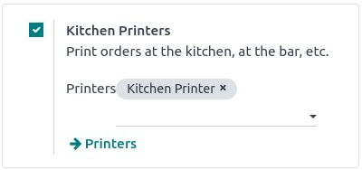
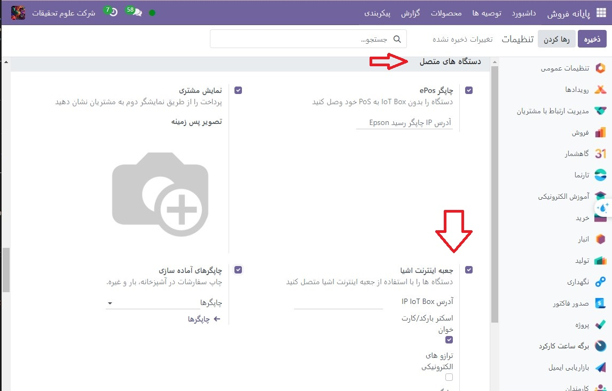
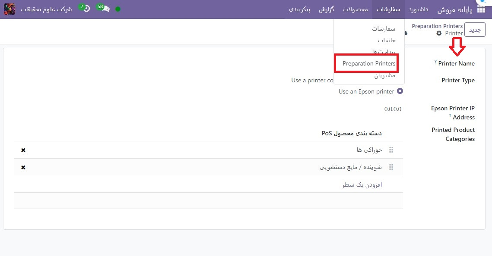

:nosearch:
:show-content:
:hide-page-toc:
:show-toc:

=============================
سفارشات چاپ
=============================

ادغام پرینترها در گردش کار رستوران یا بار می‌تواند ارتباط و همکاری بین تیم‌های داخلی و  تیم هایی که خدمات پشتیبانی می دهند را افزایش دهد و منجر به خدمات کارآمدتر و کارآمدتر شود.

پیکربندی
--------------------------------------------------------

چاپگرها را فعال و ایجاد کنید

برای فعال کردن ارسال سفارشات به چاپگر رستوران یا بار، به پایانه **فروش ‣ پیکربندی ‣ تنظیمات** بروید، به بخش رستوران و بار بروید و چاپگرهای رستوران را فعال کنید. در قسمت پرینترها یک نام برای چاپگر تایپ کنید و روی جدید و ویرایش… کلیک کنید تا یک فرم راه‌اندازی باز شود.

برای دریافت لیستی از تمام چاپگرهایی که قبلا ایجاد شده اند یا برای اصلاح چاپگری که از قبل ایجاد شده است، روی –> پرینترها کلیک کنید و چاپگر مورد نظر را انتخاب کنید تا فرم راه اندازی باز شود.

فرم راه اندازی
---------------------------------------------------
از فرم تنظیمات، نوع چاپگر را با توجه به نصب خود انتخاب کنید:

اگر چاپگر شما به جعبه اینترنت اشیا متصل است، استفاده از چاپگر متصل به جعبه اینترنت اشیا را انتخاب کنید و دستگاه را در قسمت دستگاه اینترنت اشیا انتخاب کنید.

اگر از چاپگر اپسون استفاده می کنید که به جعبه اینترنت اشیا نیاز ندارد، استفاده از چاپگر اپسون را انتخاب کنید و آدرس IP چاپگر را در قسمت آدرس IP چاپگر Epson وارد کنید.

چاپگر خود را برای چاپ محصولات خاص بر اساس دسته POS تنظیم کنید. برای انجام این کار، روی افزودن یک سطر در قسمت **Printed Product Categorys** کلیک کنید. اگر این قسمت را خالی بگذارید، همه محصولات بدون در نظر گرفتن دسته POS برای چاپگر ارسال می شوند.

چاپ سفارشات
-----------------------------------------
از یک جلسه باز، شروع به گرفتن سفارش کنید و روی **سفارش** کلیک کنید تا آن را به بار یا آشپزخانه ارسال کنید.

.. note::
    هنگامی که محصولات قابل چاپ هستند، به رنگ سبز در سبد خرید ظاهر می شوند و دکمه سفارش سبز می شود.