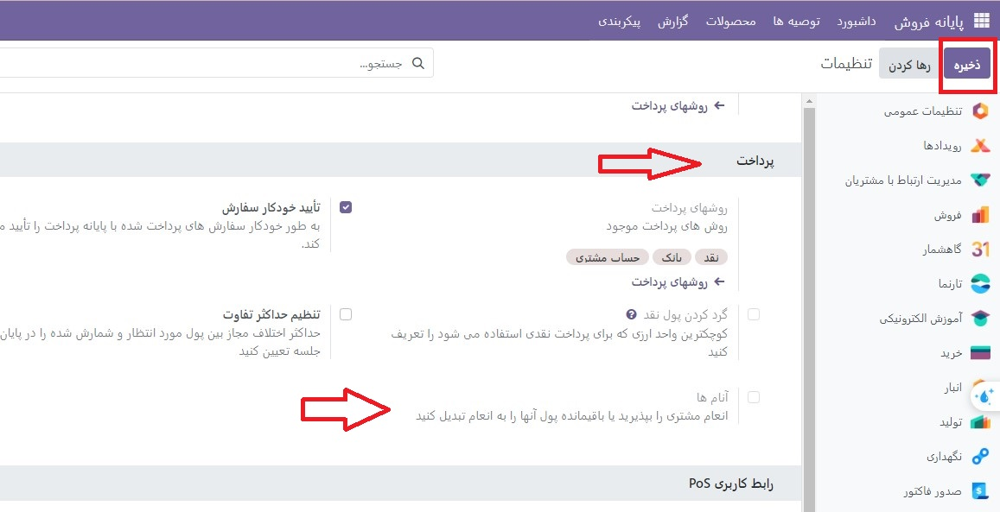
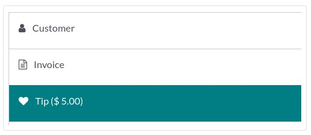

:nosearch:
:show-content:
:hide-page-toc:
:show-toc:

=============================
انعام ها
=============================
انعام دادن در کشورهای متعددی مرسوم است. پایانه فروش امکان انعام دادن در مغازه ها، بارها یا رستوران ها را فراهم می کند.

پیکربندی
--------------------------------------
برای اجازه دادن انعام در POS خود، ویژگی انعام را در **پایانه فروش ‣ پیکربندی ‣ تنظیمات** فعال کنید. در بالای صفحه، POS را که می‌خواهید در آن انعام داده شود، انتخاب کنید، به بخش پرداخت بروید و انعام را بررسی کنید. پس از فعال شدن، یک محصول انعام ها را در قسمت مربوطه اضافه کنید و ذخیره کنید. محصول تعیین شده به عنوان مرجع در رسید مشتریان استفاده خواهد شد.

انعام محصولات 
-----------------------------------
محصولات انعام را می توان در محل ایجاد کرد. برای انجام این کار، نام محصول را در قسمت انعام محصولات  وارد کنید و روی ایجاد کلیک کنید یا enter را فشار دهید. محصول به طور خودکار پیکربندی می شود تا به عنوان یک انعام در صفحه پرداخت استفاده شود.

با این حال، اگر می‌خواهید بتوانید  انعام محصول را در یک جلسه POS انتخاب کنید، باید تنظیمات موجود در POS را فعال کنید. برای انجام این کار، روی ایجاد و ویرایش… کلیک کنید تا فرم پیکربندی محصول باز شود. سپس، به تب فروش ها بروید، تیک گزینه **Available in POS** را بزنید و روی ذخیره وبستن کلیک کنید.

..  note::

    - هنگامی که محصولی را برای استفاده به عنوان انعام ایجاد می کنید، نوع محصول را به عنوان مصرفی بگذارید تا از جابجایی های غیرضروری موجودی جلوگیری کنید.

    - در هر POS فقط می‌توانید یک محصول انعام انتخاب کنید، اما می‌توانید برای هر کدام یک محصول متفاوت انتخاب کنید.

انعام بعد از پرداخت
-------------------------
اگر از سیستم POS در بار یا رستوران استفاده می‌کنید، می‌توانید «افزودن انعام» را پس از پرداخت فعال کنید. انجام این کار یک صورتحساب برای چاپ و تکمیل دستی توسط مشتری و پیشخدمت ایجاد می کند. این صورت‌حساب نشان‌دهنده ارزش انعام است که مشتری پس از پرداخت انتخاب می‌کند.

.. important::
    برای استفاده از این ویژگی، روش پرداخت انتخابی باید دارای یک آیتم های روزنامه بانکی باشد

انعام را اضافه کنید
----------------------------------------
برای **افزودن انعام ها** به سفارش، به صفحه پرداخت دسترسی پیدا کنید و روی **♥** نکته کلیک کنید. سپس، مبلغ انعام را وارد کنید، برای تأیید اعتبار، روی **تأیید** کلیک کنید و پرداخت را پردازش کنید

همچنین، می‌توانید انعام محصول  را در رابط POS انتخاب کنید تا آن را به سبد خرید اضافه کنید. هنگام انتخاب، محصول به طور خودکار به عنوان یک انعام تنظیم می شود و مقدار پیش فرض آن برابر با قیمت فروش آن است.

انعام با استفاده از ترمینال آدن
---------------------------------------------
در حین پرداخت، Adyen را به عنوان پایانه پرداخت انتخاب کنید و با کلیک روی Send درخواست پرداخت را به دستگاه ارسال کنید. از مشتریان خواسته می شود قبل از پرداخت، مبلغ انعام مورد نظر را در صفحه ترمینال وارد کنند.

انعام بعد از پرداخت
-----------------------------------------------
هنگام تسویه‌حساب، یک روش پرداخت با کارت را انتخاب کنید و روی بستن صفحه کلیک کنید. انجام این کار یک صورتحساب برای تکمیل توسط مشتری ایجاد می کند...
