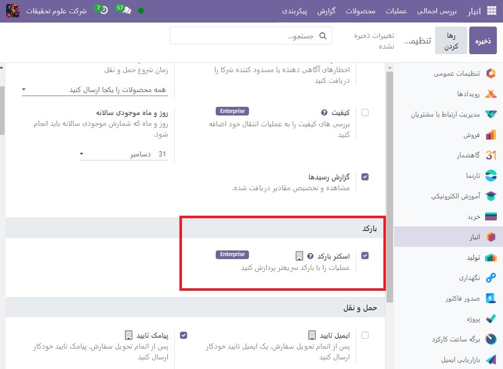
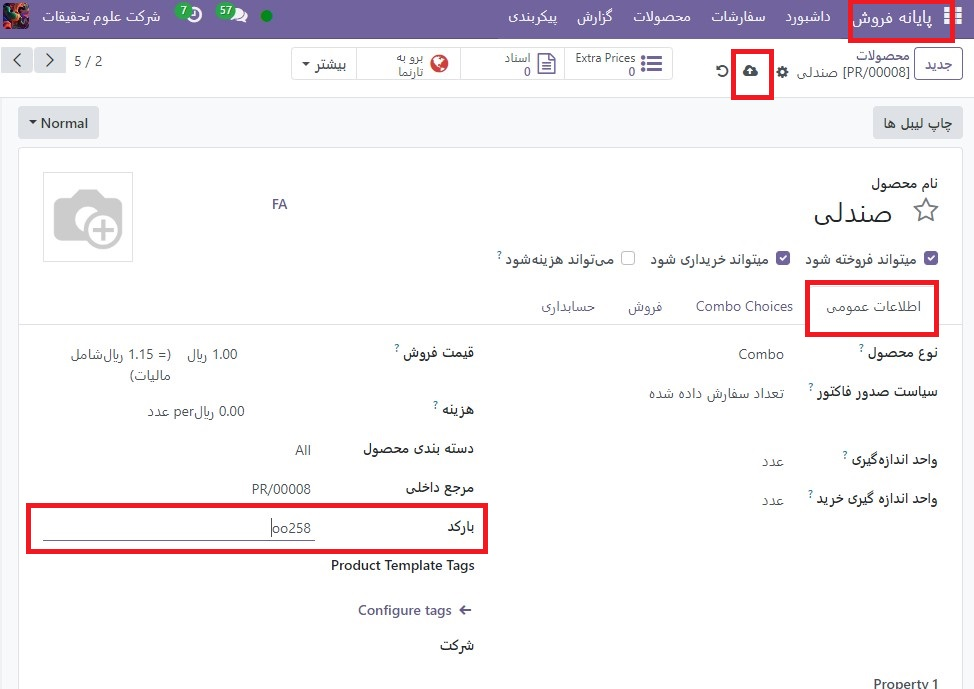
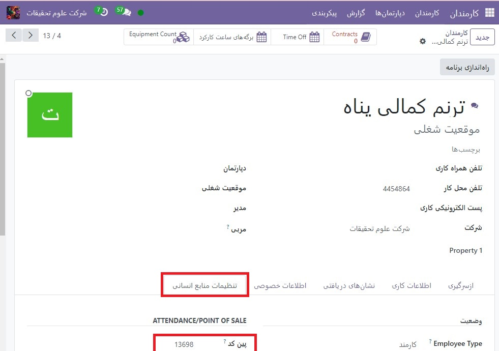

:nosearch:
:show-content:
:hide-page-toc:
:show-toc:

===========================
بارکدها
===========================

استفاده از اسکنر بارکد برای پردازش سفارشات پایانه فروش، کارایی شما را در ارائه خدمات سریعتر به مشتریان بهبود می بخشد. اسکنر بارکد می تواند هم برای اسکن محصولات و هم برای ورود کارکنان به یک جلسه POS استفاده شود.

پیکربندی
---------------------------------------
برای استفاده از **اسکنر بارکد**، باید این ویژگی را در برنامه انبار فعال کنید. به :menuselection:`انبار --> پیکربندی --> تنظیمات` بروید، در قسمت بارکد، تیک Barcode Scanner را بزنید و ذخیره کنید.

پس از فعال شدن در انبار، می توانید از ویژگی بارکد در پایانه فروش با محصولاتی که دارای شماره بارکد اختصاص داده شده استفاده کنید.

بارکد اختصاص دهید
--------------------------------------------

   #. به محصولات شما
برای استفاده از این قابلیت در POS، محصولات شما باید دارای بارکد اختصاص داده شده باشند. برای انجام این کار، به **پایانه فروش ‣ محصولات ‣ محصولات** بروید و فرم محصول را باز کنید. یک عدد بارکد در قسمت Barcode در تب اطلاعات عمومی اضافه کنید.

   #. به کارکنان خود
برای افزودن شماره شناسایی به یک کارمند، به برنامه **Employees** بروید و فرم کارمند را باز کنید. یک شماره شناسایی برای کارمند خود انتخاب کنید و قسمت PIN Code را در تب تنظیمات منابع انسانی پر کنید.

از بارکد استفاده کنید
--------------------------------------------

   #. محصولات را اسکن کنید
بارکد یک محصول را با استفاده از اسکنر بارکد اسکن کنید. با انجام این کار آن را مستقیماً به سبد خرید اضافه می کند. برای تغییر مقدار، یک محصول را هر چند بار که لازم است اسکن کنید یا روی Qty کلیک کنید و تعداد محصولات را با استفاده از صفحه کلید وارد کنید.

همچنین می توانید برای جستجوی محصول، شماره بارکد را به صورت دستی در نوار جستجو وارد کنید. سپس روی آن کلیک کنید تا به سبد خرید اضافه شود.

   #. ورود کارکنان
همچنین می توانید از اسکنر بارکد برای ثبت نام کارمندان خود استفاده کنید. برای انجام این کار، دسترسی به POS را محدود کنید و از بارکد برای ورود کارکنان خود به POS خود استفاده کنید.
