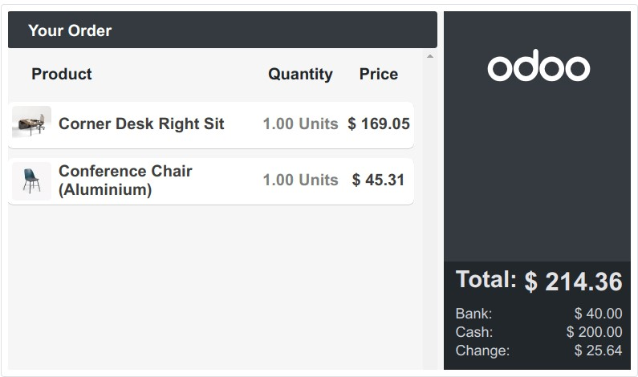
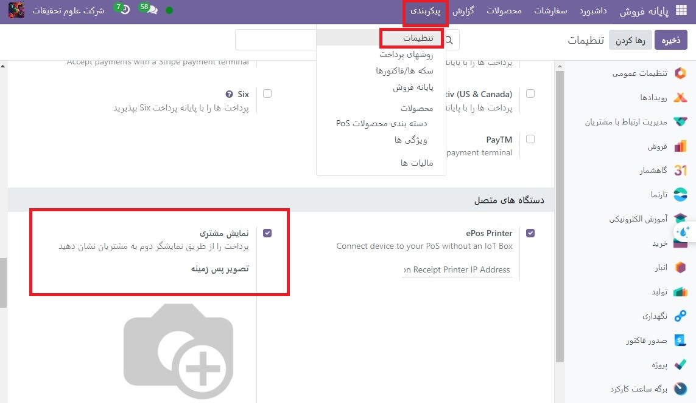
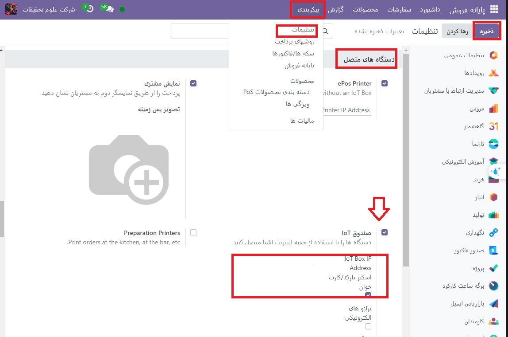

:nosearch:
:show-content:
:hide-page-toc:
:show-toc:

===========================
نمایش مشتری
===========================

ویژگی نمایش مشتری به‌روزرسانی‌های پرداخت بی‌درنگ را در نمایشگر ثانویه به مشتریان ارائه می‌دهد.

پیکربندی
------------------------------------------------
بسته به تنظیمات **(پایانه فروش)POS** شما، این ویژگی می تواند به صورت محلی در یک صفحه ثانویه یا روی مانیتور دیگری که به جعبه اینترنت اشیا متصل است نمایش داده شود.

برای فعال کردن این ویژگی، به تنظیمات POS بروید، به بخش دستگاه‌های متصل به پایین بروید و کادر **نمایش مشتری** را علامت بزنید.

محلی
-------------------------
صفحه دوم را به POS خود وصل کنید و یک جلسه POS را باز کنید. سپس روی صفحه مشتری کلیک کنید تا پنجره جدیدی برای کشیدن و رها کردن به صفحه دوم باز شود.

جعبه اینترنت اشیا
یک جعبه اینترنت اشیا را به پایگاه داده خود و صفحه دوم را به جعبه اینترنت اشیا وصل کنید. سپس، به :menuselection:`پایانه فروش --> پیکربندی --> تنظیمات` بروید، به بخش Connected Devices بروید، کادر IoT Box را علامت بزنید و مانیتور دوم را در قسمت Customer Display انتخاب کنید.

