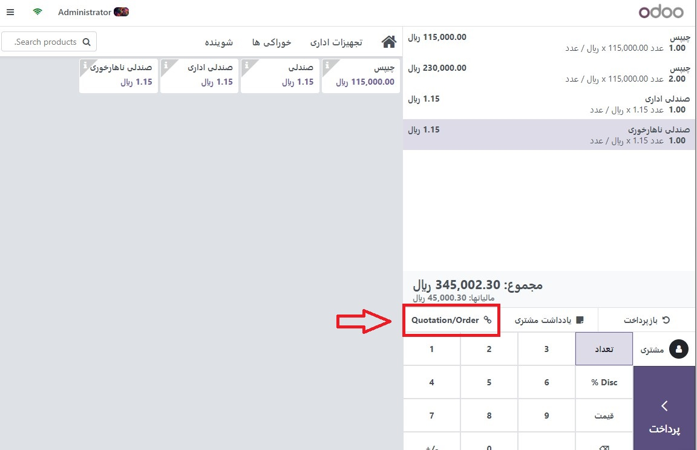
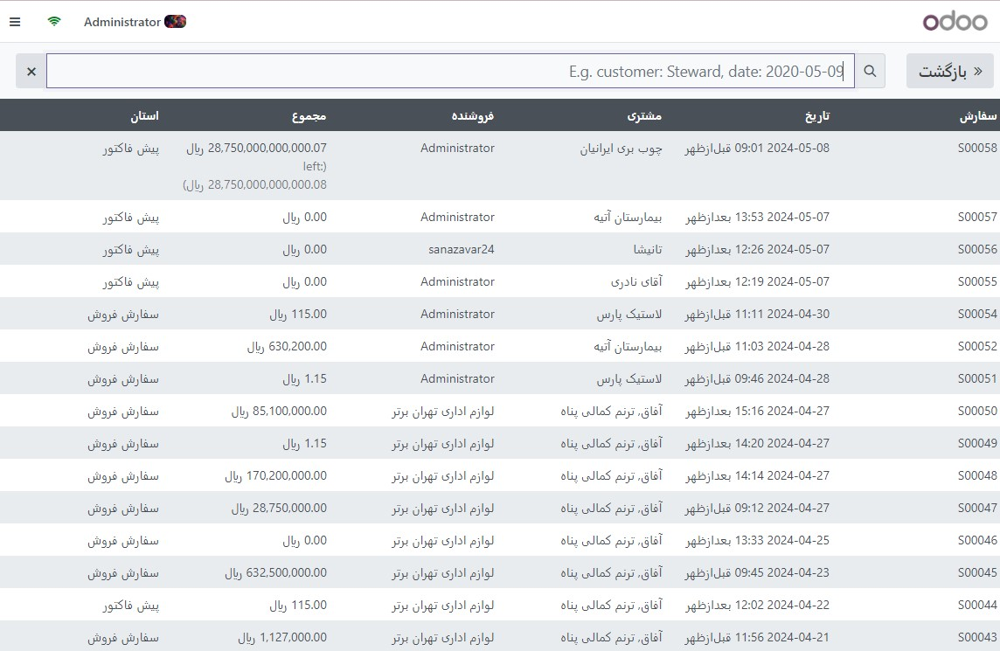

:nosearch:
:show-content:
:hide-page-toc:
:show-toc:

===========================
سفارش فروش
===========================

هنگام کار در خرده فروشی، ممکن است لازم باشد محصولات را مستقیماً از محل فروش خود سفارش دهید. خوشبختانه، Odoo پایانه فروش به طور کامل با **Odoo Sales** ادغام شده است، به این معنی که می توانید یک **سفارش فروش** ایجاد کنید و هزینه آن را مستقیماً از محل فروش خود پرداخت کنید.

سفارش فروش را انتخاب کنید
--------------------------------------------------
از برنامه پایانه فروش یک جلسه جدید باز کنید. سپس بر روی پیش فاکتور/سفارشات کلیک کنید تا لیست کامل قیمت‌ها و سفارش‌های فروش ایجاد شده در اپلیکیشن فروش را دریافت کنید.

.. note::
    برای سهولت یافتن سفارش فروش مناسب، می توانید آن لیست را روی مشتری یا در مرجع سفارش فیلتر کنید. همچنین می توانید مشتری را قبل از کلیک بر روی پیش فاکتورها/سفارش ها تنظیم کنید تا لیست را به یک مشتری خاص کاهش دهید.

درخواست پیش پرداخت یا تسویه سفارش
----------------------------------------------------------
از لیست سفارشات فروش، یکی را برای پرداخت انتخاب کنید.

شما می توانید یا:

    - تسویه نسبی سفارش: پس از کلیک بر روی اعمال پیش پرداخت، درصد پیش پرداخت مورد نظر مشتری را وارد کنید. سپس بر روی ok کلیک کرده و سفارش را ادامه دهید.

    - تسویه کامل سفارش: برای پرداخت کل سفارش فروش، روی تسویه سفارش کلیک کنید.

.. note::
    پس از تسویه سفارش فروش، پیش پرداخت اعمال شده به طور خودکار از کل مبلغ کسر می شود.
