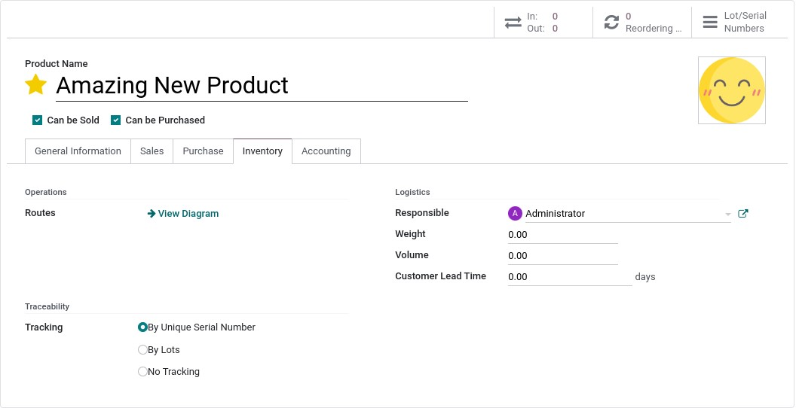
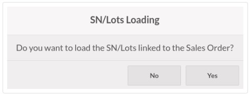
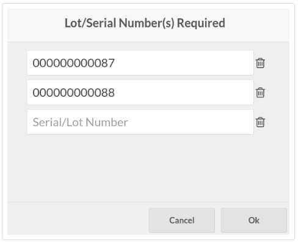

:nosearch:
:show-content:
:hide-page-toc:
:show-toc:

=============================
شماره سریال و شناسه/سری ها
=============================

کار با شماره سریال و شناسه امکان پیگیری حرکات محصولات شما را فراهم می کند. هنگامی که محصولات ردیابی می شوند، سیستم مکان آنها را بر اساس آخرین حرکت آنها شناسایی می کند.

برای فعال کردن قابلیت پیگیری، به پایانه فروش ‣ محصولات ‣ محصولات بروید. سپس، یک محصول را انتخاب کنید و کادر **Tracking By Unique Serial Number** یا **Tracking By Lots** را در تب انبارعلامت بزنید.

شماره سریال و واردات شناسه ها
---------------------------------------------------------
می توانید شماره سریال را در پایانه فروش وارد کنید. برای انجام این کار، یک سفارش فروش یا یک پیش فاکتور حاوی محصولات ردیابی شده را انتخاب کنید. سپس، با بارگیری شناسه/سری یا شماره سریال مرتبط به  :abbr:`SO (Sales Order)` موافقت کنید.

.. seealso::
   - :doc:`sales Orders`

شماره‌های رهگیری وارداتی در زیر محصولات ردیابی شده ظاهر می‌شوند. با کلیک بر روی دکمه مشاهده لیست در کنار محصولات می توانید آنها را تغییر دهید.

ایجاد شماره سریال و شناسه/سری
--------------------------------------------------
اگر محصول ردیابی شده در POS شما موجود است، با افزودن محصول به سبد خرید، یک پنجره پاپ آپ باز می شود که در آن می توانید **شماره سریال** یا شناسه محصول را تایپ یا اسکن کنید. برای افزودن بیش از یکی از محصولات ردیابی شده مشابه، برای تأیید اعتبار و شروع یک خط جدید، روی **enter** کلیک کنید.

.. note::
    - تغییر مقدار محصول ردیابی شده با استفاده از numpad، دکمه مشاهده فهرست را قرمز می کند. روی آن کلیک کنید تا شناسه و شماره سریال گم شده را اضافه کنید.

    - شماره(های) شناسه/سری و سریال در محصولات ردیابی شده الزامی است اما اجباری نیست. 
