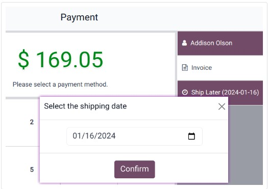

:nosearch:
:show-content:
:hide-page-toc:
:show-toc:

=============================
ارسال در زمان بعد
=============================

ویژگی **(ارسال در زمان بعد)Ship Later** به شما امکان می دهد محصولات را بفروشید و تحویل را در زمان بعدی برنامه ریزی کنید. به عنوان مثال، زمانی که کالایی در انبار موجود نیست یا حجم آن به قدری است که نیاز به ارسال دارد، یا اگر به هر دلیلی مشتری نیاز دارد سفارش خود را دیرتر ارسال کند و غیره مفید است.

.. image:: ./img/shopfeature/p9.jpg
    :align: center
    :alt: پایانه فروش 

پس از فعال شدن، می توانید:

    - محل ارسال محصولات را با انتخاب انبار انتخاب کنید.

    - یک مسیر خاص تعریف کنید یا این قسمت را برای استفاده از مسیر پیش فرض خالی بگذارید.

    - تعریف سیاست حمل و نقل؛ در صورت امکان تحویل محصولات به صورت جداگانه یا زمانی که همه محصولات آماده ارسال یکباره همه محصولات هستند، در اسرع وقت انتخاب کنید.

کاربرد عملی
----------------------------------
#. یک جلسه باز کنید و فروش انجام دهید.

#. در صفحه پرداخت، مشتری را تعیین کنید و ارسال در فرصتی دیگر را انتخاب کنید.

#. در پنجره باز شده، تاریخ ارسال را تعیین کنید و برای ادامه پرداخت، روی تأیید کلیک کنید.

سیستم فوراً یک سفارش تحویل از انبار به آدرس حمل و نقل ایجاد می کند.

.. note::
    مشتری انتخاب شده باید آدرسی را در سیستم برای ارسال محصولات ذکر کرده باشد.