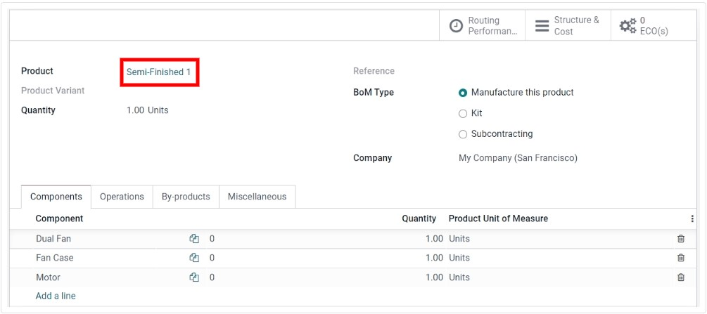
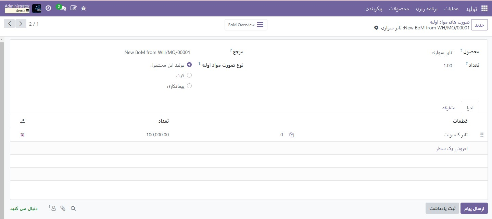
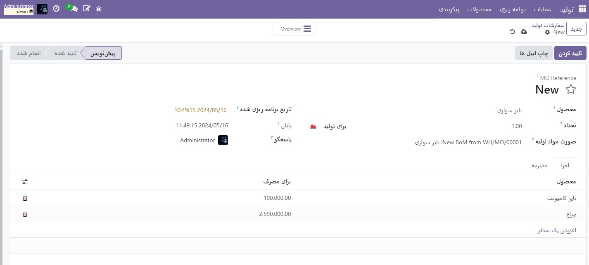

:nosearch:
:show-content:
:hide-page-toc:
:show-toc:

============================
مدیریت محصولات نیمه آماده
============================

یک محصول نیمه آماده که به عنوان یک مجموعه فرعی نیز شناخته می شود، یک محصول تولید شده است که به عنوان جزئی در صورتحساب اقلام محصول دیگر (BoM) استفاده می شود. محصولات نیمه تمام برای ساده سازی  :abbr:`BoM (Bills of materials)` های پیچیده یا نمایش دقیق تر جریان تولید استفاده می شود.  :abbr:`BoM (Bills of materials)`  که حاوی محصولات نیمه تمام است به عنوان  :abbr:`BoM (Bills of materials)` چند سطحی شناخته می شود که در آن محصول اصلی سطح بالا و مجموعه های فرعی آن متمایز می شوند.

پیکربندی محصولات نیمه تمام
----------------------------------------------------
برای راه اندازی یک BoM چند سطحی، محصول پرفروش و محصولات نیمه تمام باید پیکربندی شوند. بنابراین، اولین قدم، ایجاد محصولات نیمه تمام و  :abbr:`BoM (Bills of materials)` های آنها است.

ایجاد صورتحساب اقلام پرفروش (BoM)
------------------------------------------------
پس از پیکربندی کامل محصولات نیمه تمام، به بخش تولید ‣ محصولات ‣ محصولات بروید. سپس، محصول پرفروش را ایجاد کنید. مشخصات محصول را به دلخواه پیکربندی کنید و حتما ذخیره کنید.

هنگامی که محصول پرفروش پیکربندی شد، روی دکمه هوشمند **Bill of Materials** در فرم محصول کلیک کنید، سپس روی جدید کلیک کنید تا یک  :abbr:`BoM (Bills of materials)` برای محصول پرفروش ایجاد کنید. سپس، به سادگی محصولات نیمه آماده را به همراه سایر اجزای ضروری به این  :abbr:`BoM (Bills of materials)` اضافه کنید.

مدیریت برنامه ریزی تولید
-----------------------------------------------
چندین روش برای مدیریت اتوماسیون سفارش تولید برای محصولات با  :abbr:`BoM (Bills of materials)` های چند سطحی وجود دارد.

.. note::
    محصولات نیمه آماده به طور خاص برای مدیریت محصولات تولیدی با BoM های چند سطحی استفاده می شوند. اگر یک BoM صرفاً برای سازماندهی اجزا یا بسته بندی محصولات قابل فروش ایجاد می شود، استفاده از کیت ها گزینه مناسب تری است.

برای شروع خودکار سفارشات تولید برای محصولات نیمه آماده پس از تأیید سفارش ساخت برای محصول اصلی، دو گزینه وجود دارد:

    - روش اول (توصیه می شود): قوانین سفارش مجدد برای محصولات نیمه آماده ایجاد کنید و حداقل و حداکثر مقدار موجودی مورد نظر را روی 0 تنظیم کنید.

    - روش دوم: مسیرهای شارژمجدد (MTO) و تولید را در زیر برگه انبار فرم محصول نیمه آماده محصول فعال کنید.

گزینه 1 انعطاف پذیرتر از گزینه 2 است و بنابراین توصیه می شود. قوانین سفارش مجدد مستقیماً تقاضا را به دوباره پر کردن مرتبط نمی کند و بنابراین اجازه می دهد که سهام بدون رزرو و در صورت لزوم به سایر سفارشات هدایت شود. مسیر Replenish on Order (MTO) یک پیوند منحصر به فرد بین محصولات نیمه آماده و سطح بالا ایجاد می کند و به طور انحصاری مقادیر را برای سفارش تولید سطح بالای تایید شده رزرو می کند.

صرف نظر از روش انتخاب شده، محصولات نیمه آماده باید به طور کامل قبل از شروع ساخت بر روی محصول پرفروش تولید شوند.

