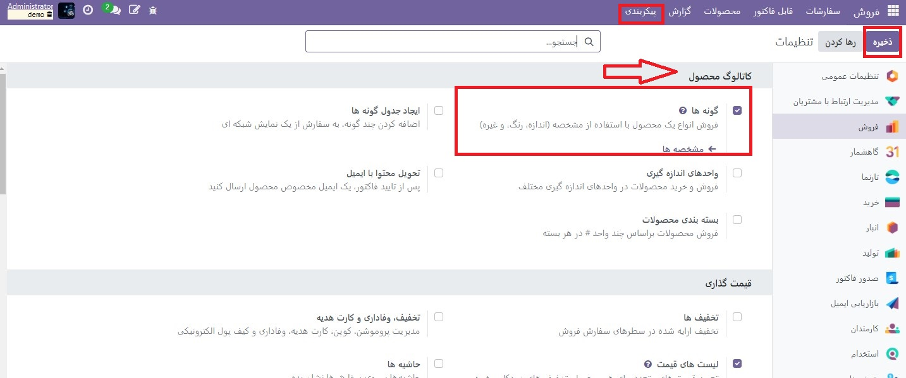

:nosearch:
:show-content:
:hide-page-toc:
:show-toc:

===================================
مدیریت BoMs برای انواع محصول
===================================

Odoo اجازه می دهد تا از یک صورتحساب اقلام (BoM) برای چندین گونه از یک محصول استفاده شود. داشتن یک  :abbr:`BoM (Bills of materials)` تلفیقی برای یک محصول با انواع مختلف با جلوگیری از نیاز به مدیریت چندین BoM باعث صرفه جویی در زمان می شود.

انواع محصولات را فعال کنید
----------------------------------------------------
برای فعال کردن ویژگی انواع محصول، به برنامه  :menuselection:`فروش --> پیکربندی --> تنظیمات` بروید و به بخش محصولات بروید. سپس بر روی چک باکس کلیک کنید تا گزینه **گونه محصول** فعال شود. پس از آن، روی **ذخیره** کلیک کنید تا تنظیمات اعمال شود.

برای اطلاعات بیشتر در مورد پیکربندی انواع محصول، به مستندات انواع محصول مراجعه کنید.

ویژگی های محصول سفارشی را ایجاد کنید
-----------------------------------------------------------
هنگامی که ویژگی انواع محصول فعال شد، ویژگی های محصول را در صفحه ویژگی ها ایجاد و ویرایش کنید.

صفحه ویژگی ها یا از طریق برنامه  :menuselection:`فروش --> پیکربندی --> تنظیمات` با کلیک کردن روی دکمه مشخصه ها یا با کلیک کردن روی  :menuselection:`انبار--> پیکربندی --> تنظیمات` قابل دسترسی است.

هنگامی که در صفحه ویژگی ها قرار گرفتید، یا روی یک ویژگی موجود کلیک کنید، یا برای ایجاد یک ویژگی جدید، روی ایجاد کلیک کنید. با کلیک بر روی ایجاد یک فرم جدید و خالی برای سفارشی کردن یک ویژگی ظاهر می شود. برای یک ویژگی موجود، روی ویرایش در فرم آن کلیک کنید تا تغییرات ایجاد شود.

یک نام ویژگی اختصاص دهید و یک دسته را از منوی کشویی فیلد دسته بندی انتخاب کنید. سپس گزینه های مورد نظر را در کنار فیلدهای نوع نمایش و روش ایجاد مشخصه انتخاب کنید. پس از انتخاب گزینه های مورد نظر، روی **افزودن یک سطر** در زیر تب Attribute Values کلیک کنید تا یک مقدار جدید اضافه شود.

.. tip::
    در ردیف مقادیریک کادر بررسی ارزش سفارشی است. در صورت انتخاب، این مقدار به‌عنوان یک مقدار سفارشی شناسایی می‌شود، که به مشتریان اجازه می‌دهد تا درخواست‌های سفارشی‌سازی ویژه را هنگام سفارش یک نوع سفارشی از یک محصول تایپ کنند.

.. example::
    
    .. image:: ./img/production/d6.jpg
        :align: center
        :alt: تولید

پس از افزودن تمام مقادیر دلخواه، روی **ذخیره** کلیک کنید تا ویژگی جدید ذخیره شود.

انواع محصول را در فرم محصول اضافه کنید
-------------------------------------------------
ویژگی های ایجاد شده را می توان بر روی انواع خاصی برای محصولات خاص اعمال کرد. برای افزودن **انواع محصول** به یک محصول، با رفتن به برنامه **انبار ‣ محصولات ‣ محصولات،** به فرم محصول بروید. برای ایجاد تغییرات در محصول، روی **ویرایش** کلیک کنید. سپس، روی **تب مشخصه ها** کلیک کنید.

در زیر سرصفحه ویژگی ها، روی **افزودن یک سطر** کلیک کنید تا یک ویژگی جدید اضافه کنید، و یکی را برای افزودن از منوی کشویی انتخاب کنید.

سپس، در زیر هدر مقادیر، روی منوی کشویی کلیک کنید تا از لیست مقادیر موجود انتخاب کنید. روی هر مقدار مورد نظر کلیک کنید تا آنها را اضافه کنید و این روند را برای هر ویژگی اضافی که باید به محصول اضافه شود تکرار کنید.

پس از اتمام، روی **ذخیره** کلیک کنید تا تغییرات ذخیره شوند.

اجزای  :abbr:`BoM (Bills of materials)` را در انواع محصول اعمال کنید
---------------------------------------------------------------------------
بعد، یک  :abbr:`BoM (Bills of materials)` جدید ایجاد کنید. یا با رفتن به برنامه **تولید ‣ محصولات ‣ صورتحساب اقلام**، یک مورد موجود را ویرایش کنید. سپس، روی جدید کلیک کنید تا یک فرم جدید  :abbr:`BoM (Bills of materials)` برای پیکربندی از ابتدا باز شود.

با کلیک بر روی منوی کشویی در قسمت محصول و انتخاب محصول مورد نظر، یک محصول را به  :abbr:`BoM (Bills of materials)` اضافه کنید.

سپس، با کلیک بر روی **افزودن یک سطر** در زیر بخش اجزا تب اجزاء، اجزای مورد نظر را از منوی کشویی انتخاب کنید.

مقادیر مورد نظر را در ستون های **مقدار** و واحد اندازه گیری انتخاب کنید. سپس، مقادیر مورد نظر را در ستون اعمال کردن **ویژگی** انتخاب کنید.

.. note::
    گزینه اعمال کردن مشخصه برای تخصیص اجزا به انواع محصولات خاص در  :abbr:`BoM (Bills of materials)` زمانی در دسترس است که تنظیمات گونه ها از برنامه انبارفعال شود. اگر فیلد اعمال کردن مشخصه ها بلافاصله قابل مشاهده نیست، آن را از منوی گزینه های اضافی (نماد سه نقطه، سمت چپ ردیف سرصفحه) فعال کنید.