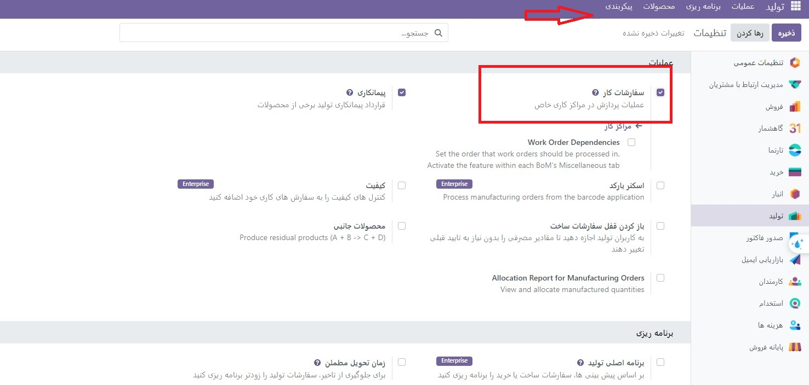
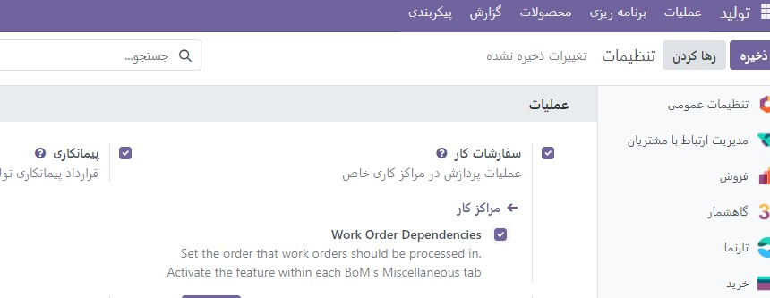
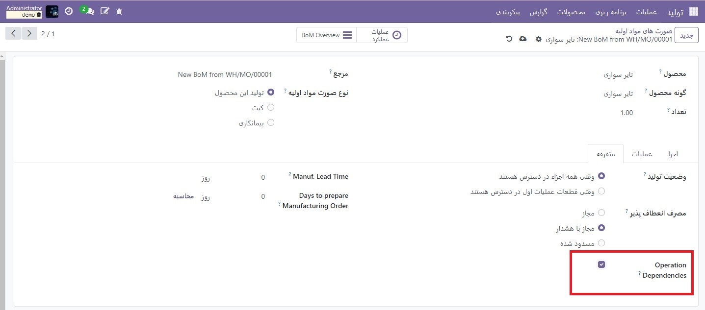
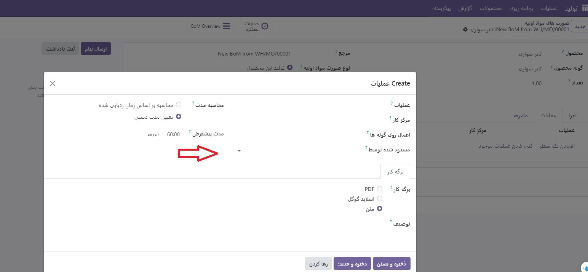
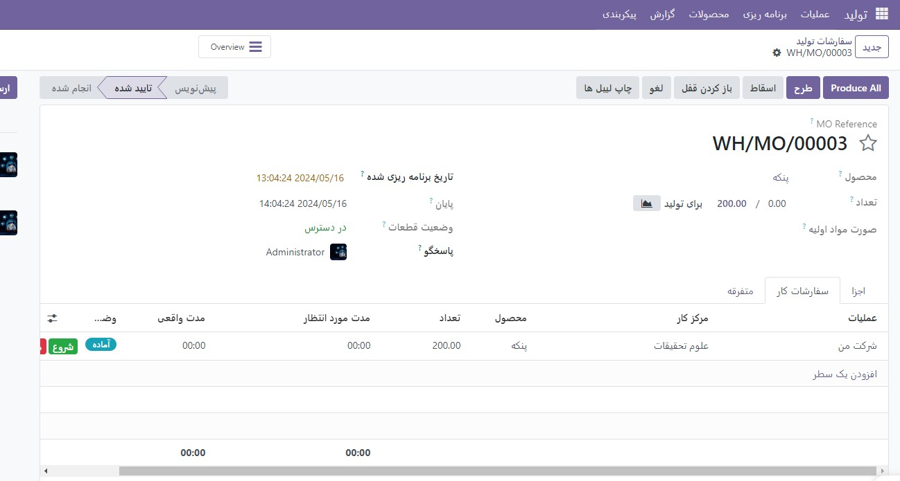
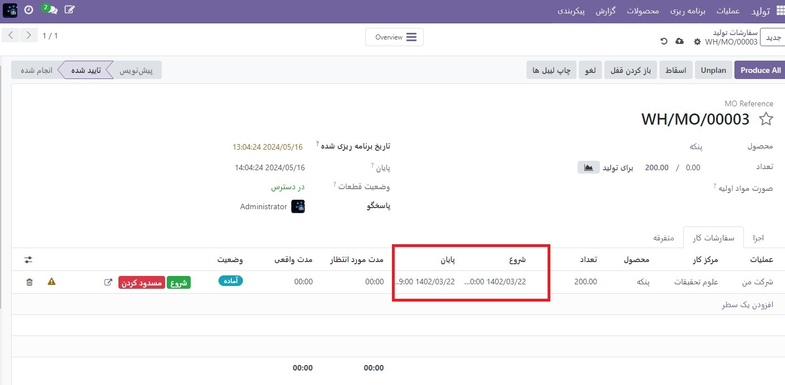

:nosearch:
:show-content:
:hide-page-toc:
:show-toc:

============================
وابستگی های سفارش کار
============================

هنگام تولید محصولات خاص، ممکن است لازم باشد عملیات خاصی قبل از شروع سایرین تکمیل شود. برای اطمینان از اینکه عملیات به ترتیب صحیح انجام می شود، تولید اودوودارای تنظیمات وابستگی سفارش کار است. فعال کردن این تنظیم اجازه می دهد تا عملیات روی صورتحساب اقلام  :abbr:`BoM (Bills of materials)` توسط سایر عملیاتی که باید ابتدا انجام شود مسدود شود.

پیکربندی
-------------------------------------------------
تنظیم وابستگی های سفارش کار به طور پیش فرض فعال نیست. برای فعال کردن آن، با رفتن به  :menuselection:`تولید --> پیکربندی --> تنظیمات` شروع کنید. سپس، تنظیمات سفارشات کاررا فعال کنید، اگر قبلاً فعال نیست.

پس از فعال کردن تنظیمات سفارشات کار، تنظیمات Work Order Dependencies در زیر آن ظاهر می شود. Work Order Dependencies را فعال کنید، سپس روی ذخیره کلیک کنید تا تغییرات را تأیید کنید.

وابستگی ها را به BoM اضافه کنید
------------------------------------------------------------
وابستگی های سفارش کار بر روی BoM محصول پیکربندی می شوند. برای انجام این کار، به :menuselection:`تولید --> پیکربندی --> صورتحساب اقلام` بروید، سپس یک BoM را انتخاب کنید، یا با کلیک کردن روی جدید، یک مورد جدید ایجاد کنید.

در BoM، روی زبانه متفرقه کلیک کنید، سپس گزینه وابستگی های عملیات را فعال کنید. این باعث می شود که یک گزینه جدید Blocked By در تنظیمات تب عملیات در دسترس باشد.

سپس روی تب عملیات کلیک کنید. در سمت راست بالای برگه، روی دکمه تنظیمات برگه کلیک کنید، سپس کادر انتخاب  مسدودشده توسط را فعال کنید. این باعث می شود که یک فیلد مسدود شده توسط برای هر عملیات در تب عملیات ظاهر شود

در خط عملیاتی که باید توسط عملیات دیگری مسدود شود، روی قسمت بلاک شده توسط کلیک کنید و یک پنجره بازشوایجاد عملیات: ظاهر می شود. در قسمت کشویی بلاک شده توسط در پنجره بازشو، عملیات مسدودسازی را که باید قبل از عملیات مسدود شده تکمیل شود، انتخاب کنید..

در نهایت با کلیک بر روی  ذخیره،  :abbr:`BoM (Bills of materials)` را ذخیره کنید

دستورات کاری را با استفاده از وابستگی ها برنامه ریزی کنید
-----------------------------------------------------------------------------------
هنگامی که وابستگی‌های سفارش کار بر روی یک BoM پیکربندی شدند، Odoo Manufacturing می‌تواند بر اساس وابستگی‌های آن‌ها، زمان‌بندی زمان‌بندی سفارش‌های کاری را برنامه‌ریزی کند. برای برنامه ریزی سفارشات کاری برای یک سفارش ساخت، با پیمایش به بخش **تولید ‣ عملیات ‣ سفارشات تولید** شروع کنید.

در مرحله بعد، یک سفارش تولید را برای یک محصول انتخاب کنید که وابستگی‌های سفارش کار در BoM آن تنظیم شده است، یا با کلیک کردن روی جدید، یک سفارش تولید جدید ایجاد کنید. اگر سفارش تولید جدیدی ایجاد شد، یک BoM پیکربندی شده با وابستگی های سفارش کار را از قسمت کشویی Bill of Material انتخاب کنید، سپس روی تأیید کلیک کنید.

پس از تایید سفارش ساخت، سربرگ سفارشات کاررا انتخاب کنید تا سفارشات کاری مورد نیاز برای تکمیل آن را مشاهده کنید. هر سفارش کاری که توسط یک سفارش کاری دیگر مسدود نشده باشد، یک برچسب آماده را در بخش وضعیت نمایش می دهد.

سفارش‌های کاری که توسط یک یا چند سفارش کاری مسدود شده‌اند، به جای آن یک برچسب Waiting for other WO نشان می‌دهند. پس از تکمیل سفارش(های) کاری مسدود کردن، برچسب به آماده به روز می شود.

برای برنامه ریزی سفارشات کاری سفارش تولید، روی دکمه طرح در بالای صفحه کلیک کنید. پس از انجام این کار، فیلد تاریخ شروع برنامه ریزی شده برای هر سفارش کاری در برگه سفارشات کار به صورت خودکار با تاریخ و زمان شروع برنامه ریزی شده پر می شود. یک سفارش کاری مسدود شده در پایان دوره زمانی مشخص شده در قسمت مدت زمان مورد انتظار سفارش کاری که قبل از آن تعیین شده است، برنامه ریزی می شود.

