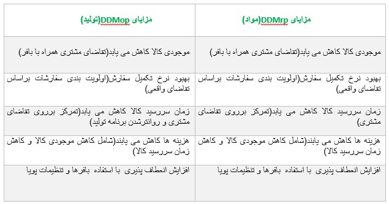
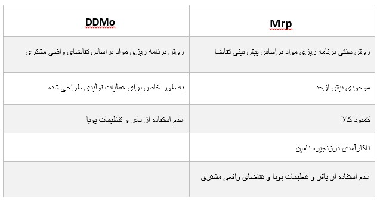
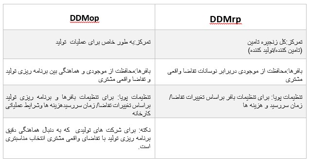

:nosearch:
:show-content:
:hide-page-toc:
:show-toc:

=====================
mrp and mop
=====================

DDMrp :روش برنامه ریزی و اجرای اقلام در چند سطح (بهینه سازی در چرخه ی تامین مواد)

هدف از این روش: 

   - کاهش موجودی کالا
   - نرخ تکمیل سفارش افزایش می یابد
   - زمان سررسید کالا کاهش می یابد

Mrp:برنامه ریزی  نیازهای اقلام 
Drp:برنامه ریزی نیازهای توضیح

تمرکزDDMrp بیشتر تقاضای مشتری برای پیش بینی های تقاضاست

مراحل DDMrp:شامل 5 روش است:

  - روش اول:مکان یابی استراتژیک موجودی یافتن<<---->> محل بهینه سازی  برای ذخیره سازی مواد: استفاده از الگوریتم های بهینه سازی

عوامل دخیل در این مرحله شامل:

   - تقاضای مشتری
   - زمان سررسید کالا
   - هزینه حمل و نقل

  - روش دوم:پروفایل و سطوح بافر:محافظت از نقاط جداکننده موجودی

سطوح بافر:انبار امنی هستند که از موجودی کالاها در برابر نوسانات تقاضای محافظت می کنند.(سطوح بافر با استفاده از مدل های آماری تعیین می شود.)

  - روش سوم:تنظیمات پویا: بافرها با توجه به شرایط تنظیم می شوند(با استفاده  از الگوریتم های یادگیری ماشین برای پیش بینی تغییرات تقاضا وتنظیم بافرها)

علت تنظیم بافرها با این روش این است که بافرها همیشه در سطح بهینه باشند.

  - روش چهارم:برنامه ریزی بر اساس تقاضا:سفارشات تولید/ خرید/ انتقال براساس اولویت بافرها صادر می شود( با استفاده از الگوریتم های بهینه سازی برای تعیین زمان و حجم سفارشات)

استفاده از این روش برای اطمینان بیشتر از تخصص کارآمد منابع می باشد.

  - روش پنچم:اجرای قابل مشاهده  ومشارکت :سفارشات خرید/ تولید/ انتقال --> همگام با تغییرات تقاضا(با استفاده از ابزارهای ارتباطی برای هماهنگی بین ذینفعان)

DDMop: برنامه ریزی عملیات تولیدی بر اساس تقاضا(بهینه سازی در چرخه تولید)

هدف از این روش:
   - موجودی کالای خام در حال انجام
   - بهبود نرخ تکمیل سفارش افزایش می یابد
   - زمان سررسید کالا کاهش می یابد
   - تمرکز DDMop تقاضای واقعی مشتری برا اساس پیش بینی تقاضا می باشد.

مراحل DDMopشامل 5 روش زیر می باشد:

  - روش اول : مکان یابی استرتژیک موجودی: یافتن محل بهینه برای ذخیره سازی  موادخام ,قطعات نیمه تمام و محصولات نهایی.(با استفاده از الگوریتم  بهینه سازی)

عوامل دخیل در این مرحله:
 - تقاضا
 - زمان سررسید
 - هزینه های حمل و نقل
 - چیدمان کارخانه

  - روش دوم: پروفایل و سطوح بافر: محافظت از نقاط جداکننده موجودی درفرآیند تولید.

سطوح بافر: انبارهای امنی هستند که از مواد خام و قطعات نیمه تمامو محصولات نهایی در برابر نوسانات تقاضا محافظت می کنند.

(سطوح بافر با استفاده از فرمول ها و مدل های آماری برای محیط تولیدی تعیین می شود.)

  - روش سوم:تنظیمات پویا بافرها با توجه به شرایط تنظیم می شوند.(عوامل دخیل -->تغییرات تقاضا ,زمان سررسید,هزینه ها,شرایط عملیاتی کارخانه) - ->>(با استفاده از الگوریتم های یادگیری ماشین  برای پیش بینی تغییرات تقاضا  وتنظیم بافرها)

  -روش چهارم:برنامه ریزی بر اساس تقاضا: برنامه خرید موادخام,تولید, وقطعات و انتقال محصولات نهاییبر اساس اولویت بندی بافرها صادر می شود.( با استفاده از الگوریتم های بهینه سازی برای تعیین زمان / حجم و ترکیب سفارشات/ برنامه ریزی وظایف تولیدی)

علت اولویت بندی بافرها در این روش:اطمینان ازتخصیص منابع به طور کارآمد/ روانترشدن فرآیندتولید

  - روش پنجم:اجرای قابل مشاهده و مشارکت: مدیریت برنامه های تولید,خرید و انتقال با استفاده از تغییراتتقاضا

تفاوت  Mrpو DDMO

.. example::

    .. image:: ./img/Mrp/m3.jpg
        :align: center
        :alt: تولید

تفاوت DDMrp  و DDMOp
------------------------------------------

DDMrpو DDMop با کدام ماژول های ERP Odoo  همخوانی دارند؟

   - انبار
   - خرید
   - تولید
   - فروش
   - مدیریت پروزه 
   - حسابداری /صورتحساب
   - تجزیه وتحلیل(داشبورد)
   - Crm
   - بحث 
