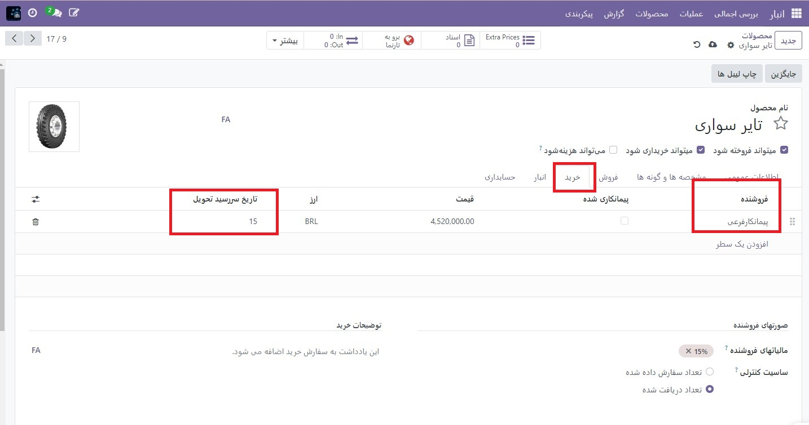
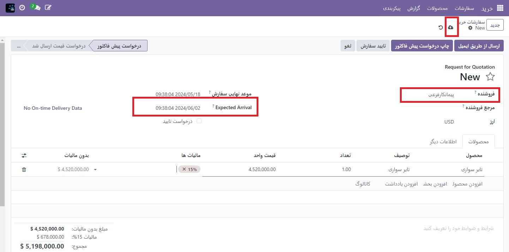

:nosearch:
:show-content:
:hide-page-toc:
:show-toc:

==================================================
زمان سرنخ برای تحویل سفارش قراداد فرعی اصلی
==================================================

در Odoo از زمان‌های سرنخ برای پیش‌بینی مدت زمان انجام یک عمل خاص استفاده می‌شود. به عنوان مثال، زمان تحویل را می توان برای یک محصول خریداری شده تنظیم کرد، که تعداد روزهایی را که معمولاً برای فروشنده محصول طول می کشد تا محصول را به شرکت خریدار تحویل دهد، مشخص می کند.

به طور خاص برای محصولات قرارداد فرعی، زمان تحویل تحویل را می توان به گونه ای پیکربندی کرد که مدت زمان مورد نیاز برای پیمانکار فرعی برای تولید یک محصول در نظر گرفته شود. انجام این کار به شرکت طرف قرارداد اجازه می دهد تا تاریخ تحویل محصولات تحت قرارداد فرعی را بهتر پیش بینی کند.

.. important::
    مانند تمام زمان‌های تحویل در Odoo، زمان‌های سررسید برای محصولات با قرارداد فرعی فقط یک تخمین است و بر اساس مدت زمانی است که انتظار می‌رود اقدامات انجام شود.

    شرایط پیش‌بینی‌نشده می‌تواند بر تکمیل این اقدامات تأثیر بگذارد، به این معنی که زمان‌های پیش‌بینی نباید به عنوان تضمین در نظر گرفته شود.

پیکربندی
----------------------------------------------
هنگام استفاده از گردش کار اصلی پیمانکاری فرعی برای تولید یک محصول، یک شرکت مسئولیتی در قبال تامین قطعات لازم برای پیمانکار فرعی ندارد. این بدان معنی است که تنها عواملی که بر تاریخ تحویل یک محصول تأثیر می گذارد، مدت زمانی است که پیمانکار فرعی برای ساخت و تحویل آن صرف می کند.

با اختصاص دادن زمان تحویل به پیمانکار فرعی محصول که هر دوی این عوامل را در نظر می گیرد، تاریخ ورود مورد انتظار که در سفارشات خرید (POs) برای محصول نمایش داده می شود، میزان زمان مورد نیاز برای ساخت و تحویل را با دقت بیشتری منعکس می کند.

زمان تحویل محصول
--------------------------------------------
برای تنظیم زمان تحویل برای پیمانکار فرعی یک محصول، به برنامه انبار ‣ محصولات ‣ محصولات بروید و یک محصول با قرارداد فرعی را انتخاب کنید.

سپس، برگه خرید را در صفحه محصول انتخاب کنید. اگر پیمانکار فرعی قبلاً به عنوان فروشنده اضافه نشده است، اکنون با کلیک بر روی افزودن خط و انتخاب پیمانکار فرعی در ستون فروشنده، این کار را انجام دهید.

پس از اضافه شدن پیمانکار فرعی، تعداد روزهایی را که برای تولید و تحویل محصول طول می کشد، در ستون زمان تحویل وارد کنید.

.. note::
    چندین پیمانکار فرعی را می توان به برگه خرید در صفحه محصول اضافه کرد و زمان تحویل متفاوتی را می توان برای هر کدام تنظیم کرد.

گردش کار زمان سرنخ
-----------------------------------------------------
پس از تنظیم زمان تحویل برای فروشنده محصول، با رفتن به برنامه **خرید ‣ سفارشات ‣ سفارشات خرید** و کلیک کردن روی جدید، یک RfQ ایجاد کنید.

در قسمت فروشنده **پیمانکار فرعی** را مشخص کنید. سپس، با کلیک بر روی افزودن محصول، انتخاب محصول در ستون محصولات و افزودن یک مقدار در ستون مقدار، محصول را در تب محصولات اضافه کنید.

هنگامی که یک محصول اضافه شد، فیلد **Expected Arrival** در RfQ به طور خودکار با تاریخی پر می شود که زمان تحویل فروشنده را نشان می دهد، همانطور که در صفحه محصول مشخص شده است.

اگر تاریخ نیاز به تنظیم دارد، روی قسمت **Expected Arrival** کلیک کنید تا پاور تقویم باز شود و تاریخ مورد نظر را انتخاب کنید. اطمینان حاصل کنید که تاریخ را زودتر از تاریخی که به طور خودکار پر شده است انتخاب نکنید، مگر اینکه پیمانکار فرعی تأیید کرده باشد که می تواند محصول را تا آن تاریخ تحویل دهد.

در نهایت روی تاییدسفارش در RfQ کلیک کنید تا آن را به یک PO تبدیل کنید. در این مرحله، پیمانکار فرعی باید قبل از تحویل محصول به شرکت پیمانکار، تولید محصول را آغاز کند.

