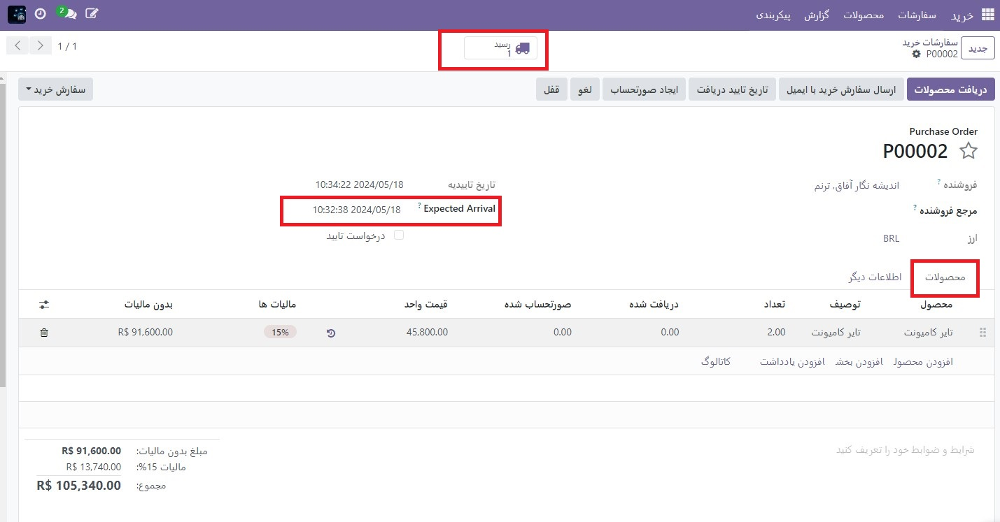

:nosearch:
:show-content:
:hide-page-toc:
:show-toc:

==================================================
پیمانکاری فرعی
==================================================

در تولید، پیمانکاری فرعی فرآیندی است که یک شرکت از یک سازنده یا پیمانکار فرعی شخص ثالث برای تولید محصولاتی که سپس توسط شرکت طرف قرارداد فروخته می‌شود، درگیر می‌کند.

در پیمانکاری اساسی، پیمانکار فرعی مسئولیت دستیابی به اجزای لازم را بر عهده دارد. این بدان معناست که شرکت طرف قرارداد فقط باید نگران این باشد که پس از تولید محصولات طرف قرارداد فرعی چه اتفاقی می افتد.

گردش کار برای خرید یک محصول تولید شده با استفاده از پیمانکاری فرعی پایه مشابه کاری است که هنگام خرید یک محصول بدون قرارداد فرعی از یک فروشنده استفاده می شود. تفاوت های اصلی در نحوه پیکربندی محصولات قرارداد فرعی و این واقعیت است که ارسال محصولات با قرارداد فرعی از فروشنده زمان بیشتری می برد، زیرا ابتدا باید توسط آنها تولید شوند.

پیکربندی
--------------------------
برای استفاده از قرارداد فرعی در Odoo، به برنامه **تولید ‣ پیکربندی ‣ تنظیمات** بروید و کادر کنار تنظیمات پیمانکار فرعی را در زیر عنوان عملیات علامت بزنید. سپس، روی **ذخیره** کلیک کنید.

هنگامی که تنظیم **پیمانکار فرعی** فعال شد، همچنین لازم است که محصول پیمانکار فرعی و  :abbr:`BoM (Bills of materials)`  محصول به درستی پیکربندی شود.

پیکربندی محصول
-------------------------------------------------
برای پیکربندی یک محصول برای قراردادهای فرعی اساسی، به برنامه **انبار ‣ محصولات ‣ محصولات** بروید و یک محصول را انتخاب کنید یا با کلیک کردن روی جدید، محصول جدیدی ایجاد کنید.

در فرم محصول، برگه خرید را انتخاب کنید و با کلیک روی افزودن خط، انتخاب پیمانکار فرعی در منوی کشویی فروشنده و وارد کردن قیمت در قسمت قیمت، **پیمانکار فرعی** محصول را به عنوان فروشنده اضافه کنید.

سپس، روی تب انبار کلیک کنید و از فیلد مسیرها برای پیکربندی مسیری استفاده کنید که تعیین می کند پس از تولید محصول نهایی توسط پیمانکار فرعی، چه اتفاقی برای آن می افتد.

اگر محصول نهایی به شرکت طرف قرارداد ارسال شد، مطمئن شوید که مسیر خرید انتخاب شده است. علاوه بر این، مسیر تکمیل سفارش (MTO) را انتخاب کنید تا پس از تأیید سفارش فروش (SO) به طور خودکار یک PO برای محصول ایجاد شود، مگر اینکه موجودی کافی برای انجام SO وجود داشته باشد.

اگر محصول نهایی مستقیماً توسط پیمانکار فرعی برای مشتری ارسال می شود، مطمئن شوید که فقط مسیر Dropship انتخاب شده است.

.. image:: ./img/subcontracting/b4.jpg
    :align: center
    :alt: تولید

BoM را پیکربندی کنید
-------------------------------------------
برای پیکربندی یک  :abbr:`BoM (Bills of materials)` برای قراردادهای فرعی اساسی، روی دکمه هوشمند **صورتحساب اقلام** در فرم محصول کلیک کنید و  :abbr:`BoM (Bills of materials)` مورد نظر را انتخاب کنید.

از طرف دیگر، به برنامه **تولید ‣ محصولات ‣ صورتحساب مواد** بروید و BoM را برای محصول پیمانکار فرعی انتخاب کنید.

در قسمت BoM Type گزینه پیمانکار را انتخاب کنید. سپس، یک یا چند پیمانکار فرعی را در قسمت پیمانکاران فرعی که در زیر نشان داده می‌شود، اضافه کنید.

در قسمت BoM Type گزینه پیمانکار را انتخاب کنید. سپس، یک یا چند پیمانکار فرعی را در قسمت پیمانکاران فرعی که در زیر نشان داده می‌شود، اضافه کنید.

در نهایت بر روی تب متفرقه کلیک کنید. در دستی. در قسمت زمان سرنخ، تعداد روزهایی را که پیمانکار فرعی برای تولید محصول طول می کشد، وارد کنید. این عدد هنگام محاسبه تاریخ ورود مورد انتظار محصول در نظر گرفته می شود.

.. note::
    هنگام استفاده از پیمانکار فرعی، نیازی به فهرست کردن اجزا در برگه اجزای :abbr:`BoM (Bills of materials)` نیست، زیرا اجزای مورد نیاز برای ساخت و ابزاری که از طریق آنها به دست می‌آیند توسط پیمانکار فرعی مدیریت می‌شوند.

گردش کار اصلی پیمانکاری فرعی
---------------------------------------------------
گردش کار اصلی پیمانکاری فرعی شامل حداکثر چهار مرحله است:

   #. یک سفارش فروش (SO) برای محصول قرارداد فرعی ایجاد کنید. انجام این کار یک PO برای خرید محصول از پیمانکار فرعی ایجاد می کند.

   #. PO ایجاد شده در مرحله قبل را تأیید کنید یا یک PO جدید ایجاد کنید. انجام این کار یک سفارش رسید یا یک سفارش dropship ایجاد می کند.

   #. زمانی که پیمانکار فرعی ساخت محصول قرارداد فرعی را به پایان رساند، رسید را پردازش کنید و آن را به شرکت طرف قرارداد ارسال کرد، یا سفارش dropship را پردازش کنید تا محصول را مستقیماً برای مشتری ارسال کنید.

   #. اگر گردش کار با ایجاد یک SO شروع شد و محصول نهایی به مشتری نهایی ارسال نشد، پس از ارسال محصول به مشتری، سفارش تحویل را پردازش کنید.

تعداد مشخص مراحل بستگی به دلیل خرید محصول قرارداد فرعی از پیمانکار فرعی دارد.

اگر دلیل انجام یک سفارش خاص مشتری باشد، این فرآیند با ایجاد یک SO شروع می شود و با تحویل محصول به مشتری یا ارسال آن توسط پیمانکار فرعی به او خاتمه می یابد.

اگر دلیل افزایش مقدار موجودی موجود باشد، فرآیند با ایجاد یک PO شروع می شود و با دریافت محصول در موجودی پایان می یابد.

سفارش فروش ایجاد کنید
------------------------------------------------
تکمیل این مرحله تنها در صورتی ضروری است که محصول از پیمانکار فرعی برای رفع نیاز مشتری خریداری شده باشد. اگر محصول برای افزایش مقدار موجودی در دسترس خریداری می شود، به مرحله بعدی بروید.

برای ایجاد یک SO(سفارش فروش) جدید، به برنامه **فروش ‣ سفارشات ‣ سفارشات** بروید و روی جدید کلیک کنید.

در منوی کشویی مشتری، مشتری را انتخاب کنید. سپس، روی **افزودن یک محصول** در تب خطوط سفارش کلیک کنید، یک محصول با قرارداد فرعی را در منوی کشویی محص انتخاب کنید و یک مقدار را در قسمت مقدار وارد کنید.

برای تأیید (سفارش فروش):abbr:`SO (Sales Order)` ، روی تأیید کلیک کنید، در این مرحله یک دکمه هوشمند خرید در بالای صفحه ظاهر می شود. این :abbr:`PO (Purchase Order)` (سفارش خرید) ایجاد شده برای خرید محصول قرارداد فرعی از **پیمانکار فرعی** را باز می کند.

.. note::
    یک SO برای محصول فقط در صورتی یک :abbr:`PO (Purchase Order)`  ایجاد می کند که مسیر شارژمجدد(MTO) در فرم محصول فعال باشد و موجودی کافی از محصول برای انجام :abbr:`SO (Sales Order)`  وجود نداشته باشد.

    اگر موجودی کافی در دسترس باشد، تأیید یک :abbr:`SO (Sales Order)` برای محصول در عوض یک سفارش تحویل ایجاد می‌کند، زیرا Odoo فرض می‌کند که SO با استفاده از موجودی انبار انجام می‌شود.

    این مورد در مورد محصولات قرارداد فرعی که به مشتری نهایی ارسال می شوند صدق نمی کند. در آن صورت، یک :abbr:`PO (Purchase Order)`  همیشه ایجاد می شود، حتی اگر سهام کافی در دسترس باشد.

فرآیند PO
---------------------------------------------
اگر یک :abbr:`PO (Purchase Order)` در مرحله قبل ایجاد شده است، با کلیک بر روی دکمه خرید هوشمند در بالای :abbr:`SO (Sales Order)` یا با رفتن به برنامه خرید -> سفارشات -> سفارشات خرید و انتخاب PO به آن بروید. سپس برای تایید آن بر روی تایید سفارش کلیک کنید و به مرحله بعد بروید.

اگر در مرحله قبل یک :abbr:`PO (Purchase Order)` ایجاد نشده بود، اکنون با رفتن به برنامه **خرید ‣ سفارشات ‣ سفارشات خرید** و کلیک بر روی گزینه **جدید**، این کار را انجام دهید.

پر کردن :abbr:`PO (Purchase Order)` را با انتخاب یک پیمانکار فرعی از منوی کشویی فروشنده شروع کنید. در برگه محصولات، روی افزودن محصول کلیک کنید تا یک خط محصول جدید ایجاد کنید. در قسمت محصولات یک محصول پیمانکار فرعی را انتخاب کنید و مقدار را در قسمت تعداد  وارد کنید. در نهایت روی تایید سفارش کلیک کنید تا PO تایید شود.

هنگامی که یک :abbr:`PO (Purchase Order)` برای یک محصول تولید شده با استفاده از قرارداد فرعی اساسی تأیید می شود، یک رسید یا سفارش dropship به طور خودکار ایجاد می شود و می توان از طریق دکمه هوشمند رسید یا Dropship مربوطه که در بالای PO ظاهر می شود به آن دسترسی داشت.

رسید یا سفارش dropship را پردازش کنید
-------------------------------------------------------------------
زمانی که پیمانکار فرعی ساخت محصول را به پایان رساند، بسته به اینکه محصول چگونه پیکربندی شده است، آن را به شرکت طرف قرارداد ارسال می کند یا برای مشتری نهایی ارسال می کند.

رسید فرآیند
------------------------------------
اگر پیمانکار فرعی محصول نهایی را به شرکت طرف قرارداد ارسال کرد، پس از دریافت آن، به برنامه **خرید ‣ سفارشات ‣ سفارشات خرید** بروید و PO را انتخاب کنید.

روی دکمه دریافت محصولات در بالای PO یا دکمه هوشمند دریافت در بالای صفحه کلیک کنید تا رسید باز شود. سپس روی تأیید اعتبار در بالای رسید کلیک کنید تا محصول وارد موجودی شود.

پردازش سفارش dropship
----------------------------------------------
اگر پیمانکار فرعی محصول را ارسال کرد، پس از ارسال آن، به برنامه **خرید ‣ سفارشات ‣ سفارشات خرید** بروید و PO را انتخاب کنید.

برای باز کردن سفارش dropship، دکمه هوشمند Dropship را در بالای صفحه انتخاب کنید و برای تأیید ارسال کالا به مشتری، روی تأیید اعتبار در بالای سفارش کلیک کنید.

پردازش سفارش تحویل
---------------------------------------------
اگر گردش کار پیمانکاری فرعی توسط یک مشتری :abbr:`SO (Sales Order)` شروع شده باشد و محصول نهایی به مشتری ارسال نشده باشد، بلکه به شرکت طرف قرارداد تحویل داده شده است، لازم است محصول برای مشتری ارسال شود و سفارش تحویل پردازش شود.

هنگامی که محصول برای مشتری ارسال شد، به برنامه فروش رفته و :abbr:`SO (Sales Order)` را انتخاب کنید. برای باز کردن سفارش تحویل، دکمه هوشمند تحویل را در بالای صفحه انتخاب کنید و برای تأیید ارسال کالا بر روی تأیید اعتبار سفارش کلیک کنید.
