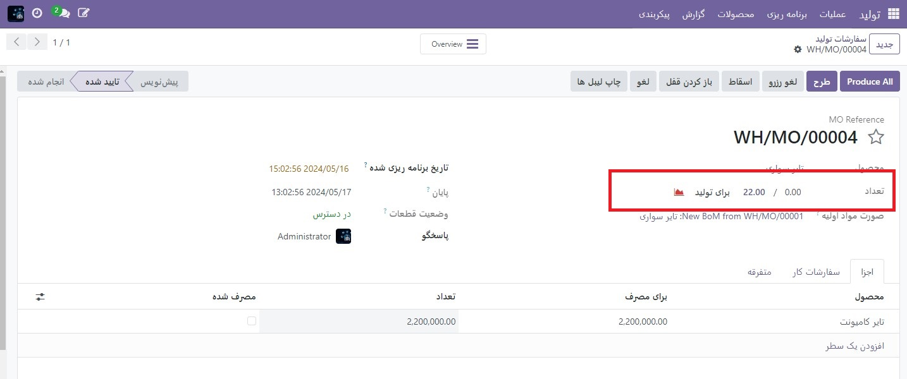
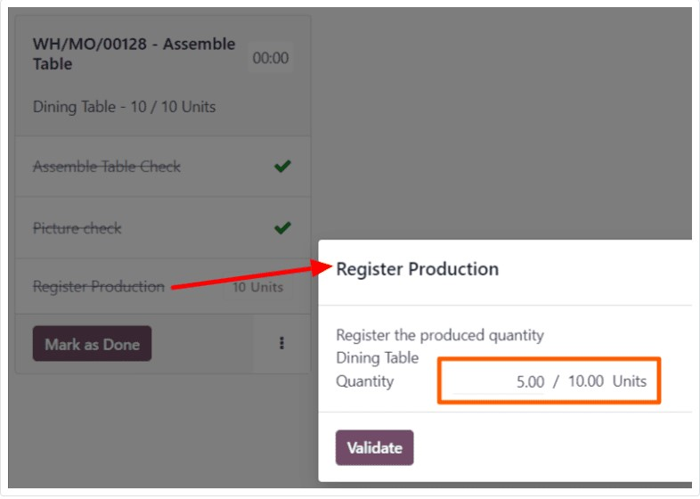

:nosearch:
:show-content:
:hide-page-toc:
:show-toc:

===================================
سفارشات پشتیبان تولید
===================================

در برخی موارد، مقدار کامل یک سفارش ساخت را نمی توان بلافاصله تولید کرد. هنگامی که این اتفاق می افتد، ماژول تولیدامکان تولید مقادیر جزئی از سفارش را می دهد و برای مقدار باقیمانده یک سفارش پشتیبان ایجاد می کند.

در برنامه تولید، ایجاد یک سفارش پشتیبان، سفارش تولید اصلی را به دو سفارش تقسیم می‌کند. تگ مرجع برای هر سفارش، برچسبی است که برای سفارش اصلی استفاده می شود، به دنبال آن یک خط فاصله و سپس یک عدد اضافی برای نشان دادن اینکه یک سفارش پشتیبان است.

یک سفارش پشتیبان تولید ایجاد کنید
------------------------------------------------------------
برای ایجاد یک سفارش پشتیبان برای بخشی از یک سفارش تولید، با رفتن به **تولید ‣ عملیات ‣ سفارشات**  شروع کنید. یک سفارش رفتن با تعداد دو یا بیشتر انتخاب کنید یا با کلیک روی ایجاد یک سفارش ایجاد کنید.

اگر سفارش ساخت جدیدی ایجاد شد، یک محصول را از منوی کشویی محصولات انتخاب کنید و مقدار دو یا بیشتر را در قسمت تعداد وارد کنید، سپس برای تایید سفارش روی تایید کلیک کنید.

پس از تولید مقداری که بلافاصله تولید می شود، آن عدد را در قسمت تعداد در بالای سفارش رفتن وارد کنید.

ایجاد یک سفارش مجدد در طبقه فروشگاه
----------------------------------------------------------
همچنین می‌توان از ماژول بخش تولید سفارش‌های پشتیبان برای سفارش‌های تولید ایجاد کرد.

.. note::
    برای استفاده از ماژول بخش تولید، تنظیم سفارشات کار باید فعال باشد. برای انجام این کار، به  :menuselection:`تولید --> پیکربندی --> تنظیمات` بروید، کادر بررسی سفارشات کار را فعال کنید و سپس روی ذخیره کلیک کنید.

برای ایجاد یک سفارش پشتیبان از ماژول   بخش تولید، با پیمایش به  :menuselection:`تولید --> عملیات --> سفارشات تولید` شروع کنید. یک :abbr:`MO (Manufacturing Order)` را برای چندین واحد از یک محصول انتخاب کنید، که برای آن باید یک سفارش پشتیبان ایجاد شود.

در  :abbr:`MO (Manufacturing Order)`، برگه سفارشات  را انتخاب کنید و سپس روی دکمه Open Work Order (نماد پیوند خارجی) در خط سفارش کاری که قرار است پردازش شود کلیک کنید. در پنجره بازشوی سفارشات کار، روی دکمه Open Shop Floor کلیک کنید تا ماژول Shop Floor باز شود.

هنگامی که از یک سفارش کاری خاص به آن دسترسی پیدا می کنید، ماژول بخش تولید به صفحه مرکز کاری که در آن سفارش پیکربندی شده است باز می شود و کارت سفارش کاری را جدا می کند تا هیچ کارت دیگری نشان داده نشود.

مراحل روی کارت سفارش کار را تکمیل کنید تا به مرحله ثبت تولید برسید و سپس روی آن کلیک کنید تا پنجره پاپ آپ ثبت تولید باز شود.

در پنجره پاپ آپ ثبت تولید ، تعداد واحدهای تولید شده را در قسمت تعداد وارد کنید. مطمئن شوید که عدد وارد شده کمتر از تعداد واحدهای ذکر شده در سمت راست فیلد باشد. سپس روی تاییداعتبار کلیک کنید.

پنجره بازشو ناپدید می‌شود و دکمه # واحد روی کارت سفارش کاری به‌روزرسانی می‌شود تا تعداد واحدهای تولید شده را منعکس کند، به عنوان کسری از تعداد واحدهایی که :abbr:`MO (Manufacturing Order)` در ابتدا برای آنها ایجاد شده است.

سپس، روی دکمه علامت گذاری به عنوان انجام شده در سمت راست پایین کارت سفارش کار کلیک کنید. کارت سفارش کار شروع به محو شدن می کند. هنگامی که به طور کامل ناپدید شد، یک کارت سفارش کار جدید با عنوان شماره مرجع MO اصلی با برچسب -002 به انتهای آن ظاهر می شود.

این شماره مرجع جدید نشان دهنده بک سفارش :abbr:`MO (Manufacturing Order)` است. شماره مرجع :abbr:`MO (Manufacturing Order)` اصلی اکنون با یک تگ -001 به انتهای آن اضافه می شود تا آن را از سفارش پشتیبان :abbr:`MO (Manufacturing Order)` متمایز کند.

اگر :abbr:`MO (Manufacturing Order)` اصلی هیچ سفارش کاری باقی نمانده باشد، می توان آن را با انتخاب فیلتر همه در پیمایش بالای ماژول Shop Floor، و سپس روی Close Production در پایین کارت MO بسته کرد.

اگر :abbr:`MO (Manufacturing Order)` اصلی دارای سفارش‌های کاری باقی مانده باشد که باید قبل از بسته شدن تکمیل شود، کارت‌های این سفارشات کاری در صفحات طبقه فروشگاه برای مراکز کاری که در آنجا پیکربندی شده‌اند ظاهر می‌شوند. آنها را می توان به طور معمول پردازش کرد، و با استفاده از دستورالعمل هایی که در این بخش توضیح داده شده است، می توان از کارت های سفارش کاری آنها سفارش های اضافی ایجاد کرد.

پس از آماده شدن سفارش کاری فعلی برای سفارش پشتیبان :abbr:`MO (Manufacturing Order)`، این نیز می تواند به طور معمول تکمیل شود و با پیروی از دستورالعمل های شرح داده شده در این بخش، یک سفارش پشتیبان اضافی از کارت سفارش کاری آن ایجاد شود.

پس از تکمیل سفارش کاری نهایی برای سفارش پشتیبان :abbr:`MO (Manufacturing Order)`، MO را می توان با کلیک بر روی دکمه بستن تولید در پایین کارت سفارش کار بسته کرد.

