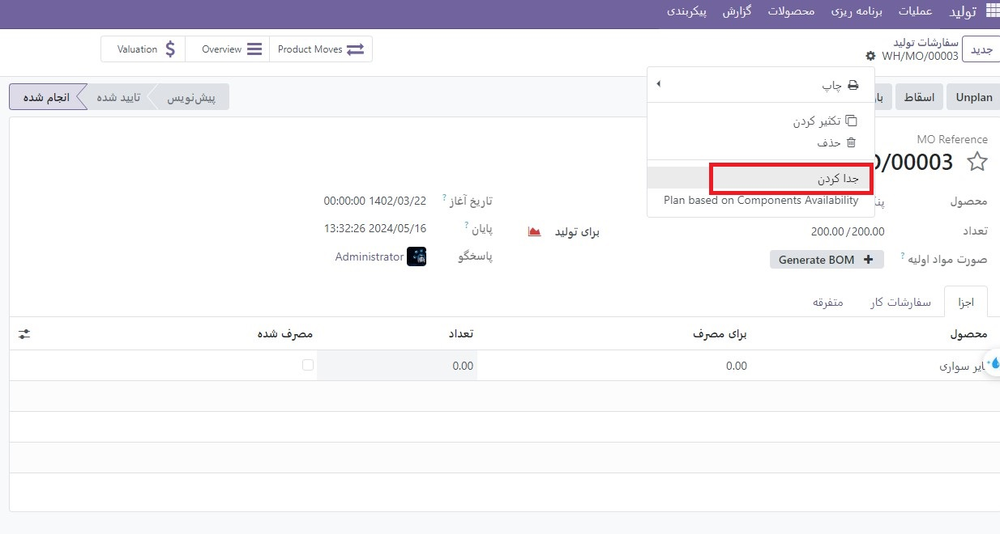
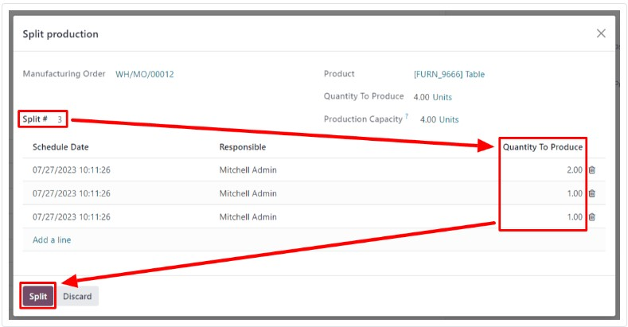
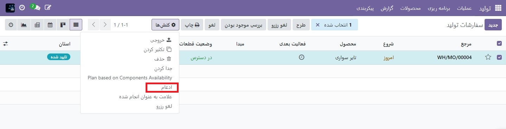

:nosearch:
:show-content:
:hide-page-toc:
:show-toc:

===================================
تقسیم و ادغام سفارشات تولید
===================================

در ماژول تولید اودوو، امکان ایجاد سفارشات ساخت برای یک واحد از یک کالا، یا چندین واحد از یک کالا وجود دارد. در برخی موارد، ممکن است لازم باشد یک سفارش تولید که شامل چندین واحد است به دو یا چند سفارش تقسیم شود، یا دو یا چند سفارش در یک سفارش واحد ادغام شوند.

.. important::
    یک سفارش تولید فقط می تواند شامل یک واحد از یک محصول یا چندین واحد از یک محصول واحد باشد که همه از یک صورتحساب مواد (BoM) استفاده می کنند. در نتیجه، تنها زمانی امکان ادغام سفارش‌های تولید وجود دارد که هر سفارش حاوی همان محصول باشد که با همان BoM تولید می‌شود.

تقسیم(جداکردن) سفارشات تولید
----------------------------------------------------------------
برای تقسیم یک سفارش تولید به چند سفارش، با رفتن به تولید ‣ عملیات ‣ سفارشات تولید شروع کنید، سپس یک سفارش تولید را انتخاب کنید. در بالای صفحه، در کنار دکمه جدید، شماره مرجع سفارش ساخت با دکمه ⚙️ (تنظیمات) در کنار آن ظاهر می‌شود.

روی دکمه ⚙️ (تنظیمات) کلیک کنید تا تنظیمات کلی برای سفارش ساخت باز شود، سپس جداکردن را انتخاب کنید.

پس از انتخاب جداکردن، یک پنجره پاپ آپ جداکردن محصولات ظاهر می شود. در قسمت جداکردن  تعداد سفارش‌های تولیدی را که سفارش اصلی باید به آن‌ها تقسیم شود، وارد کنید، سپس خارج از فیلد کلیک کنید. جدولی در زیر ظاهر می شود، با یک خط برای هر سفارش ساخت جدید که با تقسیم ایجاد می شود. در ستون تعداد محصولات، تعداد واحدهایی را که به هر سفارش ساخت جدید اختصاص داده می شود، وارد کنید. در نهایت بر روی جداکردن کلیک کنید تا سفارش تولید تقسیم شود.

پس از کلیک بر روی جداکردن، سفارش ساخت اصلی به تعداد سفارش‌هایی که در قسمت جداکردن مشخص شده است تقسیم می‌شود. شماره های مرجع برای سفارشات تولید جدید، شماره مرجع برای سفارش اصلی با برچسب -### به پایان اضافه شده است

ادغام سفارشات تولید
---------------------------------------------
برای ادغام دو یا چند سفارش تولید در یک سفارش واحد، با رفتن به تولید ‣ عملیات ‣ سفارشات تولید شروع کنید. با فعال کردن چک باکس سمت چپ نام هر سفارش، سفارش‌های تولیدی را که ادغام می‌شوند انتخاب کنید..

پس از انتخاب تمام سفارشات ساخت، روی دکمه Actions در بالای صفحه کلیک کنید، سپس از منوی کشویی گزینه ادغام را انتخاب کنید

سفارشات تولیدی انتخاب شده در یک سفارش واحد ادغام می شوند. شماره مرجع برای سفارش ساخت جدید، شماره ترتیبی بعدی است که قبلاً به یک سفارش اختصاص داده نشده است.