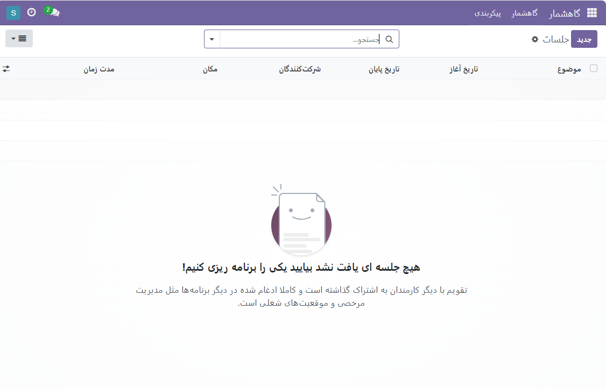

:nosearch:
:show-content:
:hide-page-toc:
:show-toc:

====================
گاهشمار(تقویم)
====================

برای تقویت ارتباطات بین کارکنان، برگزاری جلسات و اتخاذ تصمیمات مهم امری ضروری است. برنامه‌ریزی دقیق برای این جلسات اساسی است تا فعالیت‌ها به خوبی انجام شود. برگزاری این جلسات به شما کمک می‌کند تا موفقیت شرکت را بهبود بخشیده و ارتباطات را تقویت کنید. نرم‌افزار Odoo با دارا بودن ماژول گاهشمار، امکان ایجاد انواع جلسات با ساختار داخلی و خارجی را فراهم می‌کند. این فرآیند را می‌توانید به راحتی و در یک مرحله انجام دهید.

صفحه اصلی ماژول تقویم شامل تمامی جلسات برنامه‌ریزی شده در روزهای مختلف ماه است. با انتخاب یک تاریخ خاص، می‌توانید جلسات برنامه‌ریزی شده برای آن روز را مشاهده کنید. در سمت چپ و پایین صفحه، فهرستی از افرادی که قرار است در جلسه شرکت کنند قابل مشاهده است. با استفاده از نماد +، می‌توانید شرکت‌کنندگان جدید را به جلسه اضافه کنید. برای دریافت جزئیات بیشتر درباره یک جلسه، می‌توانید آن را انتخاب کنید و جزئیات مربوط به آن را مشاهده کنید.

.. image:: ./img/calendar1.png
    :alt: تقویم
    :align: center

با انتخاب یک جلسه خاص، می‌توانید جزئیات بیشتری از آن را مشاهده کنید، از جمله توضیحات جلسه، حریم خصوصی، و برچسب‌های مرتبط. اگر نیاز به ویرایش بیشتر در جلسه برنامه‌ریزی شده در تاریخ خاص دارید، می‌توانید از نماد ویرایش استفاده کنید.

برای ایجاد نوع مشابهی از جلسه، کافی است به تاریخ مورد نظر بروید و جلسه را برنامه‌ریزی کنید. پس از انتخاب تاریخ، یک پنجره ظاهر می‌شود که باید برخی از جزئیات را مانند زیر وارد کنید.

 هنگام ارائه موضوع جلسه، در برگه جزئیات جلسه و گزینه‌ها، دسترسی به برخی از داده‌ها دارید. در بخش شروع و مدت زمان، می‌توانید تاریخ شروع و پایان جلسه را وارد کنید و مدت زمان جلسه را مشخص کنید. اگر جلسه باید برای هر روز برنامه‌ریزی شود، می‌توانید گزینه هرروز را فعال کنید. همچنین، می‌توانید به برگزارکننده اشاره کرده و توضیحاتی از جلسه را که قرار است برنامه‌ریزی شود، وارد کنید. این امکانات شامل ارسال اطلاعیه جلسه به شرکت‌کنندگان از طریق ایمیل و پیامک نیز می‌شود. همچنین می‌توانید یادآوری‌ها را تنظیم، فضای جلسه را مشخص کرده و URL تماس ویدیویی را ارائه دهید. همچنین، می‌توانید برچسب‌های مرتبط را اضافه کنید.

در زبانه گزینه‌ها، اگر جلسه باید در یک بازه زمانی خاص تکرار شود، می‌توانید گزینه تکرار شونده را فعال کنید.

.. image:: ./img/calendar2.png
    :alt: تقویم
    :align: center

در تب لیست در سمت راست ماژول گاهشمار، شما می‌توانید قرار ملاقات‌هایی که قرار است شروع شوند را یادآوری کنید. یادآوری‌ها را می‌توانید به شکل چندگانه تنظیم کنید که به کارمندان کمک می‌کند تا از فراموشی یک قرار خاص جلوگیری کنند. این صفحه شامل اطلاعاتی نظیر نوع، یادآوری قبل، و گزینه‌های واحد است. برای ایجاد یک نوع یادآوری یا زنگ هشدار برای قرار ملاقات، به نماد جدید موجود در سمت چپ صفحه بروید.

.. toctree::
   :titlesonly:

   ./outlook-calendar-synchronization
   ./synchronize-google-calendar-with-Odoo