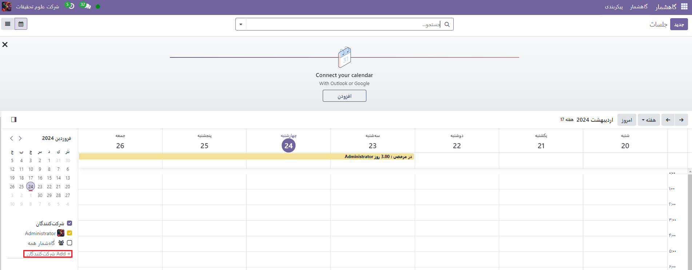
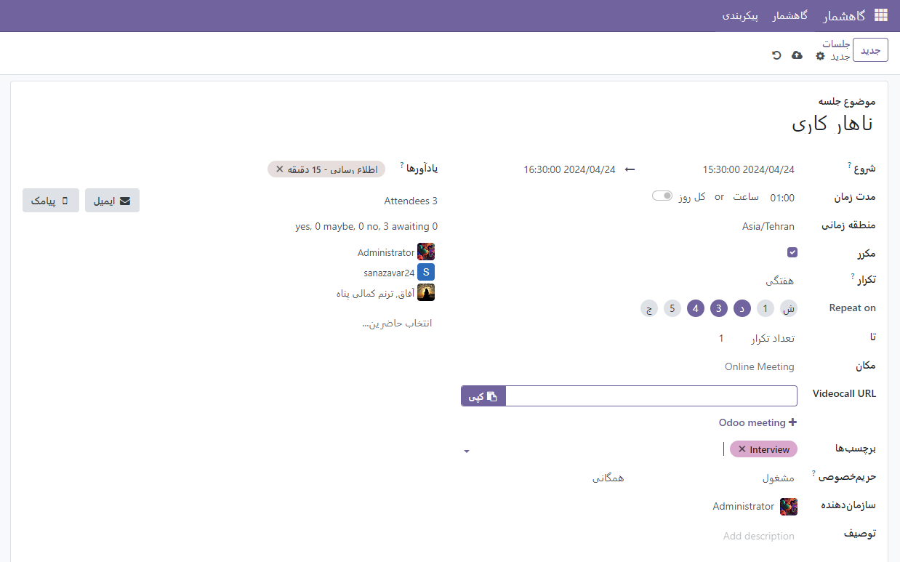

:nosearch:
:show-content:
:hide-page-toc:
:show-toc:

====================
گاهشمار(تقویم)
====================

برای تقویت ارتباطات بین کارکنان، برگزاری جلسات و اتخاذ تصمیمات مهم امری ضروری است. برنامه‌ریزی دقیق برای این جلسات اساسی است تا فعالیت‌ها به خوبی انجام شود. برگزاری این جلسات به شما کمک می‌کند تا موفقیت شرکت را بهبود بخشیده و ارتباطات را تقویت کنید. نرم‌افزار Odoo با دارا بودن ماژول گاهشمار، امکان ایجاد انواع جلسات با ساختار داخلی و خارجی را فراهم می‌کند. این فرآیند را می‌توانید به راحتی و در یک مرحله انجام دهید.

صفحه اصلی ماژول تقویم شامل تمامی جلسات برنامه‌ریزی شده در روزهای مختلف ماه است. با انتخاب یک تاریخ خاص، می‌توانید جلسات برنامه‌ریزی شده برای آن روز را مشاهده کنید. در سمت چپ و پایین صفحه، فهرستی از افرادی که قرار است در جلسه شرکت کنند قابل مشاهده است. با استفاده از نماد +، می‌توانید شرکت‌کنندگان جدید را به جلسه اضافه کنید. برای دریافت جزئیات بیشتر درباره یک جلسه، می‌توانید آن را انتخاب کنید و جزئیات مربوط به آن را مشاهده کنید.

با انتخاب یک جلسه خاص، می‌توانید جزئیات بیشتری از آن را مشاهده کنید، از جمله توضیحات جلسه، حریم خصوصی، و برچسب‌های مرتبط. اگر نیاز به ویرایش بیشتر در جلسه برنامه‌ریزی شده در تاریخ خاص دارید، می‌توانید از نماد ویرایش استفاده کنید.

.. toctree::
   :titlesonly:

   ./outlook-calendar-synchronization
   ./synchronize-google-calendar-with-Odoo