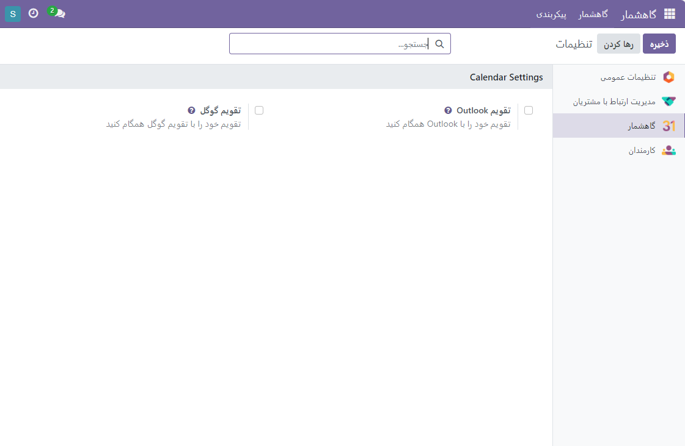

:nosearch:
:show-content:
:hide-page-toc:
:show-toc:

====================
همگام سازی گاهشمار اودوو با اوتلوک
====================

برای همگام سازی گاهشمار اودوو با اوتلوک به ماکروسافت آژور نیاز داریم که برای ایجاد حساب رایگان میباشد.

 در اینجا، می‌توانید جلسه را به عنوان تقویم گوگل یا Outlook علامت‌گذاری کنید. این گزینه به شما کمک می‌کند تا تقویم خود را با تقویم گوگل همگام سازید. با ارائه شناسه مشتری و انتقال به گزینه اتصال، شما می‌توانید تقویم خود را با تقویم گوگل متصل کنید.

