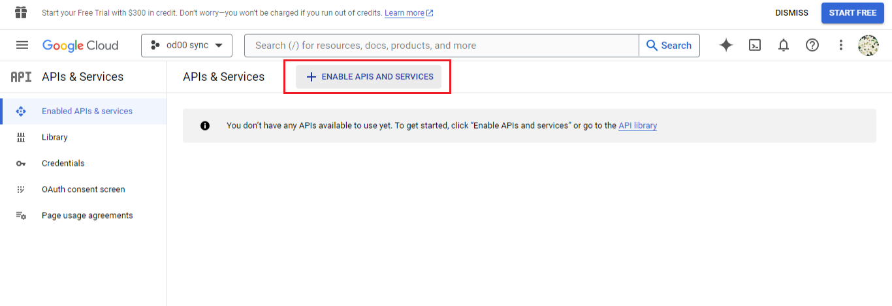
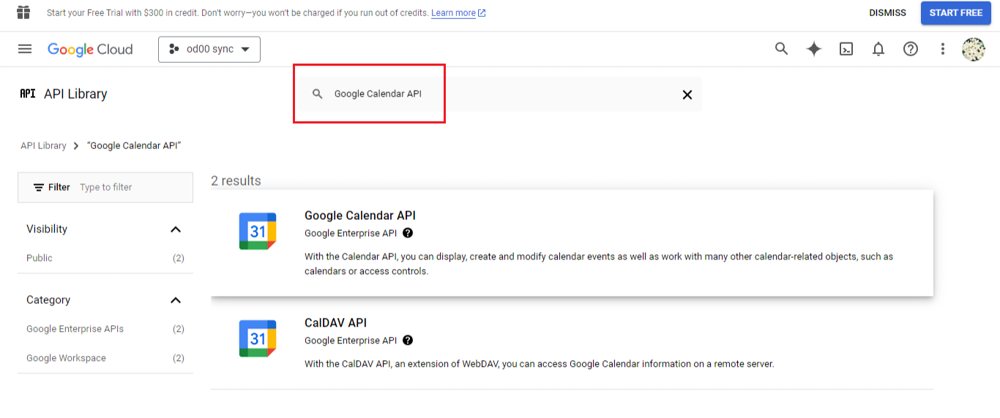
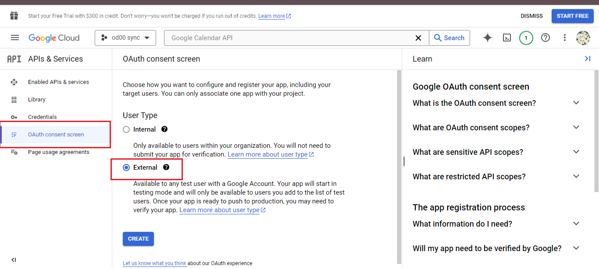
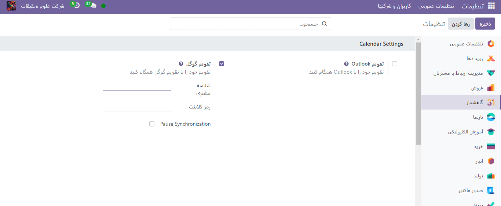

:nosearch:
:show-content:
:hide-page-toc:
:show-toc:

====================
همگام سازی گاهشمار با گوگل
====================

برای پیگیری قرار ها و رویدادها و پیگیری بهتر وظایف ، میتوان گاهشمار اودوو را با گوگل همگام سازی کنیم.توجه داشته باشید این همگام سازی به صورت دوطرفه میباشد.
o	تنظیمات گوگل
o	تنظیمات در اودو
تنظیمات گوگل
ابتدا پروژه ای را انتخاب یا ایجاد میکنیم. با حساب ایمیل خود واردhttps://console.developers.google.com شوید .پروژه ای را انتخاب و یا  ایجاد کرده و نامی مشخص برای آن انتخاب کنید. 

حال گزینه ENABLES APIS AND SERVICES انتخاب کرده و در نوار جستجو عبارت Google Calendar API را سرچ کرده و گزینه Google Calendar API را از نتایج جستجو انتخاب کنید و با زدن دکمه ENABLE آن  را فعال سازی کنید.

پیکربندی oAuth
--------------

حال باید OAuth پیکربندی بشود. برای این کار، در منوی سمت چپ OAuth consent را کلیک کرده و سپس User Type را از گزینه های داده شده انتخاب کنید.
دقت کنید که جیمیل های حساب شخصی جدا باید تایپ external داشته باشند وبرای  حساب فضای کاری گوگل امکان استفاده از نوع کاربر داخلی را نیز میتوانید انتخاب کنید.

در مرحله بعدی، در صفحه OAuth Consent Screen، در فیلد App name نام برنامه، Odoo  را تایپ کنید، آدرس ایمیلی را برای فیلد (ایمیل پشتیبان کاربر)  و آدرس ایمیل Developer contact information (اطلاعات تماس توسعه‌دهنده) را وارد نمایید. سپس بر روی ذخیره و ادامه کلیک کنید.حدود را با دکمه Save and Continue  رد کنید.
در ادامه، اگر در حالت external فعالیت می‌کنید آدرس ایمیلی که در حال پیکربندی است را در مرحله Test users (کاربران تست) وارد کنید. این کار با کلیک بر روی Add Users (افزودن کاربران) و سپس Save and Continue (ذخیره و ادامه) انجام می‌شود. در نهایت Back to Dashboard (برگشت به داشبورد) را کلیک کنید.
اطلاعات احراز
این مرحله برای بدست اوردن Client ID و Client Secret و استفاده از آن در اودوو میباشد.
ابتدا در منوی چپ Credentials > Create Credentials را انتخاب کنید و OAuth client ID را انتخاب نمایید. 
در بخش Create OAuth Client ID گزینه Website application را در فیلد Application Type وارد نمایید، و در فیلد Name عبارت My Odoo Database را وارد نمایید.
در بخش Authorized JavaScript Origins بر روی + Add URI کلیک کرده و آدرس URL کامل اودوو را وارد کنید.
در بخش Authorized redirect URIs، روی + Add URI کلیک کرده و آدرس URL کامل اودوو را وارد کرده و در ادامه /google_account/authentication را تایپ کنید. 
در آخر Create را بزنید. و Client ID و Client Secret نمایش داده میشود و میتوانید آن را دریافت کنید.

تنظیمات اودوو
------------

پس از دریافت Client ID و Client Secret به برنامه اودوو می رویم تا همگام سازی را انجام دهیم. به بخش تنظیمات >تنظیمات عمومی > گاهشمار>گزینه تقویم گوگل بروید. و client secret ,client id را در فیلد های مربوطه وارد کنید.

سپس وارد بخش گاهشمار شوید و در تقویم همگام سازی با گوگل را انتخاب کنید.
(وقتی تقویم گوگل برای اولین بار با اودوو همگام‌سازی می‌شود، صفحه به حساب گوگل هدایت میشود. در اینجا حساب کاربری ایمیلی که باید دسترسی داشته باشد را انتخاب کرده و Continue را بزنید.)

ممکن است در همگام سازی مشکلاتی بوجود بیاید و به درستی باهم همگام نشوند.برای برطرف کردن این مشکل میتوانید به تنظیمات> مدیریت کاربران  و کاربر را انتخاب کرده و بر تب گاهشمار > reset account را کلیک کنید.

گزینه هایی برای ریست وجود دارد:
User’s Existing Events
•	Leave them untouched: تغییری در رویداد ها وجود نداشته باشد
•	Delete from the current Google Calendar account: حذف رویداد از  تقویم گوگل
•	Delete from Odoo: حذف رویداد از تقویم اودوو
•	Delete from both: حذف رویداد از هر دو تقویم اودوو و گوگل 
Next Synchronization:
•	Synchronize only new events:همگام کردن رویدادهای جدید در اودو یا گوگل  
•	Synchronize all existing events: همگام کردن تمام رویداد ها در اودوو یا گوگل
سپس بر روی confirm کلیک کنید.

حال به رایج ترین خطاهایی که ممکن است هنگام پیکربندی Google Calendar برای استفاده با Odoo رخ دهد، میپردازیم:

Production vs. testing publishing status
اگر برای وضعیت محصولات حالت Publishing Status   را بجای تست قرار دهیم.برای رفع این مشکل میتوان به ادرس https://console.cloud.google.com/apis/credentials/consent مراجعه کرده و حالت تست را انتخاب کنیم.
No test users added
اگر test user  در OAuth consent screen وجود نداشته باشد با Error 403 مواجه میشویم. برای رفع این مشکل به OAuth consent screen > APIs & Services رفته و کاربر تست را انتخاب و ایمیل آن را اضافه میکنیم.
Application Type
اگر هنگام دریافت OAuth Client ID و Client Secret،  Desktop App را برای حالت اپلیکیشن انتخاب کرده باشیم با Error 400:redirect_uri_mismatch  مواجه میشویم. برای رفع این مشکل اعتبارنامه فعلی را حذف کرده و با رفتن به بخش Web Application> Application Type. اعتبار نامه جدیدی بسازید.
