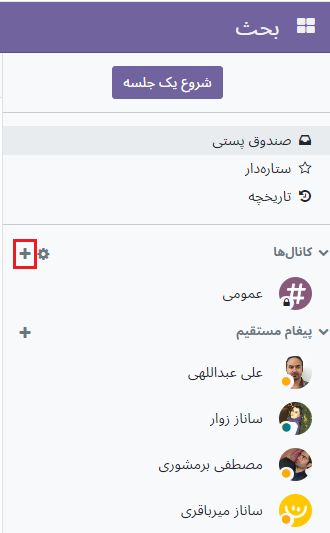

:nosearch:
:show-content:
:hide-page-toc:
:show-toc:

===============
بحث و گفتگو
===============

ماژول بحث یک برنامه ارتباطی داخلی است که به کاربران اجازه می‌دهد از طریق پیام‌ها، یادداشت‌ها و به اشتراک‌گذاری فایل، از طریق یک پنجره چت دائمی که در بین برنامه‌ها کار می‌کند یا از طریق داشبورد اختصاصی  بحثبا یکدیگر ارتباط برقرار کنند .

شروع گفتگو
--------------------

اولین باری که کاربر وارد حساب کاربری خود می‌شود، OdooBot پیامی ارسال می‌کند و درخواست اجازه برای ارسال اعلان‌های دسکتاپ برای چت می‌کند. در صورت پذیرش، کاربر اعلان‌های فشاری را بر روی دسکتاپ خود برای پیام‌هایی که دریافت می‌کند، صرف نظر از اینکه کاربر در کجای Odoo است، دریافت می‌کند.
 

.. Note::
    برای توقف دریافت اعلان‌های دسک‌تاپ، تنظیمات اعلان‌های مرورگر را بازنشانی کنید.

برای شروع یک چت، به برنامه بحث بروید و روی نماد + (plus) در کنار Direct Messages یا Channels در منوی سمت چپ داشبورد کلیک کنید.

.. Note::
    یک شرکت همچنین می تواند به راحتی کانال های عمومی و خصوصی ایجاد کند .

ذکر یک کاربر در چت 
--------------

برای ذکر یک کاربر در چت یا چت، تایپ کنید @user-name؛ برای مراجعه به یک کانال، تایپ کنید #channel-name. کاربر ذکر شده بسته به تنظیمات ارتباطی خود در صندق ورودی یا از طریق ایمیل مطلع می شود.

.. Note::
    وقتی از یک کاربر نام برده می شود، لیست جستجو (فهرست اسامی) ابتدا مقادیری را بر اساس دنبال کنندگان کار و در مرحله دوم بر اساس کارمندان پیشنهاد می کند. اگر رکورد مورد جستجو با یک دنبال کننده یا کارمند مطابقت نداشته باشد، دامنه جستجو به همه شرکا تبدیل می شود.

وضعیت کاربر
-------------------

این مفید است که ببینیم همکاران در حال انجام چه کاری هستند و با بررسی وضعیت آنها چقدر سریع می توانند به پیام ها پاسخ دهند . وضعیت در سمت چپ نام مخاطب در نوار کناری بحث ، در منوی پیام‌رسانی و زمانی که در چت لیست شده است نشان داده می‌شود .

- سبز = آنلاین
- نارنجی = دور
- سفید = آفلاین
- هواپیما = خارج از دفتر

.. toctree::
   :titlesonly:

   ./channels_team_communication

