:nosearch:
:show-content:
:hide-page-toc:
:show-toc:

===============
یادداشت(To-do)
===============

این ماژول در تسک های فردی کاربرد دارد .

ایجاد یادداشت(To-do) 
---------------------

در ابتدا وارد داشبورد ماژول یادداشت (To-do)میشویم، برای ایجاد یادداشت(To-do) جدید بر روی دکمه *جدید* در سمت راست بالا کلیک میکنیم و امکان اضافه کردن و ویرایش یادداشت(To-do)را به ما میدهد و سپس میتوان آن را ذخیره کرد.جهت ویرایش ابتدا باید نام یادداشت(To-do) مورد نظر را وارد کرد و سپس کلید ویرایش را کلیک کرد تا وارد صفحه ویرایش شود.

.. Note::
    در صفحه ایجاد شده میتوان برچسب، و افراد مسئول را انتخاب کرد و حتی لینک و میدیا با علامت سنجاق در پایین سمت چپ در یادداشت(To-do) اضافه کرد.

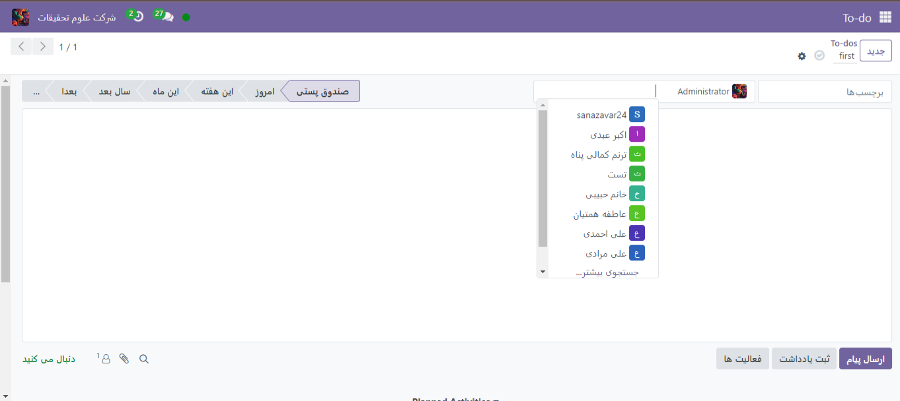

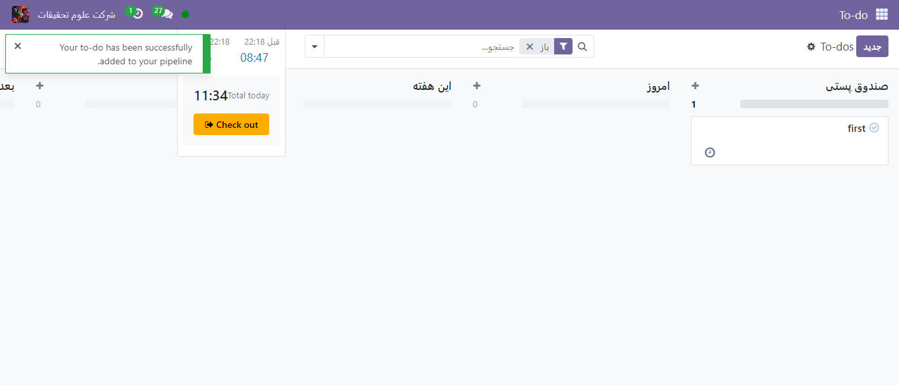

.. Tip::
    علاوه بر این میتوان یادداشت(To-do) را در هر جایی در اودوو با shortcut ‘ctrl+k’ ایجاد کرد و اضافه کرد.

    .. image:: ./img/Todo2.png
      :alt: وبسایت
      :align: center

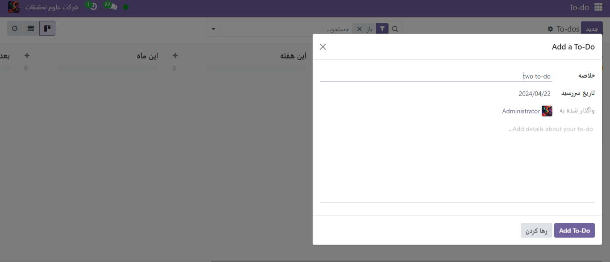

همچنین با علامت ساعت و انتخاب add یادداشت(To-do)  میتوان این مراحل را انجام داد.

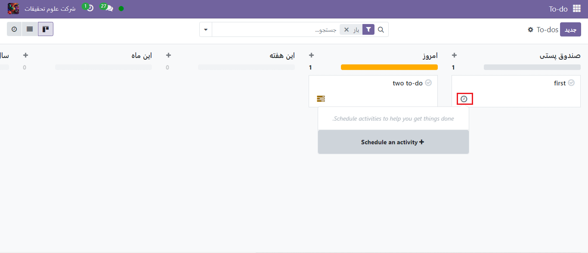

تبدیل یادداشت (To-do)به project task
-------------------------

زمانیکه بخواهیم تسک فردی خود را به تسکی از پروژه تبدیل کنیم ،در همان صفحه یادداشت(To-do)  علامت چرخ دنده >convert to task را کلیک میکنیم و صفحه ای باز میشود که میتوان نام پروژه و افراد مسئول و برچسب را انتخاب کنیم و سپس دکمه Convert to Task را کلیک کنیم.

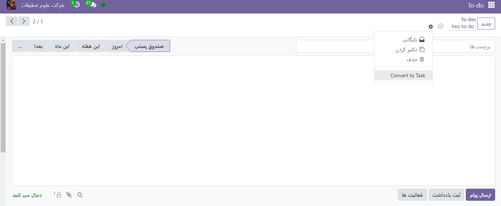

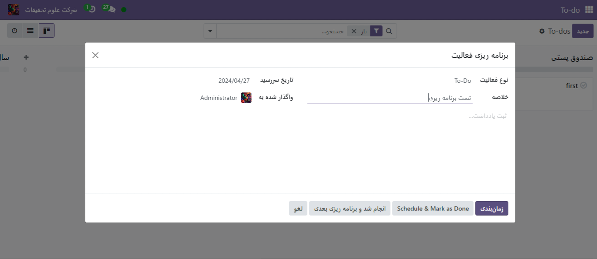

در بخش نام پروژه میتوان پروژه جدیدی را با انتخاب **جستجوی بیشتر** و سپس **جدید**، تعریف و سپس برای یادداشت(To-do) انتخاب کنیم.

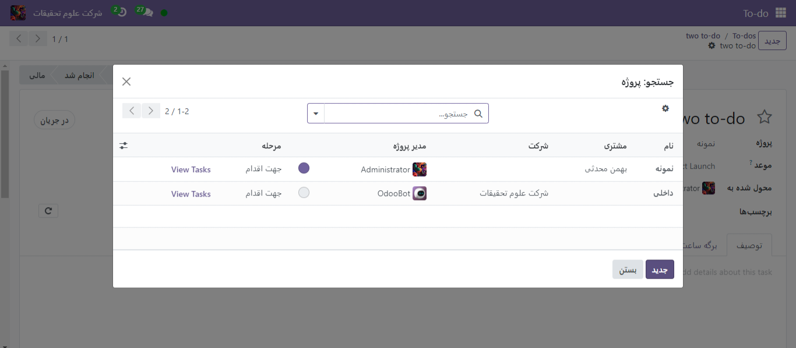

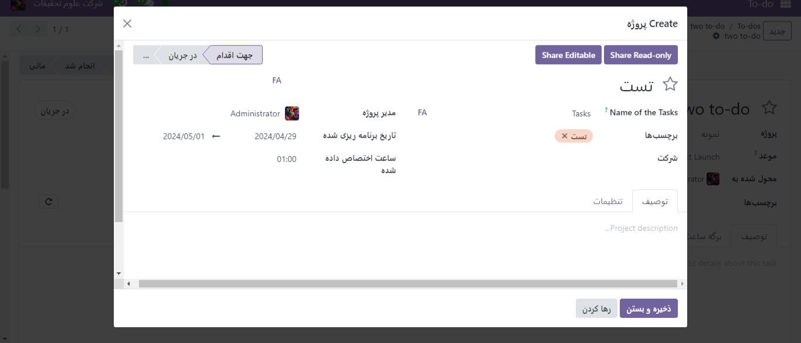

برای ایجاد پروژه جدید هم نیز باید عنوان و برچسب ،مدیر پروژه ، تاریخ برنامه ریزی شده و ساعت اختصاص داده شده را مشخص و ذخیره کرد.
پس از تمام این مراحل یادداشت (To-do) از داشبورد این ماژول حذف میشود و به عنوان تسک جدید در داشبورد پروژه اضافه میشود

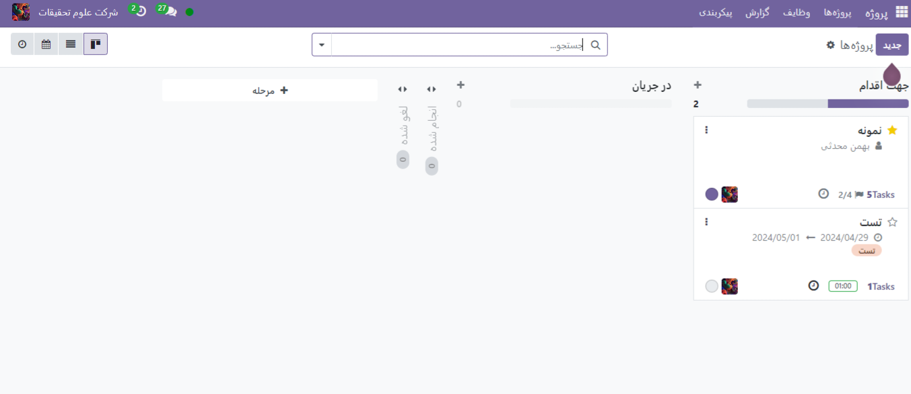

مشاهده کارهای انجام شده در برنامه Project
----------------------

برای جابجا کردن یادداشت (To-do) ها از یک مرحله به مرحله بعد میتوان در صفحه داشبورد با drag and drop این کار را انجام داد. همچنین اگر میخواهید مرحله جدیدی اضافه کنید به کلیک بر روی علامت “+ مرحله شخصی” در انتهای مرحله ها در بالای صفحه و انتخاب نام برای مرحله میتوان این کار را انجام نمود.

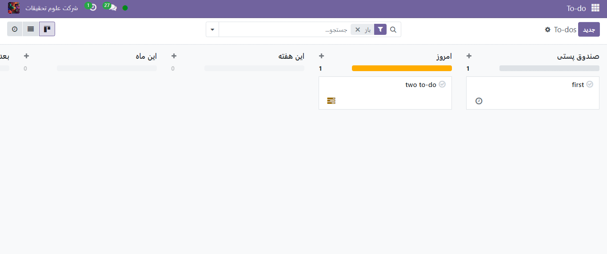

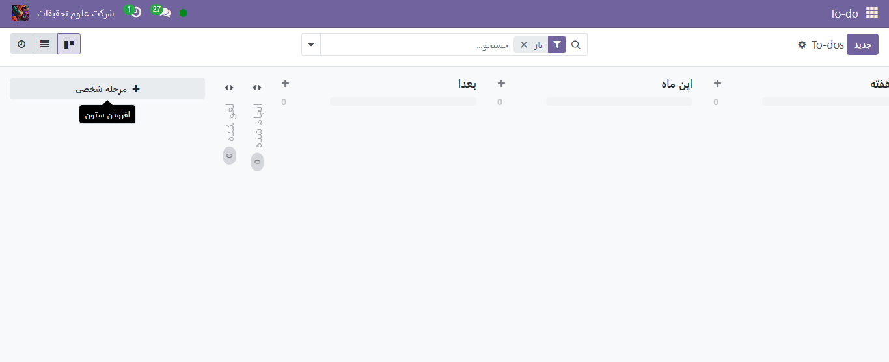

اضافه کردن برنامه ریزی به یادداشت(To-do)
---------------------

برای اضافه کردن برنامه ریزی، یادداشت (To-do) مورد نظر را انتخاب کرده و بر روی علامت ساعت > + Schedule an activity  کلیک میکنیم .

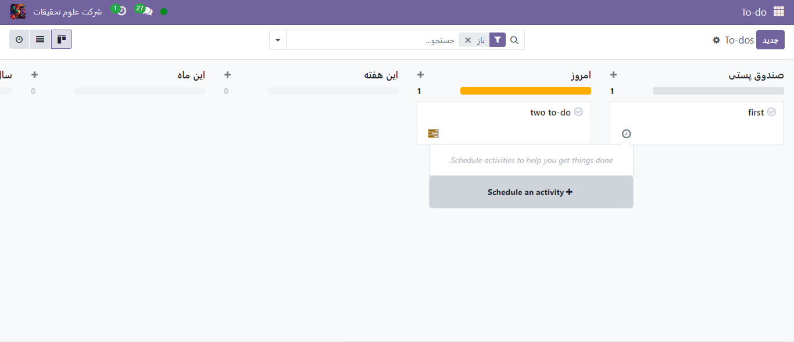

سپس میتوان خلاصه و تاریخ سررسید و افراد مسئول را مشخص نمود و بر روی زمان بندی کلیک کرد.

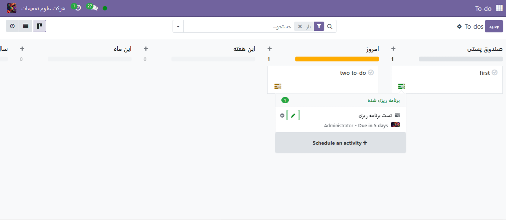

نحوه نمایش یادداشت(To-do) ها را  نیز میتوان از نوار بالای صفحه انتخاب کرد.

تگ ها
---------------

:guilabel:`#todo`

:guilabel:`#task`

:guilabel:`#reminder`

:guilabel:`#checklist`

:guilabel:`#agenda`

:guilabel:`#action_item`

:guilabel:`#to_do_list`

:guilabel:`#pending`

:guilabel:`#priority`

:guilabel:`#schedule`

:guilabel:`#کاربرد`

:guilabel:`#انجام_پذیر`

:guilabel:`#کارهای_باقیمانده`

:guilabel:`#یادداشت_انجام`

:guilabel:`#فهرست_وظایف`

:guilabel:`#برنامه_کاری`

:guilabel:`#اولویت_ها`

:guilabel:`#اقدامات`

:guilabel:`#کارهای_پیش_رو`

:guilabel:`#اطلاع_رسانی`

رفرنس ها
--------------------

1. https://www.cybrosys.com/odoo/odoo#books/v17
   
2. https://www.tashilgostar.com/documentation/16.0/applications
   
3. https://www.odoo.com/documentation/17.0/applications
   
4. https://oxydoo.com/blog/guide-28/to-do-243

