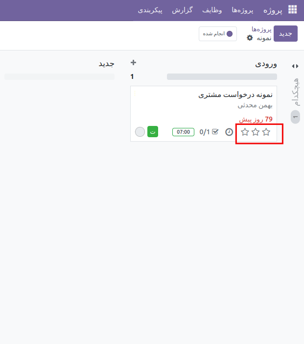

:nosearch:
:show-content:
:hide-page-toc:
:show-toc:

===========================================
اضاف کردن اولویت به ماژول پروژه 
===========================================

 ماژول Project Task Add Very High در OCA  یک فیلد برای اولویت دادن به task های پروژه میباشد.که به صورت ستاره در فرم کنبن در زیر هر تسکی نشان داده میشود . که باعث میشود ما بتوانیم دو سطح اولویت  بالا و بسیار بالا را به تسک ها اضاف کنیم و بهتر بتوان تسکها را مدیریت کرد. 

این ماژول از ماژول های oca است و میتوان آن را در repository git  oca  پیدا کرد .