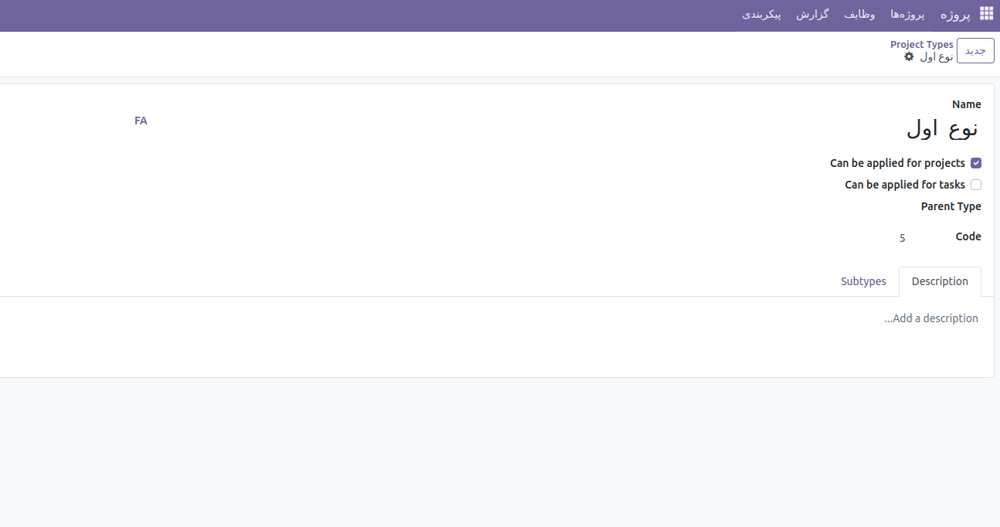

:nosearch:
:show-content:
:hide-page-toc:
:show-toc:

===========================================
نوع پروژه
===========================================

ماژول project_type در OCA، که به نام فنی project_category شناخته میشود، یک افزونه برای نرم افزار مدیریت کسب وکار Odoo است. این ماژول به شما امکان میدهد تا دسته بندیهای مختلفی را برای پروژهها و وظایف ایجاد کنید.

برای استفاده از این ماژول، مراحل زیر را دنبال کنید:

1. به بخشProject > Configuration > Project Typeبروید و مواردی را برای دسته بندی پروژهها و وظایف اضافه کنید.

2. به داشبورد پروژه بروید و هر پروژهای را ویرایش کنید و نوع آن را وارد کنید.
3. حالا میتوانید پروژهها را بر اساس نوع دسته بندی کنید. همین روش برای وظایف نیز صدق میکند.

این ماژول به شما کمک میکند تا سازماندهی بهتری بر روی پروژهها و وظایف خود داشته باشید و آنها را بر اساس دسته بندیهای تعریف شده مدیریت کنید. این امر به ویژه در محیطهایی که تعداد زیادی پروژه و وظیفه وجود دارد، مفید است.

این ماژول از ماژول های oca است و میتوان آن را در repository git  oca  پیدا کرد .