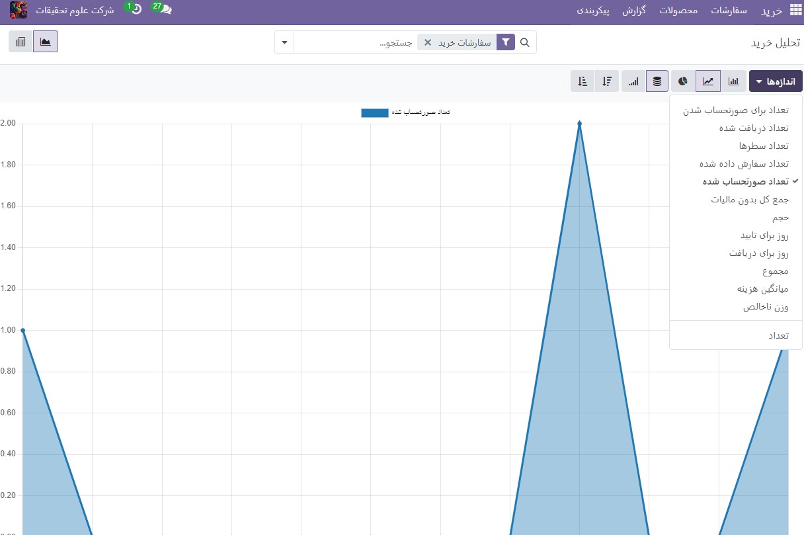
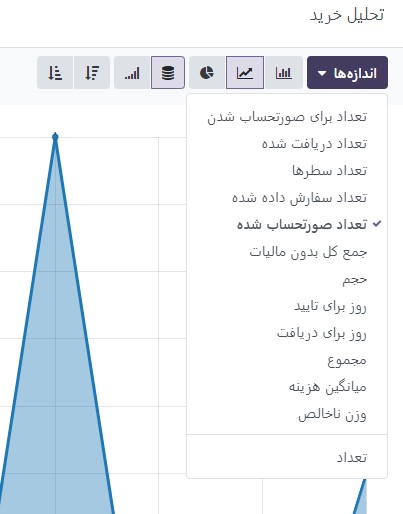

:nosearch:
:show-content:
:hide-page-toc:
:show-toc:

===================================================
عملکرد خریدهای خود را تجزیه و تحلیل کنید
===================================================

اگر شرکت شما مرتباً محصولاتی را خریداری می کند، دلایل مختلفی برای پیگیری و تجزیه و تحلیل عملکرد خود دارید. بینش جمع آوری شده می تواند به شما کمک کند تا سفارشات آینده خود را بهتر پیش بینی و برنامه ریزی کنید. برای مثال، می‌توانید ارزیابی کنید که آیا کسب‌وکار شما به فروشندگان خاصی وابسته است یا خیر، و داده‌ها می‌توانند به شما کمک کنند تا در مورد تخفیف‌های قیمت‌ها مذاکره کنید.

گزارش های سفارشی ایجاد کنید
---------------------------------------------

برای دسترسی به تجزیه و تحلیل خرید به Reporting بروید. به سادگی با دسترسی به داشبورد گزارش، می توانید یک نمای کلی سریع از عملکرد واقعی خود دریافت کنید. به‌طور پیش‌فرض، داشبورد گزارش‌دهی نمودار خطی را نشان می‌دهد که مقدار مالیات‌نشده سفارش‌های خرید شما در روز را نشان می‌دهد و در زیر آن، معیارهای کلیدی و جدول محوری را نشان می‌دهد.

در حالی که داده‌های ارائه شده در ابتدا مفید هستند، ابزارها و ویژگی‌های متعددی وجود دارد که می‌توانید از آنها برای دریافت اطلاعات بیشتر در مورد خریدهای خود استفاده کنید.

از فیلترها برای انتخاب داده های مورد نیاز خود استفاده کنید
-----------------------------------------------------------------------------

Odoo چندین فیلتر پیش فرض را ارائه می دهد که می توانید با کلیک بر روی **فیلترها** از آنها استفاده کرده و ترکیب کنید. وقتی یک یا چند فیلتر را انتخاب می‌کنید، **Odoo** به دنبال تمام سفارش‌هایی است که حداقل با یکی از فیلترهایی که انتخاب کرده‌اید مطابقت دارند و نمودار، معیارهای کلیدی و جدول محوری را با داده‌ها پر می‌کند. فیلترهای از پیش تنظیم شده عبارتند از:

#. همه درخواست ها برای پیش فاکتور

#. تمام سفارشات خرید، به جز موارد لغو شده

#. تاریخ تایید سال گذشته شامل تمام سفارش‌هایی است که سال قبل تایید شده‌اند، شامل سفارش‌های خرید لغو شده نیز می‌شود

#. تاریخ سفارش شامل همه سفارش‌ها می‌شود - درخواست قیمت‌ها و سفارش‌های خرید (شامل موارد لغو شده) - بسته به تاریخ ایجاد آنها

#. تاریخ تأیید شامل تمام سفارش‌های تأیید شده، شامل موارد لغو شده، بسته به تاریخ تأیید آنها می‌شود

.. note::
    هنگامی که باید یک دوره را انتخاب کنید، می توانید از چندین سال استفاده کنید، و با انتخاب حداقل یک سال، از چند فصل و سه ماه اخیر استفاده کنید.

.. tip::
    اگر از فیلترهای تاریخ سفارش یا تاریخ تأیید استفاده می کنید، ویژگی مقایسه در کنار فیلترها ظاهر می شود. این به شما امکان می دهد دوره ای را که فیلتر کرده اید با دوره قبلی مقایسه کنید.

افزودن فیلترهای سفارشی
----------------------------------------------

با کمک31 گزینه فیلتر برای انتخاب، امکان سفارشی کردن مجموعه داده شما تقریباً نامحدود است. به :menuselection:`فیلترها --> افزودن فیلترسفارشی` بروید، شرایطی را که گزینه فیلتر باید داشته باشد (مثلاً برابر است، حاوی و غیره است) مشخص کنید و روی اعمال کنید کلیک کنید. اگر می‌خواهید سفارش‌هایی را انتخاب کنید که با چندین شرط به طور همزمان (و اپراتور) مطابقت دارند، این فرآیند را تکرار کنید تا یک فیلتر سفارشی دیگر اضافه کنید. اگر می خواهید از عملگر یا استفاده کنید، روی اعمال کردن کلیک نکنید و به جای آن روی افزودن یک شرط کلیک کنید. پس از اینکه تمام گزینه های فیلترینگ مورد نظر را اضافه کردید، روی اعمال کردن کلیک کنید.

.. image:: ./img/advanced/p64.jpg
    :alt: خرید
    :align: center

.. tip::
    برای اینکه مجبور نباشید هر بار فیلترهای سفارشی را دوباره ایجاد کنید، آنها را با کلیک بر روی :menuselection:`علاقه مندی ها --> ذخیره سازی فایل فعلی -->ذخیره` ذخیره کنید. سپس با کلیک بر روی علاقه مندی ها می توان به فیلتر جستجوی سفارشی شده دسترسی پیدا کرد یا حتی وقتی داشبورد گزارش را باز می کنید به عنوان فیلتر پیش فرض تنظیم شود.

    .. image:: ./img/advanced/p65.jpg
        :alt: خرید
        :align: center

