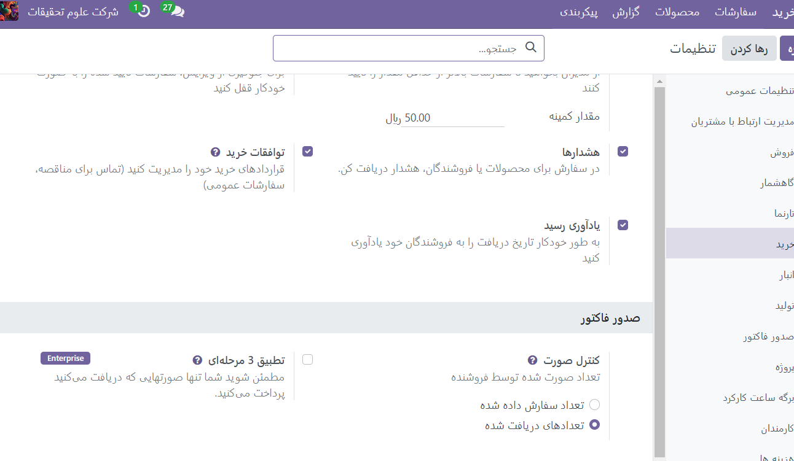
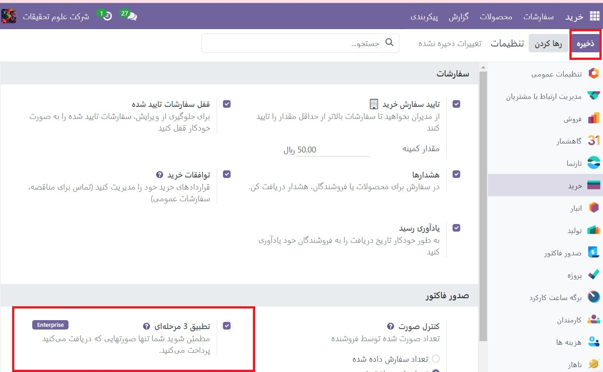
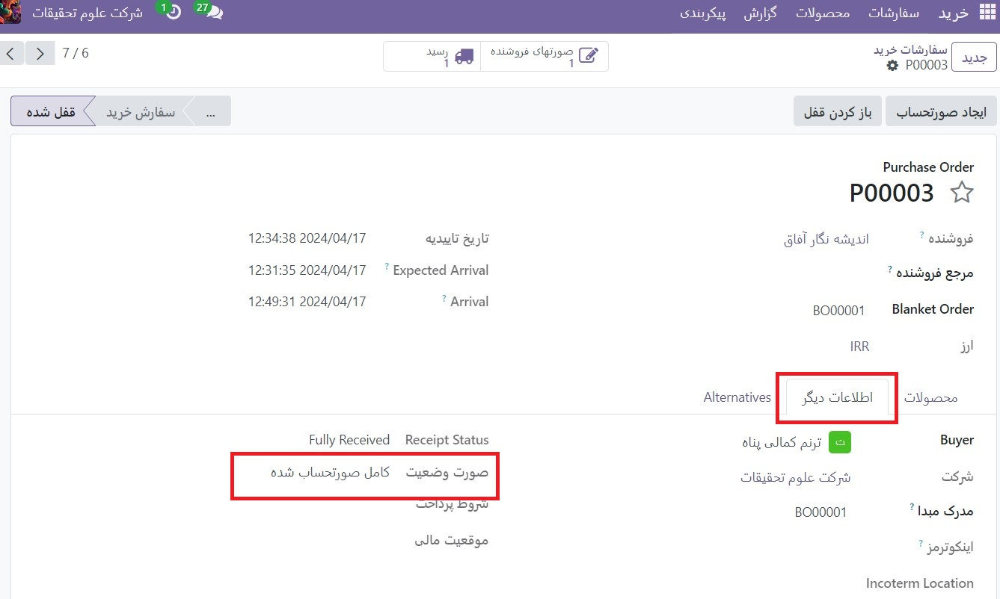

:nosearch:
:show-content:
:hide-page-toc:
:show-toc:

==================================
سیاست های کنترل صورتحساب
==================================

در برنامه خرید Odoo، خط‌ مشی کنترل صورت‌حساب، مقادیری را که توسط فروشندگان در هر سفارش خرید (PO)، برای مقادیر سفارش‌داده‌شده یا دریافت‌شده، صورت‌حساب می‌شود، تعیین می‌کند.

خط مشی انتخاب شده در تنظیمات برنامه خرید به عنوان مقدار پیش فرض عمل می کند و برای هر محصول جدیدی که ایجاد می شود اعمال می شود.

پیکربندی
------------------------------------
برای پیکربندی خط مشی کنترل صورتحساب، به برنامه :menuselection:`خرید --> پیکربندی --> تنظیمات` بروید و به بخش صورتحساب به پایین بروید. در قسمت کنترل صورتحساب، مقادیر سفارش داده شده یا مقادیر دریافتی را انتخاب کنید. سپس، روی ذخیره کلیک کنید.

- مقادیر سفارش داده شده: به محض تایید یک PO، صورتحساب فروشنده ایجاد می کند. محصولات و مقادیر موجود در :abbr:`PO (manage order Order``)برای تهیه پیش نویس صورتحساب استفاده می شود.

- مقادیر دریافتی: صورتحساب فقط پس از دریافت بخشی از کل سفارش ایجاد می شود. محصولات و مقادیر دریافتی برای تهیه پیش نویس صورتحساب استفاده می شود. اگر اقدام به ایجاد صورت‌حساب فروشنده بدون دریافت چیزی شود، یک پیام خطا ظاهر می‌شود.

.. image:: ./img/manage order/p47(2).jpg
    :alt: خرید
    :align: center

.. note::
    اگر یک محصول خاص باید از خط‌ مشی کنترلی متفاوتی نسبت به انتخاب شده در تنظیمات برنامه خرید استفاده کند، خط‌مشی کنترل صورت‌حساب برای آن محصول را می‌توان از شکل محصول آن تغییر داد.

    برای انجام این کار، به برنامه خرید ‣ محصولات ‣ محصولات بروید و یک محصول را انتخاب کنید. از فرم محصول، روی تب خرید کلیک کنید. در بخش فروشنده صورتحساب، انتخاب را در قسمت سیاست های کنترلی تغییر دهید.

    .. image:: ./img/manage order/p48.jpg
        :alt: خرید
        :align: center

 تطبیق 3 مرحله ای
----------------------------------------------------------
ویژگی تطبیق سه‌طرفه تضمین می‌کند که صورت‌حساب‌های فروشنده فقط زمانی پرداخت می‌شوند که برخی (یا همه) محصولات موجود در PO دریافت شده باشند.

برای فعال کردن تطابق سه‌مرحله ی، به برنامه :menuselection:`خرید --> پیکربندی --> تنظیمات`بروید و به بخش صورتحساب به پایین بروید. سپس، برای فعال کردن این ویژگی، چک باکس مربوط به تطابق سه‌طرفه را علامت بزنید و روی ذخیره کلیک کنید.

.. important::
    ویژگی تطبیق سه مرحله ای فقط با سیاست کنترل صورتحساب که روی مقادیر دریافتی تنظیم شده است کار می کند.

.. note::
    اگر مقدار کل محصولات از یک PO دریافت نشده باشد، Odoo فقط شامل محصولاتی می شود که در پیش نویس صورتحساب فروشنده دریافت شده اند.

پیش نویس صورتحساب های فروشنده را می توان برای افزایش مقدار صورتحساب، تغییر قیمت محصولات در صورتحساب و افزودن محصولات اضافی به صورت حساب ویرایش کرد.

اگر اطلاعات پیش‌ نویس صورتحساب تغییر کند، وضعیت فیلد باید پرداخت شود روی استثنا تنظیم می‌شود. این بدان معنی است که Odoo متوجه مغایرت می شود، اما تغییرات را مسدود نمی کند یا پیام خطایی را نمایش نمی دهد، زیرا ممکن است دلیل موجهی برای ایجاد تغییرات در پیش نویس صورتحساب وجود داشته باشد.

برای پردازش صورتحساب فروشنده، یک تاریخ را در قسمت تاریخ صورتحساب انتخاب کنید و روی تأیید و سپس ثبت پرداخت کلیک کنید.

با این کار یک پنجره پاپ آپ **ثبت پرداخت** باز می شود. از این پنجره، اطلاعات حسابداری بر اساس تنظیمات حسابداری پایگاه داده از قبل پر می شود. برای پردازش صورتحساب فروشنده، روی ایجاد پرداخت کلیک کنید.

هنگامی که **پرداخت** برای یک صورتحساب فروشنده ثبت شد و صورتحساب بنر سبز رنگ پرداختی را نشان داد، وضعیت فیلد باید پرداخت شود روی No تنظیم می شود.

مشاهده وضعیت صورت‌حساب سفارش خرید
---------------------------------------------------

پس از تایید یک PO، وضعیت صورتحساب آن را می توان در برگه اطلاعات دیگر در فرم (سفارش خرید)PO مشاهده کرد.

برای مشاهده وضعیت صورت‌حساب یک PO، به برنامه :menuselection:`خرید --> سفارشات --> سفارشات خرید` بروید و یک PO را برای مشاهده انتخاب کنید.

روی برگه اطلاعات دیگر کلیک کنید و قسمت وضعیت صورتحساب را پیدا کنید.

        

جدول زیر مقادیر مختلفی را که فیلد وضعیت صورت‌حساب می‌تواند بخواند و زمان نمایش آنها بسته به خط‌ مشی کنترل صورت‌حساب مورد استفاده، نشان می‌دهد.

