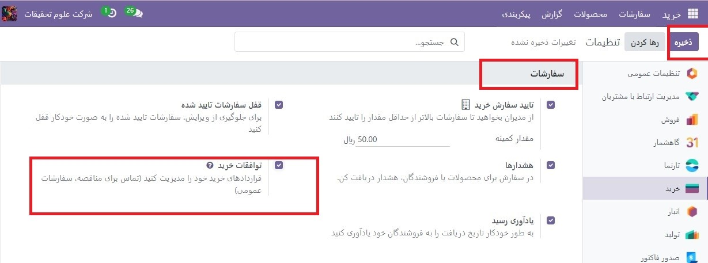
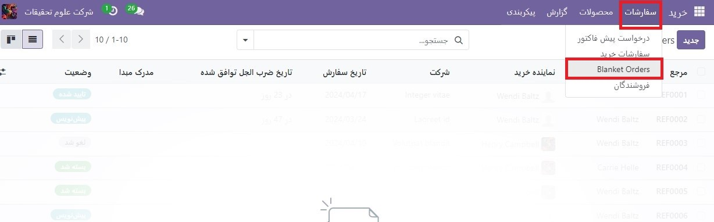
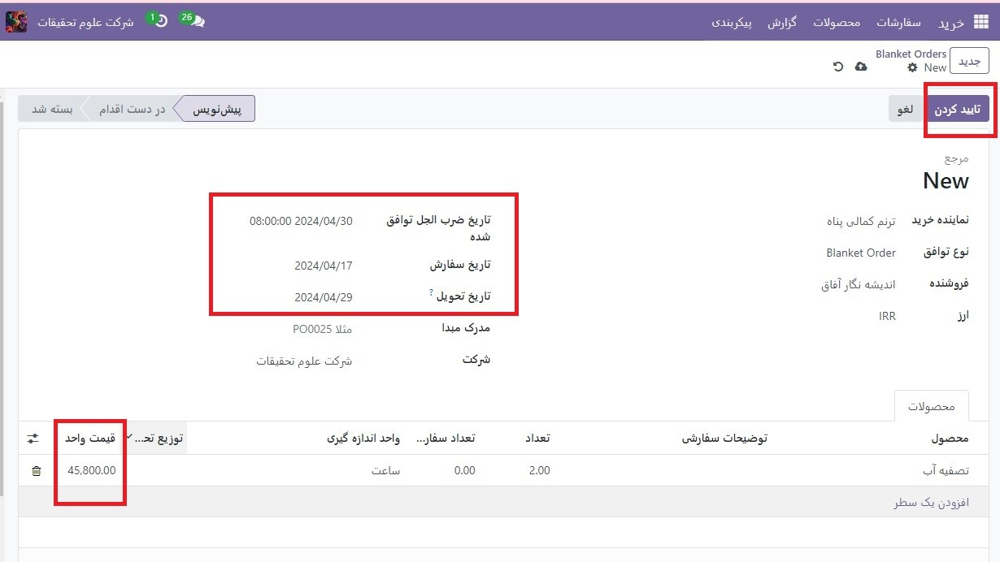
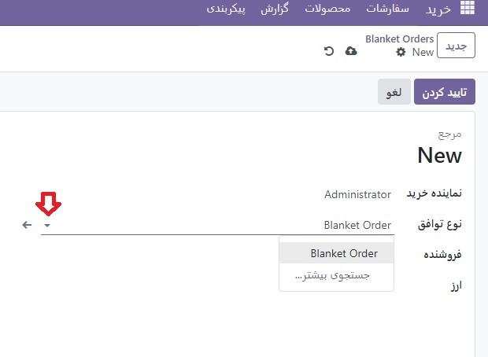
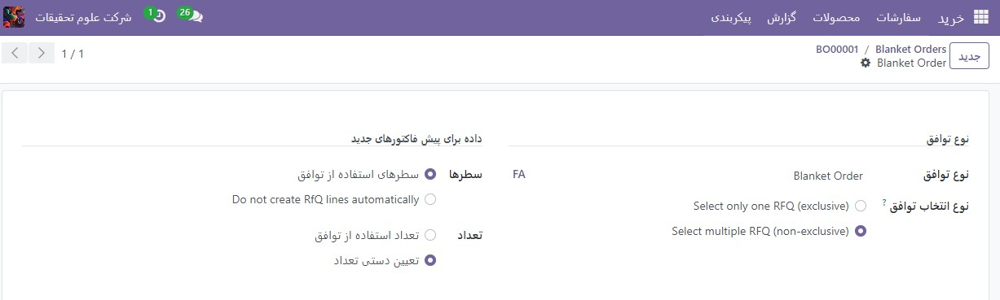
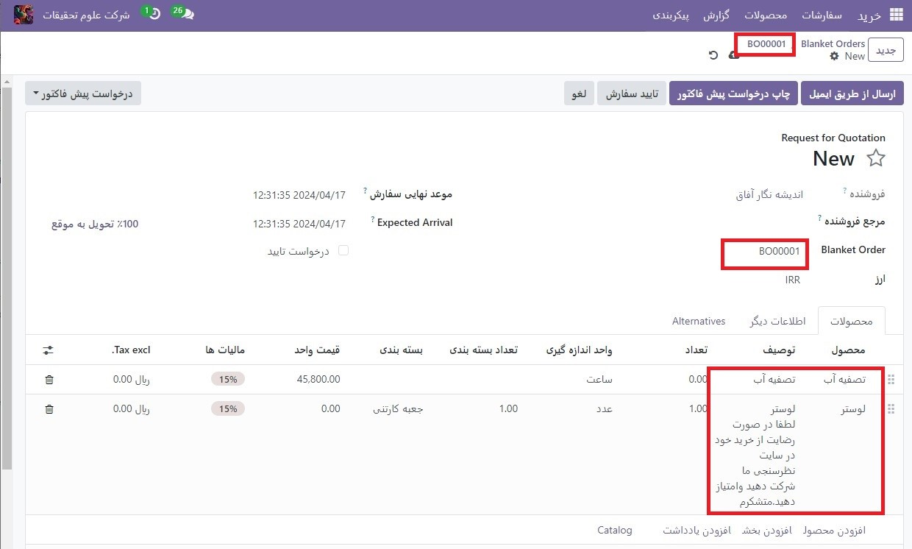
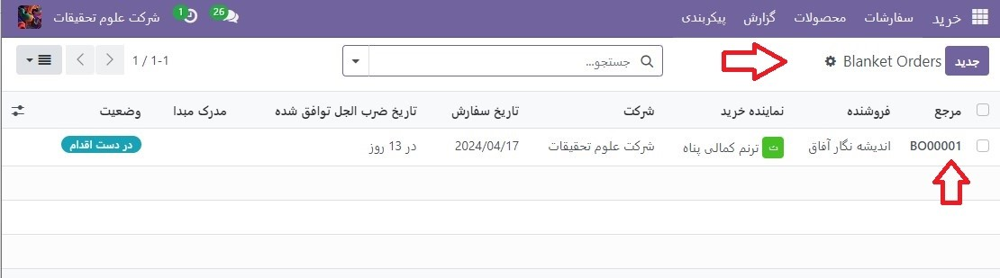
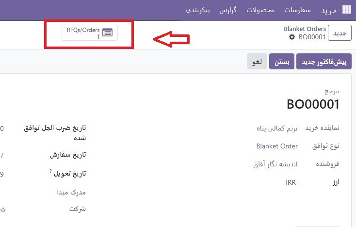
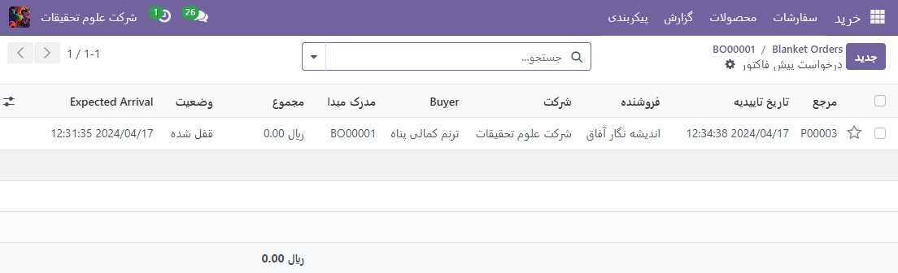
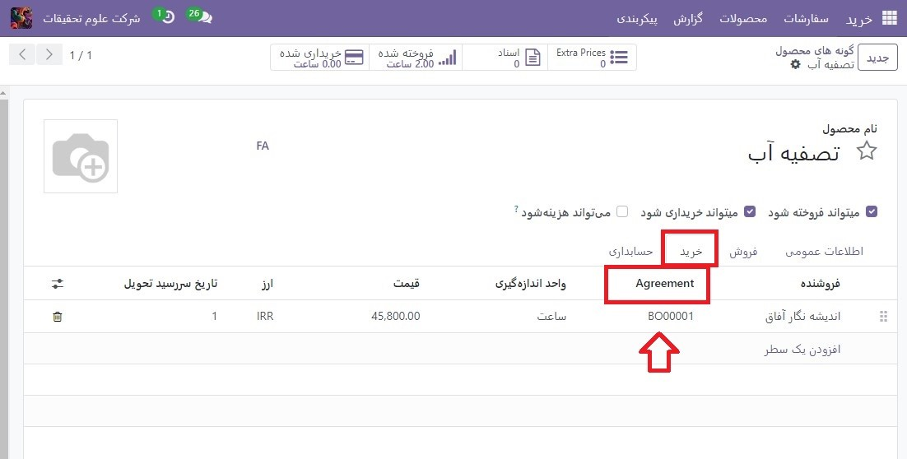

:nosearch:
:show-content:
:hide-page-toc:
:show-toc:

================================
سفارشات عمده
================================

سفارشات عمده قراردادهای خرید بلندمدت بین شرکت و فروشنده برای تحویل محصولات به صورت مکرر با قیمت از پیش تعیین شده است.

زمانی که محصولات به طور مداوم از یک فروشنده، اما در مقادیر متفاوت و در زمان‌های مختلف خریداری می‌شوند، سفارش‌های عمده مفید هستند.

با ساده ‌سازی فرآیند سفارش، سفارش‌های عمومی نه تنها در زمان صرفه‌جویی می‌کنند، بلکه در هزینه‌ها نیز صرفه‌جویی می‌کنند، زیرا می‌توانند هنگام مذاکره در مورد قیمت عمده با فروشندگان سودمند باشند.

یک سفارش جدید ایجاد کنید
--------------------------------------

برای ایجاد سفارش‌های عمومی، ویژگی قراردادهای خرید را از تنظیمات برنامه خرید فعال کنید. به برنامه :menuselection:`خرید --> پیکربندی --> تنظیمات`خرید` بروید و در بخش سفارشات، روی کادر تأیید قراردادهای خرید کلیک کنید. سپس روی ذخیره کلیک کنید تا تغییرات اعمال شود.

برای ایجاد یک سفارش عمومی، به برنامه  :menuselection:`خرید --> سفارشات --> سفارشات عمده` عمده بروید و روی جدید کلیک کنید. با این کار یک فرم سفارش جدید باز می شود.

- فیلدهای زیر را در فرم سفارش عمومی جدید پیکربندی کنید تا قوانین از پیش تعیین شده برای قرارداد بلندمدت تکرار شونده ایجاد شود:
#. نماینده خرید: کاربری که به این سفارش خاص اختصاص داده شده است. به طور پیش فرض، این کاربری است که توافق نامه را ایجاد کرده است. کاربر را می توان مستقیماً از منوی کشویی کنار این فیلد تغییر داد.
#. نوع قرارداد: نوع قرارداد خرید که این سفارش عمومی به آن دسته بندی می شود. در Odoo، سفارشات عمده تنها قرارداد خرید رسمی است.
#. فروشنده: تامین کننده ای است که این توافقنامه، یک بار یا به صورت مکرر به او گره خورده است. فروشنده را می توان مستقیماً از منوی کشویی کنار این فیلد انتخاب کرد.
#. ارز: ارز مورد توافق برای استفاده در این مبادله. اگر چندین ارز در پایگاه داده فعال شده باشد، ارز را می توان از منوی کشویی کنار این فیلد تغییر داد.
#. مهلت قرارداد: تاریخی که این قرارداد خرید در آن منقضی می شود. اگر این دستور عمومی منقضی نمی شود، این قسمت را خالی بگذارید.
#. تاریخ سفارش: تاریخی که اگر یک پیشنهاد جدید مستقیماً از فرم سفارش عمده ایجاد شود، باید این سفارش عمومی در آن قرار گیرد. اگر یک پیش فاکتور جدید ایجاد شود، این مقدار به طور خودکار قسمت Order Deadline را در (درخواست برای پیش فاکتور)RfQ پر می کند.

#. تاریخ تحویل: تاریخ تحویل مورد انتظار است که محصولات موجود در RfQ مورد انتظار هستند، اگر مستقیماً از فرم سفارش عمومی ایجاد شده باشند. اگر یک پیش فاکتور جدید ایجاد شود، این مقدار به طور خودکار قسمت Expected Arrival را در RfQ پر می کند.

#. سند منبع: سفارش خرید منبع (PO) که این سفارش عمومی به آن گره خورده است. اگر این دستور عمومی نباید به هیچ PO موجود مرتبط باشد، این قسمت را خالی بگذارید.

#. شرکت: شرکتی است که به این دستور عمومی اختصاص داده شده است. به طور پیش فرض، این شرکتی است که کاربر ایجاد کننده سفارش عمده در آن فهرست شده است. اگر پایگاه داده یک پایگاه داده چند شرکتی نباشد، این فیلد را نمی توان تغییر داد، و به طور پیش فرض تنها شرکت فهرست شده در پایگاه داده است.

پس از پر شدن تمام فیلدهای مربوطه، روی افزودن یک سطر کلیک کنید تا محصولات زیر ستون محصولات اضافه شود. سپس در ستون تعداد, مقدار هر محصول را تغییر دهید و در ستون قیمت واحد قیمت تعیین کنید.

.. important::
    هنگام افزودن محصولات به یک سفارش جدید، قیمت های از قبل موجود محصولات به طور خودکار به خطوط تولید اضافه نمی شوند. در عوض، قیمت‌ها باید به‌صورت دستی با تغییر مقدار در ستون قیمت واحد به قیمت توافقی با فروشنده فهرست‌شده، تخصیص داده شوند. در غیر این صورت قیمت 0 باقی می ماند.

برای مشاهده و تغییر تنظیمات قرارداد خرید پیش‌فرض برای سفارش‌های عمده به‌طور مستقیم از فرم سفارش عمده، روی نماد ➡️ (پیکان سمت راست) که هنگام نگه‌داشتن ماوس روی فیلد نوع توافق، جایی که سفارش عمده فهرست شده، قابل مشاهده است، کلیک کنید. این به تنظیمات سفارش عمده هدایت می شود.

- از اینجا، تنظیمات مربوط به سفارشات عمده را می توان ویرایش کرد. در بخش نوع توافق، نام نوع توافق را می توان تغییر داد، و نوع انتخاب توافق را نیز می توان تغییر داد. دو گزینه وجود دارد که می توان برای نوع انتخاب فعال کرد:
#. فقط یک RfQ (انحصاری) را انتخاب کنید: هنگامی که سفارش خرید تأیید شد، سفارش‌های خرید باقی مانده لغو می‌شوند.
#. RfQ چندگانه (غیر انحصاری) را انتخاب کنید: هنگامی که یک سفارش خرید تأیید می شود، سفارشات خرید باقیمانده لغو نمی شوند. در عوض، چندین سفارش خرید مجاز است.

در بخش داده‌ها برای پیش فاکتور‌های جدید، فیلدهای خطوط و مقادیر قابل ویرایش هستند. انجام این کار تعیین می کند که قیمت های جدید چگونه باید در هنگام استفاده از این قرارداد خرید پر شوند.

- دو گزینه وجود دارد که می توان برای خطوط فعال کرد:

  #. استفاده از خطوط توافق: هنگام ایجاد یک پیشنهاد جدید، خطوط محصول با همان محصولات فهرست شده در سفارش عمده از قبل پر می شوند، اگر سفارش عمده ی مذکور برای قیمت پیشنهادی جدید انتخاب شده باشد.
  #. خطوط RfQ را به طور خودکار ایجاد نکنید: هنگام ایجاد یک پیش فاکتور جدید و انتخاب یک سفارش عمومی موجود، تنظیمات به پیش فاکتورجدید منتقل می شوند، اما خطوط محصول پر نمی شوند

- و دو گزینه وجود دارد که می توان برای مقادیر فعال کرد:
  #. از مقادیر توافقی استفاده کنید: هنگام ایجاد یک پیشنهاد جدید، مقادیر محصول ذکر شده در سفارش عمده از قبل در خطوط محصول تکمیل می شود، اگر سفارش عمده ی مذکور برای قیمت جدید انتخاب شده باشد.
  #. مقادیر را به صورت دستی تنظیم کنید: هنگام ایجاد یک پیشنهاد جدید و انتخاب یک سفارش کلی موجود، خطوط محصول از قبل پر می شوند، اما همه مقادیر روی 0 تنظیم می شوند. مقادیر باید به صورت دستی توسط کاربر تنظیم شوند.

پس از انجام هر گونه تغییر دلخواه، روی جدید (در بالای صفحه) کلیک کنید تا به فرم سفارش عمده برگردید. سپس روی تأیید کلیک کنید تا این قرارداد خرید جدید ذخیره شود.

پس از تأیید، مرحله سفارش عمومی (در گوشه بالا سمت راست) از پیش نویس به در حال تغییر تغییر می کند، به این معنی که این توافق می تواند هنگام ایجاد RfQ های جدید انتخاب و استفاده شود.

.. note::
    پس از ایجاد و تأیید یک سفارش کلی، محصولات، مقادیر و قیمت‌ها همچنان قابل ویرایش، افزودن و حذف از قرارداد خرید هستند.

یک :abbr:` RfQ (Requests for Quotation)`جدید از ترتیب عمومی ایجاد کنید
------------------------------------------------
پس از تایید سفارش عمومی، می‌توان قیمت‌های جدید را مستقیماً از فرم سفارش عمومی ایجاد کرد. RfQ هایی که از این فرم استفاده می کنند با اطلاعات بر اساس قوانین تنظیم شده در فرم از قبل پر شده اند. علاوه بر این، پیش فاکتور‌های جدید به‌طور خودکار از طریق دکمه هوشمندRFQ /سفارشات در سمت راست بالای فرم به این فرم سفارش عمومی مرتبط می‌شوند.

برای ایجاد یک پیش فاکتور جدید از فرم سفارش عمده، روی دکمه قیمت جدید کلیک کنید. این یک (درخواست پیش فاکتور) RfQ جدید را باز می کند، که از قبل با اطلاعات صحیح، بسته به تنظیمات پیکربندی شده در فرم سفارش عمده، پر شده است.
از فرم جدید RfQ، برای نوشتن و ارسال ایمیل به فروشنده فهرست شده، روی ارسال با ایمیل کلیک کنید. برای ایجاد یک PDF قابل چاپ از پیش  فاکتور، روی Print RFQ کلیک کنید. یا پس از آماده شدن، روی تأیید سفارش کلیک کنید تا :abbr:`PO(manage order Order)`تأیید شود

پس از تأیید :abbr:`PO (manage order Order)`، به فرم سفارش عمده (در بالای صفحه) برگردید. از فرم سفارش عمده، اکنون یک :abbr:` RFQ (Requests for Quotation)`در دکمه هوشمند RFQs/Orders در سمت راست بالای فرم فهرست شده است. روی دکمه هوشمند RFQs/Orders کلیک کنید تا PO ایجاد شده را ببینید.

شارژمجدد
-----------------------------------
پس از تأیید سفارش کلی، یک خط فروشنده جدید در زیر برگه خرید محصولات موجود در سفارش اضافه می شود.
این امر باعث می‌شود سفارش‌های عمومی با تکمیل خودکار مفید باشند، زیرا اطلاعات مربوط به فروشنده، قیمت و توافقنامه در خط فروشنده ارجاع می‌شوند. این اطلاعات تعیین می کند که محصول چه زمانی، کجا و با چه قیمتی باید دوباره شارژ شود

.. seealso::
   - :doc:`Alternative RfQs`