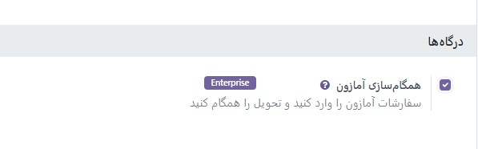
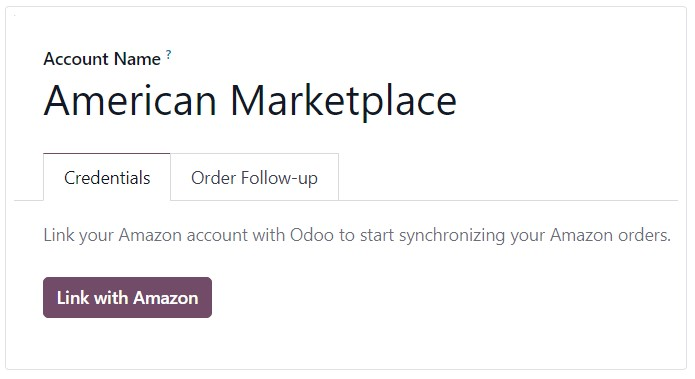
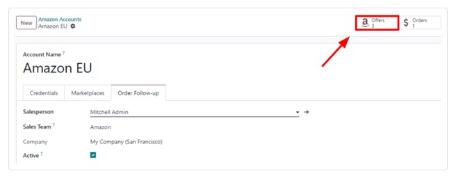

:nosearch:
:show-content:
:hide-page-toc:
:show-toc:

=======================================
پیکربندی کانکتور آمازون
=======================================

Odoo به کاربران اجازه می دهد تا یک حساب فروشنده آمازون را در پایگاه داده ثبت کنند، اما کاربر باید قبل از تکمیل پیکربندی، یک حساب فروشنده آمازون پولی داشته باشد.

ابتدا با ورود به پلتفرم آمازون و رفتن به **Account & Lists ‣ Start a Selling Account** از منوی کشویی واقع در قسمت header، یک حساب فروشنده پولی در آمازون راه اندازی کنید.

سپس در صفحه فروش با آمازون، مراحل ثبت نام را دنبال کنید و در نهایت دستورالعمل های زیر را برای ثبت نام و پیوند آن حساب فروشنده آمازون در Odoo دنبال کنید.

حساب فروشنده آمازون را به Odoo متصل کنید
-------------------------------------------------------
برای اتصال یک حساب فروشنده آمازون در Odoo، به برنامه **فروش ‣ پیکربندی‣ تنظیمات ‣ بخش اتصالات** بروید، ویژگی همگام سازی آمازون را فعال کنید و روی **ذخیره** کلیک کنید.

سپس به بخش **همگام سازی آماژون‣ تنظیمات ‣ پیکربندی ‣ فروش** برگردید و بر روی پیوند حساب آمازون در زیر تنظیمات همگام سازی آمازون کلیک کنید.

با انجام این کار یک صفحه جداگانه حساب های آمازون نشان داده می شود. از اینجا، روی **جدید** کلیک کنید تا یک حساب جدید آمازون ایجاد و پیوند دهید.

در صفحه فرم خالی حساب آمازون، با انتخاب یک نام برای حساب شروع کنید .سپس در تب **Credentials**، بازاری را که در ابتدا اکانت فروشنده در آن ایجاد شده بود، از منوی کشویی Home Marketplace انتخاب کنید.

.. image:: ./img/amazonConnector/k2.jpg
   :align: center
   :alt: فروش

پس از ذخیره، فیلد موجود در برگه اعتبارنامه با دکمه پیوند با آمازون جایگزین می شود.

با کلیک بر روی آن دکمه به صفحه ورود به آمازون یا مستقیماً به صفحه رضایت لازم هدایت می شود، اگر کاربر قبلاً وارد آمازون شده باشد.

در صفحه ورود به حساب فروشنده آمازون مورد نظر وارد شوید.

در صفحه رضایت، تأیید کنید که آمازون مجاز است به Odoo دسترسی به حساب و داده‌های مرتبط را بدهد.

پس از تایید، آمازون کاربر را به Odoo برمی گرداند و حساب کاربری ثبت شده است.

با ثبت موفقیت آمیز حساب آمازون، بازارهای موجود برای این حساب خاص با Odoo همگام شده و در برگه Marketplaces فهرست می شوند.

در صورت تمایل، موارد را از لیست بازارهای همگام‌سازی شده حذف کنید تا همگام‌سازی غیرفعال شود.

آمازون در Odoo سفارش می دهد
---------------------------------------------------------
وقتی یک سفارش آمازون همگام‌سازی می‌شود، حداکثر سه مورد در سفارش فروش در Odoo ایجاد می‌شود. هر کدام نشان دهنده محصولی است که در آمازون فروخته شده است: یکی برای محصولی که در بازار آمازون فروخته شده است، یکی برای هزینه حمل و نقل (در صورت وجود) و دیگری برای هزینه بسته بندی هدیه (در صورت وجود).

انتخاب یک محصول پایگاه داده برای یک کالای سفارش فروش با تطبیق مرجع داخلی آن (یک شناسه مرجع قابل تنظیم محصول در Odoo، مانند FURN001) با SKU آمازون برای اقلام بازار، کد حمل و نقل آمازون برای هزینه های تحویل، و هدیه آمازون انجام می شود. کد بسته بندی هزینه بسته بندی هدیه.

برای محصولات بازار، جفت‌ها به‌عنوان پیشنهادات آمازون ذخیره می‌شوند که در زیر دکمه هوشمند پیشنهادات در فرم حساب فهرست شده‌اند.

پیشنهادها به‌طور خودکار هنگام برقراری جفت‌سازی ایجاد می‌شوند و برای سفارش‌های بعدی برای جستجوی **SKU** استفاده می‌شوند. اگر پیشنهادی با **SKU** منطبق پیدا نشد، به جای آن از مرجع داخلی استفاده می شود.

.. note::
    ممکن است جفت شدن یک کالای بازار با یک محصول خاص، با تغییر محصول یا SKU یک پیشنهاد برای اطمینان از مطابقت آنها، اجباری شود. اگر هنوز به صورت خودکار انجام نشده باشد، پیشنهاد می تواند به صورت دستی ایجاد شود.

اگر از مرجع داخلی به عنوان SKU استفاده نشود، یا اگر محصول تحت شرایط مختلف به فروش می رسد، این کار مفید است.

اگر هیچ محصول پایگاه داده با مرجع داخلی منطبق برای SKU آمازون یا کد بسته بندی هدیه یافت نشد، از محصول پایگاه داده پیش فرض، Amazon Sale استفاده می شود. در صورتی که هیچ محصول پایگاه داده ای برای کد حمل و نقل آمازون پیدا نشود، با محصول پیش فرض Amazon Shipping نیز همین کار انجام می شود.

.. tip::
    برای اصلاح محصولات پیش‌فرض، حالت توسعه‌دهنده را فعال کنید و به برنامه فروش ‣ پیکربندی ‣ تنظیمات ‣ اتصالات ‣ همگام سازی آمازون ‣ محصولات پیش‌فرض بروید.

پیکربندی مالیات محصول
------------------------------------------
برای اجازه دادن به گزارش مالیاتی از فروش آمازون با Odoo، مالیات‌های اعمال شده بر اقلام سفارش فروش، مالیات‌هایی هستند که روی محصول تعیین می‌شوند یا با موقعیت مالی تعیین می‌شوند.

مطمئن شوید که مالیات‌های صحیحی برای محصولات خود در Odoo تعیین کرده‌اید، یا این کار را با یک موقعیت مالی انجام دهید تا از اختلاف در جمع‌های فرعی بین آمازون فروشنده مرکزی و Odoo جلوگیری کنید.

.. tip::
    از آنجایی که آمازون لزوماً همان مالیات‌هایی را که در Odoo پیکربندی شده اعمال نمی‌کند، ممکن است اتفاق بیفتد که مجموع سفارشات بین Odoo و آمازون فروشنده مرکزی چند سنت متفاوت باشد. هنگام تطبیق پرداخت ها در Odoo، می توان آن اختلافات را با یک رد کردن حل کرد.

یک بازار جدید اضافه کنید
----------------------------------------------------
همه بازارها توسط کانکتور آمازون پشتیبانی می شوند. برای افزودن یک بازار جدید، به صورت زیر عمل کنید:

    - حالت توسعه دهنده را فعال کنید.

    - به برنامه **فروش ‣ پیکربندی ‣ تنظیمات ‣ اتصالات ‣ همگام سازی آمازون ‣ بازارهای آمازون** بروید.

    - برای ایجاد یک رکورد جدید در بازار، روی جدید کلیک کنید.

شناسه بازار را در قسمت شناسه API وارد کنید، و منطقه آمازون را برای بازار خود همانطور که در اسناد آمازون برای شناسه‌ها و مناطق بازار توضیح داده شده است، و نشانی اینترنتی مرکزی فروشنده را همانطور که در اسناد آمازون برای نشانی‌های اینترنتی مرکزی فروشنده توضیح داده شده است، انتخاب کنید.

نام رکورد را روی آمازون تنظیم کنید. <کد کشور> تا به راحتی آن را بازیابی کنید (به عنوان مثال Amazon.se). فیلدهای شناسه API، منطقه و نشانی اینترنتی مرکزی فروشنده باید به ترتیب دارای شناسه بازار، منطقه انتخابی آمازون و مقادیر **URL** مرکزی فروشنده از اسناد آمازون باشند.

پس از ذخیره بازار، پیکربندی حساب آمازون را با رفتن به برنامه **فروش ‣ پیکربندی ‣ تنظیمات ‣ اتصالات ‣ همگام سازی آمازون ‣ حساب های آمازون** به روز کنید.

حسابی را انتخاب کنید که در آن از بازار جدید استفاده کنید، به تب **Marketplaces** بروید و روی به‌روزرسانی بازارهای موجود کلیک کنید. یک انیمیشن باید موفقیت عملیات را تایید کند. بازارهای تازه اضافه شده به صورت خودکار به لیست بازارهای همگام شده اضافه می شوند. اگر بازار جدید به لیست اضافه نشود، به این معنی است که برای حساب فروشنده یا ناسازگار است یا در دسترس نیست.

.. seealso::
   - :doc:`amazon Connector features`
   - :doc:`amazon order management`