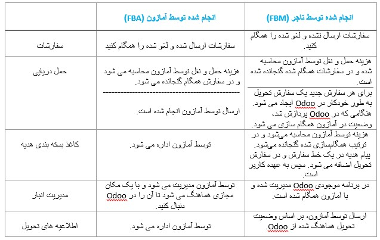

:nosearch:
:show-content:
:hide-page-toc:
:show-toc:

=======================================
ویزگی های کانکتور آمازون  
=======================================

رابط آمازون سفارش‌ها را بین آمازون و اودو همگام‌سازی می‌کند، که به میزان قابل توجهی زمان صرف شده برای وارد کردن سفارشات آمازون (از حساب فروشنده آمازون) به Odoo را کاهش می‌دهد. همچنین به کاربران این امکان را می دهد که به طور دقیق فروش آمازون را در Odoo پیگیری کنند.

ویژگی های پشتیبانی شده
----------------------------------------

رابط آمازون قادر است:
   - همگام سازی (Amazon به Odoo) همه سفارشات تایید شده (هم FBA و هم FBM)، و موارد سفارش آنها، که شامل موارد زیر است:
   - نام محصول، توضیحات و کمیت
   - هزینه های حمل و نقل برای محصول
   - هزینه بسته بندی هدیه
   - هر شریک گمشده مربوط به سفارش را در Odoo ایجاد کنید (انواع تماس پشتیبانی شده: آدرس تماس و تحویل).
   - به آمازون از ارسال تایید شده در Odoo (FBM) اطلاع دهید تا پول دریافت کنید.
   - همگام سازی (Odoo به آمازون) همه مقادیر موجود از محصولات خود (FBM).
   - پشتیبانی از چندین حساب فروشنده
   - از چندین بازار برای هر حساب فروشنده پشتیبانی کنید.

جدول زیر قابلیت های ارائه شده توسط Odoo را هنگام استفاده از کانکتور آمازون فهرست می کند:

.. tip::
    رابط آمازون برای همگام سازی داده های سفارشات فروش طراحی شده است. سایر اقدامات، مانند دانلود گزارش هزینه‌های ماهانه، رسیدگی به اختلافات، یا صدور بازپرداخت، طبق معمول باید از مرکز فروشنده آمازون مدیریت شوند.

بازارهای پشتیبانی شده
----------------------------------------
رابط آمازون از تمام بازارهای فعلی پشتیبانی می کند.

اگر بازاری در بازارهای آمازون شما فهرست نشده است، می‌توانید یک بازار جدید اضافه کنید.
