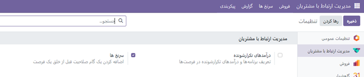
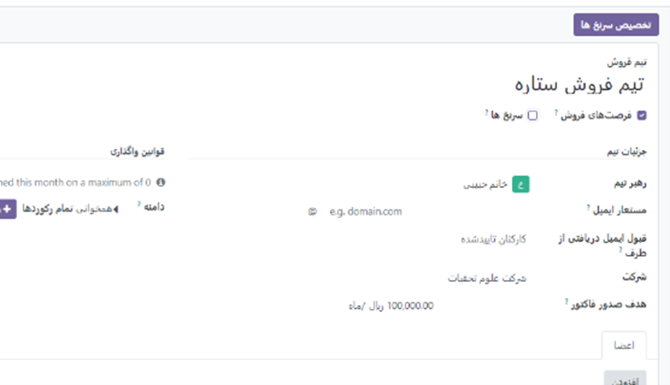

:nosearch:
:show-content:
:hide-page-toc:
:show-toc:

====================
مدیریت ارتباط با مشتریان
====================

         
**مهم ترین هدف ماژول مدیریت ادوو ارج نهادن احترام به مشتری و مسئولیت های فروشنده می باشد.**

.. raw:: html

    
 .fontMade by Sanaz 

.. role:: font

قبل از شروع و معرفی اودوو کمی درباره ی اهداف و روش های فروش توضیح دهیم.
منظور از سرنخ چیست؟
اصطلاح Lead یا سرنخ در مورد افراد یا سازمان‌هایی به کار می‌رود که به هر روش، با محصولات ما آشنا شده‌اند و برای نخستین کسب اطلاع (و شاید در نهایت خرید) به ما مراجعه می‌کنند.
بنابراین، وقتی کسی برای نخستین بار هر نوع پرسشی در مورد محصولات ما یا کسب و کارمان می‌پرسد و به نظر می‌آید که ممکن است قصد داشته باشد به مشتری ما تبدیل شود، او را Lead یا سرنخ یا مشتری راغب می‌نامیم.
معمولاً کسانی که در حوزه فروش و فروشندگی فعالیت می‌کنند، اصطلاح سرنخ را ترجیح می‌دهند.
چون در باور ذهنی یک فروشنده، همین که مشتری یک بار به تو مراجعه کرد یا به سایت سر زد یا حاضر شد شماره تماس یا ایمیل خود را در اختیار تو قرار دهد، یک سرنخ برای فروش ایجاد شده و از این به بعد، این تو هستی که باید سرِ این نخ را بگیری و آن‌قدر پیگیرش باشی تا به فروش محصول منتهی شود.

"
فرصت فروش چیست؟
به مجموعه‌ای از مشتریان بالقوه که واجد شرایط خرید از شما هستند، فرصت فروش گفته می‌شود. در واقع، این گروه از مشتریان بالقوه شما چالش یا مشکلی دارند که راه حل آن استفاده از محصول یا خدمت شماست. باید به این نکته توجه داشته باشید که فرصت‌های فروش شما مشتریانی هستند که به کسب‌وکار یا محصول شما بسیار علاقمند هستند. بنابراین، احتمال خرید در این گروه نسبت به سایر مشتریان بالاتر است.
آیا فرصت فروش و سرنخ با هم تفاوت دارند؟
سرنخ‌ها (Leads)، مشتریانی هستند که در راس قیف فروش قرار گرفته‌اند. این گروه، هنوز صلاحیت‌سنجی نشده‌اند. به عنوان مثال، این گروه ممکن است بخشی از یک مقاله یا قسمت‌هایی از کتاب الکترونیکی شما را خوانده‌ و نسبت به کسب‌وکار شما کنجکاو شده‌ باشند. اما این کنجکاوی به این معنا نیست که مشتریانِ واجد شرایط شما هستند. پس باید در نظر داشته باشید که احتمال خرید آن‌ها نسبت به مشتریان واجد شرایط پایین‌تر است.
چگونه می‌توان سرنخ را به فرصت فروش تبدیل کرد؟
برای اینکه تیم فروشندگان بتوانند عملکرد بهتری داشته باشند، باید ابتدا تمامی سرنخ‌هاشان را واجد شرایط کنند. این کار باعث می‌شود که زمان آن‌ها صرف مشتریانی شود که فرصت فروش آن‌ها محسوب می‌شوند. نتیجه این امر، عملکرد بهتر تیم فروش در یک سازمان، افزایش فروش و به دنبال آن درآمدزایی بیشتر است.
چگونه می‌توان یک فرصت را به خریدار قطعی تبدیل کرد؟
مشتریان خود را بشناسید: بعضی از فروشندگان فکر می‌کنند همه مشتریان آن‌ها، خریدار محصول‌شان هستند. اما این‌طور نیست
مشتریان خود را منتظر نگذارید: پاسخ‌دهی سریع به مشتریان بسیار مهم است. هرچه زودتر به مشتریان خود پاسخ بگویید، تاثیری که روی آن‌ها می‌گذارید بیشتر می‌شود. 
مشتریان خود را پیگیری کنید: بعد از اینکه مشتریان خود را صلاحیت‌سنجی کردید، حتما آن‌ها را پیگیری کنید. برای پیگیری از روش‌های مختلفی استفاده کنید. برای آن‌ها پیام یا ایمیل ارسال کنید، به آن‌ها زنگ بزنید. . 
با مشتریان به روش‌های مختلفی صحبت کنید گر می‌خواهید مشتری را به خریداری واقعی تبدیل کنید، باید حداقل سه تا پنج استراتژی مختلف را برای مذاکره با او آماده کنید. همیشه برای صحبت حضوری، صحبت تلفنی یا ارتباط مجازی‌ (چت کردن، ارسال ایمیل و غیره) آماده باشید.

نصب ماژول
---------------------

با نصب این ماژول منوهایی مطابق عکس زیر نمایش داده می شود.

سرنخ ها و فرصت های مشابه را ادغام کنید
------------------------
گاهی ممکن است سرنخ های ایجاد شده توسط چند فروشنده در زمان های مختلف ایجاد شود. برای اینکه از تماس های مکرر فروشنده ها به یک سرنخ جلوگیری کرد بهتر است تمام سرنخ های مشابه را با هم ادغام کنیم .
سرنخ ها و فرصت های مشابه با مقایسه شماره تماس و ایمیل مخاطب مرتبط شناسایی می شوند. اگر سرنخ/فرصت مشابهی پیدا شود، یک دکمه هوشمند سرنخ های مشابه  در بالای رکورد سرنخ (یا فرصت) ظاهر می شود. Similar lead

.. image:: ./crm/img/12.png
    :align: center

    پس از انتخاب گزینه فوق حالت نمایش را روی لیست قرار داده و لیستی از سرنخ های مشابه را به شما نشان می دهد. بعد از انتخایب تمام سرنخ های مشابه روی گزینه واکنش (علامت چرخ دنده) در بالای صفحه ظاهر میشود، کلیک کرده و گزینه ادغام را فشار داده تا تمام سرنخ ها یکی شوند.

.. image:: ./crm/img/13.png
    :align: center

پس از ادغام سرنخ ها صفحه ایی باز شده که مشخص می کند این سرنخ خای ادغام شده به کدام فرشنده و تیم ارجاع داده شود.

نکته:دقت داشته باشید هنگام باز شدن این پجره باید در قسمت انتخاب فرصت ها بیش از یک سرنخ را انتخاب کرده باشید.

سرنخ ها را به فرصت تبدیل کنید
---------------------

سرنخ قبل از ایجاد فرصت به عنوان یک مرحله واجد شرایط عمل می کنند. این امر زمان بیشتری را برای بررسی پتانسیل آن و سنجش قابلیت آن، قبل از اینکه فرصت به فروشنده اختصاص داده شود، فراهم می کند.

با فعال کردن گزنه سرنخ ها برای تمام تیم ها اراسل می شود.برای این کار وارد ماژول ارتباط با مدیریت مشتربان می شویم. بخش پیکربندی >> تنظیمات>>تیک فعال سرنخ را می زنیم

شاید بخواهیم سرنخ ها یا فرصت های فروش به یک تیم خاص نمایش داده نشود. برای این کار از منوی پیکربندی>>تیم های فروش
وارد تیم فروش مورد نظر شده و تیک گزینه سرنخ ها را برمی داریم.

.. image:: ./crm/img/17-1.png
    :align: center

تگ های مربوطه:

1.	#سئو_و_CRM
2.	#بهینه_سازی_برای_مشتریان
3.	#تجربه_کاربری_سئویی
4.	#رتبه_بندی_و_ارتباط_مشتری
5.	#سئو_و_تجربه_مشتری
6.	#بهبود_رتبه_با_ارتباط_موثر
7.	#کسب_و_کار_دوستانه_با_مشتری
8.	#بهینه_سازی_برای_تجربه_مشتری
9.	#ارتباط_موثر_و_سئو
10.	#بازخورد_مشتری_و_سئو
11.	#CRM
12.	#CustomerRelations
13.	#CustomerExperience
14.	#CustomerSupport
15.	#CustomerFeedback
16.	#MarketingStrategy
17.	#CustomerDataAnalysis
18.	#EmailMarketing
19.	#CustomerTouchpoints
20.	#CustomerExperienceManagement

لینک های مرتبط:

https://www.tashilgostar.com/documentation/16.0/applications/sales/crm.html

https://www.odoo.com/documentation/17.0/applications/sales/crm.html
https://oxydoo.com/blog/guide-

https://www.cybrosys.com/odoo/odoo-books/v17-ce/crm/28/import-267

.. toctree::
    :titlesonly:

   ./crm/leads
   ./crm/config
   ./crm/teams
