:nosearch:
:show-content:
:hide-page-toc:
:show-toc:

================================
پیکربندی
================================

در قسمت پیکربندی وارد بخش تنظیمات می شویم. همانور که مشاهاده میکنید دو بخش جداگانه مربوط به مدیریت ارتباط با مشتریان و تولید سرنخ وجود دارد.
 
**مدیریت ارتباط مشتریان**
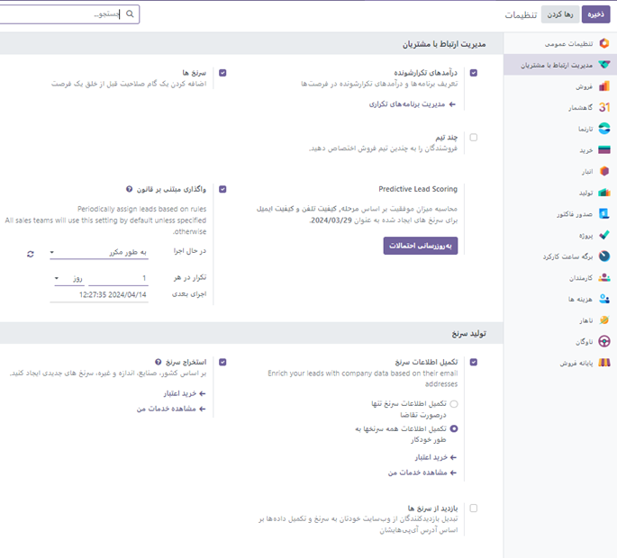

(امتیاز دهی پیشگویانه) Predictive Lead Scoring
با انتخاب  گزینه  به **به روز رسانی احتمالات** می توانید مشخص کنیددرصد احتمال بر چه اساس و از چه تاریخی اعمال شود.

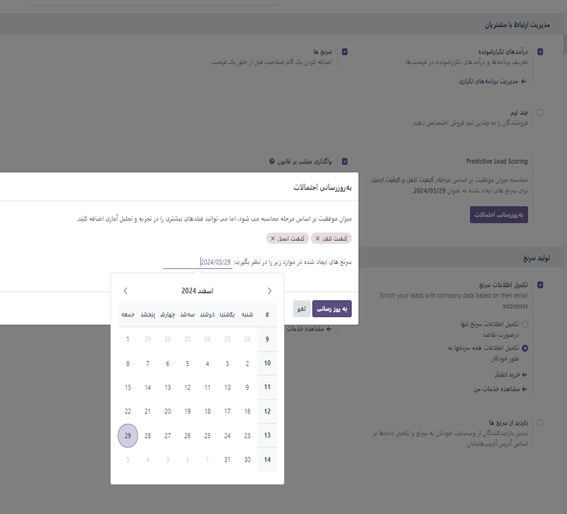

هر تعداد از متغیرهای زیر را می توان فعال کرد:

-   **دولت** : وضعیت جغرافیایی که فرصت از آن سرچشمه می گیرد 
-   **کشور** : کشور جغرافیایی که فرصت از آن نشات می گیرد 
-   **تلفن** : آیا شماره تلفنی برای فرصت ذکر شده است یا خیر
-   **ایمیل** : آیا یک آدرس ایمیل برای فرصت ذکر شده است یا خیر
-   **منبع** : منبع یک فرصت (به عنوان مثال موتور جستجو، رسانه های اجتماعی)
-   **زبان** : زبان گفتاری که در فرصت مشخص شده است
-   **برچسب‌ها** : برچسب‌هایی که روی فرصت قرار می‌گیرند

**چنانچه در یک سرنخ احتمال را به صورت دستی وارد کرده باشیم بعد از تنتظیمات مطابق شکل زیر با کلیلک روی چرخ دنده عدد احتمال با عدد اتوماتیک پر خواهد شد. **

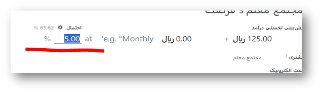

همچنین می توانید برای تعیین سرنخ ها از قوانین تکرار شونده ایی تعیین کرد. که با فعال کردن واگذاری مبتنی بر قانون
این کار صورت می گیرد. در واقع این گزینه تولید لیدها برای سفارشاتی هست که به صورت دوره ای  در زمان مشخصی تکرار میشه . این گزینه می تواند با فعال بودن به دو روش دستی (تولید سرنخ ها به صورت دستی ) و یا اوتوماتیک انجام شود.

مثال

برای پیکربندی یک قانون تخصیص به گونه‌ای که یک تیم فروش سرنخ‌هایی دریافت کند که احتمال موفقیت آن‌ها 20 درصد یا بیشتر است، یک خط دامنه ایجاد کنید که می‌خواند :Probability >= 20

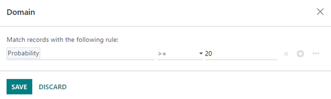

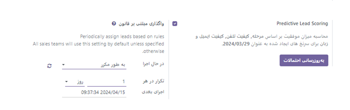

**در بخش تولید سرنخ ها**
تبدیل بازدید به سرنخ

می توانید با فعال کردن /غیر فعال کردن گزینه ها، مدیریت سرنخ ها را به صورت پیشرفته انجام دهید.به طور مثال با فعال کردن گزینه بازدید از سرنخ ها تمامی افرادی که از سایت شما بازدید می کنند به عنوان یک سرنخ حساب شده و شما را به فرصت های فروش بیشتری هدایت می کند.(سئو سایت)

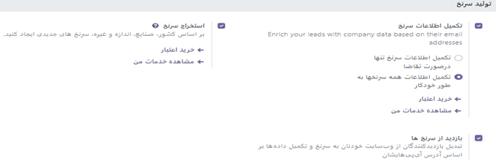

پیکربندی>انواع فعالیت
-------------------------

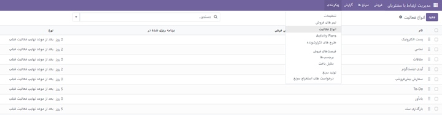

با انتخاب گزینه جدید صفحه ایی باز شده که می توان یک فعالیت جدید و یک یادآور در تقویم برای یادآوری آن فعالیت ایجاد کرد.

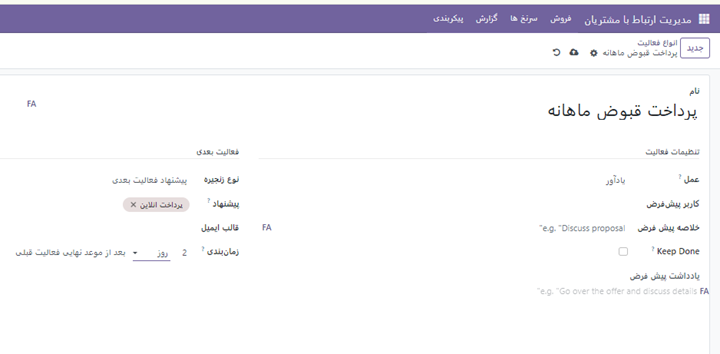

به خاطر داشته باشید. بعد از انجام هر فعالیتی آن را ذخیره کنید.به طور مثال شما یک فعالیت مثل ارسال ایمیل تعریف میکنید و می خواهید این ارسال ایمیل میخواید دو روز یک بار انجام بشه .برای تنظیمش میشه 2 روز بعد از موعد نهایی فعالیت قبلی .

پیکربندی> برنامه فعالیت ها(Activity plans)
---------------------------------

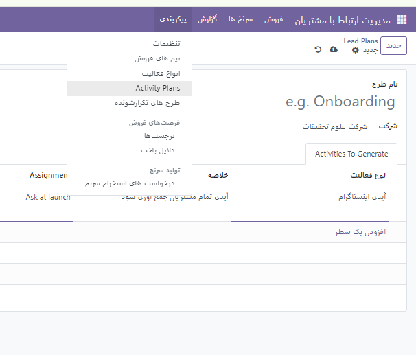

در این بخش می توانید یک برنامه فعالیت جدید تعریف کرده و آن را به شخص مورد نظر به صورت پیش فرض یا دستی واگذار کنید. (توجه شود نوع فعالیت بایداز قبل تعریف شده باشد)

گزارش
----------------

در این بخش میتوان گزارش های مختلف از فعالیت ها و سرنخ ها را براساس گزینه های موجود و یا سفارشی سازی بررسی کرد. برای اینکار از منوی سرچ بر اساس فیلترهای موجود یا دلخواه سرنخ یا فرصت دلخواه را جستجو کنید. 
دقت شود که گزارش گیری با توجه به بازه های زمانی و فرصت ها و فروش ها و .. می توان انجام شد.

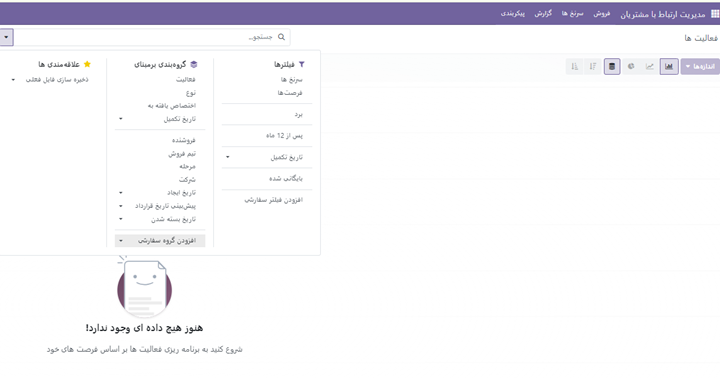

از قسمت گزارش ها می توانم فعالیت های جدیدی ایجاد کرد. همچنین می توان خط فروش رو سرنخ ها را با توجه به فیلتر های خاص زمانی تجزیه و تحلیل کرد.

**رنگ های هشدار اودوو**
----------------

اگر برای سرنخ یا فرصتی یاد آور یا فعالیتی طبق تقویم تنظیم کرده باشیم اگر یادآور آن به رنگ قرمز باشد یعنی تاریخ آن گذشته.رنگ زرد به معنی آن است که امروز روز سررسید انجام آن کار در تقویم است و در نهایت رنگ سبز به معنی انجام شدن در تاریخ مقرر آن می باشد.

افزودن ایمیل مستعار برای تیم های فروش
------------------------------------

ابرای این که ایمیل های مشتریان برای هر تیم به ایمیل مخصوص یا مستعار خود آن تیم فرستاده شود. می توان برای همه یتیم های فروش یک ایمل مستعار تعریف کرد.
اما قبل از این کار باید یک دامنه اصلی تعریف کنیم.برای این کار وارد پیکربندی>تننظیمات>تنظیمات عمومی > شرکت ها>مدیریت شرکت ها  در صفحه باز شده گزینه جدید را انتخاب کرده یک شرکت جدید ایجاد کنید. 

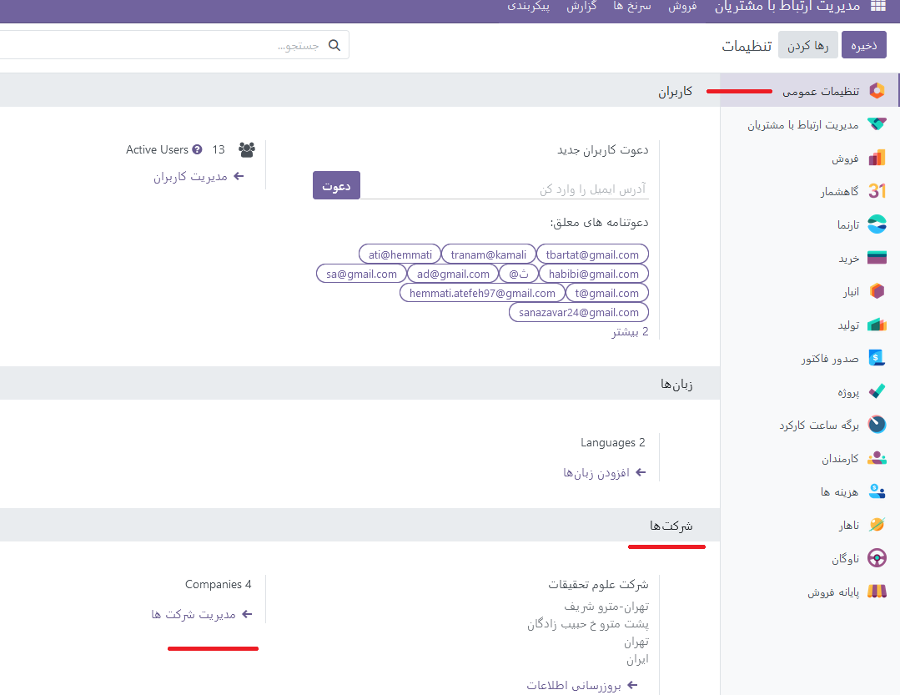

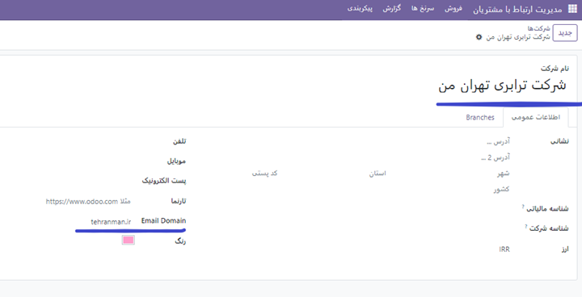

بعد از ثبت شرکت و تثب دامنه تغییرات را ذخیره کنید. 

بعد از مشخص کردن دامنه به تیم فروش مورد نظر رفته و ایمیل مستعار را به آن اختصاص دهید.

 گزارش درآمد مورد انتظار
--------------------------------

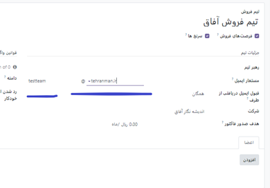

درآمد مورد انتظار کل ارزش نقدی سرنخ هایی است که انتظار می رود در یک تاریخ معین، معمولاً پایان ماه جاری بسته شوند.

گزارش درآمد مورد انتظار، تمام سرنخ‌های فعال در خط لوله فروش را که دارای تاریخ بسته شدن مورد انتظار هستند، جمع‌آوری می‌کند و نحوه عملکرد تیم‌های فروش را در یک بازه زمانی معین مقایسه می‌کند.

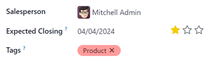

چند تیم
--------------

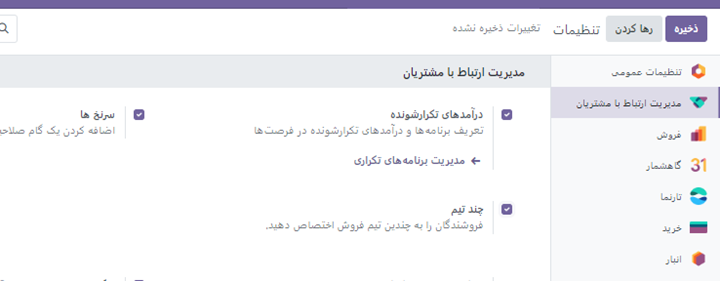

با فعال بودن این گزینه می توانید فروشندگان را به تیم های فروش مختلف اختصاص دهیم.

برای مثال یک تیم فروش میسازیم و دو فروشنده را به آن واگذار میکنیم.

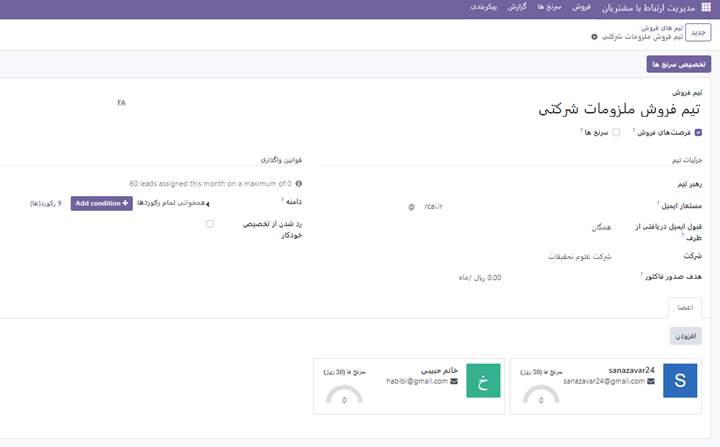

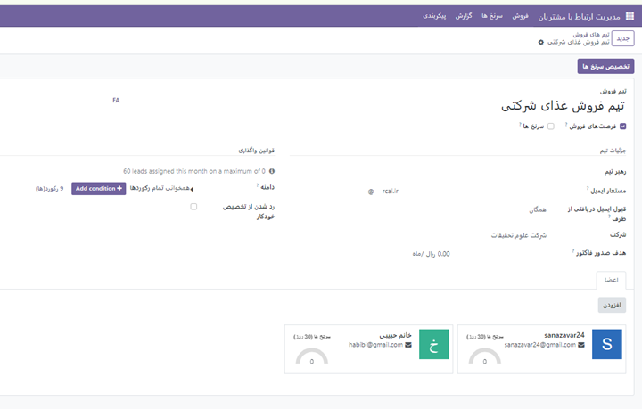

همانطور که مشاهده میکنید دو تیم فروشنده متفاوت اما فروشنده های یکسانی برای تیم ها تعریف شده است.

تبدیل بازدید کنندگان به سرنخ
--------------------------------

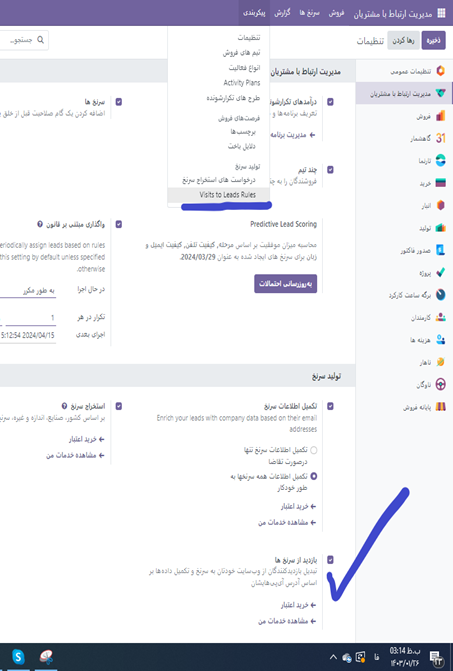

هنگام فعال کردن این گزینه در منوی پیکربندی گزینه visit to leads rules (دیدن قوانین سرنخ ها) ظاهر می شود که قبل از فعال کردن این گزینه قابل دیدن نبود. بعد از وارد شدن به این منو میتوانید قوانینی برای پیدا کردن سر نخ هایی که از طریق سایت شما را بازدبد میکنند تعریف کنید.

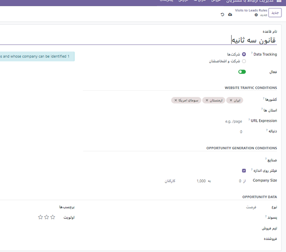

 ابتدا نام قانون خود را در قسمت "نام قانون" وارد کنید. شما می توانید انتخاب کنید که آیا "شرکت ها" یا "شرکت ها و مخاطبین آنها" را با استفاده از ویژگی ردیابی داده ها ردیابی کنید.و به ترتیب شرایط ترافیک وب سایت را تکمیل کنید.می توانید مشخص کنید که بازدیدکنندگان کدام کشورها را به سر نخ یا url مربوط تبدیل کنید.

 اطلاعات لازم در انتهای فرم کامل کرده و به همین ترتیب، فیلدهای نوع، پسوند، تیم فروش، فروشنده، برچسب‌ها و اولویت را با اطلاعات مربوطه تکمیل کنید و در نهایت اطلاعات را ذخیره کنید.

در منوی پیکربندی > فرصت های فروش
-------------------------

دو زیر منو وجود دارد که شما می توانید برچسب و یا دلایل باخت یک فرصت فروش را برای سهولت و راحتی از پیش تعربف کرده و از آن استفاده کنید.

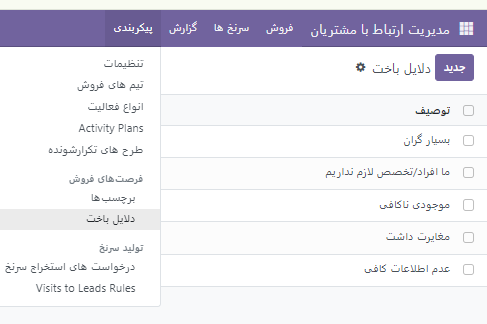

