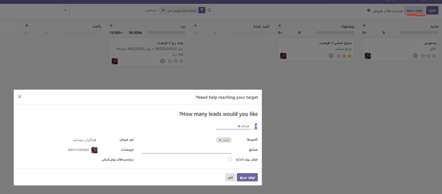

:nosearch:
:show-content:
:hide-page-toc:
:show-toc:

ایجاد سرنخ/فرصت 
---------------

ههانطور که می دانید برای فروش محصول باید مراحل زیادی تا سفارش و پرداخت انجام شود. اولین مرحله  ایجاد سرنخ است. این سرنخ حا می تواند هر چیز کوچک و به نظر کم اهمیتی باشد. اما به یاد داشته باشید که در نهایت از چنین سرنخ می توان مشتری های بالقوه را پیدا و به مشتری بالفعل تبدیل کرد.

برای ایجاد یک سرنخ روی دکمه جدید  کلیلک کنید تا یک کارت برای شما ظاهر شود. کارت باز شده شامل اطلاعات درخواستی سرنخ می باشد که می توانید مطابق عکس زبر آن را پر کنید.

.. image:: ./img/2.png
    :align: center
    :alt: photo2

برای پر کردن فیلد اول شما می توانید از سازمان یا مخاطبین موجود خوند استفاده کنید و یا در صورت جدید بودن به محض وارد کردن نام آن مخاطب یا سازمان برای شما ساخته می شود. بعد از پر کردن فیلد اول فیلد فرصت به طور اتوماتیک پر خواهد شد که در صورت نیاز می توانید نام این فرصت را تغییر دهید.

در قسمت پیش بینی تخمین درآمد می توانید درآمدی که از این سرنخ ممکن است بدست آورده شود را وارد نموده و بر اساس اولویت به این سر نخ ستاره بدهید.
در پایان  گزینه افزودن را فشار دهید تا سرنخ ثبت شود.

بعد از ایجاد سرنخ مسیر فروش آغاز خواهد شد. ممکن است شما قبل از فروش پیشهاد یا سند و یا ... قبل از ارتباط با مشتری در یک تایم و بازه زمانی خاصی بخواهید انجام داده و چک کنید. برای این منظور می توانید تنها با درگ و دارپ کردن کارت را در مرحله های مختلفتی قرا بدهید. 
اگر سرنخ مورد نظر به فروش رسید می توانید آن را در مرحله برد و یا در صورت عدم فروش باخت قرار داده. لازم به ذکر است مراحل تنها به این گزینه ها محدود نشده و کاربر می تواند با کیک روی گزینه مثبت + طبق مراحل فروش خود مرحله ایی را حذف/اضافه و یا ویرایش کند.

در طوب مسیر ی که یک سر نخ طی می کند ممکن است با چلش ها و یا درخواست هایی مواجه شوید که لازم باشد آن را برای آن فرصت ثبت کنید. برای این منظور کافیست روی کارت مورد نظر رفته تا علامت سه نقطه8 سمت راست بالای کارت ظاهر شود. با فشردن آن وارد صفحه ی جدیدی خواهید شد که امکانات بسیاری را در دسترس شما قرا رمی دهد.

به عکس زیر توجه فرمایید:

    

در  این صفحه جدید شما قادر خواهید بود در تب اطلاعات اضافی نام فروشنده، زمان انعقاد قرار داد و دیگر اطلاعات مانند بازاریابی و تیم فروش خود ار برای این سرنخ مشخص نمایید.

.. note::
        نکته: با خاطر داشته باشید بعد از هر تغیییر از آیکون ذخیره دستی برای ذخیره شدن فیلدهای مربوطه استفاده کنید. همچنین می توانبد این فرصت فروش را به مرحله برد و یا باخت تبدیل کرده

.. image:: ./img/5.png
    :align: center

در صورتیکه در این مرحله مشتری از شما در خواست پیش فاکتور کرده باشد لازم به صورت سریع می توانید از گزینه پیش فاکتور جدید استفاده کرده و یک نسخه از آن را برای مشتری ارسال کنید.

عکس زیر مثالی از ایجاد یک پیش فاکتور جدید می باشد. حتی اگر محصول مورد نظر در انبار و یا فروشگاهی موجود نباشد می تواند در همان لحظه نسبت به تعریف و درج اطلاعات محصول مورد نظر اقدام کرده و رسید را به مشتری ارسال کنید.

تست بین عکس

تولید سرنخ
---------------
 در این گزینه می توانید سرنخ های جدیدی تولید کنید که معیارهای مختلفی را دارا باشند. از جمله کشور،صنایع و ....
در واقع این گزینه همان گزیه جدید است اما با کمی پیچدگی. پیشنهاد می شود از گزینه جدید و یا منوی سرنخ ها ، سرنخ های جدی خود را ایجاد کنید.
جهت سهولت می توانید از همان گزینه **جدید** استفاده کنید

با باز شدن پنجره فوق می توان سرنخ های جدیدی ایجاد کرد. می‌توانید یکی از دو گزینه را در کادر بازشوی کنار این فیلد انتخاب کنید: «شرکت‌ها» یا «شرکت‌ها و مخاطبین آنها». اطلاعات مورد نیاز را در زمینه هایی مانند کشورها، ایالات، تیم فروش، فروشنده، و برچسب های پیش فرض پر کنید. برای سفارشی کردن محدوده تعداد کارکنان، «فیلتر در اندازه» را روشن کنید. پس از وارد کردن تمام اطلاعات، روی "ایجاد سرنخ ها" کلیک کنید. 
