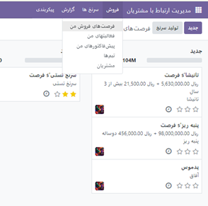
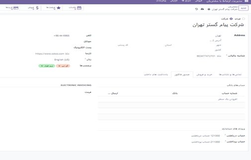
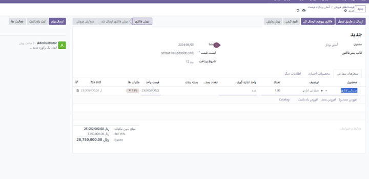
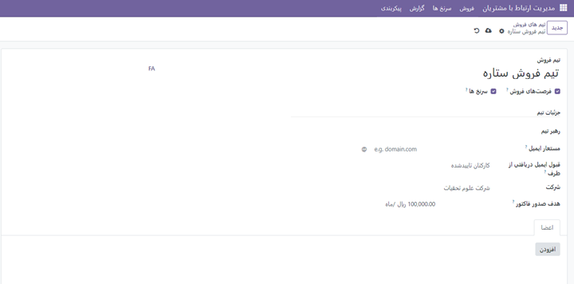
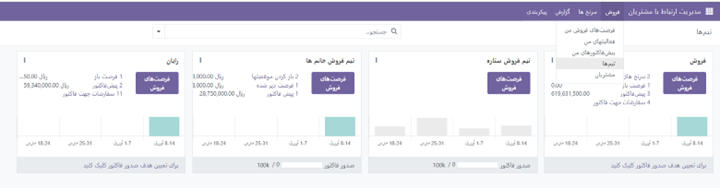
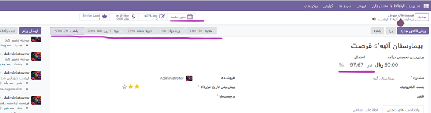

فروش
-----------------

در این منو زیر منوهای متعدی وجود دارد. که با انتخاب هر کدام می توانید به امکانات متعددی دسترسی داشته باشید.

    همانطور که در منوی کشوی باز شونده مشاهده میکنید در اولین زیر منو شما می توانید از فرصت های فروش من  فرصت ها ی فروش ،فعالیت های ثبت شده خود و تمام تیم ها و حتش مشتریان را را دیده و یا مجددتولید سرنخ کنید.

    ایجاد مشتری جدید:
    از منو فروش وارد مشتریان شده و از قسمت گوشه بالا سمت راست گزینه جدید را انتخاب کنید. بدین شکل اطلاعات مربوط به یک مشتری جدید را بنا به نیاز خود درج نمایید.

    همانطور که مشاهده می کنید درج اطلاعات مشتریان در اودوو صرفا به اطلاعات اولیه محدود نمی شود و شما میتوانید فاکتورها و خرید و فروش های مرتبط با این مشتری را در تب های پایین صفحه مشاهده کنید.

تیم های فروش متعدد
------------------
برای ایجاد یک تیم فروش جدید به پیکربندی>>تنظیمات>> تیم فروش
در صفحه باز شده اطلاعات را تکمیل کرده و مشخص کنید که آیا صرفا فرصت های فروش و یا سرنخ ها به اعضای تیم ارسال شود. همچنین می توان مبلغی را به عنوان تارگت این تیم مشخص کردو و باز فشردن کزینه افزودن اعضای تیم را مشخص کرد.

    می توان تمام تبم های فروش را در یک داشبورد مشاهده کرد.برای این کار از منوی فروش>>تیم ها  

در صفحه باز شده اطلاعات را تکمیل کرده و مشخص کنید که آیا صرفا فرصت های فروش و یا سرنخ ها به اعضای تیم ارسال شود. همچنین می توان مبلغی را به عنوان تارگت این تیم مشخص کردو و باز فشردن کزینه افزودن اعضای تیم را مشخص کرد.

    با انتخاب 3 نقطه بالای هر کارتیم فروش می توان فرصت های فروش،سرنخ ها، برد ها و ... مشاهده کرد.

توضیحات تکمیلی سرنخ
---------------------------
زمانیکه یک سرنخ تولید می شود مسیرهای مختلفی را باید طی کند تا به یکه فرصت فروش یا در نهایت به برد یا باخت تبدیل شود. 
طی شدن این مراحل را می توان به صورت پشت سر هم (breadcrum)  دید و بین وضعیت های یک سرنخ جا به جا شد.
همینطور که مشاهده میکنید می توانیم برای پیش برد اهداف برای یک سرنخ یا فرصت فروش از گزینه جلسه استفاده کنیم و اعضایی که باید در جلسه حضور داشته باشند را به جلسه در تاریخ و روز ساعت معیین دعوت کنیم.
نکته:لازم به ذکر است درصد احتمال به صورت دستی قابل تغییر است و یا بنا به فروش های قبلی  و تغییر هر فرصت با ورود به مرحله بعد و نزدیک شدن به فروش به صورت اتوماتیک توسط اودوو تعیین می شود.

سرنخ ها
--------------------

در این منو علاوه بر ایجاد یک سر نخ میتوانیم از تمام سرنخ ها یک خروجی در قالب اکسل گرفته و یا سرنخ ههای وارد شده در اکسل را به ماژول اضافه کرد. برای اینکار از منوی سرنخ ها ابتدا روی علامت چرخ دنده کلیک کرده و قالب آماده که می توان در آن سرنخ ها را وارد کرد دانلود میکنیم. سپس بعد از ورود اطلاعات در قالب فایل  آن را در اودوو با گزینه آپلود فایل اضافه میکنیم میکنیم. 
برای راهنمای بیشتر می توانید از لینک زیر استفاده کنید:

https://oxydoo.com/blog/guide-28/import-267

.. image:: ./img/19.png
    :align: center
    
