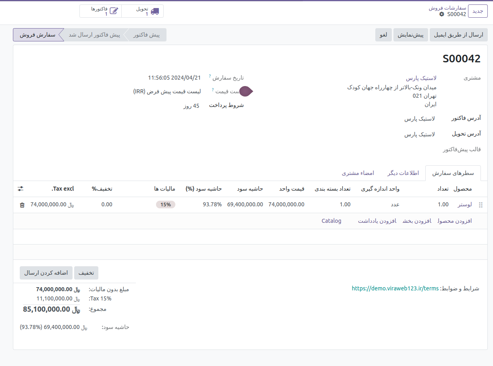

حاشیه سود  
=============

با توجه به اینکه از فروش محصول و مبلغ دریافتی بابت آن تنها مقداری به‌عنوان سود برای شرکت باقی‌ می‌ماند، بنابراین به‌ آن حاشیه سود می‌‌گویند. از مبلغی که شرکت از فروش محصول به‌دست می‌آورد تنها قسمتی از آن سود است و بقیه صرف هزینه‌های مربوط به تولید آن محصول می‌شود.

این هزینه‌ها می‌توانند به‌طور مستقیم یا غیر مستقیم برای تولید محصول نهایی که هدف اصلی شرکت است اختصاص پیدا کند. برای مثال هزینه‌هایی از قبیل مواد اولیه، اجاره مکان تولید و غیره را می‌توان نام برد که در نهایت از مبلغ دریافتی بابت فروش کم می‌شود و حاشیه سود را تشکیل می‌‌دهد. بنابراین حاشیه سود تنها جزئی از مبلغ به‌دست آمده از فروش است که پس از کسر هزینه‌ها به‌عنوان سود در نظر گرفته می‌شود.

حاشیه سود در ماژول account_invoice_margin از OCA در نرمافزار اودوو، به معنای تفاوت بین قیمت فروش و هزینههای مربوط به کالا یا خدمات است. این ماژول به کاربران اجازه میدهد تا حاشیه سود را برای هر فاکتور محاسبه کنند و این اطلاعات را برای تحلیلهای مالی و تصمیمگیریهای بهتر در زمینه قیمتگذاری و فروش استفاده کنند.

این معیار مالی به کسبوکارها کمک میکند تا سودآوری محصولات یا خدمات خود را ارزیابی کنند و درک بهتری از عملکرد مالی خود داشته باشند. این اطلاعات میتواند در تصمیمگیریهای استراتژیک مانند تعیین قیمتها، تخفیفها و سایر عوامل مرتبط با فروش و بازاریابی مفید باشد.

بعد از نصب این ماژول حاشیه سود را میتوان در فاکتورها دید . دو فیلد به فاکتورها اضاف میشود یکی فیلد مقدار  mrgin که به صورت اتوماتیک محاسبه میشود و دیگری درصد margin که بر اساس مقدار آن و قیمت فروش محصول مقدار درصد آن نیز به صورت اتوماتیک محاسبه میشود و در فاکتور نشان داده میشود .

