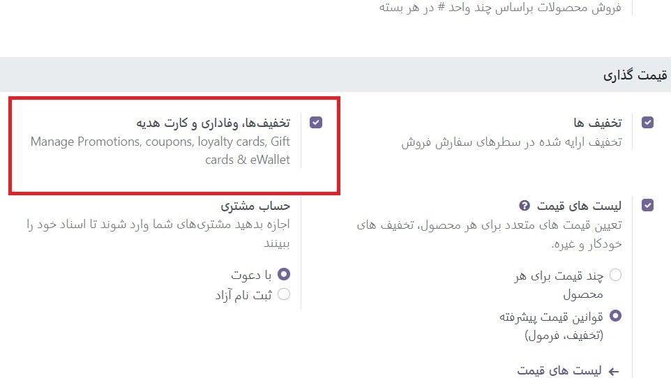
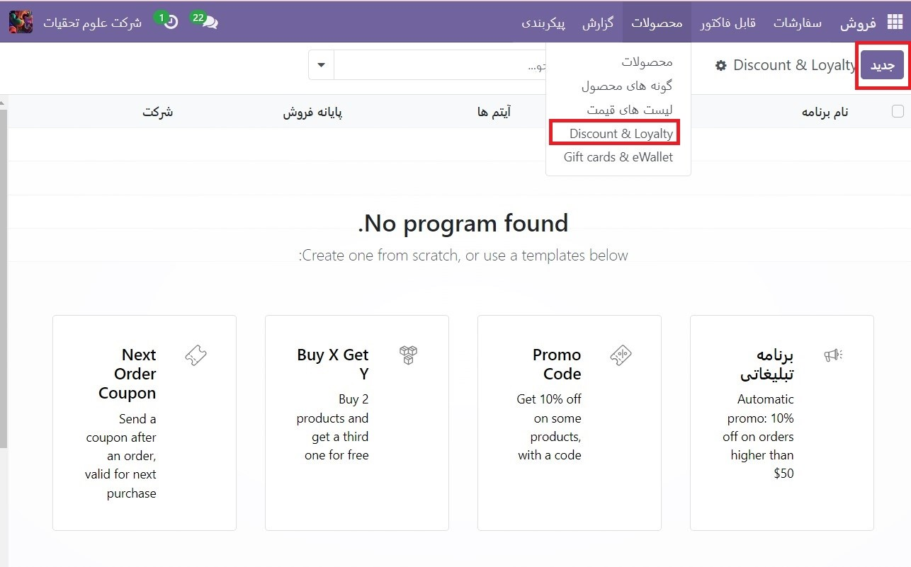
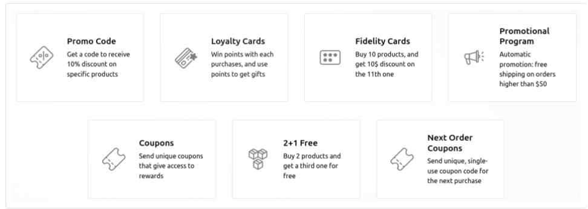
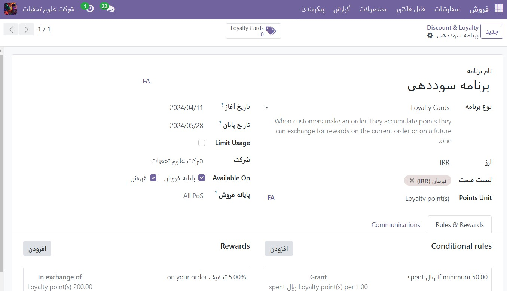
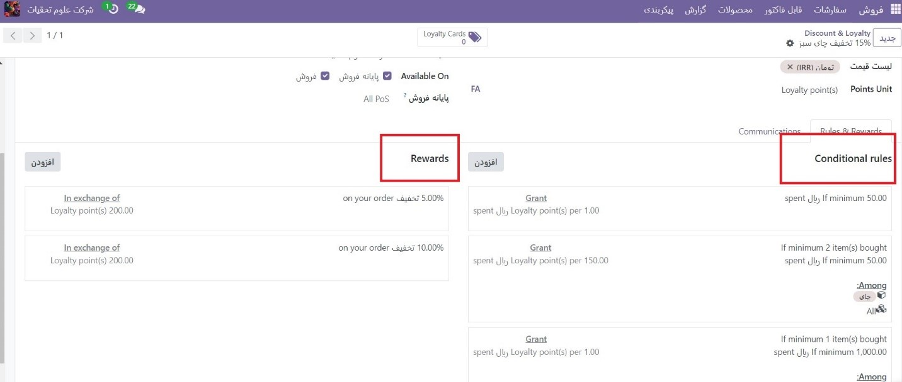
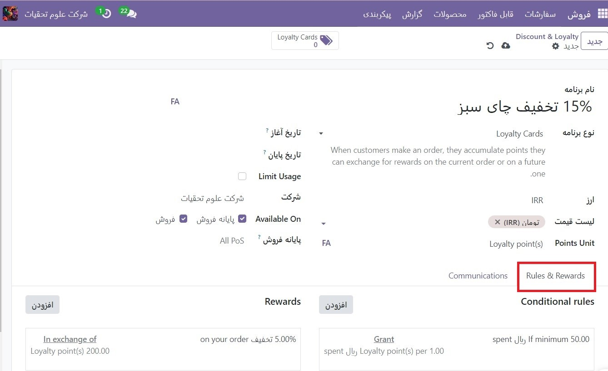
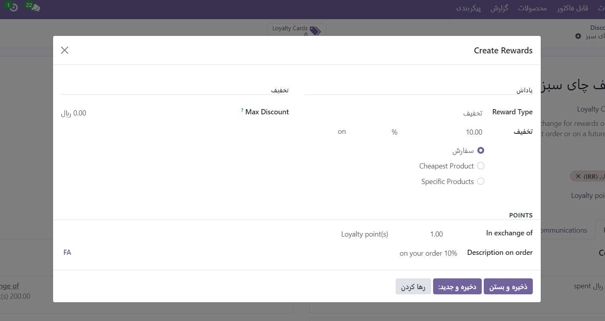

:nosearch:
:show-content:
:hide-page-toc:
:show-toc:

=======================================
برنامه های تخفیف و وفاداری
=======================================

برنامه های فروش، تجارت و پایانه فروش به کاربران اجازه می دهد برنامه های تخفیف و وفاداری ایجاد کنند که مشتریان می توانند برای خرید آنلاین و فروشگاهی از آنها استفاده کنند. این برنامه ها گزینه های قیمت گذاری متنوع، عمومی و حساس تری نسبت به لیست قیمت ها ارائه می دهند.

تنظیمات را پیکربندی کنید
--------------------------------------------
برای شروع استفاده از برنامه‌های تخفیف و وفاداری، به بخش **فروش ‣ پیکربندی ‣ تنظیمات** بروید. در عنوان قیمت گذاری، تنظیمات تخفیف، وفاداری و کارت هدیه را با علامت زدن کادر کنار ویژگی فعال کنید. در نهایت روی ذخیره کلیک کنید تا تغییرات **ذخیره** شوند.

برنامه های تخفیف و وفاداری را پیکربندی کنید
--------------------------------------------------------------------
برای ایجاد برنامه های تخفیف و وفاداری، به بخش **فروش ‣ محصولات ‣ تخفیف و وفاداری** بروید.
اگر هنوز هیچ برنامه تخفیف یا وفاداری ایجاد نشده است، Odoo انتخابی از الگوها را برای کمک به ایجاد اولین برنامه ارائه می دهد. یکی از کارت های الگو را انتخاب کنید یا روی **جدید** کلیک کنید تا یک برنامه جدید از ابتدا ایجاد کنید.

یا اگر از قبل برنامه های موجود وجود دارد، یک برنامه موجود را برای ویرایش آن انتخاب کنید.

.. tip::
    الگوها فقط زمانی ظاهر می شوند که هیچ برنامه ای ایجاد نشده باشد و پس از ایجاد اولین برنامه ناپدید می شوند.

ایجاد یا ویرایش یک برنامه، فرم برنامه را باز می کند.

فرم برنامه شامل گزینه های زیر است:

    - نام برنامه: نام برنامه را وارد کنید. نام برنامه برای مشتری قابل مشاهده نیست.

    - نوع برنامه: نوع برنامه مورد نظر را انتخاب کنید.

    - ارز: ارز مورد استفاده برای برنامه را انتخاب کنید.

    - واحد امتیاز: نام امتیازهای مورد استفاده برای برنامه کارت وفاداری (به عنوان مثال امتیاز وفاداری) را وارد کنید. نام واحد امتیاز برای مشتری قابل مشاهده است. این فیلد فقط زمانی در دسترس است که نوع برنامه روی کارت‌های وفاداری تنظیم شده باشد.

    - Validity: تاریخ اعتبار برنامه را انتخاب کنید. این قسمت را بدون تاریخ پایان خالی بگذارید، یعنی برنامه همیشه معتبر است و منقضی نمی شود.

    - Limit Usage: این کادر را علامت بزنید و عددی را وارد کنید تا تعداد دفعات استفاده از برنامه در طول دوره اعتبار محدود شود.

    - شرکت: در مورد شرکت های متعدد، شرکتی را انتخاب کنید که برنامه برای آن در دسترس است.

    - Available On: برنامه(هایی) را که برنامه در آنها در دسترس است انتخاب کنید.

    - نقطه فروش: نقطه(های) فروش را که برنامه در آن موجود است انتخاب کنید. این فیلد را خالی بگذارید تا در همه PoS در دسترس باشد.

.. tip::
    گزینه های موجود در فرم برنامه بسته به نوع برنامه انتخاب شده متفاوت است.

تمامی کارت ها، کدها، کوپن ها و غیره موجود برای برنامه از طریق دکمه هوشمند واقع در گوشه سمت راست بالای فرم قابل دسترسی هستند.

.. image:: ./img/products&Prices/c17.jpg
   :align: center
   :alt: فروش

انواع برنامه
---------------------------------------------

انواع مختلف برنامه موجود در فرم برنامه عبارتند از:

    - کوپن: کدهای کوپن یکبار مصرف را ایجاد و به اشتراک بگذارید که امکان دسترسی فوری به جوایز را فراهم می کند.
    - کوپن‌های سفارش بعدی: کدهای کوپن یک‌بار مصرف را ایجاد و به اشتراک بگذارید که امکان دسترسی به جوایز در سفارش بعدی مشتری را فراهم می‌کند.
    - کارت‌های وفاداری: هنگام خرید، مشتری امتیاز جمع‌آوری می‌کند تا در سفارش‌های آینده با پاداش عوض کند.
    - تبلیغات: قوانین مشروط را برای سفارش محصولات تنظیم کنید، که در صورت تحقق، امکان دسترسی به جوایز را برای مشتری فراهم می کند.
    - کد تخفیف: کدهایی را تنظیم کنید که با وارد کردن آنها هنگام پرداخت، تخفیف هایی به مشتری اعطا می شود.
    - خرید X دریافت Y: برای هر X مورد خریداری شده، 1 اعتبار به مشتری تعلق می گیرد. پس از جمع آوری مقدار مشخصی از اعتبار، مشتری می تواند آنها را برای دریافت کالای Y معامله کند.

قوانین مشروط
-----------------------------------------------
در مرحله بعد، قوانین مشروط را پیکربندی کنید که تعیین می کند چه زمانی برنامه برای سفارش مشتری اعمال می شود.

در تب **Rules & Rewards**، روی افزودن در کنار **Conditional rules** کلیک کنید تا شرایط را به برنامه اضافه کنید. این یک پنجره پاپ آپ **Create Conditional** قوانین را نشان می دهد.

.. note::
    گزینه های قوانین شرطی بسته به نوع برنامه انتخابی متفاوت است.

    .. image:: ./img/products&Prices/c20.jpg
        :align: center
        :alt: فروش

گزینه های زیر برای پیکربندی قوانین شرطی در دسترس هستند:

    - کد تخفیف: یک کد سفارشی را وارد کنید تا برای برنامه کد تخفیف استفاده شود، یا از کد پیش‌فرض تولید شده توسط Odoo استفاده کنید. این فیلد فقط زمانی در دسترس است که نوع برنامه روی کد تخفیف تنظیم شده باشد.

    - حداقل مقدار: حداقل تعداد محصولاتی را که برای دسترسی به پاداش باید خریداری کنید را وارد کنید. حداقل مقدار را روی حداقل 1 تنظیم کنید تا مطمئن شوید که مشتری برای دسترسی به پاداش باید خرید انجام دهد.

    - حداقل خرید: حداقل مقدار (بر حسب ارز) را با مالیات شامل یا بدون مالیات که باید برای دسترسی به پاداش خرج شود، وارد کنید. اگر هم حداقل مقدار و هم حداقل مقدار خرید وارد شده باشد، سفارش مشتری باید هر دو شرط را داشته باشد.

    - محصولات: محصول(های) خاصی را که برنامه برای آنها اعمال می شود، انتخاب کنید. این قسمت را خالی بگذارید تا برای همه محصولات اعمال شود.

    -دسته ها: دسته محصولاتی را که برنامه برای آنها اعمال می شود انتخاب کنید. همه را انتخاب کنید تا در همه دسته‌های محصول اعمال شود.

    - برچسب محصول: برچسبی را برای اعمال برنامه بر روی محصولات با آن برچسب خاص انتخاب کنید.

    - Grant: تعداد امتیازهایی را که مشتری در هر سفارش، به ازای ارز خرج شده، یا به ازای هر واحد پرداخت شده کسب می کند (برای برنامه های کارت وفاداری و خرید X دریافت Y) وارد کنید.

    - برای ذخیره قانون روی **ذخیره وبستن** کلیک کنید و پنجره پاپ آپ را ببندید یا روی **ذخیره وجدید** کلیک کنید تا قانون ذخیره شود و بلافاصله یک قانون جدید ایجاد کنید.

پاداش
--------------------------------
در برگه **Rules & Rewards** فرم برنامه، روی افزودن در کنار **Rewards** کلیک کنید تا پاداش به برنامه اضافه شود. این یک پنجره پاپ آپ **Create Rewards** را نشان می دهد.

.. tip::
    گزینه های پاداش بسته به نوع برنامه انتخابی متفاوت است

گزینه های زیر برای پیکربندی جوایز در دسترس هستند:

نوع پاداش: نوع پاداش را از بین محصول رایگان، تخفیف و ارسال رایگان انتخاب کنید. گزینه های دیگر برای پیکربندی پاداش به نوع پاداش انتخاب شده بستگی دارد.

#. محصول رایگان:

  -Quantity Rewarded: تعداد محصولات رایگانی که به مشتری پاداش داده می شود را انتخاب کنید.

  - محصول: محصولی را که به صورت رایگان ارائه می شود به عنوان جایزه انتخاب کنید. فقط یک محصول را می توان انتخاب کرد.
  - برچسب محصول: برای مشخص کردن بیشتر محصول رایگان واجد شرایط برای پاداش، یک برچسب را انتخاب کنید.
  - تخفیف: مقدار تخفیف را به صورت درصد، ارز به ازای هر امتیاز یا ارز در هر سفارش وارد کنید. سپس، انتخاب کنید که آیا تخفیف برای کل سفارش اعمال می‌شود، فقط برای ارزان‌ترین محصول در سفارش، یا فقط برای محصولات خاص.
  - حداکثر تخفیف: حداکثر مقدار (به ارز) را که این پاداش ممکن است به عنوان تخفیف اعطا کند را وارد کنید. این قسمت را بدون محدودیت در 0 بگذارید.

#. ارسال رایگان:

  - حداکثر تخفیف(Max Discount): حداکثر مقدار (به ارز) را که این پاداش ممکن است به عنوان تخفیف اعطا کند را وارد کنید. این قسمت را بدون محدودیت در 0 بگذارید.
  - در ازای(In exchange of): تعداد امتیازهای مورد نیاز برای مبادله پاداش (برای برنامه های کارت وفاداری و خرید X دریافت Y) را وارد کنید.
  - توضیحات در هنگام سفارش(Description on order): توضیحات مربوط به پاداش را وارد کنید که هنگام پرداخت به مشتری نمایش داده می شود.

