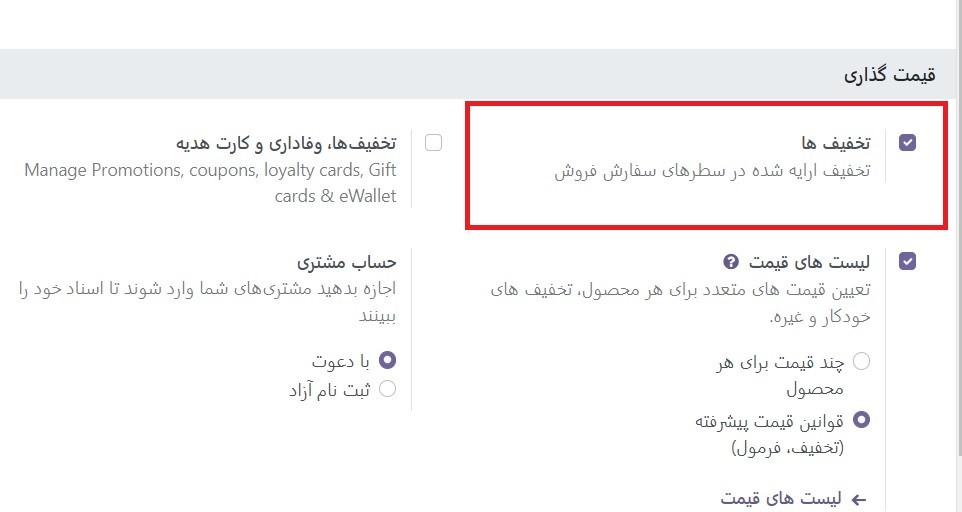

:nosearch:
:show-content:
:hide-page-toc:
:show-toc:

============================================
لیست قیمت ها، تخفیف ها و فرمول ها
============================================

Odoo Sales دارای یک ویژگی لیست قیمت مفید است که می تواند متناسب با هر استراتژی قیمت گذاری منحصر به فردی تنظیم شود.

لیست قیمت لیستی از قیمت ها (یا قوانین قیمت) است که Odoo برای تعیین قیمت مناسب برای مشتری استفاده می کند. این لیست قیمت ها را می توان با معیارهای خاصی (مانند دوره های زمانی، حداقل مقدار فروخته شده و موارد دیگر) به منظور اعمال قیمت ها یا تخفیف های خاص تنظیم کرد.
لیست قیمت ها قیمت های خاصی را پیشنهاد می کنند، اما همیشه می توان آنها را در سفارش فروش نادیده گرفت.

گزینه های استراتژی قیمت گذاری
------------------------------------------------
برای انتخاب استراتژی قیمت‌گذاری، ابتدا به برنامه **فروش ‣ پیکربندی ‣ تنظیمات** بروید. در قسمت قیمت گذاری، روی کادر کنار ویژگی لیست قیمت کلیک کنید.

انجام این کار دو گزینه اضافی را در زیر آن نشان می دهد: قیمت های چندگانه برای هر محصول و قوانین قیمت پیشرفته (تخفیف ها، فرمول ها). پیوندی با برچسب لیست قیمت نیز ظاهر می‌شود که به صفحه فهرست‌های قیمت جداگانه منتهی می‌شود که در آن لیست‌های قیمت را می‌توان ایجاد و/یا تغییر داد.

   - قیمت های چندگانه برای هر محصول: امکان تعیین چندین قیمت مختلف برای هر محصول را فراهم می کند.
   - قوانین قیمت پیشرفته (تخفیف ها، فرمول ها): امکان ایجاد قوانین دقیق قیمت و اعمال تخفیف، حاشیه و گرد کردن را فراهم می کند.

پس از کلیک بر روی کادر کنار ویژگی لیست قیمت، یکی از این دو گزینه را انتخاب کنید، سپس روی ذخیره کلیک کنید تا همه تغییرات ذخیره شوند.

لیست قیمت ها
------------------------------------
پس از فعال‌سازی و ذخیره ویژگی لیست‌های قیمت، صفحه تنظیمات مجدداً بارگیری می‌شود و از اینجا، پیوند لیست‌های قیمت (در زیر ویژگی لیست‌های قیمت در صفحه تنظیمات) را انتخاب کنید، یا به برنامه **فروش ‣ محصولات ‣ لیست قیمت‌ها** بروید.

هر یک از گزینه‌ها صفحه فهرست‌های قیمت را نشان می‌دهد، که در آن لیست‌های قیمت را می‌توان در هر زمان ایجاد و/یا تغییر داد.

.. image:: ./img/manageyourpricing/f10.jpg
    :align: center
    :alt: فروش

.. note::
    لیست قیمت عمومی لیست قیمت پیش فرضی است که با فروش و تجارت الکترونیک Odoo استفاده می شود.

از صفحه لیست قیمت ها، یا لیست قیمت مورد نظر را برای ویرایش انتخاب کنید، یا برای ایجاد یک لیست قیمت جدید، روی جدید کلیک کنید، که یک فرم لیست قیمت خالی را نشان می دهد که می تواند به روش های مختلف پیکربندی شود.

هنگام ایجاد یک لیست قیمت جدید، با اضافه کردن یک نام برای لیست قیمت در بالای فرم، در قسمت خالی شروع کنید. در مرحله بعد، ارز مورد نظر را انتخاب کنید.

سپس، اگر در یک محیط چند شرکتی کار می کنید، در قسمت شرکت انتخاب کنید که این لیست قیمت برای کدام شرکت اعمال شود. اگر این قسمت خالی بماند، لیست قیمت به طور خودکار برای همه شرکت های موجود در پایگاه داده اعمال می شود.

برگه قوانین قیمت
------------------------------------------
عملکرد **برگه قوانین قیمت** در فرم لیست قیمت بسته به تنظیم لیست قیمت انتخاب شده متفاوت است: یا قیمت های چندگانه برای هر محصول یا قوانین قیمت پیشرفته (تخفیف ها، فرمول ها).

با این حال، برگه قواعد مبتنی بر زمان و برگه پیکربندی همیشه یکسان هستند، صرف نظر از تنظیمات انتخابی لیست قیمت.

.. image:: ./img/manageyourpricing/f12.jpg
    :align: center
    :alt: فروش

برگه قوانین قیمت (چند قیمت برای هر محصول)
-------------------------------------------------------------
با فعال شدن تنظیمات چند قیمت برای هر محصول، برگه قوانین قیمت در فرم‌های فهرست قیمت، گزینه‌ای را برای افزودن محصولات خاص، با قیمتی خاص، به فهرست قیمت‌ها فراهم می‌کند.

برای افزودن یک محصول و قیمت خاص به فرم لیست قیمت، روی تب قوانین قیمت کلیک کنید، سپس روی افزودن یک سطر در ستون محصولات کلیک کنید. سپس محصول مورد نظر را که باید قیمت مشخصی برای آن اعمال شود انتخاب کنید.

سپس، در صورت لزوم، یک نوع محصول را در زیر ستون گونه ها انتخاب کنید (به عنوان مثال یک محصول خاص، اندازه، رنگ، و غیره). در صورت انتخاب هیچ گونه ای، این قیمت برای تمامی انواع محصول اعمال می شود.

اگر برای اعمال قیمت خاص باید حداقل مقداری از محصول خریداری شود، مقدار آن را زیر حداقل وارد کنید. ستون کمیت

برای تنظیم قیمت محصول برای این لیست قیمت خاص، مقدار مورد نظر را در ستون قیمت وارد کنید. سپس، در صورت تمایل، گزینه ای برای اضافه کردن تاریخ شروع و پایان به قیمت محصول پیکربندی شده وجود دارد.

برای افزودن یک خط محصول دیگر، دوباره روی **افزودن یک سطر** کلیک کنید و روند را تکرار کنید. محدودیتی برای اضافه کردن تعداد محصولات در برگه قوانین قیمت در فرم لیست قیمت وجود ندارد.

برگه قوانین قیمت (قوانین قیمت پیشرفته)
-------------------------------------------------------------------
با فعال شدن تنظیمات پیشرفته قیمت (تخفیف ها، فرمول ها)، زبانه قوانین قیمت در فرم های لیست قیمت، گزینه ای را برای پیکربندی قوانین دقیق قیمت بر اساس فرمول ها فراهم می کند.

.. image:: ./img/manageyourpricing/f12.jpg
    :align: center
    :alt: فروش

برگه قوانین مبتنی بر زمان
------------------------------------------------
قوانین مبتنی بر زمان به طور خاص برای محصولات اشتراکی استفاده می شود.

در برگه قوانین مبتنی بر زمان، همان عملکرد زبانه قوانین قیمت وجود دارد، با تنها تفاوت این است که یک دوره زمانی تکراری را می توان در ستون زمان اعمال کرد.

پس از انتخاب محصول و نوع احتمالی در برگه قوانین مبتنی بر زمان، فیلد خالی در ستون دوره را انتخاب کنید تا منوی کشویی دوره‌های تکرار از پیش تعیین‌شده (مانند ماهانه، فصلی، هفتگی و غیره) نمایش داده شود.

دوره‌های تکراری جدید نیز می‌توانند مستقیماً از این ستون ایجاد شوند، با تایپ نام جدید برای دوره و سپس انتخاب ایجاد برای ایجاد دوره زمانی، که بعداً قابل ویرایش است. یا ایجاد و ویرایش… را انتخاب کنید تا یک فرم پاپ آپ نمایان شود، که در آن دوره تکرار جدید را می توان مستقیماً پیکربندی کرد.

.. image:: ./img/manageyourpricing/f13.jpg
    :align: center
    :alt: فروش

از این فرم پاپ آپ Create Period، یک نام، مدت زمان و سپس یک واحد (به عنوان مثال روز، هفته و غیره) اضافه کنید. پس از اتمام، روی ذخیره و بستن کلیک کنید.

در نهایت، قیمت مورد نظر را برای این قانون مبتنی بر زمان در ستون قیمت اضافه کنید.

برگه پیکربندی
-----------------------------------------
در زیر تب پیکربندی، چند گزینه وجود دارد که می توانند لیست قیمت را بیشتر سفارشی کنند.

.. image:: ./img/manageyourpricing/f14.jpg
    :align: center
    :alt: فروش

.. tip::
    اگر هیچ کشوری برای مشتری تعیین نشده باشد، Odoo اولین لیست قیمت را بدون هیچ گروه کشوری انتخاب می کند.

نمایش درصد تخفیف به مشتریان
--------------------------------------------------
با فروش Odoo، گزینه نمایش قیمت عمومی و درصد تخفیف محاسبه شده در کاتالوگ محصول در دسترس است.
برای انجام این کار، به برنامه **فروش ‣ پیکربندی ‣ تنظیمات** بروید و در قسمت قیمت گذاری، روی کادر کنار ویژگی تخفیف ها کلیک کنید و سپس روی ذخیره کلیک کنید تا همه تغییرات ذخیره شوند.

.. image:: ./img/manageyourpricing/f15.jpg
    :align: center
    :alt: فروش

پس از فعال کردن قابلیت تخفیف، یا با کلیک کردن روی لینک لیست قیمت ها از صفحه تنظیمات یا با رفتن به اپلیکیشن **فروش ‣ محصولات ‣ لیست قیمت، به صفحه لیست قیمت ها** بروید.

در صفحه لیست قیمت ها، لیست قیمت مورد نظر را برای **ویرایش** انتخاب کنید. در فرم لیست قیمت، روی تب **پیکربندی** کلیک کنید. در تب پیکربندی، در پایین، بخش تخفیف‌ها اکنون در دسترس است

گزینه های موجود در این بخش عبارتند از:

   - تخفیف درج شده در قیمت: فقط قیمت نهایی را با تخفیف درج شده به مشتری نشان می دهد.
   - نمایش قیمت عمومی و تخفیف به مشتری: قیمت عمومی و تخفیفی را که به دست می آورد را به مشتری نشان می دهد.

برنامه لیست قیمت مشتری
-------------------------------------------------
در حالی که لیست قیمت پیش‌فرض اعمال شده برای هر مشتری، لیست قیمت عمومی است، Odoo این فرصت را فراهم می‌کند که مستقیماً یک لیست قیمت متفاوت را برای مشتریان در فرم تماس آنها اعمال کند.

برای انجام این کار، یا با رفتن به اپلیکیشن **فروش ‣ سفارشات ‣ مشتریان** و انتخاب مشتری از صفحه اصلی مشتریان، یا با کلیک بر روی نام مشتری در سفارش فروش، فرم تماس مشتری مورد نظر را باز کنید.

.. image:: ./img/manageyourpricing/f17.jpg
    :align: center
    :alt: فروش

در فرم تماس با مشتری مورد نظر، در زیر برگه فروش و خرید، در بخش فروش، از منوی کشویی در قسمت لیست قیمت، لیست قیمتی را که باید برای این مشتری خاص اعمال شود، تعیین کنید.

چند قیمت برای هر محصول
-----------------------------------------------
برای اعمال چندین قیمت برای هر محصول، پس از فعال کردن ویژگی لیست قیمت ها در صفحه تنظیمات برنامه فروش **(برنامه فروش ‣ پیکربندی ‣ تنظیمات)**، گزینه چند قیمت برای هر محصول را انتخاب کنید و روی **ذخیره** کلیک کنید.

در مرحله بعد، با استفاده از فرم محصول، لیست قیمت ها را برای محصولات خاص اعمال کنید. به برنامه **فروش ‣ محصولات ‣ محصولات** بروید و محصولی را انتخاب کنید که چند قیمت برای آن اعمال شود. انتخاب یک محصول از صفحه محصولات، فرم محصول آن محصول خاص را در صفحه ای جداگانه نشان می دهد

.. image:: ./img/manageyourpricing/f20.jpg
    :align: center
    :alt: فروش

در فرم محصول، روی دکمه هوشمند **Extra Prices**، واقع در بالای فرم کلیک کنید.

با انجام این کار یک صفحه جداگانه نشان می دهد که قوانین قیمت را که مخصوص آن محصول خاص است نمایش می دهد. در اینجا، قوانین قیمت را می توان در هر زمان ویرایش یا ایجاد کرد

برای ایجاد یک قانون قیمت جدید برای یک محصول از این صفحه قوانین قیمت خاص، روی **جدید** کلیک کنید تا یک ردیف جدید و قابل تنظیم که محصول مورد نظر قبلاً در ستون اعمال روی پر شده است، اضافه شود.
در مرحله بعد، از طریق منوی کشویی در ستون **Pricelist**، انتخاب کنید که این قانون قیمت محصول خاص برای کدام لیست قیمت اعمال شود.

.. tip::
    لیست قیمت عمومی لیست قیمت پیش فرضی است که با فروش و تجارت الکترونیک Odoo استفاده می شود

.. note::
    برای ایجاد یک لیست قیمت جدید از این صفحه، نام دلخواه لیست قیمت جدید را در ستون **Pricelist** تایپ کنید، سپس از منوی کشویی گزینه Create را انتخاب کنید. با رفتن به برنامه **فروش ‣ محصولات ‣ لیست قیمت، همه لیست قیمت ها** را می توان در هر زمان تغییر داد. لیست قیمت ها همچنین می تواند در آن صفحه لیست قیمت های خاص ایجاد شود.

پس از اینکه لیست قیمت مورد نظر به ردیف اضافه شد، یک حداقل تعیین کنید. مقدار برای قانون قیمت.

سپس در ستون Price مقدار مورد نظر را وارد کنید. سپس، در صورت نیاز، تاریخ شروع و تاریخ پایان را برای قانون قیمت محصول وارد کنید.

و در آخر، اگر در محیط چند شرکتی کار می کنید، در قسمت شرکت انتخاب کنید که این قانون قیمت برای کدام شرکت اعمال شود. خالی گذاشتن این قسمت به این معنی است که قانون قیمت برای همه شرکت های موجود در پایگاه داده اعمال می شود.

دور از ردیف کلیک کنید تا قابلیت ذخیره خودکار Odoo فعال شود، به این معنی که قانون قیمت جدید ایجاد شده اکنون آماده استفاده است.

ادامه دهید تا به تعداد دلخواه قوانین قیمت منحصر به فرد را برای هر محصول اضافه کنید. هیچ محدودیتی برای اضافه کردن قوانین قیمت به هر محصول وجود ندارد

با وجود قانون(های) قیمت برای یک محصول خاص، مشتریانی که در لیست قیمت‌های مربوطه قرار می‌گیرند، به‌طور خودکار آن قیمت‌های جدید اعمال شده را مشاهده می‌کنند. تعداد قوانین قیمت اعمال شده برای یک محصول خاص نیز در دکمه هوشمند **Extra Prices**، واقع در هر فرم محصول، نمایش داده می شود.

.. tip::
    هنگامی که یک قانون قیمت/لیست قیمت از طریق دکمه هوشمند Extra Prices به محصول اضافه می شود، در خود لیست قیمت نیز منعکس می شود. به همین ترتیب، هنگامی که یک قانون قیمت برای یک محصول خاص به لیست قیمت اضافه می شود، از طریق دکمه هوشمند **Extra Prices** در فرم محصول نیز منعکس می شود.

قوانین قیمت پیشرفته
------------------------------------------------
ویژگی لیست قیمت قوانین پیشرفته (تخفیف، فرمول) گزینه تنظیم قوانین تغییر قیمت بر اساس تخفیف ها و فرمول ها را فراهم می کند. این تغییرات می تواند نسبت به لیست محصول/قیمت کاتالوگ، هزینه محصول یا لیست قیمت دیگری باشد.

برای استفاده از قوانین قیمت گذاری پیشرفته، با تخفیف و فرمول، پس از فعال کردن ویژگی لیست قیمت ها در صفحه تنظیمات اپلیکیشن فروش **(برنامه فروش ‣ پیکربندی ‣ تنظیمات)**، گزینه قوانین قیمت پیشرفته (تخفیف، فرمول) را انتخاب کرده و روی ذخیره کلیک کنید.

.. image:: ./img/manageyourpricing/f23.jpg
    :align: center
    :alt: فروش

پس از فعال‌سازی و ذخیره ویژگی لیست‌های قیمت، صفحه تنظیمات مجدداً بارگیری می‌شود و از اینجا، یا پیوند لیست‌های قیمت را انتخاب کنید (در زیر ویژگی لیست‌های قیمت در صفحه تنظیمات)، یا به برنامه **فروش ‣ محصولات ‣ لیست قیمت‌ها** بروید.

هر یک از گزینه‌ها صفحه فهرست‌های قیمت را نشان می‌دهد، که در آن لیست‌های قیمت را می‌توان در هر زمان ایجاد و/یا تغییر داد.

از صفحه لیست قیمت ها، لیست قیمت مورد نظر را برای تغییر انتخاب کنید یا با کلیک بر روی دکمه **جدید** یک لیست قیمت جدید ایجاد کنید.

در فرم لیست قیمت، در زبانه قوانین قیمت، روی **افزودن یک سطر**کلیک کنید تا یک قانون قیمت پیشرفته اضافه شود. با انجام این کار یک فرم پاپ آپ قوانین لیست قیمت را نشان می دهد که در آن قانون پیشرفته پیکربندی شده است.

محاسبه قیمت
-----------------------------------
در این فرم ابتدا یکی از سه گزینه محاسبه را انتخاب کنید:
  - قیمت ثابت: محاسبه قیمت بر اساس قیمت ثابت است.
  - تخفیف: محاسبه قیمت بر اساس تخفیف است.
  - فرمول: محاسبه قیمت بر اساس یک فرمول است.

.. note::
    هر گزینه محاسبه فیلدهای محاسباتی خاص خود را در فرم نشان می دهد.

در صورت انتخاب قیمت ثابت، قیمت مورد نظر را در قسمت قیمت ثابت زیر وارد کنید. اگر تخفیف انتخاب شده است، درصد تخفیف مورد نظر را در قسمت تخفیف ظاهر شده وارد کنید.

اگر فرمول انتخاب شده باشد، تعدادی گزینه قابل تنظیم ظاهر می شود.

برای پیکربندی گزینه محاسبات فرمول، با انتخاب گزینه ای از فیلد بر اساس: قیمت فروش، هزینه یا سایر لیست قیمت شروع کنید. این مشخص می کند که فرمول قوانین قیمت پیشرفته بر چه چیزی استوار خواهد بود.

بعد، در قسمت تخفیف، تعیین کنید که چه مقدار از تخفیف باید اعمال شود. لازم به ذکر است با قرار دادن تخفیف منفی در این زمینه می توان نسبت به ثبت نام اقدام کرد.

سپس در قسمت هزینه اضافی مقدار ثابتی را برای اضافه کردن (یا تفریق) به مبلغ محاسبه شده با تخفیف مشخص کنید. پس از آن در قسمت روش  گرد کردن یک عدد دلخواه را وارد کنید. روش گرد کردن قیمت را طوری تنظیم می کند که مضربی از مقدار موجود در فیلد باشد.

.. tip::
    گرد کردن پس از تخفیف و قبل از پرداخت اضافه اعمال می شود.

.. note::
    برای داشتن قیمت هایی که به 9.99 ختم می شوند، روش گرد کردن را روی 10 و هزینه اضافی را روی 0.01- تنظیم کنید.

در انتها، در قسمت حاشیه ها حداقل میزان حاشیه را بر قیمت پایه مشخص کنید.

هنگامی که تمام تنظیمات مربوط به فرمول کامل شد، Odoo نمونه ای از فرمول را در یک بلوک آبی در سمت راست پیکربندی ها ارائه می دهد.

.. example::
    برای اعمال 20 درصد تخفیف، با قیمت‌های گرد شده تا 9.99، فیلد براساس قیمت فروش، فیلد تخفیف را روی 20، قسمت هزینه اضافی را روی 0.01- و قسمت روش گرد کردن را روی 10 تنظیم کنید.

    .. image:: ./img/manageyourpricing/f26.jpg
        :align: center
        :alt: فروش

شرایط
---------------------------------
در پایین فرم پاپ آپ قوانین لیست قیمت قسمت شرایط قرار دارد.

در اینجا، با انتخاب یکی از گزینه های موجود در قسمت اعمال روی شروع کنید:

    - همه محصولات: قانون لیست قیمت پیشرفته برای همه محصولات اعمال می شود.

    - دسته بندی محصول: قانون لیست قیمت پیشرفته برای دسته خاصی از محصولات اعمال می شود.

    - محصول: قانون لیست قیمت پیشرفته برای یک محصول خاص اعمال می شود.

    - نوع (گونه)محصول: قانون لیست قیمت پیشرفته برای یک نوع محصول خاص اعمال می شود.

اگر هر یک از آن گزینه‌ها، به‌جز «همه محصولات» انتخاب شود، یک فیلد ویژه گزینه جدید ظاهر می‌شود که در آن دسته، محصول یا نوع محصول خاص باید انتخاب شود.

سپس، حداقل مقداری را انتخاب کنید تا در قانون لیست قیمت پیشرفته در تعداد کمینه اعمال شود. فیلد کمیت در نهایت، محدوده ای از تاریخ ها را برای اعتبار سنجی آیتم لیست قیمت در قسمت معتبربودن انتخاب کنید.

پس از تکمیل همه پیکربندی‌ها، برای ذخیره قانون فهرست قیمت پیشرفته، روی **ذخیره وبستن** کلیک کنید، یا روی **ذخیره و جدید** کلیک کنید تا فوراً یک قانون فهرست قیمت پیشرفته دیگر در یک فرم جدید ایجاد کنید.

.. note::
    اگر یک قانون قیمت برای یک محصول خاص و قانون دیگری برای دسته محصول آن تعیین شود، Odoo قانون خود محصول را در نظر می گیرد.

.. seealso::
   - :doc:`foreign currencies`