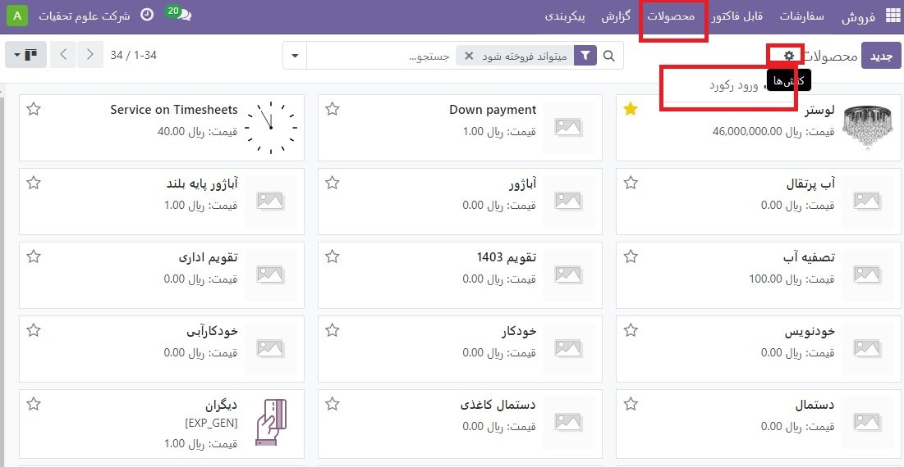
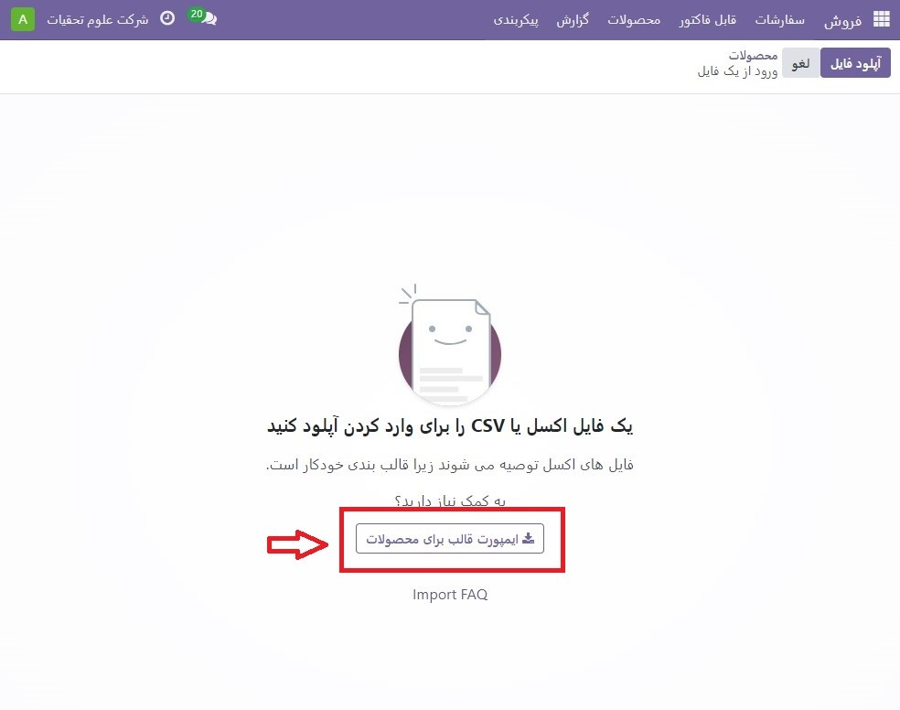
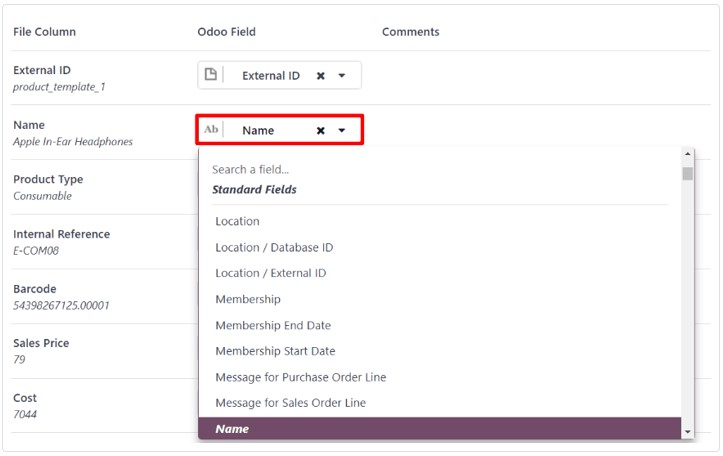
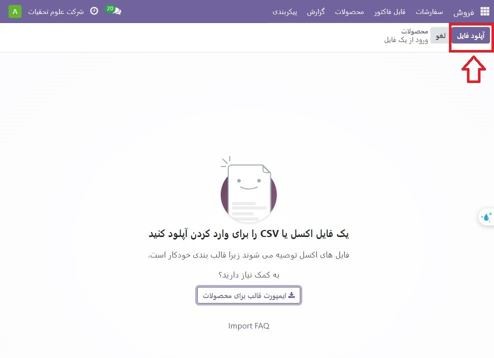
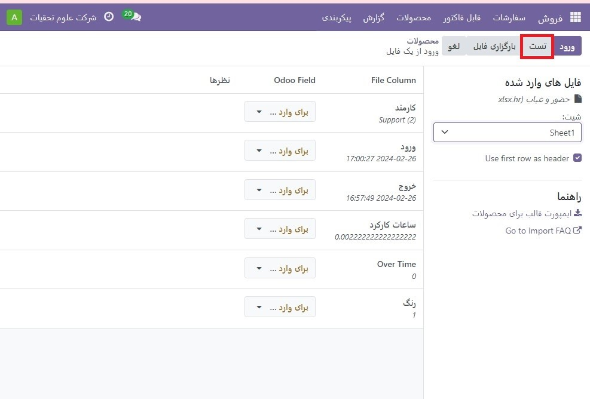
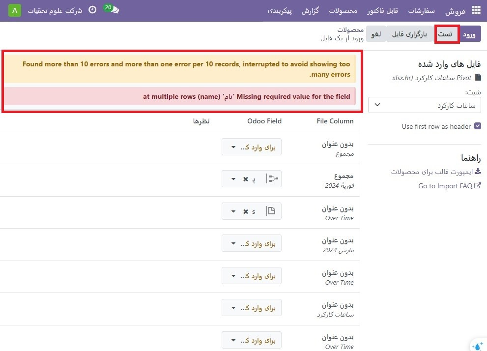
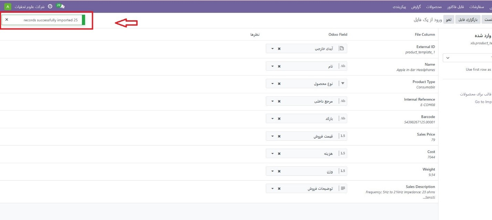
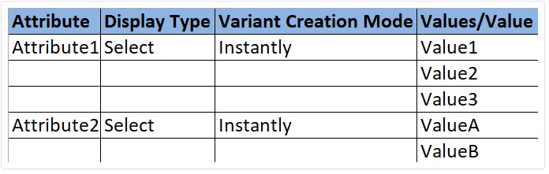
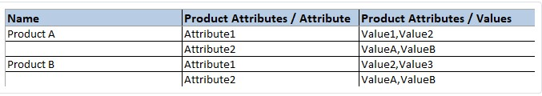

:nosearch:
:show-content:
:hide-page-toc:
:show-toc:

=======================================
واردات محصولات
=======================================

Odoo Sales الگویی برای وارد کردن محصولات با دسته بندی ها و انواع مختلف ارائه می دهد که می تواند با هر نرم افزار صفحه گسترده (Microsoft Excel، OpenOffice، Google Sheets و غیره) باز و ویرایش شود.

هنگامی که این صفحه گسترده به درستی پر شود، می توان آن را به سرعت در پایگاه داده Odoo آپلود کرد. هنگام آپلود، آن محصولات فوراً در کاتالوگ محصول اضافه، قابل دسترسی و ویرایش می شوند.

وارد کردن قالب
------------------------------------------------
برای وارد کردن محصولات با دسته ها و انواع، باید الگوی واردات برای محصولات دانلود شود. پس از دانلود، می توان الگو را تنظیم و سفارشی کرد و سپس در پایگاه داده Odoo بارگذاری کرد.

برای دانلود الگوی واردات ضروری، به برنامه **فروش ‣ محصولات ‣ محصولات** بروید. در صفحه محصولات، روی نماد ⚙️ (چرخ‌دنده) در گوشه سمت چپ بالا کلیک کنید. با انجام این کار یک منوی کشویی نمایان می شود.

از این منوی کشویی گزینه ورود رکورد را انتخاب کنید.

با انتخاب رکوردهای واردات صفحه جداگانه ای با پیوندی برای دانلود الگوی واردات برای محصولات نمایان می شود. برای دانلود قالب روی آن لینک کلیک کنید.

پس از اتمام دانلود قالب، فایل صفحه گسترده را باز کنید تا آن را سفارشی کنید.

قالب واردات محصول را سفارشی کنید
--------------------------------------------------
هنگامی که قالب واردات دانلود و باز شد، زمان آن رسیده است که محتوای آن را اصلاح کنید. با این حال، قبل از ایجاد هر گونه تغییر، چند عنصر وجود دارد که باید در طول فرآیند در نظر داشته باشید:

با خیال راحت هر ستونی را که لازم نمی بینید حذف کنید. اما، اکیداً توصیه می شود که ستون مرجع داخلی باقی بماند.

اگرچه اجباری نیست، داشتن یک شناسه منحصر به فرد در ستون مرجع داخلی برای هر محصول می تواند در بسیاری از موارد مفید باشد. این حتی می تواند از صفحات گسترده نرم افزار قبلی باشد تا انتقال به Odoo را آسان کند.

.. example::

    هنگام به‌روزرسانی محصولات وارداتی، می‌توان یک فایل را چندین بار بدون ایجاد موارد تکراری وارد کرد و در نتیجه کارایی و سادگی مدیریت محصول وارداتی را افزایش داد.

برچسب های ستون هایی را که قرار است وارد شوند تغییر ندهید. در غیر این صورت، Odoo آنها را نمی شناسد و کاربر را مجبور می کند تا به صورت دستی آنها را روی صفحه واردات نقشه برداری کند.

در صورت تمایل می توانید ستون های جدیدی را به صفحه گسترده الگو اضافه کنید. با این حال، برای اضافه شدن، آن فیلدها باید در Odoo وجود داشته باشند. اگر Odoo نمی تواند نام ستون را با یک فیلد مطابقت دهد، می توان آن را به صورت دستی در طول فرآیند واردات مطابقت داد.

در طول فرآیند وارد کردن الگوی تکمیل‌شده، Odoo صفحه‌ای را نشان می‌دهد که همه عناصر صفحه‌گسترده الگوی محصول جدید پیکربندی‌شده را نشان می‌دهد که با ستون فایل، فیلد Odoo و نظرات جدا شده‌اند.

برای تطبیق دستی نام ستون با فیلدی در Odoo، روی منوی کشویی **Odoo Field** در کنار ستون فایل که نیاز به تنظیم دستی دارد، کلیک کنید و فیلد مناسب را از آن منوی کشویی انتخاب کنید

وارد کردن  قالب محصول بصورت اکسل
-----------------------------------------------------------
پس از سفارشی کردن اکسل قالب محصول، به صفحه واردات محصول Odoo، جایی که لینک دانلود الگو پیدا می شود، برگردید و روی دکمه آپلود فایل در گوشه سمت چپ بالا کلیک کنید.

سپس، یک پنجره پاپ آپ ظاهر می شود که در آن فایل اکسل قالب محصول تکمیل شده باید انتخاب شده و در Odoo آپلود شود.

پس از آن، Odoo صفحه‌ای را نشان می‌دهد که تمام عناصر اکسل قالب محصول جدید پیکربندی شده را به نمایش می‌گذارد که با ستون فایل، فیلد Odoo و نظرات جدا شده‌اند.

از اینجا، در صورت لزوم، ستون فایل را می توان به صورت دستی به یک **Odoo Field** اختصاص داد.

برای اینکه مطمئن شوید همه چیز مناسب است و تمام ستون ها و فیلدها به طور دقیق ردیف شده اند، روی دکمه تست در گوشه سمت چپ بالا کلیک کنید.
اگر همه چیز ردیف شده و به درستی اعمال شود، Odoo یک بنر آبی در بالای صفحه نشان می دهد و به کاربر اطلاع می دهد که همه چیز معتبر به نظر می رسد.

در این مرحله، تمام محصولات تازه وارد شده از طریق صفحه محصولات قابل دسترسی و ویرایش هستند.

فیلدها، ویژگی‌ها و انواع رابطه را وارد کنید
-----------------------------------------------------------------------
توجه به این نکته مهم است که یک شی Odoo همیشه با بسیاری از اشیاء دیگر مرتبط است. برای مثال، یک محصول به دسته‌بندی‌های محصول، ویژگی‌ها، فروشندگان و چیزهایی از این نوع مرتبط است. این پیوندها / اتصالات به عنوان روابط شناخته می شوند.

.. tip::
    برای وارد کردن روابط محصول، رکوردهای شی مرتبط باید ابتدا از فهرست فهرست خودشان وارد شوند.

زمینه های رابطه
--------------------------------------------
در فرم های محصول در Odoo، تعدادی فیلد وجود دارد که می توان آنها را در هر زمان تغییر داد و سفارشی کرد. این فیلدها در زیر هر برگه در فرم محصول یافت می شوند. در حالی که این فیلدها به راحتی مستقیماً در فرم محصول قابل ویرایش هستند، می توان آنها را از طریق واردات محصول نیز تغییر داد.

همانطور که گفته شد، فیلدهای رابطه با این ماهیت تنها در صورتی می توانند برای محصولات وارد شوند که از قبل در پایگاه داده وجود داشته باشند. به عنوان مثال، اگر کاربر تلاش کند محصولی را با یک نوع محصول وارد کند، این محصول تنها می تواند یکی از انواع محصولات از پیش پیکربندی شده موجود در پایگاه داده باشد (به عنوان مثال محصول قابل ذخیره، قابل مصرف، و غیره).

برای وارد کردن اطلاعات یک فیلد رابطه در اکسل قالب واردات محصول، نام فیلد را به‌عنوان نام/عنوان ستون در اکسل اضافه کنید. سپس در خط تولید مناسب، گزینه فیلد رابطه مورد نظر را اضافه کنید.

هنگامی که تمام اطلاعات فیلد رابطه مورد نظر وارد شد، صفحه گسترده را ذخیره کنید و آن را طبق فرآیند ذکر شده در بالا به پایگاه داده وارد کنید **(برنامه فروش ‣ محصولات ‣ محصولات ‣ ⚙️ نماد (چرخ دنده) ‣ ثبت رکوردها ‣ آپلود فایل)**.

پس از آپلود اکسل با اطلاعات فیلد رابطه جدید پیکربندی شده، روی Import کلیک کنید و Odoo به صفحه محصولات باز می گردد.

هنگامی که محصولات تازه تغییر/تغییر شده، به همراه اطلاعات فیلد رابطه جدید، وارد و آپلود شدند، آن اطلاعات جدید را می توان در صفحه محصولات یافت.

صفات و ارزش ها
-------------------------------------
Odoo همچنین به کاربران اجازه می دهد تا ویژگی ها و مقادیر محصول را وارد کنند که می تواند برای محصولاتی که از قبل در پایگاه داده وجود دارد و/یا با محصولات وارداتی استفاده شود.

برای وارد کردن ویژگی‌ها و مقادیر، یک اکسل یا فایل CSV جداگانه که به ویژگی‌ها و مقادیر اختصاص داده شده است، باید قبل از استفاده برای محصولات دیگر وارد و آپلود شود.

نام ستون‌ها/عناوین اکسل ویژگی‌ها و مقادیر باید به شرح زیر باشد: ویژگی، نوع نمایش، حالت ایجاد متغیر، و مقادیر / ارزش.

   - ویژگی: نام ویژگی (به عنوان مثال اندازه).

   - نوع نمایش: نوع نمایشگر مورد استفاده در پیکربندی محصول. سه گزینه نوع نمایش وجود دارد:

   - رادیو: مقادیری که به صورت دکمه های رادیویی نمایش داده می شوند

   - انتخاب: مقادیر نمایش داده شده در لیست انتخاب

   - رنگ: مقادیری که به عنوان انتخاب رنگ مشخص می شوند

   - حالت ایجاد متغیر: نحوه ایجاد انواع زمانی که روی یک محصول اعمال می شود. سه گزینه حالت ایجاد نوع وجود دارد: 

   - Instant: همه انواع ممکن به محض افزودن ویژگی و مقادیر آن به محصول ایجاد می شوند

   - به صورت پویا: هر گونه تنها زمانی ایجاد می شود که ویژگی ها و مقادیر مربوط به آن به یک سفارش فروش اضافه شود

   - Never: انواع هرگز برای ویژگی ایجاد نمی شوند

.. note::
    پس از استفاده از ویژگی حداقل در یک محصول، حالت ایجاد شده را نمی توان تغییر داد

    - Values/Value: مقادیر مربوط به ویژگی مربوطه. اگر چندین مقدار برای یک ویژگی وجود دارد، مقادیر باید در خطوط جداگانه در صفحه گسترده باشند.

انواع محصول
--------------------------------------------------------------------------
هنگامی که ویژگی ها و مقادیر محصول در پایگاه داده پیکربندی می شوند، می توان از آنها در اکسل واردات محصول برای افزودن اطلاعات و جزئیات بیشتر به محصولات وارد شده استفاده کرد.

برای وارد کردن محصولات با ویژگی‌ها و مقادیر محصول، اکسل الگوی واردات محصول باید با ستون‌های مشخصه‌های محصول/ویژگی، ویژگی‌های محصول/مقدارها و نام پیکربندی شود.

ستون‌های دیگری نیز می‌تواند وجود داشته باشد، اما این ستون‌ها برای واردات درست محصولات با انواع خاص مورد نیاز هستند.

   - نام: نام محصول

   - ویژگی های محصول / ویژگی: نام ویژگی

   - ویژگی های محصول / ارزش ها: مقادیر مربوط به ویژگی مربوطه

هنگامی که محصولات و انواع محصول مورد نظر وارد و در اکسل ذخیره شدند، زمان وارد کردن و آپلود آنها در Odoo است. برای انجام این کار، به برنامه فروش ‣ محصولات ‣ محصولات ‣ ⚙️ نماد (چرخ‌دنده) ‣ واردات سوابق ‣ آپلود فایل بروید.

پس از آپلود اکسل با محصولات جدید پیکربندی شده و انواع محصول، روی Import کلیک کنید و Odoo به صفحه محصولات باز می گردد. اینجاست که محصولات جدید اضافه شده را می توان پیدا کرد.

برای مشاهده و اصلاح ویژگی‌ها و انواع هر محصول، محصول مورد نظر را از صفحه محصولات انتخاب کنید و روی تب **Attributes & Variants** کلیک کنید.

.. seealso::
   - :doc:`product variants`