:nosearch:
:show-content:
:hide-page-toc:
:show-toc:

=======================================
تصاویر محصول با Google Images
=======================================

یک کلید API در Odoo یک کد منحصر به فرد است که به عنوان یک روش احراز هویت امن برای دسترسی و تعامل با خدمات وب Odoo عمل می کند. برای انجام اقدامات از طریق وب سرویس ها ضروری است و می توان از آن برای دستکاری و بازیابی داده ها از یک سیستم Odoo استفاده کرد. کلیدهای API برای اطمینان از یکپارچگی ایمن با سایر سیستم‌ها و دسترسی به حساب‌های کاربری مشابه رمز عبور بسیار مهم هستند. برای استفاده از یک کلید API در Odoo، باید آن را تولید کرده و به طور ایمن ذخیره کنید و با همان دقتی که یک رمز عبور دارد، از آن استفاده کنید. کلیدهای API از طریق بخش Preferences یا My Profile در Odoo قابل دسترسی هستند، جایی که می توانید آنها را مشاهده و مدیریت کنید. یک کلید API در Odoo یک کد منحصر به فرد است که به عنوان یک روش احراز هویت امن برای دسترسی و تعامل با سرویس های وب Odoo عمل می کند. برای انجام اقدامات از طریق وب سرویس ها ضروری است و می توان از آن برای دستکاری و بازیابی داده ها از یک سیستم Odoo استفاده کرد. کلیدهای API برای اطمینان از یکپارچگی ایمن با سایر سیستم‌ها و دسترسی به حساب‌های کاربری مشابه رمز عبور بسیار مهم هستند. برای استفاده از یک کلید API در Odoo، باید آن را تولید کرده و به طور ایمن ذخیره کنید و با همان دقتی که یک رمز عبور دارد، از آن استفاده کنید. کلیدهای API از طریق قسمت Preferences یا My Profile در Odoo قابل دسترسی هستند، جایی که می توانید آنها را مشاهده و مدیریت کنید.

داشتن تصاویر مناسب از محصول در Odoo به چند دلیل مفید است. با این حال، اگر بسیاری از محصولات نیاز به تصاویر داشته باشند، اختصاص دادن آنها می تواند بسیار زمان بر باشد.

خوشبختانه، با پیکربندی **API** جستجوی سفارشی Google در پایگاه داده Odoo، یافتن تصاویر محصول برای محصولات (بر اساس بارکد آنها) بسیار کارآمد است.

پیکربندی
----------------------------------------
برای استفاده از جستجوی سفارشی Google در پایگاه داده Odoo، هم پایگاه داده و هم **Google API** باید به درستی پیکربندی شوند.

.. tip::
    اکانت های رایگان گوگل به کاربران این امکان را می دهند که تا 100 عکس رایگان در روز انتخاب کنند. در صورت نیاز به مبلغ بالاتر، ارتقاء صورتحساب مورد نیاز است.

داشبورد Google API
------------------------------------------------

#. به صفحه Google Cloud Platform API & Services بروید تا اعتبارنامه API جستجوی سفارشی Google را ایجاد کنید. سپس با یک حساب کاربری گوگل وارد شوید. در مرحله بعد، با علامت زدن کادر و کلیک بر روی موافقت و ادامه، با شرایط خدمات آنها موافقت کنید.

#. از اینجا، یک پروژه API را برای ذخیره اعتبار انتخاب کنید (یا ایجاد کنید). با دادن یک نام پروژه به یاد ماندنی به آن شروع کنید، یک مکان (در صورت وجود) انتخاب کنید، سپس روی ایجاد کلیک کنید.

#. با انتخاب گزینه Credentials در نوار کناری سمت چپ، روی Create Credentials کلیک کنید و کلید API را از منوی کشویی انتخاب کنید.

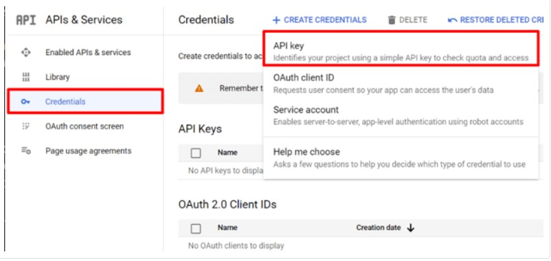

#. با انجام این کار، یک کلید API ایجاد شده، پنجره پاپ آپی را نشان می دهد که حاوی یک کلید API سفارشی است. کلید API خود را در پنجره پاپ آپ کپی و ذخیره کنید – بعداً استفاده خواهد شد. هنگامی که کلید کپی شد (و برای استفاده بعدی ذخیره شد)، روی Close کلیک کنید تا پنجره پاپ آپ حذف شود.

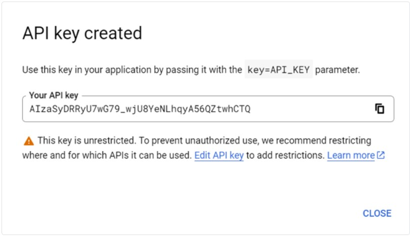

#. در این صفحه، **Custom Search API** را جستجو کرده و آن را انتخاب کنید.

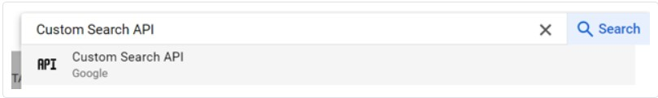

#. از صفحه Custom Search API، API را با کلیک روی **Enable** فعال کنید.

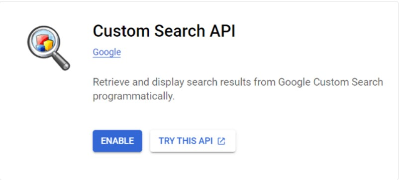

داشبورد جستجوی قابل برنامه ریزی گوگل
----------------------------------------------------

#. سپس به موتور جستجوی برنامه‌پذیر Google بروید و روی یکی از دکمه‌های شروع کار کلیک کنید. اگر قبلاً وارد نشده اید، با یک حساب Google وارد شوید.

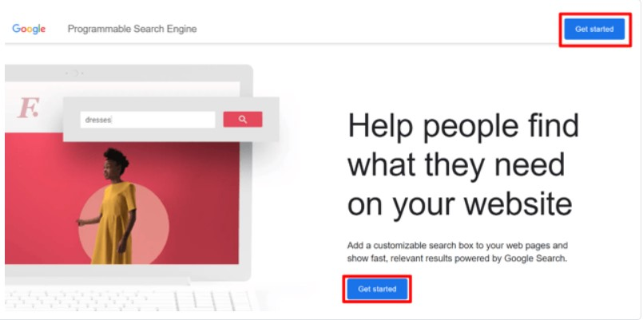

#. در فرم ایجاد یک موتور جستجوی جدید، نام موتور جستجو را به همراه آنچه که موتور باید جستجو کند، پر کنید و مطمئن شوید که جستجوی تصویر و جستجوی ایمن را فعال کنید.

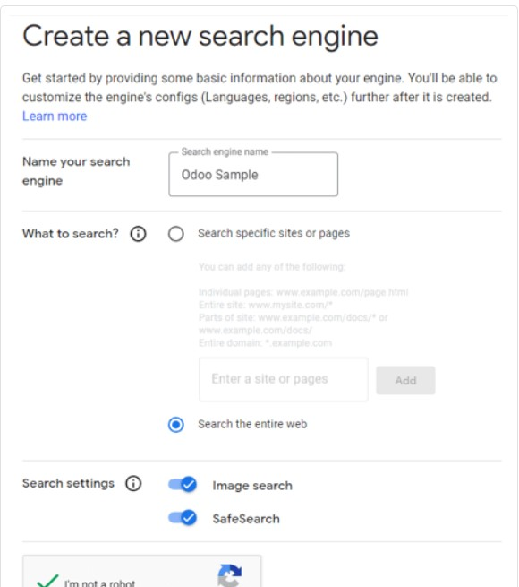

#. با کلیک بر روی ایجاد، فرم را اعتبار سنجی کنید.
#. با انجام این کار، صفحه جدیدی با عنوان: موتور جستجوی جدید شما ایجاد شده است، نمایان می شود.

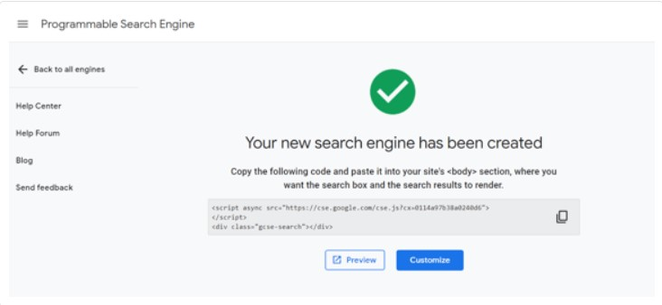

از این صفحه، روی **Customize** کلیک کنید تا صفحه **Overview ‣ Basic** باز شود. سپس شناسه را در قسمت شناسه موتور جستجو کپی کنید. این شناسه برای پیکربندی Odoo مورد نیاز است.

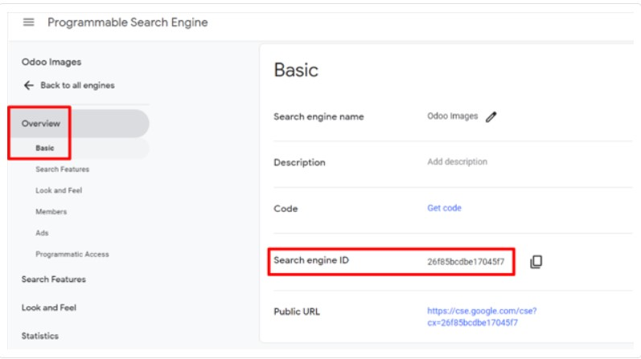

اودو
----------------------------------------
#. در پایگاه داده Odoo، به برنامه تنظیمات بروید و به بخش ادغامها بروید. از اینجا، کادر کنار تصاویرگوگل را علامت بزنید. سپس، روی ذخیره کلیک کنید.

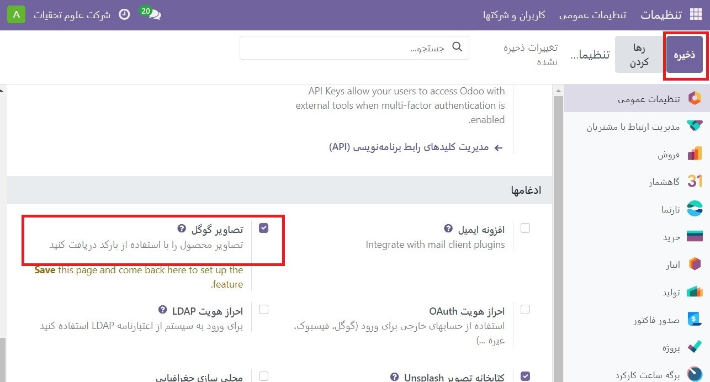

#. سپس به برنامه تنظیمات برگردید و به بخش ادغامها بروید. سپس، کلید API و شناسه موتور جستجو را در فیلدهای زیر ویژگی Google Images وارد کنید.
#. روی ذخیره کلیک کنید.

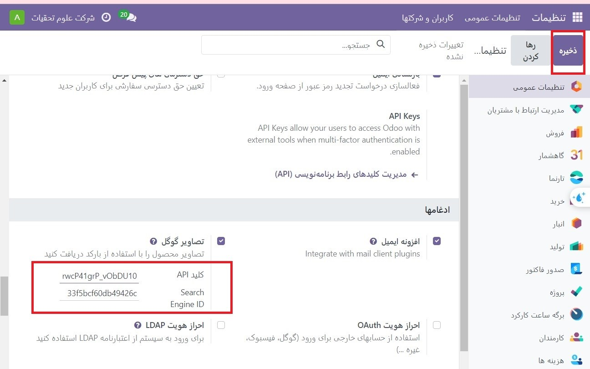

تصاویر محصول در Odoo با Google Custom Search API
--------------------------------------------------------------------------
افزودن تصاویر به محصولات در Odoo بر روی هر محصول یا نوع محصولی قابل انجام است. این فرآیند را می توان در هر برنامه Odoo که دسترسی به صفحات محصول را فراهم می کند (به عنوان مثال برنامه فروش، برنامه موجودی و غیره) تکمیل شود.

در زیر راهنمای گام به گام نحوه استفاده از **Google Custom Search API** برای اختصاص تصاویر به محصولات در Odoo با استفاده از برنامه فروش Odoo آورده شده است:

#. به صفحه محصولات در برنامه فروش بروید (برنامه فروش ‣ محصولات ‣ محصولات). یا، به صفحه انواع محصولات در برنامه فروش بروید (برنامه فروش ‣ محصولات ‣ انواع محصولات).

#. محصول مورد نظر را که نیاز به تصویر دارد انتخاب کنید.

.. note::
    فقط محصولات (یا انواع محصول) که دارای بارکد هستند، اما تصویر ندارند، پردازش می شوند.
    اگر محصولی با یک یا چند نوع انتخاب شود، هر گونه ای که با معیارهای ذکر شده مطابقت داشته باشد پردازش می شود.

#. روی نماد Action ⚙️ (چرخ‌دنده) در صفحه محصول کلیک کنید و از منوی باز شده گزینه Get Pictures from Google Images را انتخاب کنید.

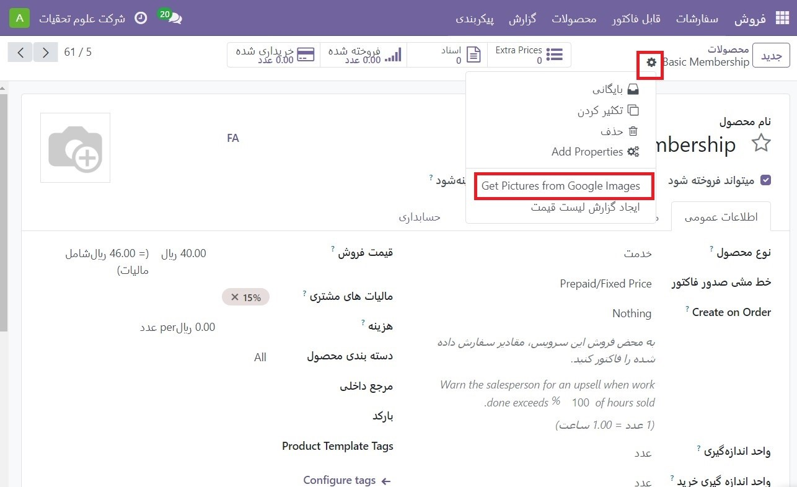

#. در پنجره پاپ آپی که ظاهر می شود، روی **Get Pictures** کلیک کنید.

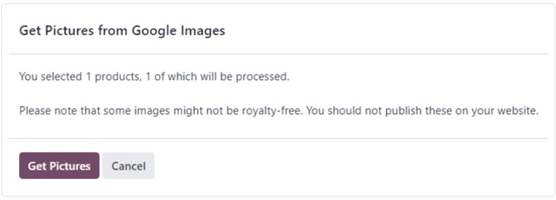

#. پس از کلیک کردن، تصویر(ها) به صورت تدریجی ظاهر می شوند.

.. tip::
    فقط 10 تصویر اول بلافاصله واکشی می شوند. اگر بیش از 10 مورد را انتخاب کرده باشید، بقیه به عنوان یک کار پس زمینه واکشی می شوند.

کار پس زمینه حدود 100 تصویر را در یک دقیقه پردازش می کند. اگر سهمیه مجاز توسط Google (چه با طرح رایگان یا پولی) به دست آید، کار پس‌زمینه به مدت 24 ساعت در حالت تعلیق قرار می‌گیرد. سپس، همان جایی که روز قبل متوقف شده بود، ادامه خواهد یافت.

