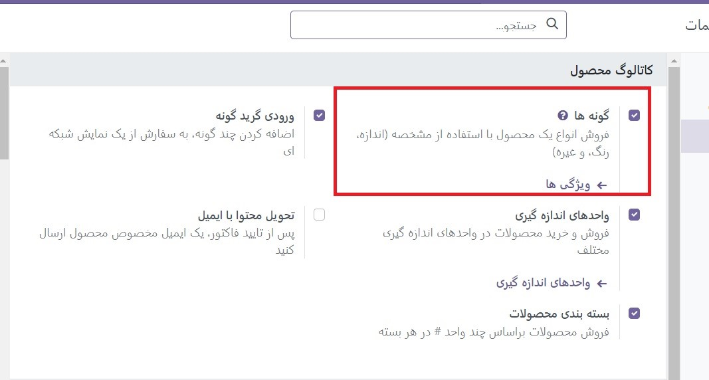
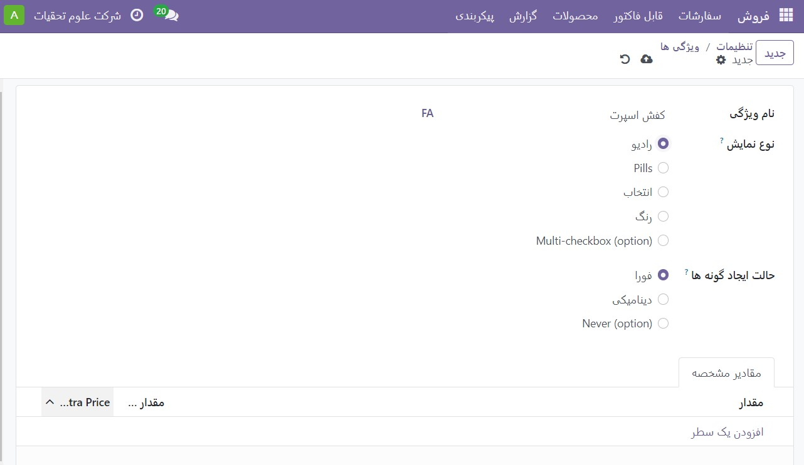
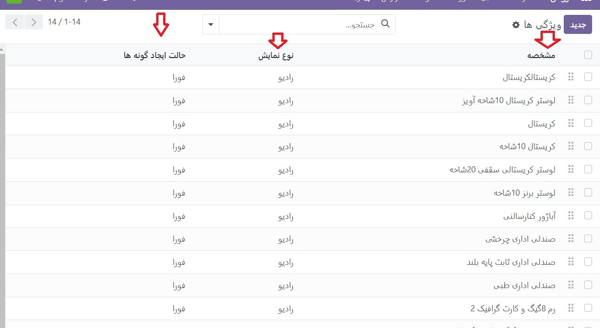
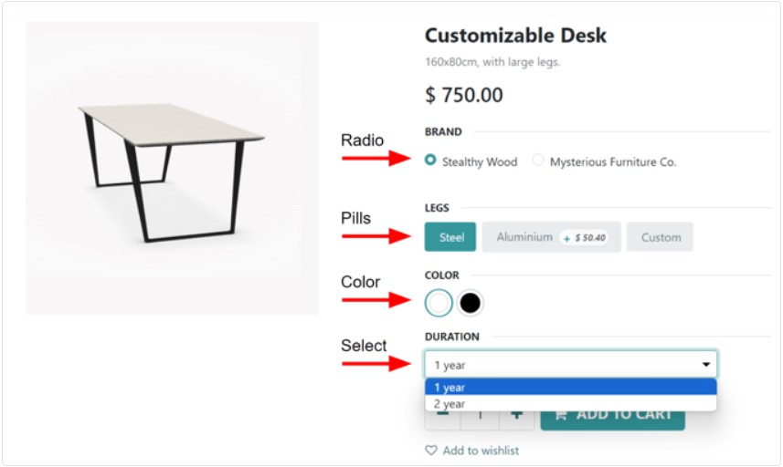
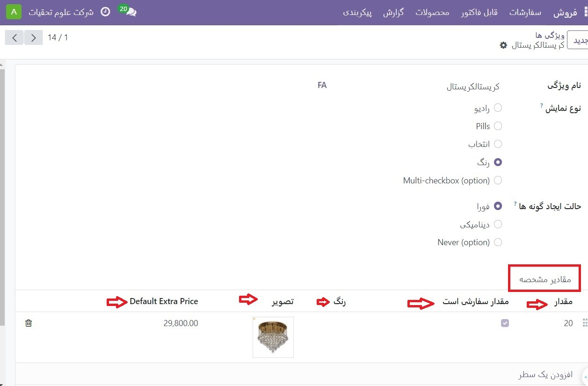
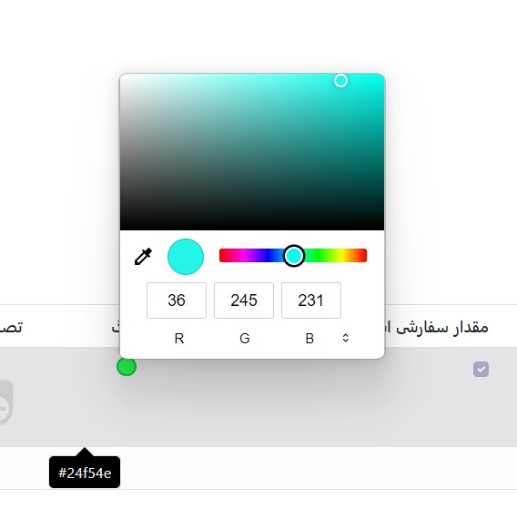
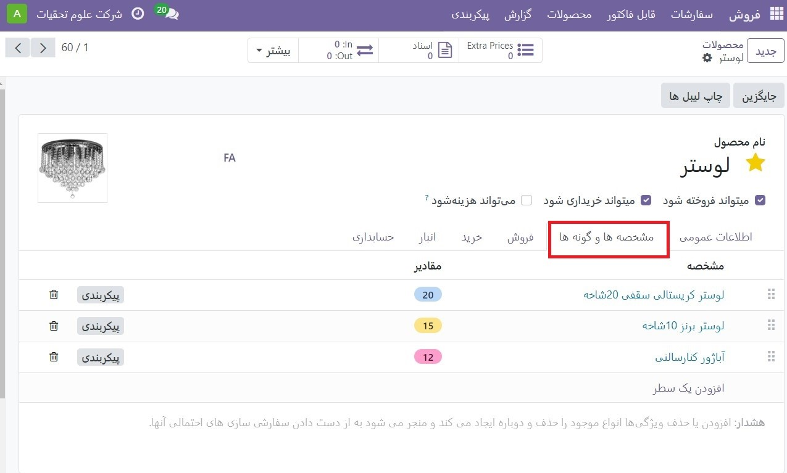
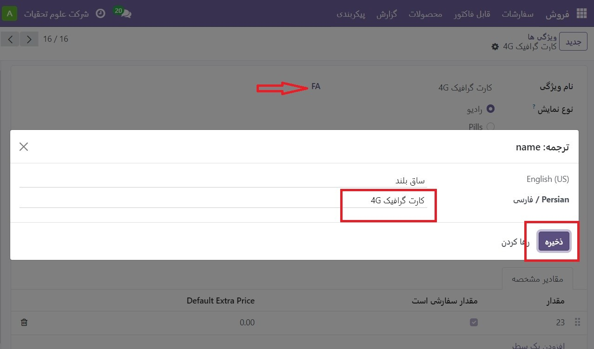
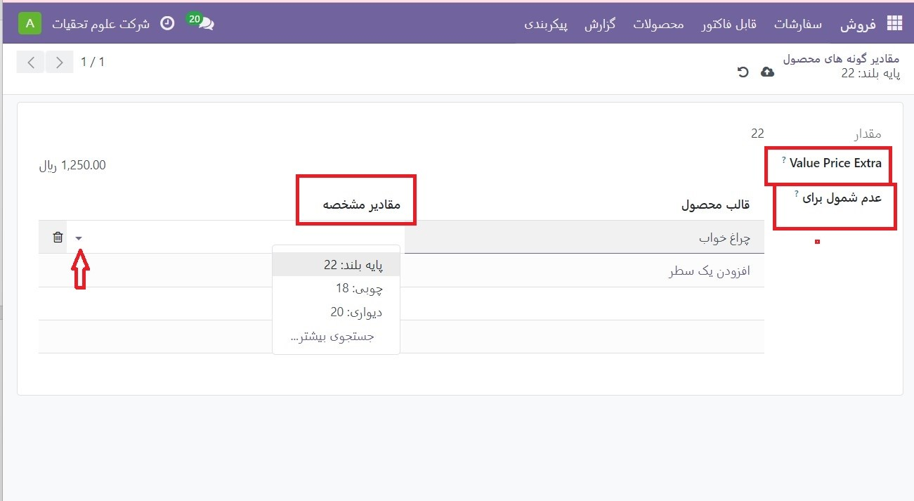
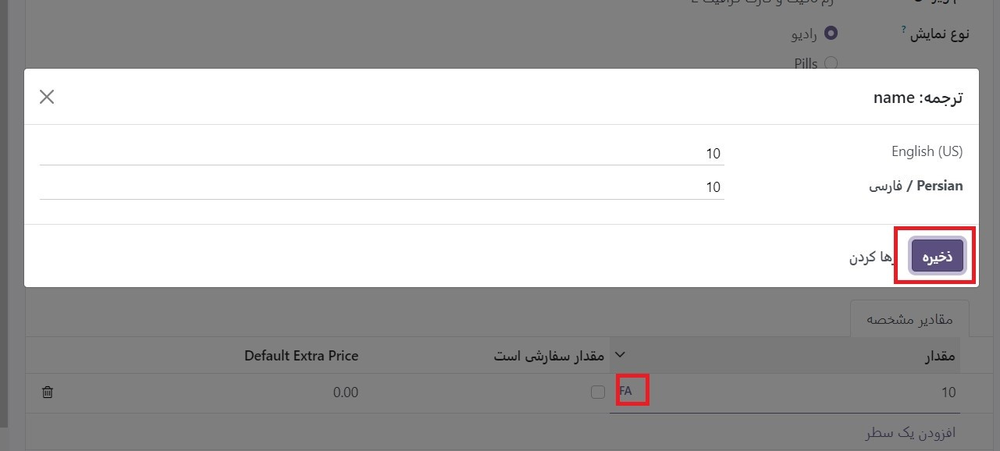

:nosearch:
:show-content:
:hide-page-toc:
:show-toc:

=======================================
انوع محصول
=======================================

انواع محصولات برای ارائه ویژگی‌ها و گزینه‌های مختلف برای مشتریان، مانند اندازه، سبک، یا رنگ، فقط برای نام بردن چند مورد استفاده می‌شود.

انواع محصولات را می توان از طریق الگوی محصول فردی آنها یا با پیمایش به صفحه انواع محصول یا ویژگی ها مدیریت کرد. همه این گزینه ها در برنامه فروش Odoo قرار دارند.

.. example::
    یک شرکت پوشاک انواع زیر را برای یکی از تی شرت های پرفروش خود تقسیم بندی می کند:

    - رنگ: آبی، قرمز، سفید، مشکی

    - سایز: S، M، L، XL، XXL

    - در اینجا، تی شرت الگوی محصول است و تی شرت: آبی، S یک نوع محصول خاص است.

    رنگ و اندازه صفات هستند و گزینه های مربوطه (مانند آبی و S) مقادیر هستند.

    در این مثال، در مجموع بیست نوع محصول مختلف وجود دارد: چهار گزینه رنگ ضرب در پنج گزینه اندازه. هر نسخه دارای تعداد موجودی، مجموع فروش و سایر رکوردهای مشابه در Odoo است.

پیکربندی
-------------------------------------------
برای استفاده از انواع محصول، تنظیمات (گونه ها یا مشخصه ها) Variants باید در برنامه Odoo Sales فعال شود
برای انجام این کار، به برنامه فروش ‣ پیکربندی ‣ تنظیمات بروید و بخش کاتالوگ محصولات را در بالای صفحه قرار دهید.در آن بخش، کادر را علامت بزنید تا ویژگی مشخصه ها فعال شود.

سپس روی **ذخیره** در بالای صفحه تنظیمات کلیک کنید.

ویژگی های
---------------------------------------
قبل از راه‌اندازی انواع محصول، باید ویژگی‌ها ایجاد شوند. برای ایجاد، مدیریت و اصلاح ویژگی‌ها، به برنامه **فروش ‣ پیکربندی ‣ ویژگی‌ها** بروید.

.. note::
    ترتیب ویژگی‌ها در صفحه ویژگی‌ها نشان می‌دهد که چگونه در صفحه پیکربندی محصول، داشبورد نقطه فروش و تجارت الکترونیک ظاهر شوند.

برای ایجاد یک ویژگی جدید از صفحه ویژگی ها، روی **جدید** کلیک کنید. با انجام این کار، یک فرم ویژگی های خالی را نشان می دهد که می تواند به روش های مختلفی سفارشی و پیکربندی شود.

در اینجا، مشخصه و نوع نمایش و حالت ایجاد در بالا نمایش داده می شود. به دنبال ویژگی های مرتبط مرتبط با دسته. این ویژگی‌ها را می‌توان به ترتیب اولویت‌های مطلوب کشیده و رها کرد.

ویژگی ها را می توان مستقیماً با کلیک روی افزودن یک خط نیز به دسته اضافه کرد.

در زیر قسمت نام ویژگی گزینه های نوع نمایش قرار دارند. نوع نمایش نحوه نمایش این محصول در فروشگاه آنلاین، داشبورد نقطه فروش و پیکربندی محصول را تعیین می کند.

گزینه های نوع نمایش عبارتند از:

    - رادیو: گزینه ها در یک لیست گلوله ای در صفحه محصول فروشگاه آنلاین ظاهر می شوند.

    - pills: گزینه ها به صورت دکمه های قابل انتخاب در صفحه محصول فروشگاه آنلاین ظاهر می شوند.

    - انتخاب کنید: گزینه‌ها در منوی کشویی در صفحه محصول فروشگاه آنلاین ظاهر می‌شوند.

    - رنگ: گزینه‌ها به صورت مربع‌های کوچک رنگی ظاهر می‌شوند که هر مجموعه کد رنگ HTML را در صفحه محصول فروشگاه آنلاین نشان می‌دهند.

فیلد حالت ایجاد گونه ها به Odoo اطلاع می‌دهد که چه زمانی یک نوع جدید را به‌طور خودکار پس از اضافه شدن یک ویژگی به محصول ایجاد کند.

   - فورا: به محض افزودن ویژگی ها و مقادیر به یک الگوی محصول، همه انواع ممکن را ایجاد می کند.

   - به صورت پویا: تنها زمانی که ویژگی ها و مقادیر مربوطه به یک سفارش فروش اضافه می شود، انواع را ایجاد می کند.

   - هرگز (گزینه): هرگز به طور خودکار انواع ایجاد نمی کند.

.. danger::
    پس از اضافه شدن به یک محصول، حالت ایجاد متغیرهای یک ویژگی قابل ویرایش نیست.

مقادیر صفت(مشخصه)
--------------------------------------
مقادیر مشخصه باید به تب **Attribute Values** اضافه شود. در صورت نیاز می توان مقادیر را در هر زمان به یک ویژگی اضافه کرد.

برای افزودن یک مقدار، روی **افزودن به سطر** در تب مقادیرصفت کلیک کنید.

سپس نام مقدار را در ستون مقدار وارد کنید. در مرحله بعد، اگر مقدار سفارشی است، کادر ستون ارزش سفارشی است را علامت بزنید (یعنی مشتری باید مشخصات منحصر به فردی را که مختص این مقدار خاص است ارائه کند).

.. tip::
    اگر گزینه نوع نمایش,رنگ انتخاب شده باشد، گزینه افزودن کد رنگ HTML در سمت راست خط ارزش ظاهر می‌شود تا فروشندگان و مشتریان راحت‌تر بدانند دقیقاً چه رنگی را انتخاب می‌کنند.

    .. image:: ./img/manageyourproducts/g15.jpg
        :align: center
        :alt: فروش

در این پنجره پاپ آپ، با کشیدن نوار لغزنده به یک رنگ خاص، و کلیک کردن بر روی قسمت رنگی به طور مستقیم در پنجره گرادیان رنگ، یک رنگ خاص را انتخاب کنید.

یا با کلیک کردن روی نماد قطره چکان و انتخاب رنگ دلخواه که در حال حاضر روی صفحه قابل کلیک است، رنگ خاصی را انتخاب کنید.

.. note::
    همچنین می‌توان با افزودن یک خط جدید و تایپ نام در تب مشخصه ها، ویژگی‌ها را مستقیماً از الگوی محصول ایجاد کرد.

هنگامی که یک ویژگی به یک محصول اضافه می شود، آن محصول از طریق دکمه هوشمند محصولات مرتبط، فهرست شده و قابل دسترسی است. آن دکمه **تمام محصولات موجود** در پایگاه داده را که در حال حاضر از آن ویژگی استفاده می کنند، فهرست می کند

انواع محصول
------------------------------------------------
هنگامی که یک ویژگی ایجاد شد، از ویژگی (و مقادیر آن) برای ایجاد یک نوع محصول استفاده کنید. برای انجام این کار، به برنامه فروش ‣ محصولات ‣ محصولات بروید و یک محصول موجود را انتخاب کنید تا فرم آن محصول مورد نظر را مشاهده کنید. یا، برای ایجاد یک محصول جدید، که یک نوع محصول به آن اضافه شود، روی **ایجاد** کلیک کنید.

در فرم محصول، روی **تب مشخصه ها وگونه ها** کلیک کنید تا ویژگی ها و مقادیر محصول را مشاهده، مدیریت و تغییر دهید.

برای افزودن یک ویژگی به یک محصول، و مقادیر مشخصه بعدی، روی افزودن یک سطر در تب **(مشخصه ها وگونه ها)** کلیک کنید. سپس از منوی کشویی که ظاهر می شود، ویژگی مورد نظر را انتخاب کنید.

.. note::
    ویژگی ها را می توان مستقیماً از برگه ویژگی ها و انواع یک فرم محصول ایجاد کرد. برای انجام این کار، شروع به تایپ نام ویژگی جدید در فیلد خالی کنید و از منوی کشویی کوچکی که ظاهر می‌شود.

با کلیک بر روی **ایجاد** ویژگی ایجاد می شود که می تواند بعداً سفارشی شود. 

پس از انتخاب یک ویژگی در ستون ویژگی، از طریق منوی کشویی موجود در ستون مقادیر، به انتخاب مقادیر مشخصه برای اعمال به محصول ادامه دهید.

.. tip::
    محدودیتی برای اضافه کردن مقادیر وجود ندارد.

    در اینجا، نام مقدار خاص، شاخص رنگ HTML (در صورت وجود)، و ارزش اضافی قیمت قابل مشاهده است.

.. tip::
    ارزش اضافی قیمت نشان دهنده افزایش قیمت فروش در صورت انتخاب ویژگی است.

در صفحه جزئیات نوع محصول خاص، فیلدهای مقدار و **Value Price Extra** به همراه یک قسمت عدم شمول برای یافت می شوند.

در قسمت(عدم شمول برای) Exclude for، الگوهای محصول مختلف و **مقادیر مشخصه** خاصی را می توان اضافه کرد. هنگامی که اضافه می شود، این مقدار مشخصه خاص از آن محصولات خاص حذف می شود.

وقتی روی یک مقدار روی صفحه **مقادیر متغیر محصول** کلیک می‌شود، Odoo صفحه جداگانه‌ای را نشان می‌دهد که جزئیات مربوط به آن مقدار را به تفصیل نشان می‌دهد

انواع دکمه هوشمند
------------------------------------------------
هنگامی که یک محصول دارای ویژگی‌ها و گونه‌هایی است که در برگه**(گونه ها ومشخصه ها) Attributes & Variants پیکربندی شده‌اند، یک دکمه هوشمند Variants در بالای فرم محصول ظاهر می‌شود. دکمه هوشمند Variants نشان می دهد که در حال حاضر چند نوع برای آن محصول خاص پیکربندی شده است.
