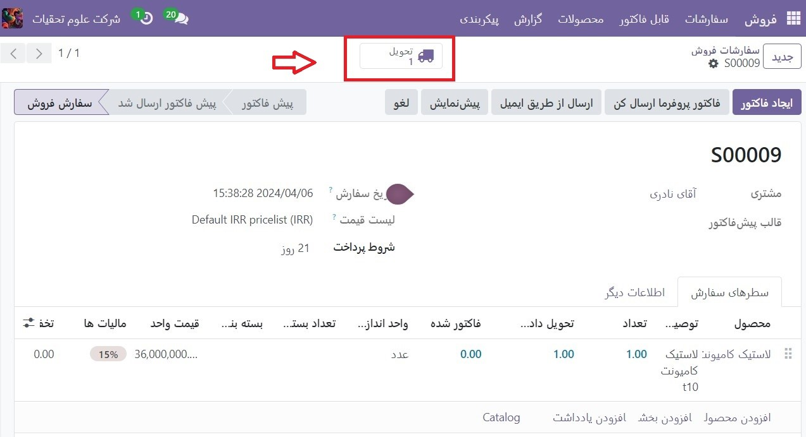
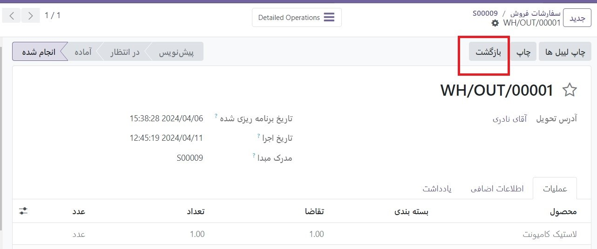
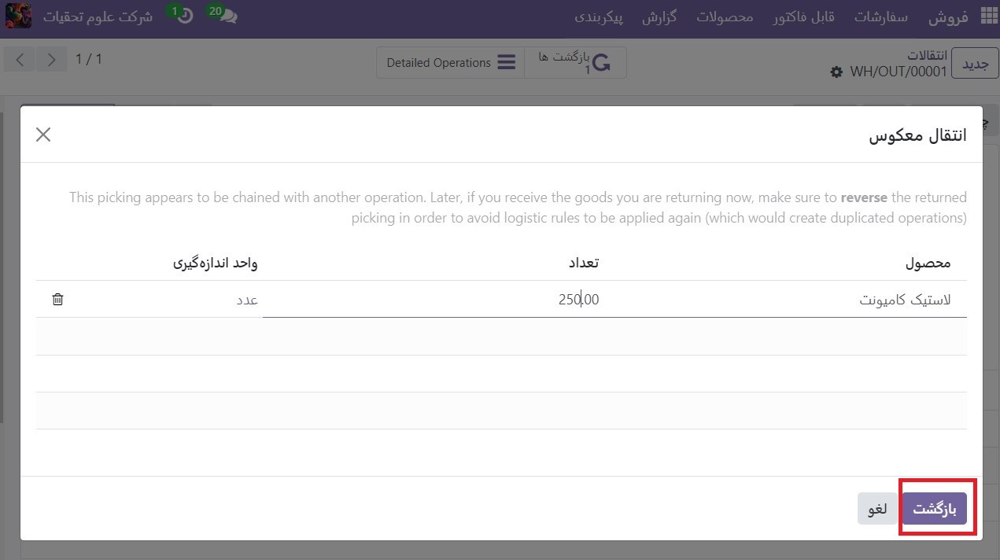
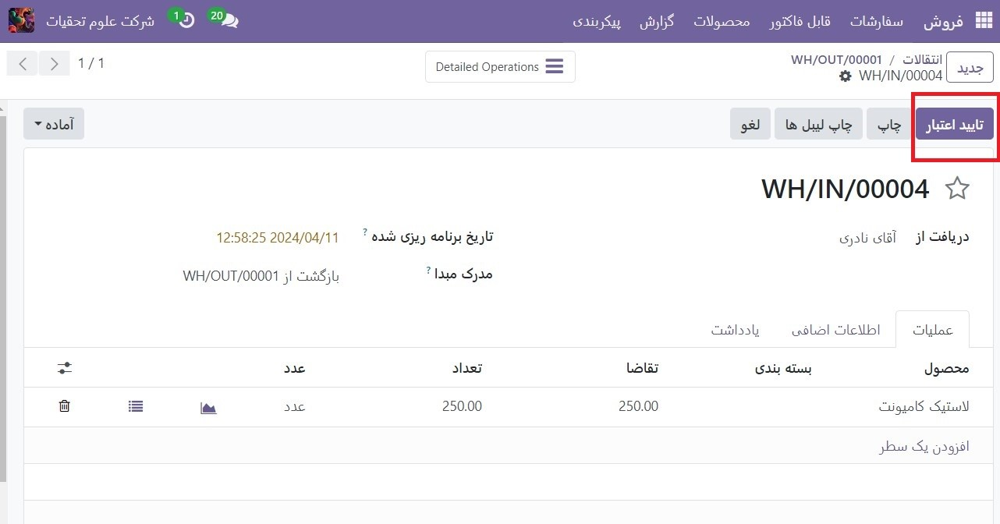
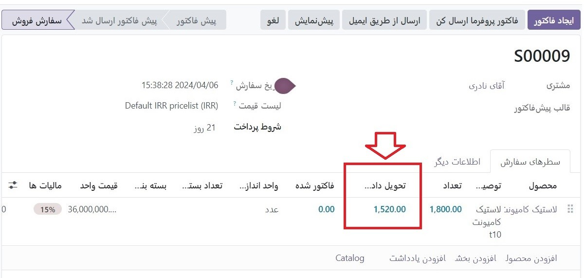
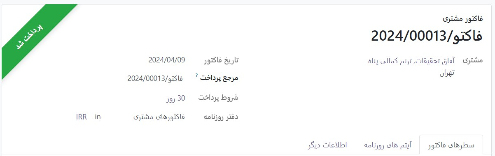
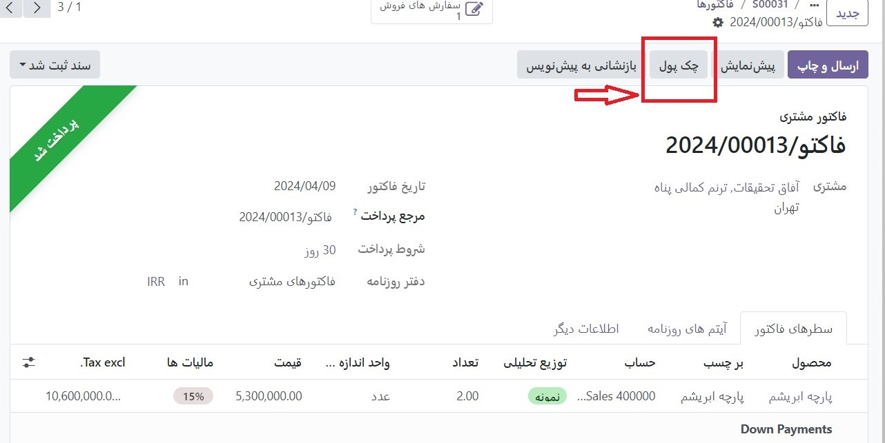
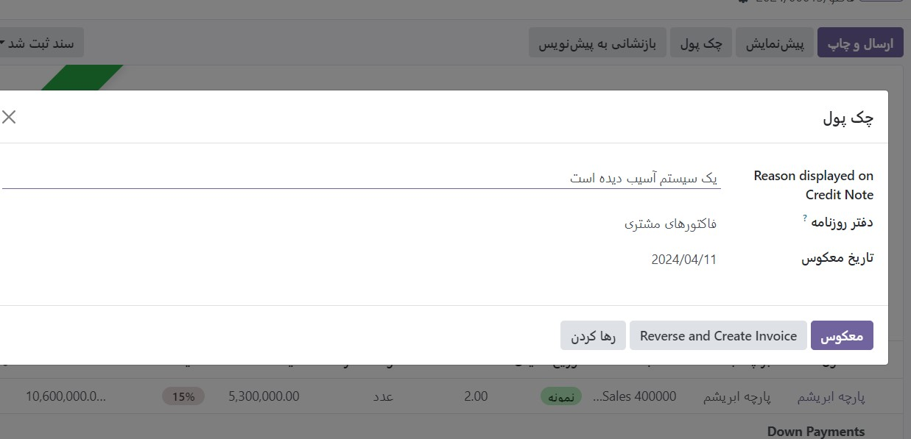

:nosearch:
:show-content:
:hide-page-toc:
:show-toc:

=======================================
بازده و بازپرداخت
=======================================

برنامه فروش Odoo دو روش مختلف برای پردازش بازگشت ارائه می دهد. روش مورد استفاده بستگی به ارسال یا عدم ارسال فاکتور دارد.

قبل از فاکتور
---------------------------------
زمانی که مشتری تصمیم می‌گیرد قبل از ارسال فاکتور یا اعتبارسنجی، محصولی را بازگرداند، با استفاده از انتقال معکوس، برگشت‌ها تکمیل می‌شوند.

.. note::
    برای استفاده از انتقال معکوس، برنامه Inventory(انبار) باید نصب شده باشد.

برای شروع بازگشت قبل از صورتحساب، به برنامه فروش بروید، سفارش فروش مورد نظر را انتخاب کنید و روی دکمه هوشمند **تحویل** کلیک کنید تا سفارش تحویل مرتبط باز شود.

در سفارش تحویل معتبر، روی **بازگشت** کلیک کنید.

با این کار یک پنجره پاپ آپ **انتقال معکوس** باز می شود

به طور پیش فرض، مقدار با مقادیر تأیید شده از سفارش تحویل مطابقت دارد. در صورت لزوم مقادیر را به روز کنید. روی نماد 🗑️ (سطل زباله) در کنار یک مورد خط کلیک کنید تا آن را از بازگشت حذف کنید.
در مرحله بعد، برای تأیید بازگشت، روی **بازگشت** کلیک کنید. این یک عملیات انبار جدید برای محصول(های) برگشتی دریافتی ایجاد می کند.

تیم انبار پس از دریافت مرجوعی، عملیات انبار را با کلیک بر روی **تاییداعتبار** تایید می کند. سپس، در سفارش فروش اصلی، مقدار تحویل داده شده به روز می شود تا تفاوت بین مقادیر تأیید شده اولیه و مقادیر برگشتی را منعکس کند.

هنگامی که یک فاکتور ایجاد می شود، مشتری فقط برای محصولاتی که نگهداری می کند، در صورت وجود، فاکتور دریافت می کند.

پس از فاکتور
---------------------------------------
گاهی اوقات، مشتریان پس از دریافت و/یا پرداخت فاکتور، کالایی را برمی گردانند. در این موارد، بازگشت فقط با استفاده از انتقال معکوس کافی نیست زیرا فاکتورهای تأیید شده یا ارسال شده قابل تغییر نیستند.

با این حال، انتقال معکوس می‌تواند همراه با یادداشت‌های اعتباری برای تکمیل بازگشت مشتری استفاده شود.

برای شروع بازگشت پس از فاکتور، به سفارش فروش مربوطه در برنامه فروش بروید.

اگر پرداختی در سفارش فروش ثبت شده باشد، جزئیات پرداخت در چت ظاهر می شود و فاکتور **(قابل دسترسی از طریق دکمه هوشمند فاکتورها)** دارای بنر سبز رنگ پرداخت شد است.

از سفارش فروش، روی دکمه هوشمند **تحویل** کلیک کنید تا سفارش تحویل معتبر را مشاهده کنید. سپس بر روی بازگشت کلیک کنید تا پنجره بازشو انتقال معکوس باز شود.

در مرحله بعد، محصول و/یا مقدار را در صورت نیاز برای بازگشت ویرایش کنید. سپس روی **بازگشت** کلیک کنید. این یک عملیات انبار جدید برای محصول(های) برگشتی دریافتی ایجاد می کند، که پس از دریافت بازگشت با کلیک بر روی **تأیید اعتبار**، توسط تیم انبار تأیید می شود.

سپس، در سفارش فروش، مقدار تحویل داده شده به روز می شود تا تفاوت بین مقادیر تأیید شده اولیه و مقادیر برگشتی را منعکس کند.

برای پردازش بازپرداخت، به فاکتور مربوطه بروید **(از سفارش فروش، روی دکمه هوشمند فاکتورها کلیک کنید)**. سپس روی دکمه Credit Note (چک پول)در بالای فاکتور معتبر کلیک کنید.

با انجام این کار، یک فرم پاپ آپ (چک پول)Credit Note ظاهر می شود

با وارد کردن یک دلیل نمایش داده شده در **(چک پول)Credit Note** و یک دفتر روزنامه برای پردازش اعتبار شروع کنید. سپس، یک تاریخ معکوس خاص را انتخاب کنید.

پس از پر شدن اطلاعات، بر روی معکوس یا **Reverse** و **Create Invoice** کلیک کنید. سپس، در صورت نیاز، پیش نویس را ویرایش کنید.

در آخر برای تأیید اعتبار یادداشت، روی **تأیید** کلیک کنید.

