:nosearch:
:show-content:
:hide-page-toc:
:show-toc:

===================================================
از کیف پول الکترونیکی و کارت هدیه استفاده کنید
===================================================

با Odoo، مشتریان می توانند از کیف پول الکترونیکی و کارت های هدیه برای خرید آنلاین و در فروشگاه استفاده کنند.

برای فعال کردن کیف پول الکترونیکی و کارت‌های هدیه برای تجارت الکترونیک و نقطه فروش (PoS)، ابتدا تخفیف‌ها، وفاداری و کارت هدیه را در قسمت برنامه فروش ‣ پیکربندی ‣ تنظیمات ‣ قیمت فعال کنید. پس از فعال شدن، به برنامه **فروش ‣ محصولات ‣ کارت های هدیه و کیف پول الکترونیکی** بروید و یک برنامه کیف پول الکترونیکی یا کارت هدیه جدید ایجاد کنید.

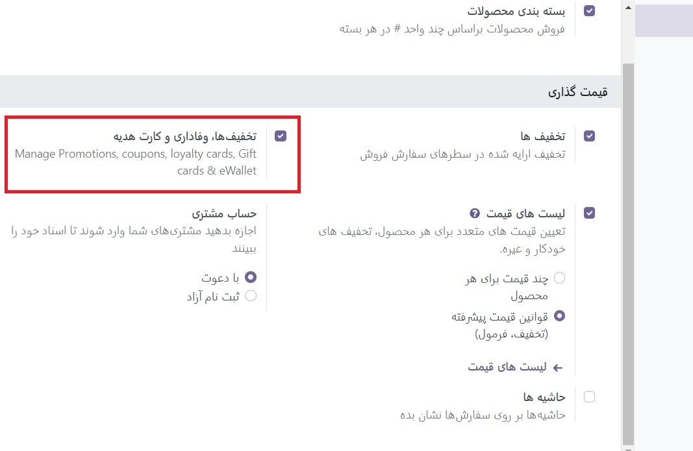

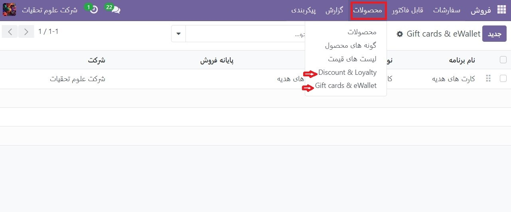

پس از تکمیل، یک بنر آبی با این مضمون: شما اعتبارات برجسته ای برای این مشتری دارید. می توانید آنها را برای علامت گذاری این فاکتور به عنوان پولی تخصیص دهید. در بالای صفحه ظاهر می شود

کیف پول الکترونیکی
-------------------------------------------
کیف پول الکترونیکی به مشتریان این امکان را می دهد که اعتبارات خود را در حساب آنلاین خود ذخیره کنند و از این اعتبارات به عنوان روش پرداخت هنگام خرید اقلام در یک فروشگاه آنلاین یا یک فروشگاه آجری استفاده کنند. کیف پول الکترونیکی همچنین می تواند برای متمرکز کردن چندین کارت هدیه استفاده شود.

قبل از ایجاد یک برنامه کیف پول الکترونیکی، لازم است یک محصول شارژی کیف پول الکترونیکی ایجاد کنید. شارژها ارزش های اعتباری دیجیتال از پیش تعریف شده ای هستند که در ازای معادل آن به ارز واقعی به کیف پول الکترونیکی اضافه می شوند. سپس از این اعتبارات می توان به عنوان روش پرداخت در فروشگاه تجارت الکترونیک یا PoS استفاده کرد. مقادیر بالا می تواند مقادیر متفاوتی داشته باشد.

.. example::
    یک شارژ 50 دلاری را می توان با 50 دلار خریداری کرد و همین مقدار اعتبار را به کیف پول الکترونیکی اضافه می کند

برای ایجاد یک محصول بالا، به برنامه **فروش ‣ محصولات ‣ محصولات** و ایجاد یک محصول جدید بروید. در قالب محصول، گزینه ها را به صورت زیر پیکربندی کنید:

   - نام محصول: نامی را برای محصول شارژ شده وارد کنید (مثلاً مانیتور)

   - قابل فروش: فعال است

   - نوع محصول: خدمت را انتخاب کنید

   - خط مشی صورتحساب: قیمت پیش پرداخت/ثابت را انتخاب کنید

   - ایجاد در سفارش: هیچ چیز را انتخاب کنید

   - قیمت فروش: مقدار شارژ را وارد کنید

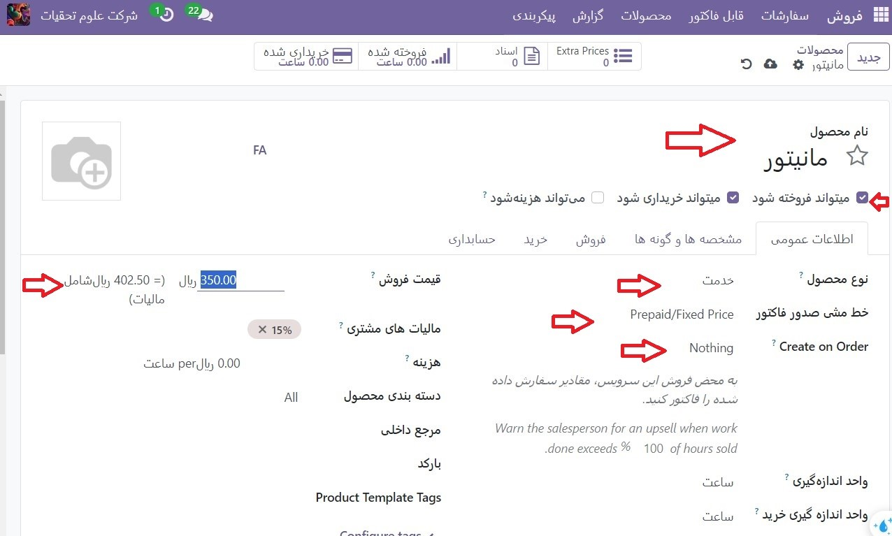

.. note::
    برای داشتن شارژهای کیف پول الکترونیکی با مقادیر مختلف، چندین محصول شارژی ایجاد کنید و قیمت فروش را بر این اساس تغییر دهید.

پس از ایجاد شارژ، به برنامه **فروش ‣ محصولات ‣ کارت های هدیه و کیف پول الکترونیکی** برای ایجاد یک برنامه کیف پول الکترونیکی بروید. گزینه های پیکربندی زیر در دسترس هستند:

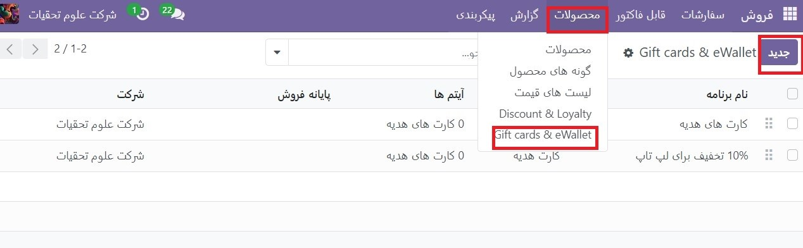

   #. نام برنامه: نامی برای برنامه کیف پول الکترونیکی وارد کنید
   #. نوع برنامه: کیف پول الکترونیکی را انتخاب کنید
   #. محصولات کیف پول الکتر.نیکی: شارژ کیف پول الکتر.نیکی را انتخاب کنید که قبلاً ایجاد شده است. در صورت ایجاد شارژ با مقادیر مختلف، این فرآیند را تکرار کنید.
   #. الگوی ایمیل: الگوی ایمیل مورد استفاده برای ایمیل ارسال شده به مشتری را انتخاب کنید. برای ایجاد یک الگوی جدید، روی فیلد کلیک کنید، جستجوی بیشتر را انتخاب کنید و سپس روی ایجاد کلیک کنید.
   #. ارز: ارز مورد استفاده برای برنامه کیف پول الکترونیکی را انتخاب کنید
   #. شرکت: شرکتی را انتخاب کنید که برنامه برای آن معتبر و در دسترس است
   #. Available On: برنامه هایی را انتخاب کنید که برنامه در آنها معتبر و در دسترس است
   #. Point of Sale: PoS را انتخاب کنید که برنامه در آن معتبر و در دسترس است. این فیلد را خالی بگذارید تا همه PoS ها را شامل شود.

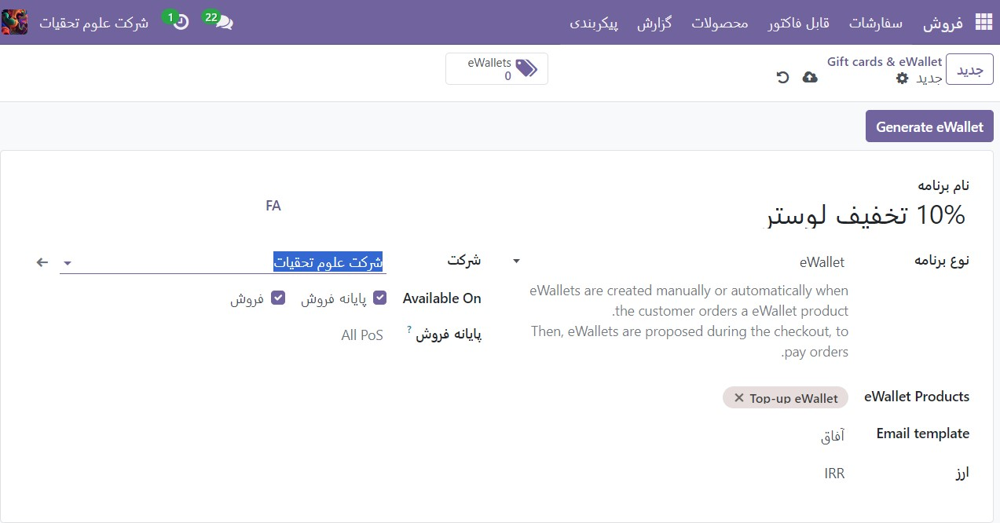

پس از پیکربندی برنامه، روی دکمه **Generate eWallet** در گوشه سمت چپ بالا کلیک کنید تا کیف پول الکترونیکی تولید شود. کیف پول الکترونیکی را می توان بر اساس مشتریان و/یا برچسب های مشتری تولید کرد. مقدار به طور خودکار با توجه به مشتریان و برچسب های مشتری انتخاب شده تطبیق داده می شود. سپس، مقدار **eWallet** را تنظیم کنید. در نهایت، در صورت وجود، دوره معتبرتا را تنظیم کنید.

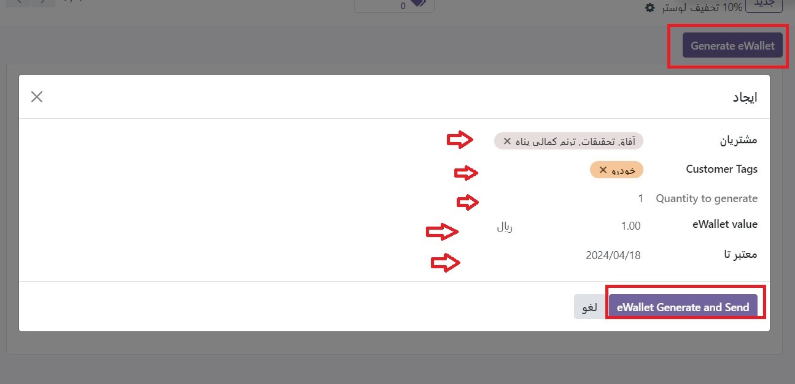

از طریق دکمه هوشمند eWallets در گوشه سمت راست بالا می‌توان به کیف‌های الکترونیکی تولید شده دسترسی داشت. از آنجا، کیف پول الکترونیکی را از طریق ایمیل یا پیوند URL ارسال یا به اشتراک بگذارید.

برای تغییر تاریخ انقضا، همکار یا موجودی، روی **کیف پول الکترونیکی** کلیک کنید. کد یک کیف پول الکترونیکی قابل تغییر، حذف یا تکرار نیست.

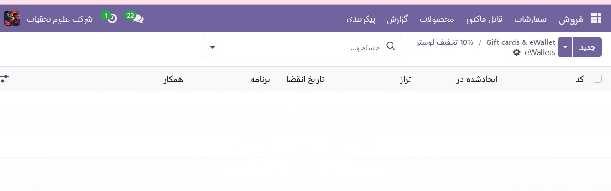

کارت هدیه
------------------------------------
کارت های هدیه را می توان توسط مشتریان خریداری کرد و به نوبه خود به عنوان یک روش پرداخت هنگام پرداخت در فروشگاه تجارت الکترونیک یا PoS استفاده کرد.

قبل از ایجاد یک برنامه کارت هدیه جدید، لازم است ابتدا کارت های هدیه را به عنوان محصول ایجاد کنید. برای انجام این کار، به برنامه **فروش ‣ محصولات ‣ محصولات** بروید و یک محصول ایجاد کنید. در قالب محصول، گزینه ها را به صورت زیر پیکربندی کنید:

   - نام محصول: یک نام برای محصول کارت هدیه وارد کنید
   - قابل فروش: فعال است
   - نوع محصول: سرویس را انتخاب کنید
   - خط مشی صورتحساب: قیمت پیش پرداخت/ثابت را انتخاب کنید
   - ایجاد در سفارش: هیچ چیز را انتخاب کنید
   - قیمت فروش: مبلغ کارت هدیه را وارد کنید

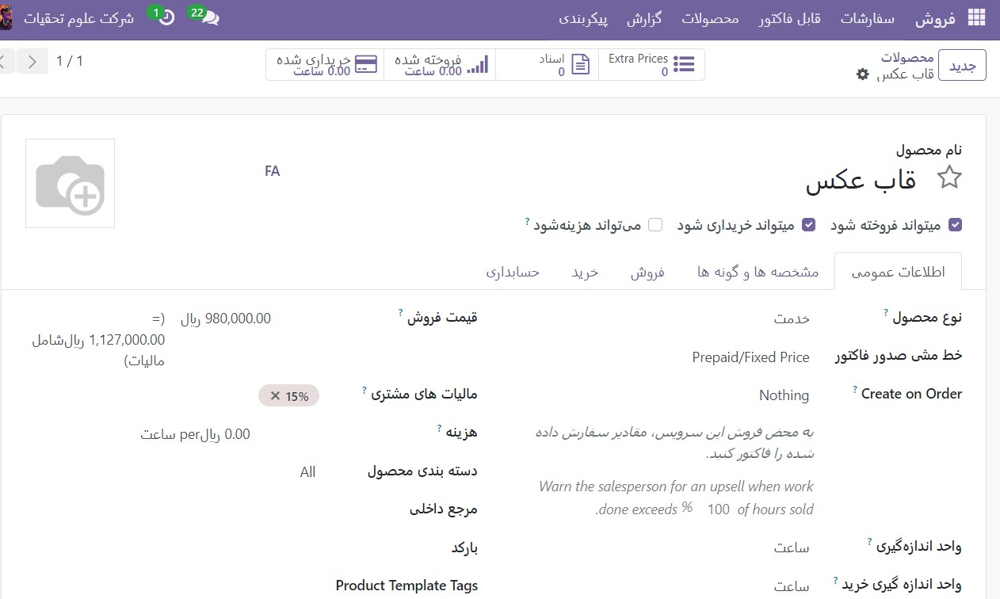

.. tip::
    برای داشتن کارت های هدیه با مبالغ مختلف، چندین محصول کارت هدیه ایجاد کنید و قیمت فروش را متناسب با آن تغییر دهید.

پس از ایجاد محصول کارت هدیه، به برنامه **فروش ‣ محصولات ‣ کارت های هدیه و کیف پول الکترونیکی** برای ایجاد برنامه کارت هدیه بروید. گزینه های پیکربندی زیر در دسترس هستند:

    - نام برنامه: نامی برای برنامه کارت هدیه وارد کنید
    - نوع برنامه: کارت هدیه را انتخاب کنید
    - محصولات کارت هدیه: محصول کارت هدیه را که قبلا ایجاد شده است انتخاب کنید. اگر محصولات کارت هدیه با مقادیر مختلف ایجاد کرده اید، این روند را تکرار کنید.
    - الگوی ایمیل: الگوی پیش‌فرض Gift Card: Gift Card Information را انتخاب کنید، یا با کلیک بر روی فیلد، انتخاب Search More و سپس کلیک کردن روی ایجاد یک الگوی جدید ایجاد کنید.
    - چاپ گزارش: کارت هدیه را انتخاب کنید
    - ارز: ارز مورد استفاده برای برنامه کارت هدیه را انتخاب کنید
    - شرکت: شرکتی را انتخاب کنید که برنامه برای آن معتبر و در دسترس است
    - Available On:برنامه هایی را انتخاب کنید که برنامه در آنها معتبر و در دسترس است.
    - Point of Sale: PoS را انتخاب کنید که برنامه در آن معتبر و در دسترس است. این فیلد را خالی بگذارید تا همه PoS ها را شامل شود.

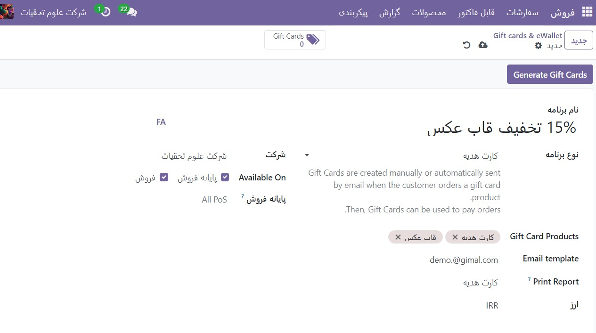

پس از پیکربندی برنامه، روی دکمه **Generate Gift Cards** در گوشه سمت چپ بالا کلیک کنید تا کارت هدیه تولید شود. کارت های هدیه را می توان برای مشتریان ناشناس یا مشتریان منتخب تولید کرد. مقدار تولید را برای مشتریان ناشناس تنظیم کنید، یا مشتریان و/یا برچسب های مشتری را برای مشتریان منتخب انتخاب کنید. سپس، مقدار کارت هدیه را تنظیم کنید. در نهایت، در صورت وجود، دوره **Valid Until** را تنظیم کنید.

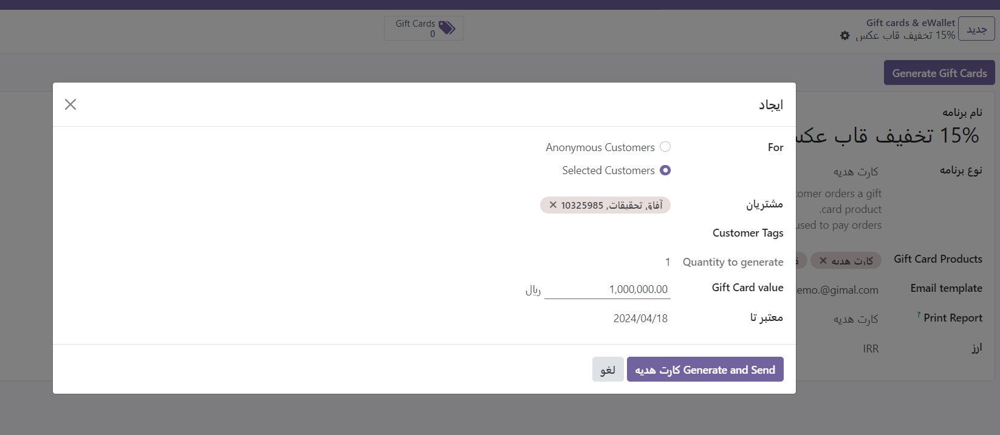

کارت های هدیه تولید شده را می توان از طریق دکمه هوشمند **کارت هدیه** در گوشه سمت راست بالا مشاهده کرد. از آنجا، کارت‌های هدیه را از طریق ایمیل یا پیوند URL ارسال یا به اشتراک بگذارید

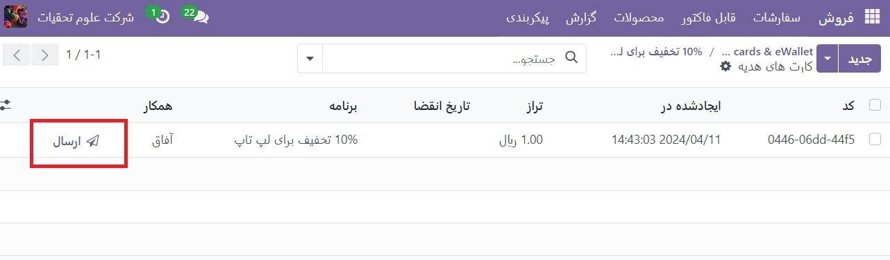

برای تغییر تاریخ انقضا، همکار یا موجودی، روی کارت هدیه کلیک کنید. کد کارت هدیه قابل تغییر، حذف یا تکرار نیست.