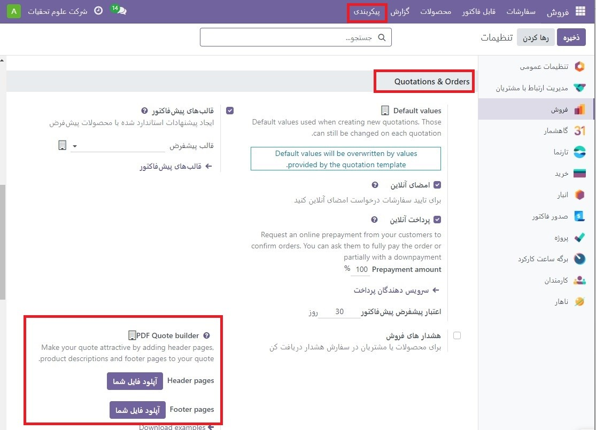
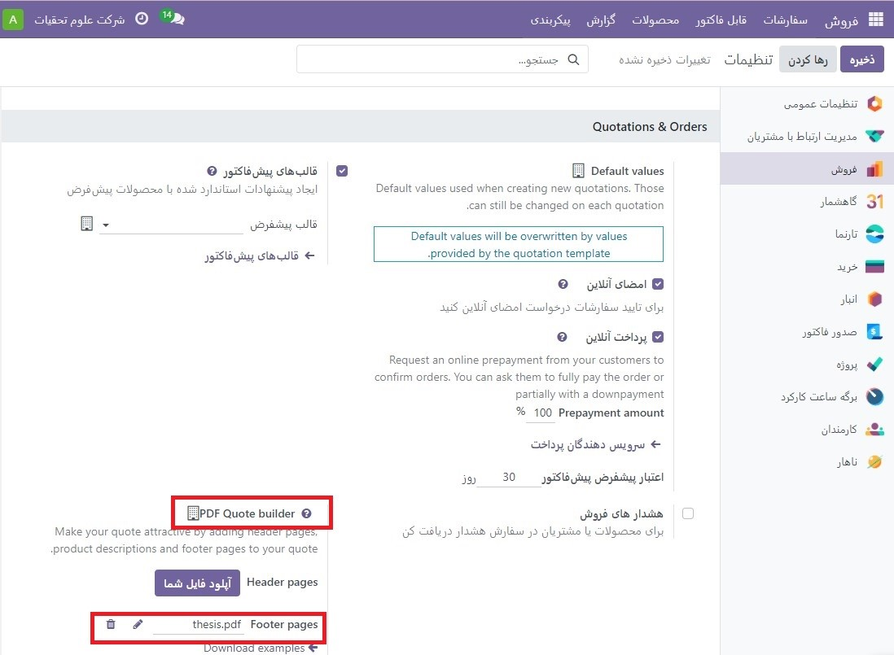
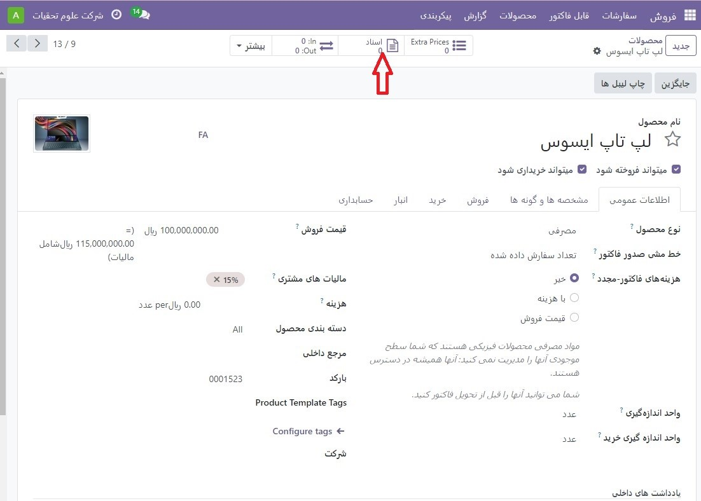
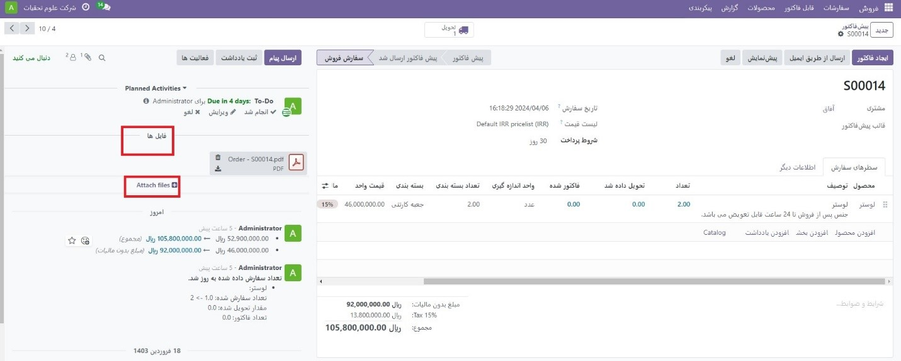

:nosearch:
:show-content:
:hide-page-toc:
:show-toc:

===========================================
ساخت پیش فاکتور با PDF
===========================================

PDF Quote Builder در فروش Odoo این فرصت را فراهم می کند تا به جای اینکه فقط قیمت و کل را نشان دهد، یک فایل PDF کاملا سفارشی شده را برای مشتریان ارسال کند، شرکت و محصولات را به نمایش بگذارد، با اطلاعات مختلف و عناصر طراحی.

PDF Quote Builder صفحات سرصفحه، توضیحات محصول، قیمت(ها) و صفحات پاورقی را برای ایجاد یک پیش فاکتوذ دقیق گروه بندی می کند. همچنین می‌تواند متن‌های پویا را در PDF وارد کند تا پیشنهاد را برای مشتری شخصی‌سازی کند.
داشتن یک پی دی اف سفارشی شده در پیش فاکتور، نتیجه گیری بالاتری از تجربه خرید را برای مشتریان فراهم می کند و سطح حرفه ای زیبایی را به یک شرکت اضافه می کند.

.. tip::
    توصیه می شود فرم های PDF را با نرم افزار Adobe ویرایش کنید. فیلدهای فرم در قالب‌های PDF سربرگ و پاورقی برای دریافت مقادیر پویا با Odoo ضروری هستند.

پیکربندی
--------------------------------------------
برای افزودن فایل‌های PDF سفارشی برای  پیش فاکتورها، ویژگی PDF Quote builder باید پیکربندی شود.

برای انجام این کار، به برنامه **فروش ‣ پیکربندی ‣ تنظیمات** بروید. سپس، در صفحه تنظیمات، به بخش پیش فاکتورها و سفارشات بروید و ویژگی PDF Quote builder را پیدا کنید.

در اینجا، صفحات سرصفحه سفارشی و صفحات پاورقی را می توان آپلود کرد. برای آپلود هر کدام، روی دکمه آپلود فایل خود یا نماددر سمت راست فیلد مورد نظر کلیک کنید و اقدام به مکان یابی، انتخاب و آپلود فایل PDF مورد نظر کنید.

.. note::
    سرصفحه‌ها و پاورقی‌ها را می‌توان مستقیماً در یک قالب پیش فاکتور اضافه کرد، بنابراین می‌توان تغییرات مختلفی در هر الگو داشت.
    با کلیک بر روی نماد 🗑️ (سطل زباله) فایل PDF فعلی حذف می شود و فیلد خالی با دکمه آپلود فایل شما جایگزین می شود.

هنگامی که فایل(های) PDF مورد نظر در قسمت های مربوطه در بخش سازنده پیش فاکتور PDF صفحه تنظیمات فروش آپلود شد، حتما روی **ذخیره** کلیک کنید.
فایل‌های آپلود شده در اینجا PDF پیش‌فرض مورد استفاده برای همه پیش فاکتورها خواهند بود.

.. note::
    مقادیر تنظیم شده در تنظیمات PDF Quote Builder مختص شرکت هستند.

متن پویا در PDF
----------------------------------------------
هنگام ایجاد PDF های سفارشی برای پیش فاکتور، از متن پویا برای Odoo استفاده کنید تا محتوای PDF را با اطلاعات مربوط به پیش فاکتوراز پایگاه داده Odoo، مانند نام، قیمت و غیره، به طور خودکار پر کنید.

مقادیر متن پویا اجزای فرم (ورودی های متن) هستند که می توانند در یک فایل PDF اضافه شوند و Odoo به طور خودکار این مقادیر را با اطلاعات مربوط به پیش فاکتور پر می کند.

مقادیر متن پویا
------------------------------------
در زیر مقادیر متنی پویا رایج مورد استفاده در PDF های سفارشی و آنچه که نشان می دهند آورده شده است:

  #. نام: مرجع سفارش فروش

  #. partner_id__name: نام مشتری

  #. user_id__name: نام فروشنده

  #. مبلغ_بدون مالیات: مقدار مالیات نشده

  #. sum_total: مجموع مبلغ

  #. delivery_date: تاریخ تحویل

  #. validity_date: تاریخ انقضا

  #. client_order_ref: مرجع مشتری

مقادیر متن پویا مخصوص محصول به شرح زیر است:

  #. توضیحات: توضیحات محصول

  #. مقدار: مقدار

  #. uom: واحد اندازه گیری (UoM)

  #. قیمت_واحد: واحد قیمت

  #. تخفیف: تخفیف

  #. product_sale_price: لیست قیمت محصولات

  #. مالیات ها: نام مالیات ها با کاما (،) به هم پیوسته است.

  #. tax_excl_price: قیمت بدون مالیات

  #. tax_incl_price: قیمت شامل مالیات

.. example::
    هنگامی که یک PDF ساخته می شود، بهترین روش استفاده از مقادیر متن پویا رایج (name و partner_id_name) است. هنگامی که در پایگاه داده آپلود می شود، Odoo به طور خودکار آن فیلدها را با اطلاعات مربوط به فیلدهای مربوطه پر می کند.

    در این مورد، Odoo مرجع سفارش فروش را در قسمت متن پویا نام و نام مشتری را در قسمت **partner_id_name** به‌طور خودکار پر می‌کند.

    پس از تکمیل فایل(های) PDF، آنها را در هارد دیسک کامپیوتر ذخیره کنید و از طریق اپلیکیشن  :menuselection:`فروش --> پیکربندی --> تنظیمات --> PDF Quote Builder` به آپلود آنها در Odoo ادامه دهید.

    PDF ایجاد شده را در قسمت Header pages یا Footer pages آپلود کنید.

    پس از تکمیل آپلود(ها)، روی **ذخیره** کلیک کنید.

افزودن PDF به محصول
----------------------------------------
در Odoo Sales، اضافه کردن PDF سفارشی به فرم محصول نیز امکان پذیر است. هنگامی که یک PDF به محصول اضافه می شود و آن محصول در یک پیش فاکتور استفاده می شود، آن PDF نیز در PDF نهایی درج می شود.
برای افزودن PDF سفارشی به محصول، با رفتن به برنامه **فروش ‣ محصولات ‣ محصولات** شروع کنید و محصول مورد نظر را که باید PDF سفارشی به آن اضافه شود، انتخاب کنید.

.. tip::
    یک سند همچنین می تواند به جای یک محصول به یک نوع محصول اضافه شود. اگر اسنادی در مورد محصول و نوع آن وجود داشته باشد، فقط اسناد موجود در نوع آن نشان داده می شود.

برای افزودن یک سند سفارشی به یک نوع محصول، به برنامه **فروش ‣ محصولات ‣ انواع محصولات** بروید. نوع مورد نظر را انتخاب کنید، روی دکمه هوشمند اسناد کلیک کنید و به آپلود سند(های) سفارشی در نوع محصول خاص ادامه دهید.

در صفحه محصول، روی دکمه هوشمند اسناد در بالای صفحه کلیک کنید.

با انجام این کار، یک صفحه اسناد جداگانه برای آن محصول نشان داده می شود که در آن فایل های مربوط به آن محصول را می توان **آپلود** کرد. از این صفحه، روی **جدید** یا آپلود کلیک کنید.
با کلیک بر روی آپلود فوراً فرصتی برای آپلود سند مورد نظر فراهم می شود. سپس، سند را می توان روی کارت سند یا با کلیک کردن روی نماد سه نقطه در گوشه سمت راست بالای کارت سند پیکربندی کرد و سپس روی ویرایش کلیک کرد.
با کلیک بر روی **جدید** یک فرم اسناد خالی نمایان می شود که در آن **PDF** مورد نظر را می توان از طریق دکمه Upload your file روی فرم که در قسمت File Content قرار دارد آپلود کرد.

اطلاعات و پیکربندی های مختلف مربوط به سند آپلود شده را می توان در اینجا تغییر داد.
اولین فیلد در فرم اسناد مربوط به نام سند است و تا زمانی که یک سند آپلود نشود، خاکستری (غیرقابل کلیک) است. هنگامی که یک PDF آپلود شد، قسمت نام به طور خودکار با نام PDF پر می شود و سپس می توان آن را ویرایش کرد.
قبل از آپلود یک سند، گزینه ای برای تعیین اینکه آیا سند یک فایل یا URL است از منوی فیلد کشویی Type وجود دارد.

.. note::
    اگر PDF آپلود شود، فیلد Type به صورت خودکار به File اضافه می شود و نمی توان آن را تغییر داد.

سپس، در بخش فروش، در قسمت قابل مشاهده، روی منوی کشویی کلیک کنید و یکی را انتخاب کنید: پیش فاکتور، سفارش تایید شده، یا قیمت داخلی.
پیش فاکتور: سند در هر زمان برای مشتریان ارسال می شود (و قابل دسترسی است).
سفارش تایید شده: سند پس از تایید سفارش برای مشتریان ارسال می شود. این برای راهنمای کاربر و سایر اسناد تکمیلی بهترین است.
پیش فاکتور داخلی: سند در PDF پیش فاکتور، بین صفحات سرصفحه و بخش قیمت گذاری پیش فاکتور گنجانده شده است.

.. example::
    وقتی گزینه Inside quote برای فیلد Visible at انتخاب شد و فایل PDF سفارشی Sample Builder.pdf آپلود شد، PDF در نقل قول در پورتال مشتری در قسمت Documents قابل مشاهده است.
    
    .. image:: ./img/sales/e40.jpg
        :align: center
        :alt: فروش