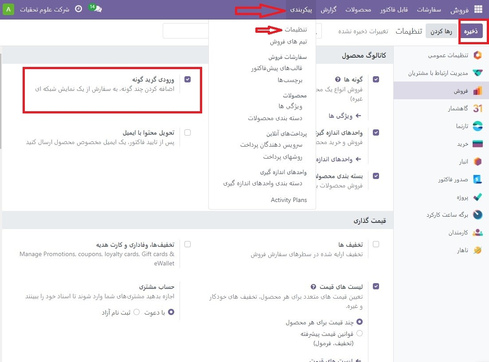
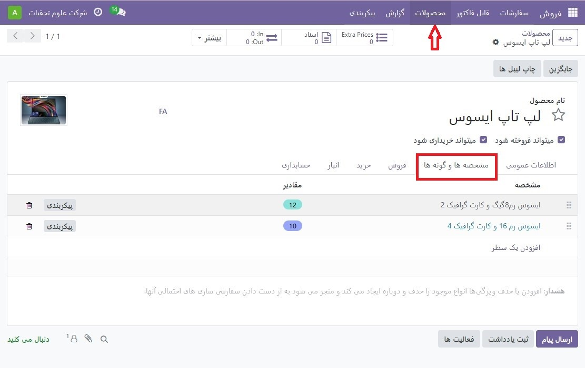
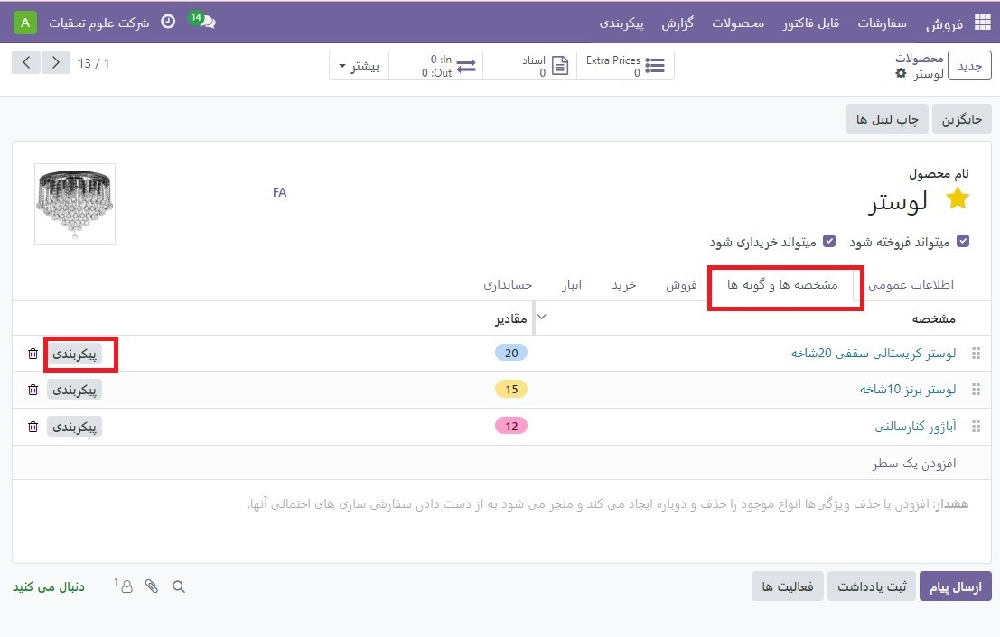
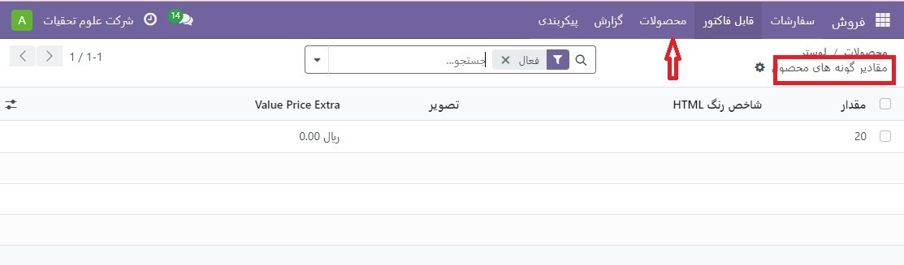
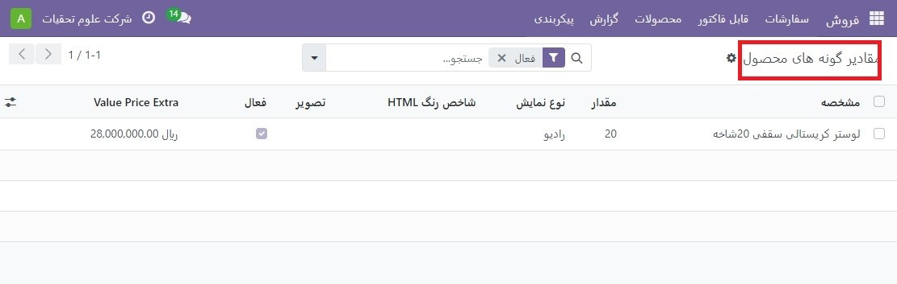
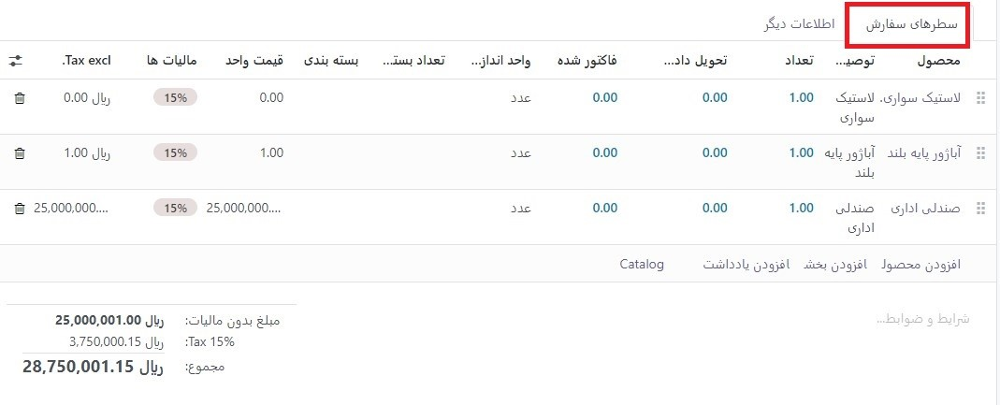

:nosearch:
:show-content:
:hide-page-toc:
:show-toc:

===========================================
انواع محصولات در قیمت ها و سفارشات فروش
===========================================

قبل از پرداختن به جزئیات در مورد نحوه استفاده از انواع محصولات در قیمت‌ها و سفارش‌های فروش، توصیه می‌شود در مورد انواع محصولات در Odoo اطلاعاتی کسب کنید.

پس از آشنایی با اصول اولیه انواع محصولات، موارد زیر نحوه افزودن انواع محصولات را با استفاده از پیکربندی محصول یا ورودی شبکه سفارش به قیمت‌ها و سفارش‌های فروش پوشش می‌دهد.

.. tip::
    لازم به ذکر است که این تنظیمات در صفحه تنظیمات اپلیکیشن فروش عنوان، (نوع ورودی شبکه)Variant Grid Entry و در فرم های محصول با عنوان*(نوع خروجی شبکه) Order Grid Entry می باشد. بنابراین، حتما این را در نظر داشته باشید.

تنظیمات
-----------------------------------------------
هنگام کار با انواع محصولات، Odoo به طور پیش فرض از پیکربندی محصول استفاده می کند. برای افزودن گزینه ورود به شبکه، این ویژگی باید در برنامه فروش Odoo فعال شود. گزینه ورود به شبکه یک پنجره بازشو در مورد سفارش پیش فاکتور/فروش برای ساده کردن فرآیند انتخاب نوع ارائه می دهد.

.. note::
    
    برای فعال کردن این تنظیم، به برنامه فروش ‣ پیکربندی ‣ تنظیمات بروید و به بخش کاتالوگ محصولات بروید. سپس کادر کنار گزینه ورودی گریدگونه را علامت بزنید و روی ذخیره کلیک کنید.

.. tip::
    البته، ویژگی گونه ها نیز باید فعال باشد تا بتوان از انواع محصولات در قیمت‌ها و سفارش‌های فروش استفاده کرد.

پیکربندی محصول
----------------------------------------------
پس از فعال شدن تنظیمات ورودی گریدگونه، هر دو گزینه (Product Configurator و Order Grid Entry) در هر فرم محصول در دسترس می شوند.
برای پیکربندی فرم محصول برای استفاده از پیکربندی محصول یا ورودی شبکه متغیر، با پیمایش به برنامه **فروش ‣ محصولات ‣ محصولات** برای مشاهده همه محصولات در پایگاه داده شروع کنید.

سپس، محصول مورد نظر را برای پیکربندی انتخاب کنید یا روی جدید کلیک کنید تا یک محصول جدید از ابتدا ایجاد کنید. پس از وارد شدن به فرم محصول، روی تب مشخصه ها وگونه ها کلیک کنید، جایی که می توان انواع محصول را مشاهده، اصلاح و اضافه کرد.

در پایین تب مشخصه ها و گونه ها، یک بخش Sales Variant Selection با دو گزینه وجود دارد: Product Configurator و Order Grid Entry

.. note::
    لازم به ذکر است که این گزینه ها تنها در صورتی ظاهر می شوند که حداقل دو مقدار از یک ویژگی به رکورد اضافه شده باشد
    این گزینه‌ها تعیین می‌کنند که هنگام افزودن انواع محصول به قیمت‌ها یا سفارش‌های فروش از کدام روش استفاده می‌شود.

پیکربندی محصول یک پنجره پاپ آپ ارائه می دهد که به طور منظم تمام انواع محصول موجود برای آن محصول خاص را هنگامی که به یک پیش فاکتور اضافه می شود، نمایش می دهد. با این حال، تنها یک نوع را می توان در یک زمان انتخاب / اضافه کرد.

Order Grid Entry اطلاعاتی مشابه با پیکربندی محصول در یک طرح بندی جدول ارائه می دهد و به کاربر این امکان را می دهد که تعداد بیشتری از انواع منحصر به فرد محصول را انتخاب کند و آنها را در یک نمای واحد به یک سفارش پیشنهادی/فروش اضافه کند.

پیکربندی محصول
--------------------------------------------
ویژگی پیکربندی محصول به‌محض اینکه محصولی با (حداقل دو نوع) به یک پیشنهاد یا سفارش فروش اضافه شود، به‌عنوان یک پنجره پاپ‌آپ پیکربندی ظاهر می‌شود، اما تنها در صورتی که گزینه Product Configurator در فرم محصول آن انتخاب شده باشد.

.. note::
    این پنجره بازشو پیکربندی همچنین در صورتی ظاهر می‌شود که تنظیم Order Grid Entry فعال نشده باشد، زیرا این گزینه پیش‌فرض است که Odoo هنگام برخورد با انواع محصولات در قیمت‌ها و/یا سفارش‌های فروش از آن استفاده می‌کند.

گزینه Product Configurator به فروشندگان این امکان را می دهد که دقیقاً کدام نوع محصول را با استفاده از قالبی مشابه خرید آنلاین به قیمت پیشنهادی یا سفارش فروش اضافه کنند.

ورود به شبکه را سفارش دهید
--------------------------------------------------------
به محض اینکه محصولی با (حداقل دو) نوع به یک پیشنهاد یا سفارش فروش اضافه شود، ویژگی ورود به شبکه سفارش به عنوان یک پنجره پاپ آپ انتخاب انواع محصولات ظاهر می شود، اما تنها در صورتی که گزینه Order Grid Entry روی  فرم محصول آن انتخاب شده باشد. 

پنجره پاپ آپ Choose Product Variants همه گزینه های مختلف برای آن محصول خاص را نشان می دهد. از این پنجره پاپ آپ، فروشنده می تواند تعیین کند که چه تعداد از هر گونه را می خواهد به یکباره به مظنه / سفارش فروش اضافه کند.

وقتی همه مقادیر و انواع مورد نظر انتخاب شدند، فروشنده به سادگی روی تأیید کلیک می‌کند و آن سفارش‌ها فوراً در برگه خطوط سفارش به سفارش قیمت/فروش اضافه می‌شوند.

