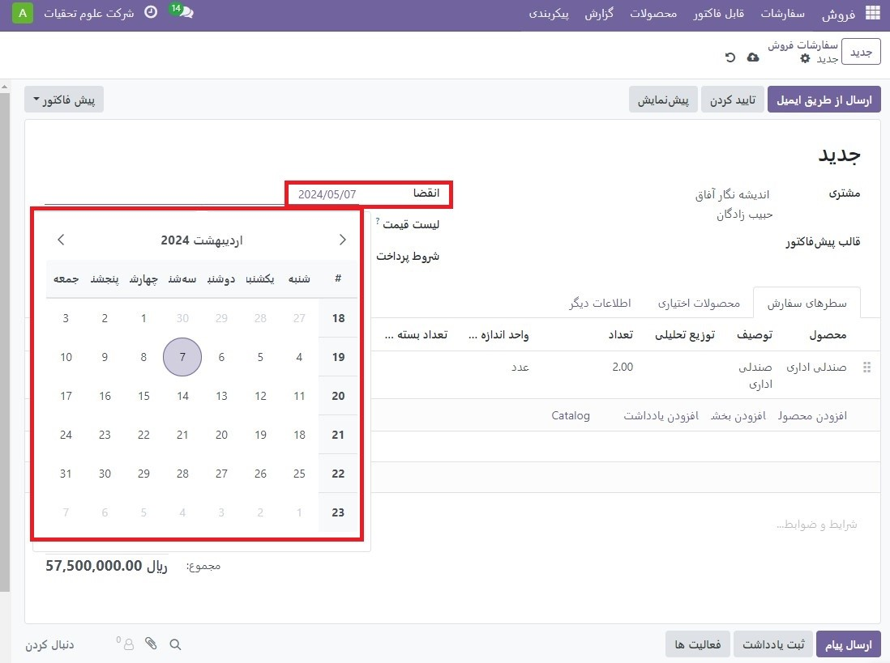
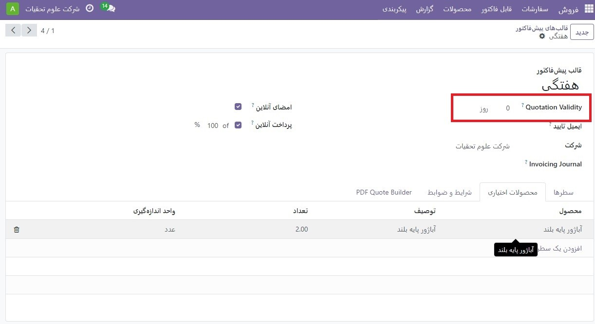

:nosearch:
:show-content:
:hide-page-toc:
:show-toc:

===========================================
مهلت های پیش فاکتور
===========================================

در اپلیکیشن فروش Odoo، امکان تعیین ضرب الاجل در قیمت فروش وجود دارد. انجام این کار مشتریان را تشویق می کند که در طول مذاکرات فروش سریع عمل کنند، زیرا ممکن است از دست دادن یک معامله خوب ترس داشته باشند. همچنین، ضرب‌الاجل‌ها همچنین می‌توانند به عنوان محافظت از یک شرکت عمل کنند، در صورتی که یک سفارش باید با قیمتی انجام شود که دیگر برای تجارت سودآور نیست.

منقضی شدن مظنه
--------------------------------
در فروش Odoo، گزینه ای برای اضافه کردن تاریخ انقضا به یک قیمت وجود دارد.

برای افزودن تاریخ انقضا به یک مظنه، به برنامه فروش بروید و یک پیش فاکتور مورد نظر را انتخاب کنید یا با کلیک کردن روی **جدید** یک قیمت جدید ایجاد کنید.

در فرم پیش فاکتور، روی قسمت انقضا کلیک کنید تا یک تقویم پاپ آپ نمایان شود. از این تقویم پاپ آپ، ماه و تاریخ مورد نظر را به عنوان تاریخ انقضای قیمت انتخاب کنید.

.. note::
    با کلیک کردن روی دکمه پیش ‌نمایش در یک پیش فاکتور، Odoo به وضوح زمان انقضای آن پیشنهاد خاص را نشان می‌دهد.

    .. image:: ./img/sales/e25.jpg
        :align: center
        :alt: فروش

انقضای قالب پیش فاکتور
-------------------------------------------------

برنامه فروش Odoo همچنین امکان اضافه کردن تاریخ انقضای مهلت به قالب های پیش فاکتور را فراهم می کند.

برای افزودن تاریخ انقضای مهلت به قالب های پیش فاکتور، به برنامه فروش ‣ پیکربندی ‣ قالب های پیش فاکتور بروید و  قالب های پیش فاکتور مورد نظر را که باید مهلتی به آن اضافه شود انتخاب کنید، یا برای ایجاد یک قالب پیش فاکتور جدید از ابتدا، روی **جدید** کلیک کنید.

در فرم قالب پیش فاکتور، تعداد روزهای مشخصی را به فیلد انقضای پیش فاکتور که در زیر نام قالب پیش فاکتور قرار دارد، اضافه کنید. تعداد روزها نشان‌دهنده مدت زمان اعتبار مظنه قبل از انقضای آن است.

پس، هر زمان که آن **قالب پیش فاکتور** خاص در یک پیش فاکتور استفاده شود، تاریخ انقضا به طور خودکار بر اساس تعداد روزهای تعیین شده در بالا محاسبه می شود. با این حال، این تاریخ را می توان قبل از ارسال قیمت برای مشتری بازنویسی کرد.