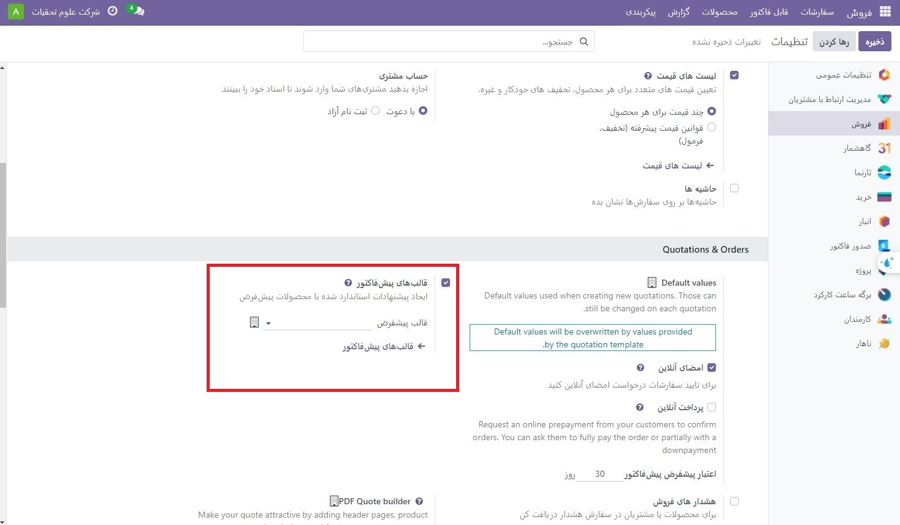
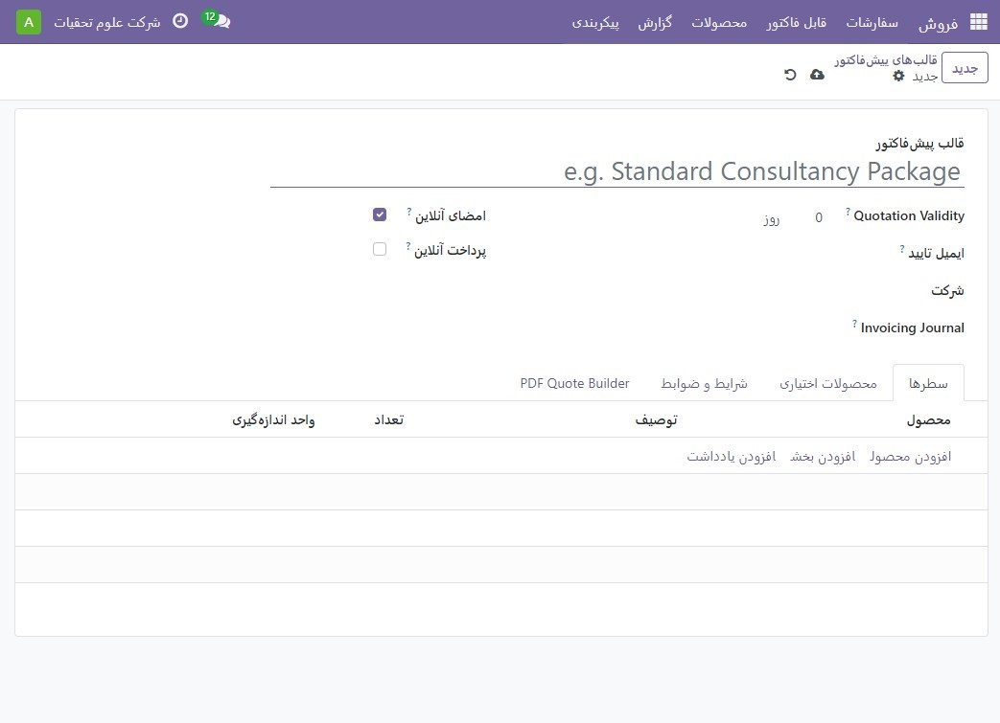
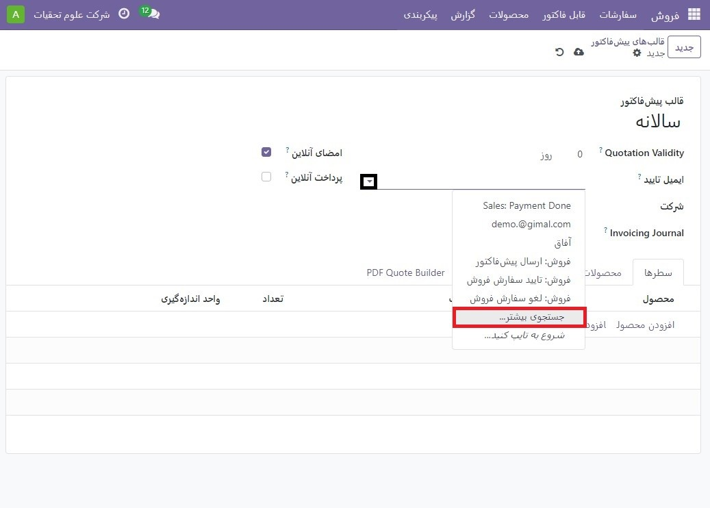
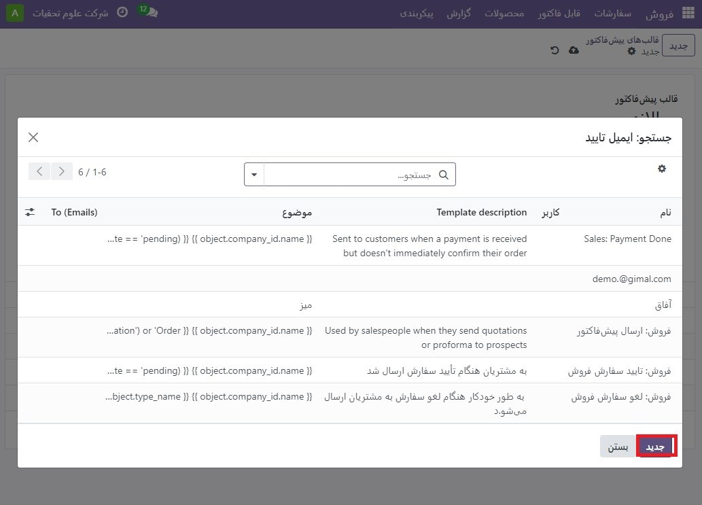
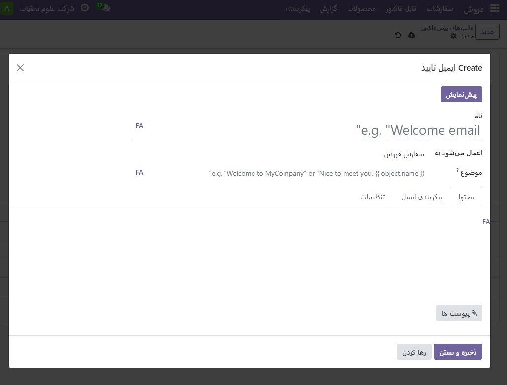
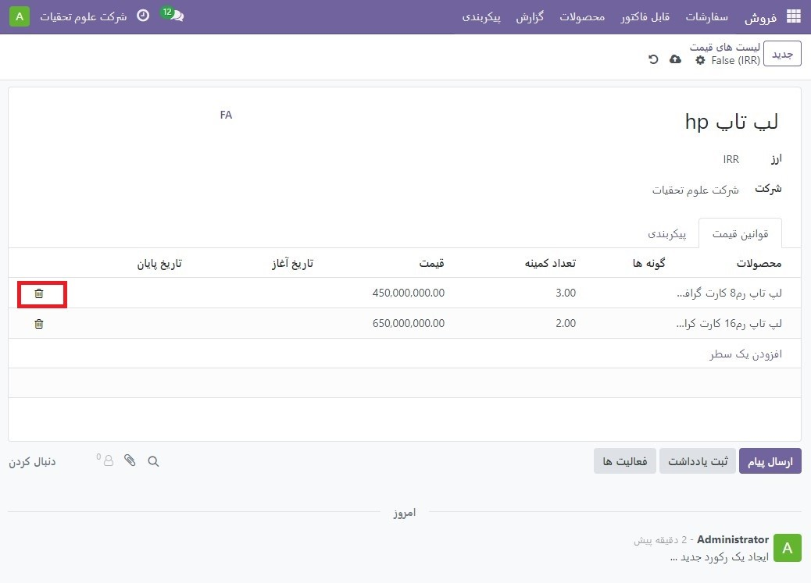
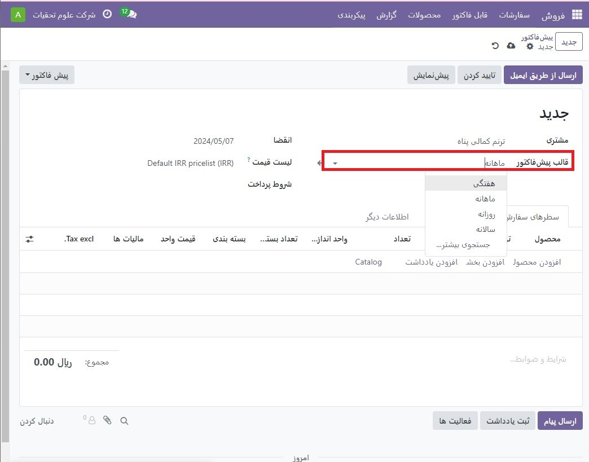
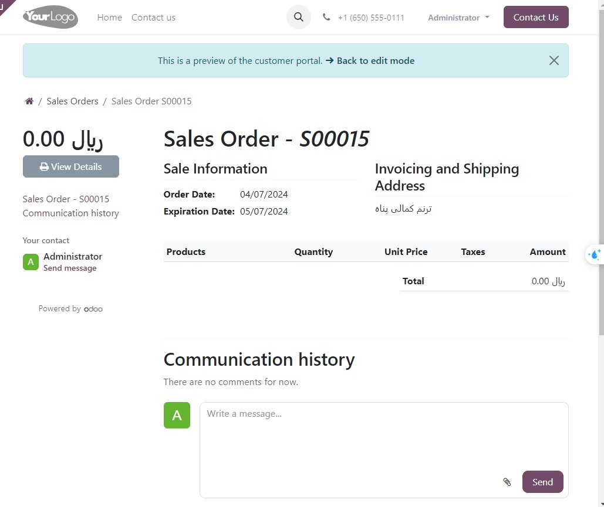

:nosearch:
:show-content:
:hide-page-toc:
:show-toc:

===========================================
قالب های پیش فاکتور
===========================================

فروشندگان این توانایی را دارند که الگوهای پیش فاکتور قابل استفاده مجدد برای محصولات یا خدمات رایجی که کسب و کار ارائه می دهد ایجاد کنند.

با استفاده از این قالب‌ها، قیمت‌ها را می‌توان با سرعتی بسیار سریع‌تر تنظیم کرد و برای مشتریان ارسال کرد، بدون اینکه هر بار که یک مذاکره فروش اتفاق می‌افتد، قیمت‌های جدیدی از ابتدا ایجاد کنید

پیکربندی
--------------------------------------------------
با فعال کردن تنظیمات در برنامه **فروش ‣ پیکربندی ‣ تنظیمات** شروع کنید و به عنوان پیش فاکتورها و سفارشات بروید.

در آن بخش، کادر کنار گزینه قالب های پیش فاکتور را علامت بزنید. با انجام این کار، یک فیلد قالب پیش‌فرض جدید نشان داده می‌شود که در آن می‌توان یک الگوی پیش فاکتور پیش‌فرض را از یک منوی کشویی انتخاب کرد

همچنین، با فعال کردن ویژگی قالب های پیش فاکتور، یک پیوند داخلی ➡️ قالب های پیش فاکتور در زیر قسمت قالب پیش فرض ظاهر می‌شود.

با کلیک بر روی آن پیوند، صفحه الگوهای پیش فاکتور ظاهر می شود، که از آن می توان الگوها را ایجاد، مشاهده و ویرایش کرد.

قبل از خروج از صفحه تنظیمات، فراموش نکنید که روی دکمه ذخیره کلیک کنید تا تمام تغییرات ایجاد شده در طول جلسه ذخیره شود.

الگوهای پیش فاکتور ایجاد کنید
------------------------------------------
روی پیوند قالب های پیش فاکتور در صفحه تنظیمات کلیک کنید یا به برنامه فروش :menuselection:`پیکربندی --> قالب های پیش فاکتور` بروید. هر دو گزینه صفحه الگوهای پیش فاکتور را نشان می دهند، جایی که می توان الگوهای پیش فاکتور را ایجاد، مشاهده و ویرایش کرد.

.. image:: ./img/sales/e2.jpg
    :align: center
    :alt: فروش

برای ایجاد یک الگوی پیش فاکتور جدید، روی دکمه جدید، واقع در گوشه سمت راست بالا کلیک کنید. با انجام این کار یک فرم الگوی پیش فاکتور خالی را نشان می دهد که می تواند به روش های مختلفی سفارشی شود.

با وارد کردن یک نام برای الگو در قسمت قالب های پیش فاکتور شروع کنید.
سپس، در قسمت Quotation Validity، مشخص کنید که الگوی نقل قول برای چند روز معتبر باقی می‌ماند، یا فیلد را روی 0 پیش‌فرض بگذارید تا الگو برای مدت نامحدود معتبر بماند.
سپس در قسمت تاییدایمیل، روی فیلد خالی کلیک کنید تا منوی کشویی نمایان شود. از منوی کشویی، یک الگوی ایمیل از پیش پیکربندی شده را انتخاب کنید تا پس از تأیید سفارش برای مشتریان ارسال شود.

.. note::
    
برای ایجاد یک الگوی ایمیل جدید مستقیماً از فیلد نامه تأیید، شروع به تایپ نام الگوی ایمیل جدید در فیلد کنید و یکی از این موارد را انتخاب کنید: ایجاد یا ایجاد و ویرایش… را از منوی کشویی که ظاهر می‌شود.

با انتخاب ایجاد، الگوی ایمیل ایجاد می شود که می تواند بعداً ویرایش شود.

با انتخاب جدید و ویرایش…، الگوی ایمیل ایجاد می‌شود، و یک پنجره بازشوی **Create Confirmation Mail** ظاهر می‌شود، که در آن می‌توان الگوی ایمیل را بلافاصله سفارشی و پیکربندی کرد.

پس از تکمیل تمام تغییرات، روی **ذخیره و بستن** کلیک کنید تا الگوی ایمیل ذخیره شود و به فرم پیش فاکتور بازگردید

اگر در یک محیط چند شرکتی کار می کنید، از قسمت شرکت برای تعیین اینکه این الگوی پیش فاکتور برای کدام شرکت اعمال می شود، استفاده کنید.

اگر ژورنالی در قسمت **Invoicing Journal** تنظیم شده باشد، تمام سفارش‌های فروش با این الگو در آن مجله مشخص صورت‌حساب می‌شوند. اگر مجله ای در این زمینه تنظیم نشده باشد، از مجله فروش با کمترین توالی استفاده می شود.

اگر ویژگی‌های امضای آنلاین و/یا پرداخت آنلاین در تنظیمات **(برنامه فروش ‣ پیکربندی ‣ تنظیمات)** فعال شده باشد، این گزینه‌ها در فرم‌های الگوی پیش فاکتور موجود هستند.

برای درخواست امضای آنلاین از مشتری برای تأیید سفارش، کادر کنار امضای آنلاین را علامت بزنید.

کادر کنار پرداخت آنلاین را علامت بزنید تا برای تأیید سفارش، از مشتری پرداخت آنلاین درخواست کنید. وقتی پرداخت آنلاین تیک خورده است، فیلد درصد جدیدی ظاهر می شود که می توان درصد خاصی از پرداخت را در آن وارد کرد.

هر دو گزینه، امضای آنلاین و پرداخت آنلاین را می توان به طور همزمان فعال کرد، در این صورت مشتری باید برای تأیید سفارش، هم امضا و هم پرداخت را ارائه دهد.

در فیلد برنامه تکرارشونده، از انواع زمان‌های از پیش پیکربندی‌شده (مانند ماهانه، فصلی، و غیره) انتخاب کنید تا مشخص کنید این الگوی پیش فاکتور باید چند وقت یکبار رخ دهد.

برگه خطوط
--------------------------------------------------
در برگه خطوط، محصولات را می توان با کلیک کردن روی **افزودن یک محصول** به الگوی پیش فاکتور اضافه کرد، با کلیک کردن بر روی افزودن یک بخش (و کشیدن/رها کردن سرصفحه های بخش) سازماندهی شده و با اطلاعات اختیاری (مانند جزئیات ضمانت، شرایط و غیره) توضیح بیشتری داد. ) با کلیک روی افزودن یادداشت.

برای افزودن یک محصول به یک الگوی پیش فاکتور، روی افزودن یک محصول در برگه خطوط در فرم الگوی پیش فاکتور کلیک کنید. با انجام این کار یک فیلد خالی در ستون محصول نمایان می شود.

پس از کلیک کردن، یک منوی کشویی با محصولات موجود در پایگاه داده ظاهر می شود. محصول مورد نظر را از منوی کشویی انتخاب کنید تا آن را به الگوی پیش فاکتور اضافه کنید.

.. note::
    اگر محصول مورد نظر به راحتی قابل مشاهده نیست، نام محصول مورد نظر را در قسمت محصول تایپ کنید و این گزینه در منوی کشویی ظاهر می شود. همچنین می‌توانید محصولات را با کلیک بر روی جستجوی بیشتر... از منوی کشویی پیدا کنید.

.. tip::
    هنگامی که یک محصول به یک الگوی پیش فاکتور اضافه می شود، مقدار پیش فرض 1 است، اما می توان آن را در هر زمان ویرایش کرد.

    سپس، از طریق نماد شش مربع، که در سمت چپ هر مورد خط قرار دارد، محصول را به موقعیت مورد نظر بکشید و رها کنید.

    برای افزودن یک بخش، که به عنوان هدر برای سازماندهی خطوط سفارش فروش عمل می کند، روی افزودن بخش در تب خطوط کلیک کنید. پس از کلیک کردن، یک فیلد خالی ظاهر می شود که می توان نام مورد نظر بخش را در آن تایپ کرد. هنگامی که نام وارد شد، روی دور کلیک کنید تا نام بخش ایمن شود.

    سپس، از طریق نماد شش مربع که در سمت چپ هر آیتم خط قرار دارد، نام بخش را به موقعیت مورد نظر بکشید و رها کنید.

    برای افزودن یادداشتی که به عنوان یک متن برای مشتری در پیش فاکتور ظاهر می شود، روی افزودن یادداشت در برگه خطوط کلیک کنید. پس از کلیک کردن، یک فیلد خالی ظاهر می شود که می توان یادداشت مورد نظر را در آن تایپ کرد. هنگامی که یادداشت وارد شد، روی دور کلیک کنید تا یادداشت را ایمن کنید.

    سپس، یادداشت را از طریق نماد شش مربع به موقعیت مورد نظر بکشید و رها کنید.

    برای حذف هر مورد خطی از برگه خطوط (محصول، بخش، و/یا یادداشت)، روی نماد 🗑️ (سطل زباله) در سمت راست سمت راست خط کلیک کنید.

برگه محصولات اختیاری
-------------------------------------------------
استفاده از محصولات اختیاری یک استراتژی بازاریابی است که شامل فروش متقابل محصولات به همراه یک محصول اصلی است. هدف ارائه محصولات مفید و مرتبط به مشتریان است که ممکن است منجر به افزایش فروش شود.

به عنوان مثال، اگر مشتری بخواهد ماشینی بخرد، این انتخاب را دارد که صندلی ماساژور را نیز سفارش دهد، یا پیشنهاد را نادیده بگیرد و به سادگی ماشین را بخرد. ارائه انتخاب برای خرید محصولات اختیاری، تجربه مشتری را افزایش می دهد.

محصولات اختیاری به عنوان بخشی در پایین صفحات سفارشات فروش و تجارت الکترونیک ظاهر می شوند. مشتریان در صورت تمایل می توانند بلافاصله آنها را به سفارشات فروش آنلاین خود اضافه کنند.

در برگه «محصولات اختیاری»، در صورت وجود، برای هر محصول متقابل فروش مربوط به اقلام اصلی در برگه خطوط، یک خط اضافه کنید. محصولات اضافه شده در اینجا به طور ایده آل مکمل پیشنهاد اصلی به عنوان ارزش افزوده برای خریدار احتمالی است.

با کلیک بر روی افزودن یک خط، یک فیلد خالی در ستون ستون نمایان می شود.

پس از کلیک کردن، یک منوی کشویی با محصولات از پایگاه داده ظاهر می شود. محصول مورد نظر را از منوی کشویی انتخاب کنید تا به عنوان یک محصول اختیاری به الگوی پیش فاکتور اضافه شود.

برای حذف هر مورد خطی از برگه محصولات اختیاری، روی نماد 🗑️ (سطل زباله) کلیک کنید.

.. tip::
    محصولات اختیاری برای ایجاد یک الگوی پیش فاکتور لازم نیست.

برگه شرایط و ضوابط
-----------------------------------------------
برگه شرایط و ضوابط این فرصت را فراهم می کند تا شرایط و ضوابط را به **الگوی پیش فاکتور** اضافه کنید. برای افزودن شرایط و ضوابط، به سادگی شرایط و ضوابط مورد نظر را در این تب تایپ کنید (یا کپی/پیست کنید).

.. tip::
    برای ایجاد یک الگوی پیش فاکتور، شرایط و ضوابط لازم نیست.

برگه PDF Quote Builder
--------------------------------------------------
برگه **PDF Quote Builder** گزینه هایی را برای نوشتن یک پیش فاکتور جذاب، با اطلاعات بیشتر و عناصر بصری دلپذیر، برای برجسته کردن محصولات و/یا خدمات ارائه می دهد.

برای آپلود صفحات سرصفحه مشتری و صفحات پاورقی، روی نماد ✏️ (مداد) در سمت راست صفحات مربوطه کلیک کنید. برای حذف PDF آپلود شده، روی نماد 🗑️ (سطل زباله) کلیک کنید.

.. seealso::
   - :doc:`pDF quote builder`

از قالب های پیش فاکتور استفاده کنید
--------------------------------------------------------------
هنگام ایجاد یک پیش فاکتور **(برنامه فروش ‣ جدید)**، یک الگوی از پیش پیکربندی شده را در قسمت الگوی پیش فاکتور انتخاب کنید.

برای مشاهده آنچه مشتری خواهد دید، روی دکمه پیش نمایش در بالای صفحه کلیک کنید تا ببینید که چگونه الگوی پیش فاکتور در قسمت جلویی وب سایت از طریق پورتال مشتری Odoo ظاهر می شود.

.. image:: ./img/sales/e9.jpg
    :align: center
    :alt: فروش

.. note::
    طراحی قالب پیش فاکتور از همان روش و عملکرد با بلوک های ساختمان طراحی به عنوان یک طراحی صفحه وب معمولی با وب سایت Odoo استفاده می کند. برای کسب اطلاعات بیشتر حتما اسناد وب سایت را بررسی کنید.

وقتی همه بلوک‌ها و سفارشی‌سازی‌ها کامل شدند، روی دکمه ذخیره کلیک کنید تا آن تنظیمات در جای خود قرار گیرند.

همچنین یک بنر آبی در بالای طرح الگوی پیش فاکتور با پیوندی برای بازگشت سریع به حالت ویرایش وجود دارد. پس از کلیک کردن، Odoo به فرم پیش فاکتور در انتهای برنامه فروش باز می گردد.

.. seealso::
   - :doc:`online payment order confirmation`
   - :doc:`online signatures for order confirmations`