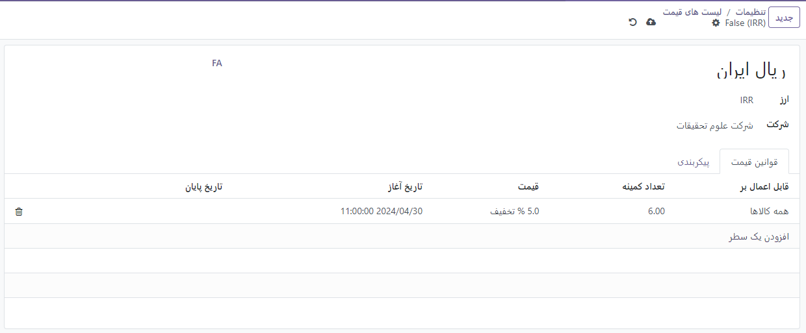
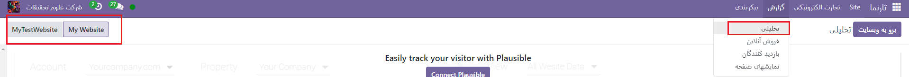

:nosearch:
:show-content:
:hide-page-toc:
:show-toc:

====================
مدیریت چند وب‌سایت
====================

Odoo به شما امکان می دهد چندین وب سایت از یک پایگاه داده ایجاد کنید. برای مثال، اگر چندین برند تحت سازمان خود دارید یا برای ایجاد وب سایت های جداگانه برای محصولات/خدمات مختلف یا مخاطبان مختلف. در این موارد، داشتن وب‌سایت‌های مختلف می‌تواند به جلوگیری از سردرگمی کمک کند و تنظیم استراتژی‌های توسعه دیجیتال خود را آسان‌تر کند و به مخاطبان هدف شما دسترسی پیدا کند.
هر وب سایت را می توان به طور مستقل با نام دامنه ، موضوع، صفحات، منوها، زبان ها ، محصولات ، تیم فروش اختصاص داده شده و غیره طراحی و پیکربندی کرد. آنها همچنین می توانند محتوا و صفحات را به اشتراک بگذارند .
 نکته
محتوای تکراری (یعنی صفحات و محتوای به اشتراک گذاشته شده بین چندین وب سایت) می تواند تأثیر منفی بر بهینه سازی موتور جستجو (SEO) داشته باشد .

ایجاد وب سایت
------------

برای ایجاد یک وب سایت جدید به صورت زیر عمل کنید:

1.	به وب سایت ‣ پیکربندی ‣ تنظیمات بروید.
2.	روی + وب سایت جدید کلیک کنید.
 

3.	نام وب سایت و دامنه وب سایت را مشخص کنید . هر وب سایت باید تحت دامنه خود منتشر شود .
4.	در صورت نیاز نام شرکت ، زبان‌ها و زبان پیش‌فرض را تطبیق دهید .
5.	روی دکمه ایجاد کلیک کنید.
سپس می توانید شروع به ساخت وب سایت جدید خود کنید.
 توجه داشته باشید
به‌طور پیش‌فرض، همه برنامه‌های مرتبط با وب‌سایت که نصب کرده‌اید (مانند تجارت الکترونیک ، انجمن ، وبلاگ ، و غیره) و صفحات وب‌سایت مرتبط با آنها نیز در وب‌سایت جدید موجود هستند. می توانید با اصلاح منوی وب سایت آنها را حذف کنید.

تغییر وب سایت ها
----------------

برای جابه‌جایی از یک وب‌سایت به وب‌سایت دیگر، روی منوی کنار دکمه +جدید در گوشه بالا سمت راست کلیک کنید و وب‌سایتی را که می‌خواهید به آن تغییر دهید انتخاب کنید.
 

.. Note::
    وقتی وب‌سایت‌ها را تغییر می‌دهید، به وب‌سایت دیگر هدایت می‌شوید، به همان صفحه (URL) که وب‌سایت فعلی وجود دارد. اگر صفحه ای که در حال حاضر مشاهده می کنید در وب سایت دیگر وجود نداشته باشد، به صفحه خطای 404 هدایت می شوید. پس از تغییر مسیر، روی ایجاد صفحه کلیک کنید تا صفحه ایجاد شود.
 
پیکربندی وب سایت خاص
-------------------

اکثر تنظیمات وب سایت مختص وب سایت هستند، به این معنی که می توان آنها را در هر وب سایت فعال/غیرفعال کرد. برای تطبیق تنظیمات یک وب سایت، به وب سایت ‣ پیکربندی ‣ تنظیمات بروید . در قسمت تنظیمات وب سایت در بالای صفحه تنظیمات ، در بنر زرد ، وب سایت مورد نظر را انتخاب کنید . سپس، گزینه ها را برای آن وب سایت خاص تطبیق دهید.
 
.. Note::
    - وب سایت ها با تنظیمات پیش فرض ایجاد می شوند. تنظیمات از یک وب سایت به وب سایت دیگر کپی نمی شود.
    - در یک محیط چند شرکتی ، هر وب سایت را می توان به یک شرکت خاص در پایگاه داده شما پیوند داد تا فقط داده های مربوط به شرکت (به عنوان مثال، محصولات، مشاغل، رویدادها و غیره) در وب سایت نمایش داده شود. برای نمایش داده های خاص شرکت، شرکت مورد نظر را در قسمت Company تنظیم کنید .

صفحات وبسایت
--------------------

برای تغییر وب سایتی که قرار است صفحه ای در آن منتشر شود، به صورت زیر عمل کنید:

1.	به وب سایت ‣ سایت ‣ صفحات بروید .
2.	پانل جستجو را باز کنید و وب سایتی را که صفحه در حال حاضر در آن منتشر شده است انتخاب کنید.
 

3.	تیک کنار صفحه(هایی) که می خواهید تغییر دهید را علامت بزنید.
4.	روی قسمت Website کلیک کنید و وب سایت را انتخاب کنید یا آن را خالی کنید تا صفحه در همه وب سایت ها منتشر شود.
 توجه داشته باشید
هر وب سایت باید صفحه اصلی خود را داشته باشد. شما نمی توانید از یک صفحه اصلی برای چندین وب سایت استفاده کنید.

ویژگی های تجارت الکترونیک
------------------------

ویژگی های تجارت الکترونیک مانند محصولات، دسته بندی های تجارت الکترونیک، لیست قیمت ها، تخفیف ها، ارائه دهندگان پرداخت و غیره را می توان به یک وب سایت خاص محدود کرد .

قیمت گذاری
--------------------

محصولات را می توان بر اساس وب سایت با استفاده از لیست قیمت ها قیمت گذاری متفاوتی داشت . پیکربندی زیر مورد نیاز است:

1.	به وب سایت ‣ پیکربندی ‣ تنظیمات بروید .
2.	به بخش فروشگاه - محصولات بروید و گزینه لیست قیمت ها را انتخاب کنید قیمت های چندگانه برای هر محصول .

3.	برای تعریف لیست قیمت های جدید یا ویرایش لیست های موجود، روی لیست های قیمت کلیک کنید .

4.	لیست قیمت را انتخاب کنید یا روی New کلیک کنید تا لیست جدیدی ایجاد کنید، سپس تب Configuration را انتخاب کرده و قسمت Website را تنظیم کنید .

گزارش نویسی
--------------------

تجزیه و تحلیل
---------------------

هر وب سایت تجزیه و تحلیل خاص خود را دارد . برای جابه‌جایی بین وب‌سایت‌ها، روی دکمه‌های گوشه سمت راست بالا کلیک کنید.
 

سایر داده های گزارش
----------------------------

سایر داده های گزارش مانند داده های داشبورد تجارت الکترونیک، تحلیل های فروش آنلاین و بازدیدکنندگان را می توان در صورت لزوم بر اساس وب سایت گروه بندی کرد. پانل جستجو را باز کنید و گروه بر اساس –> وب سایت را انتخاب کنید .

