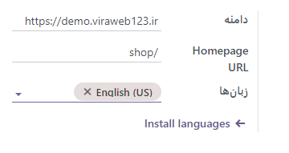
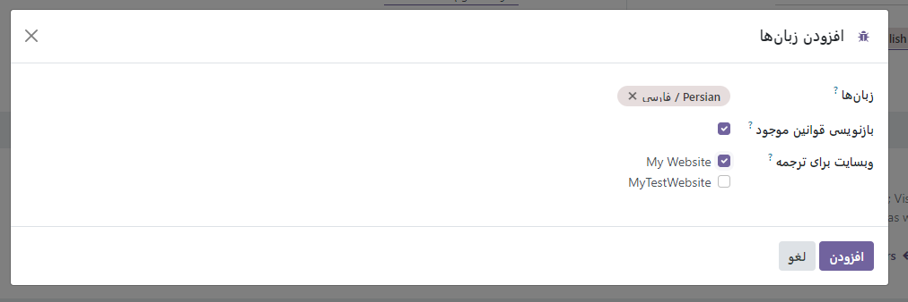

:nosearch:
:show-content:
:hide-page-toc:
:show-toc:

====================
ترجمه‌ها
====================

محتویات صفحات وب سایت شما (یعنی رشته های متنی) را می توان مستقیماً در وب سایت شما به زبان های مختلف ترجمه کرد.
وب سایت شما به زبانی نمایش داده می شود که با زبان مرورگر بازدیدکننده مطابقت دارد، مگر اینکه آن زبان خاص نصب نشده باشد. در این حالت وب سایت به زبان پیش فرض نمایش داده می شود . بازدیدکننده همچنان می تواند زبان دیگری را در منوی زبان انتخاب کند.
نصب زبان ها
----------------

برای ترجمه وب سایت خود، ابتدا باید زبان های مورد نیاز را اضافه کنید:

1.	به وب سایت خود بروید.
2.	به پایین صفحه بروید و به منوی زبان بروید .
3.	روی زبان کلیک کنید و افزودن زبان را انتخاب کنید .

4.	روی قسمت Languages کلیک کنید و زبان مورد نیاز را از لیست کشویی انتخاب کنید. این مرحله را برای هر زبان اضافی تکرار کنید.
5.	روی دکمه Add کلیک کنید .
 

 .. Note::
    همچنین می‌توانید زبان‌های وب‌سایت خود را از قسمت پشتیبان، در تنظیمات ویرایش کنید . به Website –> Configuration –> Settings بروید و زبان های مورد نیاز را در قسمت Languages در قسمت Website info اضافه/حذف کنید .

زبان پیش فرض
---------------

اگر زبان مرورگر بازدیدکننده در وب سایت شما نصب نشده باشد، محتوا به زبان پیش فرض نمایش داده می شود.
برای تعریف یک زبان پیش‌فرض، به وب‌سایت -> پیکربندی -> تنظیمات بروید و یک زبان را در قسمت پیش‌فرض انتخاب کنید .
 
 .. image:: ./img/translate3.png
    :alt: وبسایت
    :align: center

.. Note::
    این فیلد فقط در صورتی قابل مشاهده است که چندین زبان از قبل برای وب سایت شما پیکربندی شده باشد.

ترجمه مطالب
----------------

پس از اضافه شدن زبان ها، می توانید محتوای وب سایت خود را ترجمه کنید. برای انجام این کار، به وب سایت خود بروید، زبان را از منوی زبان انتخاب کنید و روی دکمه Translate در سمت راست نوار وظیفه کلیک کنید تا حالت ترجمه فعال شود .
 
در نتیجه:

- رشته های متنی که قبلا ترجمه شده اند با رنگ سبز مشخص می شوند.
- رشته های متنی که باید ترجمه شوند با رنگ زرد برجسته می شوند.
 
 .. image:: ./img/translate4.png
    :alt: وبسایت
    :align: center

سپس می توانید با کلیک بر روی بلوک، ویرایش محتوای آن و ذخیره متن اصلی را با ترجمه جایگزین کنید.

.. Tip::
    - پس از نصب زبان‌ها، می‌توانید برخی از موارد (مثلاً نام و توضیحات محصول) را از قسمت پشتیبان (مثلاً در قالب محصول) ترجمه کنید. برای انجام این کار، روی کد زبان (به عنوان مثال، EN ) در کنار متنی که می خواهید ترجمه کنید (به عنوان مثال، نام محصول) کلیک کنید و ترجمه را اضافه کنید.
    - همچنین می‌توانید ترجمه‌ها را صادر/وارد کنید تا چندین مورد (به عنوان مثال، نام محصول و توضیحات) را به صورت یکجا ترجمه کنید.

منوی انتخابگر زبان
---------------

برای افزودن منوی انتخابگر زبان:

1.	به وب سایت خود بروید و روی ویرایش کلیک کنید .
2.	بلوکی را که می‌خواهید منوی انتخابگر زبان را در آن اضافه کنید (مثلاً سرصفحه) انتخاب کنید.
3.	تب Customize را انتخاب کنید .
4.	در بخش Navbar ، فیلد انتخابگر زبان را روی گزینه Dropdown یا Inline قرار دهید .
5.	روی ذخیره کلیک کنید .

 .. image:: ./img/translate5.png
    :alt: وبسایت
    :align: center