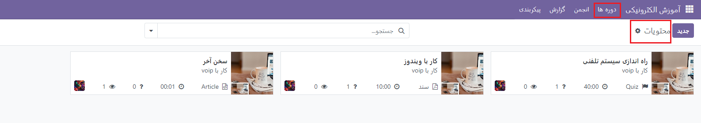
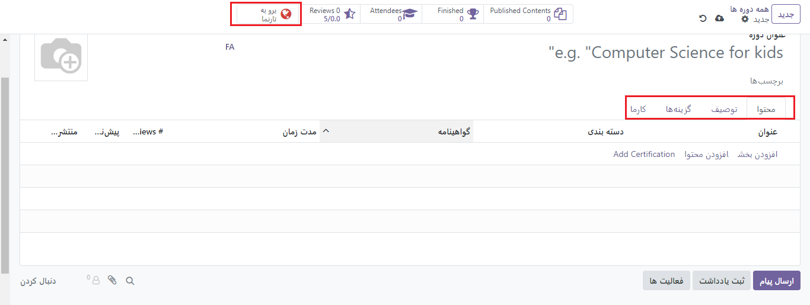

:nosearch:
:show-content:
:hide-page-toc:
:show-toc:

================
آموزش الکترونیکی
================

برنامه آموزش الکترونیک این امکان را فراهم کرده است که به آسانی محتوای خود را آپلود کنید، اهداف آموزشی را تعریف کنید، حضار را مدیریت کنید، پیشرفت دانشجویان را رهگیری کنید، و حتی پاداش‌هایی تعریف نمایید. درگیر کردن شرکت‌کنندگان در یک تجربه آموزشی معنادار باعث افزایش هوشیاری و توجه آن‌ها می‌شود و بهره‌وری را افزایش می‌دهد.

.. important::
    محتوای آموزش الکترونیک خود را می‌توانید هم در فرانت‌اند و هم در بک‌اند مدیریت کنید. فرانت‌اند اجازه می‌دهد به سرعت محتوا را از وب‌سایت خود ایجاد کنید، ولی در بک‌اند گزینه‌های دیگری نیز وجود دارد که امکان همکاری را فراهم می‌کند. در این راهنما برای ایجاد محتوا بر روی بک‌اند تمرکز می‌کنیم.

ماژول آموزش الکترونیکی دارای 4 زیر منو هست که در شکل زیر مشاهده میکنید

- دوره ها
- انجمن
- پیکربندی
- گزارش

**دوره ها**:  این بخش شامل فهرستی از دوره‌های موجود در ماژول آموزشی است، که شامل دوره ها، محتویات و گواهینامه های مرتبط است.

.. image:: ./img/elearning1.png
    :alt:  آموزش الکترونیکی
    :align: center

بخش بک‌اند با کلیک بر روی عنوان و بخش فرانت‌اند با کلیک بر روی "برو به تارنما" در صفحه مدیریت می‌شوند. تمام دوره‌ها در داشبورد این ماژول قابل مشاهده هستند و برای ایجاد دوره جدید کافیست بر روی "جدید" در بالای صفحه کلیک کنید.

.. image:: ./img/elearning4.png
    :alt:  آموزش الکترونیکی
    :align: center

4 تب وجود دارد:

- 	محتوا
- 	توضیح
- 	گزینه‌ها 
- 	امتیاز

تب محتوا
--------------

این تب برای مدیریت محتوا طراحی شده است و شما می‌توانید از بخش‌های "افزودن بخش" و "افزودن محتوا" مطالب دوره را مدیریت کنید. حتی می‌توانید گواهی برای دوره تعریف کنید. با کلیک بر روی "افزودن محتوا"، صفحه‌ای برای شما باز خواهد شد که می‌توانید در تب اول سند خود را آپلود کنید و امکان دانلود، اجازه پیش‌نمایش و مسئول پاسخگو را مشخص کنید. در تب دوم (توصیف) می‌توانید توضیحاتی درباره محتوای مذکور ارائه دهید یا در تب منابع اضافی، منابع و لینک‌های جدیدی را اضافه کنید. تب آخر (آزمون) نیز برای تعریف آزمون و مشخص کردن سوالات و پاسخ‌ها می‌باشد.

 .. image:: ./img/elearning5.png
    :alt:  آموزش الکترونیکی
    :align: center

تب توضیحات
------------------

در این تب میتوانید توضیحی راجب دوره ارائه دهید.

تب گزینه ها
--------------

در این تب میتوانید بخش های دوره، عطف ،سطوح دسترسی و نمایش را مشاهده کنید.

 .. image:: ./img/elearning6.png
    :alt:  آموزش الکترونیکی
    :align: center

- در بخش "دوره"، می‌توانید نام مسئول پاسخگو و وب‌سایت منتشرکننده دوره را مشخص کنید.
- بخش "عطف" مربوط به ارتباطات با شرکت‌کنندگان است.

- با فعال کردن گزینه "Allow Reviews"، به شرکت‌کنندگان امکان می‌دهید تا نظرات خود را در مورد دوره با ما به اشتراک بگذارند.
- در جلوی "انجمن"، می‌توانید انجمن مرتبط با دوره را انتخاب کنید. (این گزینه در صورت فعال بودن در تنظیمات نمایش داده می‌شود.)
- گزینه "New Content Notification" برای ارسال یک قالب ایمیل به حضار در صورت آپلود محتوای جدید استفاده می‌شود. برای دسترسی به ویرایشگر قالب ایمیل، از لینک داخلی (➜) استفاده کنید.
- گزینه "Completion Notification" یک قالب ایمیل را برای لحظه به پایان رسیدن دوره جهت ارسال به شرکت‌کننده ایجاد می‌کند. برای دسترسی به ویرایشگر قالب ایمیل، از لینک داخلی (➜) استفاده کنید.
 

- در بخش "سطوح دسترسی"، می‌توانید پیش‌نیازها، افرادی که مجاز به دیدن دوره هستند، و سیاست ثبت‌نام را مشخص کنید.
- بخش "نمایش"، نحوه نمایش دوره را برای کاربر تعیین می‌کند. این می‌تواند به صورت "آموزش" باشد که ترتیب پیشنهادی را برای کاربر اعمال و نمایش می‌دهد، یا "مستندات" که فقط محتواهای مستنداتی را نمایش می‌دهد.

تب کارما
----------------

این تب برای تعیین امتیاز جهت نقد و یا پایان دوره برای شرکت‌کنندگان استفاده می‌شود. همچنین می‌توانید در بخش "سطوح دسترسی" امتیازاتی را برای افزودن نقد، نظر و یا رای‌گیری مشخص کنید.

در بخش منوی بالایی میتوان به موارد زیر دسترسی داشت: 

**برو به تارنما**: این گزینه به کاربران امکان می‌دهد به صفحه اصلی یا تارنمای ماژول آموزشی الکترونیکی در Odoo بروند.
**Reviews**: این بخش شامل نظرات و بررسی‌های کاربران در مورد دوره‌ها یا محتواهای منتشر شده است، که می‌تواند به کاربران دیگر در انتخاب منابع آموزشی کمک کند.
**Attendees**: این بخش اطلاعاتی در مورد کاربرانی که به دوره‌ها یا محتواهای آموزشی مشترک شده‌اند، ارائه می‌دهد.
**Finished**: این بخش شامل لیستی از دوره‌هایی است که کاربران آنها را به پایان رسانده‌اند.
**Published Contents**: این بخش شامل فهرستی از محتواهایی است که در دسترس کاربران قرار گرفته‌اند، مانند فیلم‌های آموزشی، مقالات، یا هر نوع منبع آموزشی دیگر.

گروه های دوره
----------------

برای مدیریت گروه های دوره میتوان به داشبورد>پیکربندی> گروه های دوره مراجعه نمایید.

تنظیمات
--------------

به داشبورد>پیکربندی >تنظیمات بروید.میتوانید دوره های خود را سفارشی سازی کنید.

بخش آموزش الکترونیک
-------------------

- گواهینامه‌ها: برای ارزیابی دانش شرکت‌کنندگان و تأیید مهارت آن‌ها استفاده می‌شود.
- دوره‌های پولی: برای فروش دوره‌ها در وب‌سایت و رهگیری درآمد حاصل از آن‌ها مورد استفاده قرار می‌گیرد.
- Mailing: اطلاع‌رسانی یکباره به تمام شرکت‌کنندگان از طریق ارسال انبوه صورت می‌گیرد.
- انجمن: ایجاد یک انجمن و اجازه دادن به شرکت‌کنندگان برای پاسخ به سؤالات همدیگر.

تگ های محتوا
---------------

با کلیک بر روی پیکربندی>  تگ های محتوا میتوانید تگ های خود را مدیریت کنید.

 انتشار محتوا
---------------
برای انتشار محتوا در بخش فرانت اند میتوانید بر روی رفتن به تارنما کلیک کنید و در بالای صفحه وضعیت را به منتشر شده تغییر دهید تا بر روی وب سایت قابل مشاهده شود.
